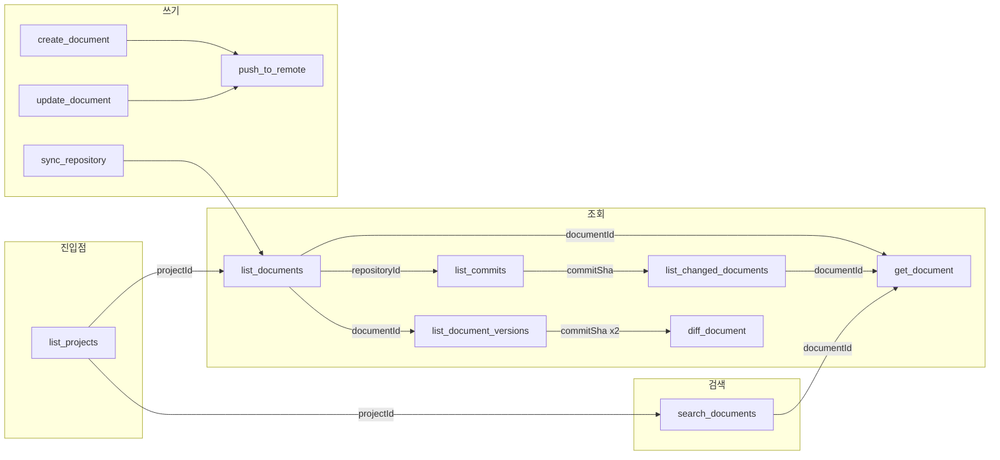
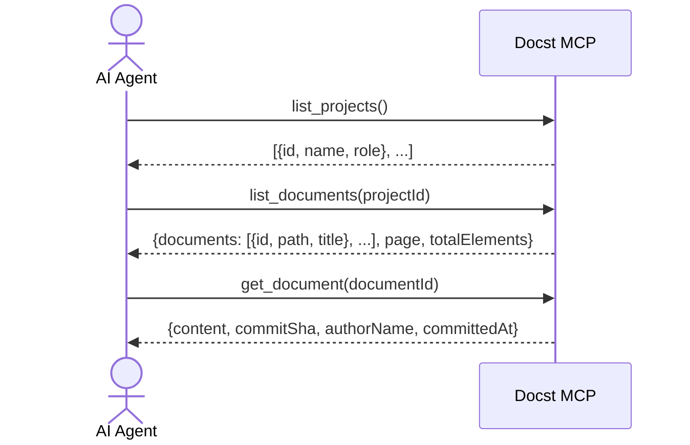
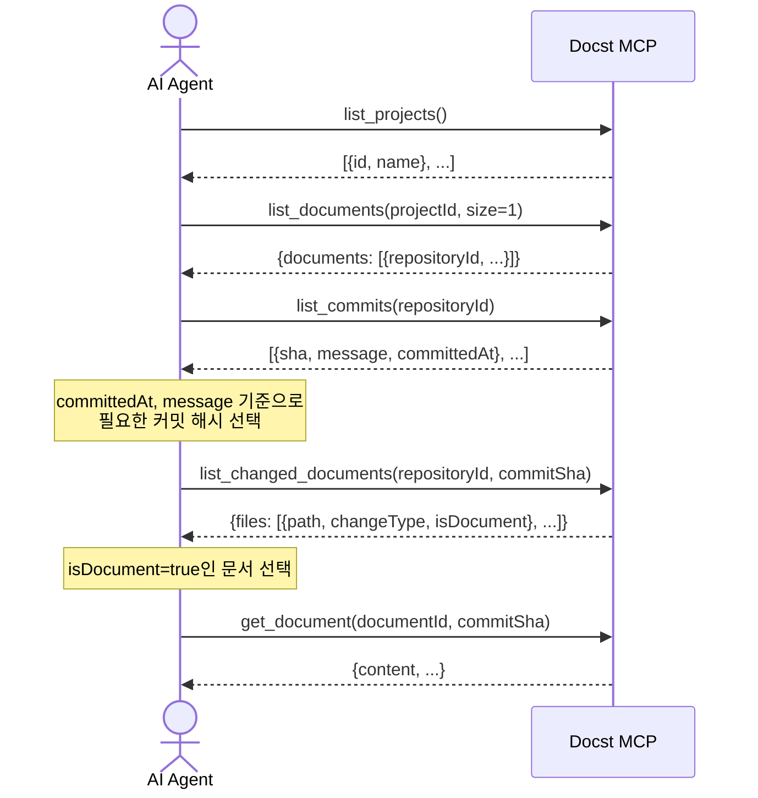
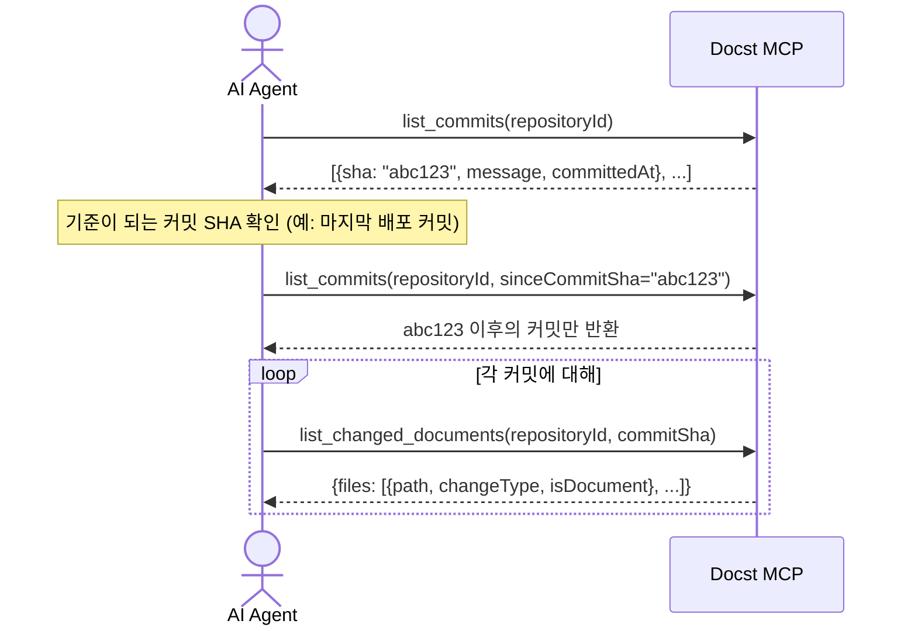
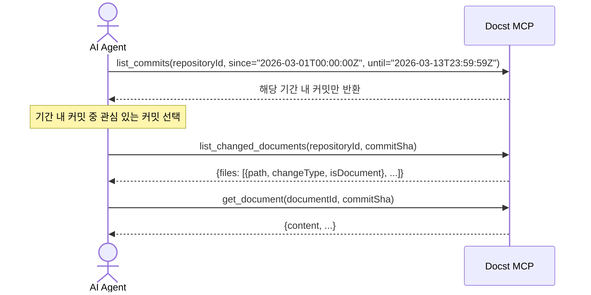
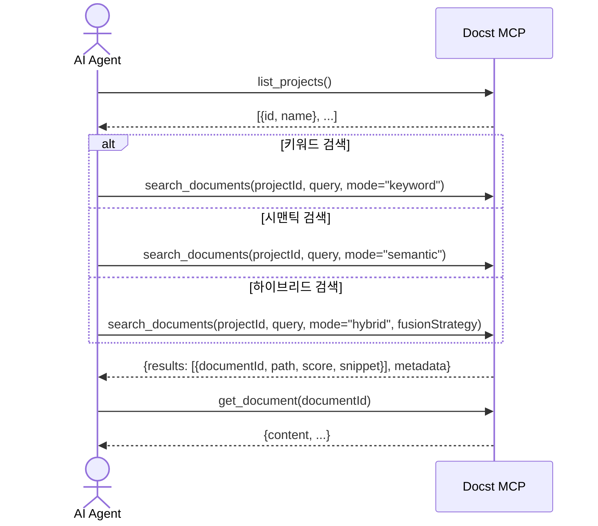
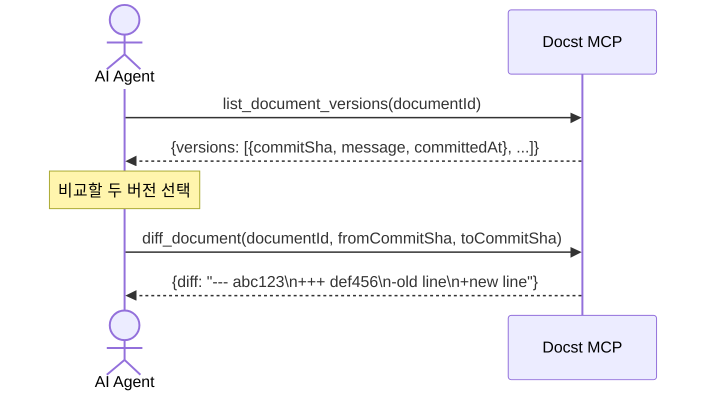
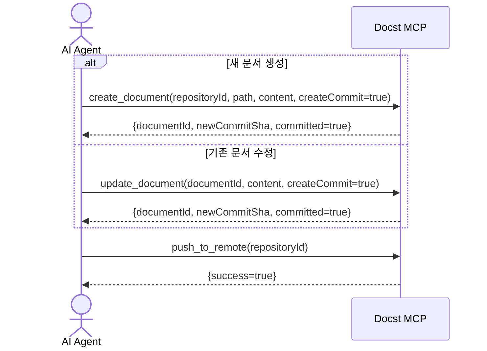
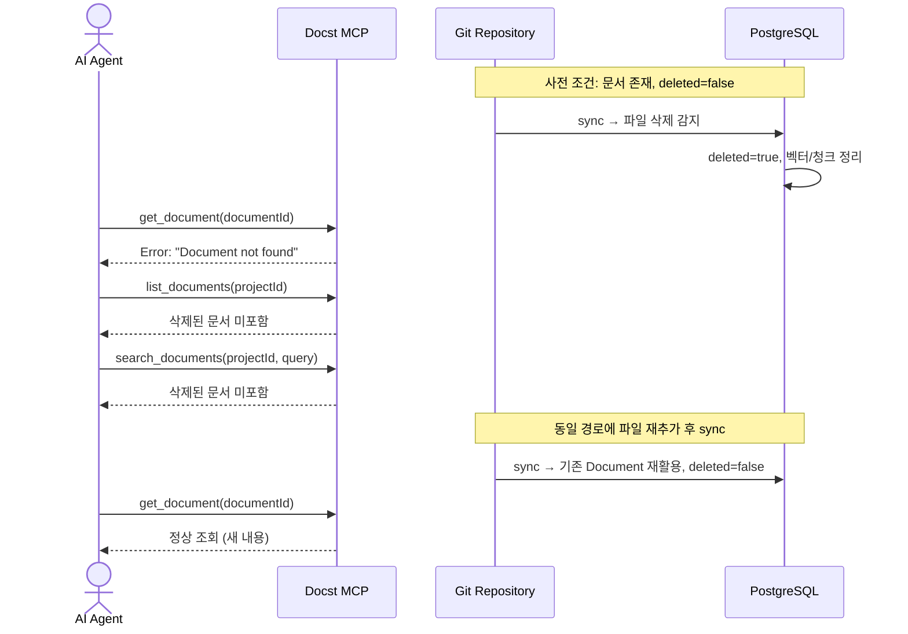

 # MCP Test Scenarios

Docst MCP 도구의 수동 테스트 시나리오.
mcp-remote 또는 Claude Desktop에서 MCP 연결 후 실행한다.

---

## Flow Diagrams

### 전체 MCP 도구 관계도

### 1-1. 프로젝트 → 문서 목록 → 문서 상세

### 1-2. 커밋 히스토리 → 변경 문서 → 문서 상세

### 1-3. 특정 커밋 이후 변경 이력 추적

### 1-4. 특정 기간 커밋 이력 조회

### 2. 검색 플로우

### 3. 버전 비교 플로우

### 4. 문서 쓰기 플로우

### 6. Soft-Delete 문서 노출 차단

---

## 1. 기본 탐색 플로우

### 1-1. 프로젝트 → 문서 목록 → 문서 상세

| 단계 | 도구 | 입력 | 기대 결과 |
|------|------|------|-----------|
| 1 | `list_projects` | — | 사용자 접근 가능 프로젝트 목록, 각 항목에 id/name/role 포함 |
| 2 | `list_documents` | projectId=`{1의 id}` | 문서 목록 (page=0, size=20 기본), totalElements/totalPages 포함 |
| 3 | `get_document` | documentId=`{2의 첫 문서 id}` | 문서 전체 내용, commitSha, authorName, committedAt 포함 |

### 1-2. 커밋 히스토리 → 변경 문서 → 문서 상세

최근 변경 사항을 추적하여 특정 문서의 내용을 확인하는 플로우.

| 단계 | 도구 | 입력 | 기대 결과 |
|------|------|------|-----------|
| 1 | `list_projects` | — | 프로젝트 목록에서 대상 프로젝트 확인 |
| 2 | `list_documents` | projectId=`{1의 id}`, size=1 | repositoryId 확인용 (문서의 repositoryId 필드) |
| 3 | `list_commits` | repositoryId=`{2의 repositoryId}` | 최근 커밋 목록 (sha, shortSha, message, committedAt) |
| 4 | 사용자 판단 | — | committedAt, message 기준으로 필요한 커밋 해시 선택 |
| 5 | `list_changed_documents` | repositoryId, commitSha=`{4에서 선택한 sha}` | 해당 커밋의 변경 파일 목록 (path, changeType, isDocument) |
| 6 | `get_document` | documentId=`{5에서 isDocument=true인 문서 id}` | 문서 전체 내용 조회 |

> **참고**: 5단계에서 isDocument=true인 파일은 Docst가 관리하는 문서 파일이다.
> isDocument=false인 파일(소스코드 등)은 get_document로 조회할 수 없다.
> 문서 상세 조회 시 해당 커밋 시점의 버전을 보려면 commitSha 파라미터를 함께 전달한다.

### 1-3. 특정 커밋 이후 변경 이력 추적

특정 커밋(예: 마지막 배포 커밋) 이후에 발생한 커밋만 조회하는 플로우.

| 단계 | 도구 | 입력 | 기대 결과 |
|------|------|------|-----------|
| 1 | `list_commits` | repositoryId | 전체 최근 커밋 목록에서 기준 커밋 SHA 확인 |
| 2 | `list_commits` | repositoryId, sinceCommitSha=`{1에서 선택한 sha}` | 해당 커밋 이후(exclusive)의 커밋만 반환 |
| 3 | `list_changed_documents` | repositoryId, commitSha=`{2의 커밋 중 하나}` | 해당 커밋에서 변경된 문서 목록 |
| 4 | `get_document` | documentId=`{3에서 isDocument=true인 문서}` | 문서 내용 확인 |

### 1-4. 특정 기간 동안의 커밋 이력 조회

날짜 범위(since/until)로 특정 기간의 커밋만 필터링하는 플로우.

| 단계 | 도구 | 입력 | 기대 결과 |
|------|------|------|-----------|
| 1 | `list_commits` | repositoryId, since="2026-03-01T00:00:00Z", until="2026-03-13T23:59:59Z" | 해당 기간 내 커밋만 반환, 기간 외 커밋 미포함 |
| 2 | `list_commits` | repositoryId, since="2026-03-10T00:00:00Z" | 3월 10일 이후 커밋만 반환 (until 생략 가능) |
| 3 | `list_changed_documents` | repositoryId, commitSha=`{1 또는 2의 커밋 중 하나}` | 해당 커밋에서 변경된 문서 목록 |
| 4 | `get_document` | documentId, commitSha | 해당 시점의 문서 내용 확인 |

> **참고**: since/until은 ISO-8601 형식 (`yyyy-MM-ddTHH:mm:ssZ`)을 사용한다.
> sinceCommitSha와 since/until은 동시에 사용 가능하다 (AND 조건).

---

## 2. 검색 플로우

### 2-1. 키워드 검색

| 단계 | 도구 | 입력 | 기대 결과 |
|------|------|------|-----------|
| 1 | `list_projects` | — | projectId 확인 |
| 2 | `search_documents` | projectId, query="인증", mode="keyword" | snippet에 검색어 포함된 결과 |

### 2-2. 시맨틱 검색

| 단계 | 도구 | 입력 | 기대 결과 |
|------|------|------|-----------|
| 1 | `search_documents` | projectId, query="사용자 로그인은 어떻게 처리하나요?", mode="semantic" | 의미적으로 관련된 문서 반환, score > 0 |
| 2 | `get_document` | documentId=`{1의 상위 결과 id}` | 관련 문서 전체 내용 확인 |

### 2-3. 하이브리드 검색 (RRF)

| 단계 | 도구 | 입력 | 기대 결과 |
|------|------|------|-----------|
| 1 | `search_documents` | projectId, query="API 인증", mode="hybrid", fusionStrategy="rrf" | metadata에 mode="hybrid", fusionStrategy="rrf", rrfK=60 포함 |

### 2-4. 하이브리드 검색 (Weighted Sum)

| 단계 | 도구 | 입력 | 기대 결과 |
|------|------|------|-----------|
| 1 | `search_documents` | projectId, query="API 인증", mode="hybrid", fusionStrategy="weighted_sum", vectorWeight=0.7 | metadata에 vectorWeight=0.7 포함 |

---

## 3. 버전 비교 플로우

### 3-1. 문서 버전 히스토리 → Diff

| 단계 | 도구 | 입력 | 기대 결과 |
|------|------|------|-----------|
| 1 | `list_document_versions` | documentId | 버전 목록 (최신순), page/size/totalElements 포함 |
| 2 | `diff_document` | documentId, fromCommitSha=`{1의 두 번째}`, toCommitSha=`{1의 첫 번째}` | unified diff 형식, `+`/`-` 라인 포함 |

---

## 4. 문서 쓰기 플로우

### 4-1. 문서 생성 → 커밋 → 푸시

| 단계 | 도구 | 입력 | 기대 결과 |
|------|------|------|-----------|
| 1 | `create_document` | repositoryId, path="docs/new-guide.md", content="# New Guide\n...", createCommit=true | committed=true, newCommitSha 반환 |
| 2 | `push_to_remote` | repositoryId | success=true |
| 3 | `get_document` | documentId=`{1의 documentId}` | 생성한 내용 확인 |

### 4-2. 문서 수정 → 스테이징만 (커밋 안 함)

| 단계 | 도구 | 입력 | 기대 결과 |
|------|------|------|-----------|
| 1 | `update_document` | documentId, content="수정된 내용", createCommit=false | committed=false, newCommitSha=null |

### 4-3. 동기화

| 단계 | 도구 | 입력 | 기대 결과 |
|------|------|------|-----------|
| 1 | `sync_repository` | repositoryId | jobId, status="STARTED" 또는 "QUEUED" |

---

## 5. 페이지네이션 검증

MCP 소비자(AI 에이전트)의 컨텍스트 낭비를 방지하기 위한 시나리오.

### 5-1. list_documents 페이지네이션

| 단계 | 도구 | 입력 | 기대 결과 |
|------|------|------|-----------|
| 1 | `list_documents` | projectId, size=2 | documents 2개 이하, totalElements에 전체 수, totalPages 계산 정확 |
| 2 | `list_documents` | projectId, page=1, size=2 | 다음 페이지 문서, 1단계와 중복 없음 |
| 3 | `list_documents` | projectId (size 생략) | 기본 size=20 적용 |

### 5-2. list_document_versions 페이지네이션

| 단계 | 도구 | 입력 | 기대 결과 |
|------|------|------|-----------|
| 1 | `list_document_versions` | documentId, size=1 | versions 1개, totalElements에 전체 버전 수 |
| 2 | `list_document_versions` | documentId, page=1, size=1 | 다음 버전, committedAt이 1보다 이전 (최신순 정렬) |

### 5-3. list_commits 페이지네이션

| 단계 | 도구 | 입력 | 기대 결과 |
|------|------|------|-----------|
| 1 | `list_commits` | repositoryId, size=5 | commits 5개 이하 |
| 2 | `list_commits` | repositoryId, page=1, size=5 | 다음 페이지, 1단계와 중복 없음 |

### 5-4. list_changed_documents 페이지네이션

| 단계 | 도구 | 입력 | 기대 결과 |
|------|------|------|-----------|
| 1 | `list_changed_documents` | repositoryId, commitSha, size=2 | files 2개 이하, totalFiles에 전체 변경 파일 수 |
| 2 | `list_changed_documents` | repositoryId, commitSha, page=1, size=2 | 다음 페이지 |

---

## 6. Soft-Delete 문서 노출 차단

Git에서 삭제된 문서(deleted=true)가 MCP를 통해 노출되지 않는지 검증한다.

### 사전 조건

1. 테스트용 문서 생성 (`create_document`)
2. Git sync로 해당 파일 삭제 처리 (또는 DB에서 직접 `deleted=true` 설정)

### 6-1. 삭제된 문서 단건 조회 차단

| 단계 | 도구 | 입력 | 기대 결과 |
|------|------|------|-----------|
| 1 | `get_document` | documentId=`{삭제된 문서}` | 에러: "Document not found" |

### 6-2. 삭제된 문서 목록에서 제외

| 단계 | 도구 | 입력 | 기대 결과 |
|------|------|------|-----------|
| 1 | `list_documents` | projectId | 삭제된 문서가 목록에 포함되지 않음 |
| 2 | totalElements 확인 | — | 삭제 전보다 1 감소 |

### 6-3. 삭제된 문서 검색에서 제외

| 단계 | 도구 | 입력 | 기대 결과 |
|------|------|------|-----------|
| 1 | `search_documents` | projectId, query=`{삭제된 문서 제목}`, mode="keyword" | 삭제된 문서 미포함 |
| 2 | `search_documents` | projectId, query=`{삭제된 문서 내용}`, mode="semantic" | 삭제된 문서 미포함 |

### 6-4. 삭제 후 재추가 (undelete)

| 단계 | 도구 | 입력 | 기대 결과 |
|------|------|------|-----------|
| 1 | 문서 삭제 (sync) | — | deleted=true, 벡터/청크 정리됨 |
| 2 | 동일 경로에 문서 재추가 (sync) | — | 기존 Document 레코드 재활용 (deleted=false), 새 중복 레코드 생성 안 됨 |
| 3 | `get_document` | documentId | 정상 조회, 새 내용 반환 |
| 4 | `search_documents` | query=`{재추가된 문서 내용}` | 검색 결과에 포함 |

---

## 7. 인증/권한 검증

### 7-1. 인증 없이 도구 호출

| 단계 | 도구 | 입력 | 기대 결과 |
|------|------|------|-----------|
| 1 | `list_projects` | (API Key 없이) | 에러: "Authentication required" |

### 7-2. 다른 프로젝트 문서 접근

| 단계 | 도구 | 입력 | 기대 결과 |
|------|------|------|-----------|
| 1 | `list_documents` | projectId=`{접근 권한 없는 프로젝트}` | 빈 목록 또는 권한 에러 |

---

## 8. 에러 케이스

| 도구 | 입력 | 기대 결과 |
|------|------|-----------|
| `get_document` | documentId="invalid-uuid" | UUID 파싱 에러 |
| `get_document` | documentId=`{존재하지 않는 UUID}` | "Document not found" |
| `list_documents` | repositoryId=null, projectId=null | "Either repositoryId or projectId is required" |
| `diff_document` | fromCommitSha=`{존재하지 않는 SHA}` | "Version not found" |
| `push_to_remote` | repositoryId=`{잘못된 ID}` | success=false, 에러 메시지 포함 |
| `search_documents` | projectId=null | "projectId is required" |
| `list_commits` | repositoryId=`{존재하지 않는 ID}` | 에러 또는 빈 목록 |
