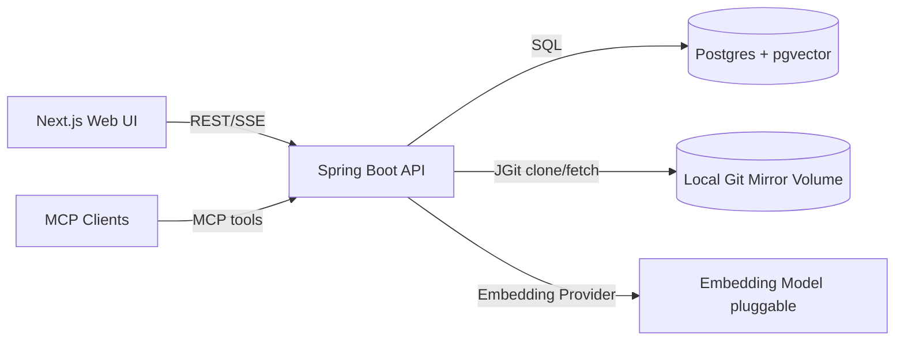
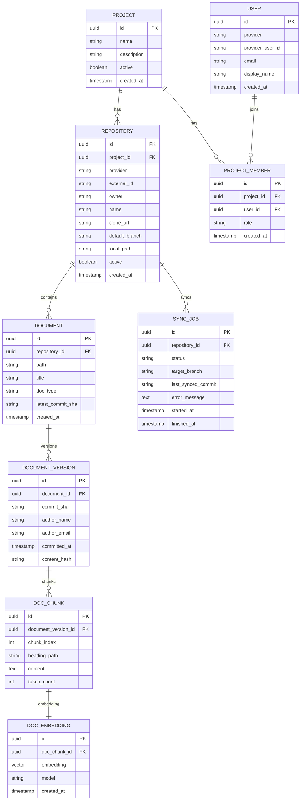

# DocMesh PRD & 설계 패키지 (대화 요약본)

> 목적: 여러 레포지토리에 나눠져 있는 백엔드, 프론트엔드, 아키텍처, QA, 기획 문서들의 **버전 관리 및 통합 조회**  
> 핵심: **통합 문서관리 + Git 기반 버전관리 + MCP Server 접근 규준**  
> 환경: **로컬 실행 가능(docker-compose)**

---

## 1. 제품 개요 (PRD)

### 1.1 제품명(Working Title)
**DocMesh**  
분산된 레포지토리 문서를 하나의 지식 인덱스로 묶는 통합 문서 관리 플랫폼

### 1.2 문제 정의 (Problem Statement)
- 문서가 여러 Git 레포지토리에 흩어져 있어 **통합 조회/탐색이 어렵다**
- Git에 버전은 있으나 **문서 간 맥락/관계/변경 추적(이유/영향) 파악이 어렵다**
- 신규 구성원/AI 에이전트가 프로젝트를 이해하는 데 **학습 비용이 크다**
- MCP 기반 에이전트가 접근할 **표준화된 문서 인터페이스가 없다**

### 1.3 제품 목표 (Goals)
1) **분산 문서 논리적 통합**
2) **Git 기반 버전 관리와 자연스러운 연동**
3) **MCP Server를 통해 AI Agent/Tool이 접근 가능한 문서 플랫폼 제공**

### 1.4 비목표 (Non-goals)
- GitHub 자체 대체
- Notion/Google Docs 같은 실시간 협업 에디터 대체

### 1.5 대상 사용자 (Target Users)
- Primary: 백엔드/프론트/인프라 개발자, 테크리드/아키텍트
- Secondary: QA, PM/기획, MCP Client(에이전트)

### 1.6 핵심 사용자 시나리오
**시나리오 A — 문서 통합**
1) GitHub OAuth 로그인
2) 레포 선택
3) `README.md`, `docs/**`, `architecture/**`, `adr/**` 등 규칙 기반 스캔
4) 메타데이터/인덱스 생성 및 통합 조회

**시나리오 B — 문서 버전 비교**
1) 문서 선택
2) Git commit 기반 버전 히스토리 조회
3) Diff 기반 변경점 시각화

**시나리오 C — MCP Agent 접근**
1) MCP Client → MCP Server Tool 호출
2) 문서 목록 조회/문서 조회/검색
3) (선택) 의미 기반 검색으로 RAG 품질 향상

---

## 2. 기능 범위

### 2.1 핵심 기능 (MVP에 포함)
1) 통합 문서관리
2) 문서 버전관리(Git 연동: commit SHA 기반)
3) MCP Server Tool 제공(list/get/search 등)
4) 로컬 실행(docker-compose)

### 2.2 고려 기능 (2차/3차)
1) 의미 기반 문서 검색(Vector DB — 초기 pgvector 권장)
2) GitHub 인증/인가 연동 + "클릭 한 번 문서 통합" 플로우
3) Webhook 기반 자동 Sync
4) 문서 관계 그래프/영향 분석

---

## 3. 기술 스택

### 3.1 Frontend
- React 19
- Next.js 16 App Router
- TypeScript
- UI: shadcn/ui + Tailwind(화이트/다크)

### 3.2 Backend
- Java 21
- Spring Boot 3.5.8
- (선택) Spring AI 기반 MCP Server 제공

### 3.3 Storage
- PostgreSQL + pgvector
- Git Local Mirror Volume(미러 clone/bare)

---

## 4. 시스템 아키텍처 설계

### 4.1 구성요소
- Web UI(Next.js): 문서 탐색/조회/버전/디프/검색, Sync 진행률(SSE)
- Backend(Spring): OAuth, 문서 수집/동기화, Git 버전 조회(JGit), 청킹/임베딩, 검색, MCP Tools
- Postgres+pgvector: 메타/청크/임베딩/잡
- Local Git Mirror Volume: repo mirror(bare) 저장

### 4.2 데이터 흐름(동기화)
1) Repo 연결 → 서버가 mirror clone/fetch
2) 대상 브랜치 최신 커밋 기준 스캔
3) 문서 파일 후보 선별(경로 규칙)
4) 최신 버전 내용 추출 → 파싱/청킹 → 임베딩 → pgvector 저장
5) UI에서 문서 조회/버전 조회/디프 수행

### 4.3 Mermaid 아키텍처


---

## 5. 데이터 모델 (ERD v1)

### 5.1 핵심 엔티티
- Project, Repository, Document, DocumentVersion, DocChunk, DocEmbedding, SyncJob, User, ProjectMember

### 5.2 ERD (Mermaid)


---

## 6. REST API 설계 (OpenAPI 3.1 초안)

> 아래는 전체 스펙 YAML입니다.

```yaml
openapi: 3.1.0
info:
  title: DocMesh API
  version: 0.1.0
  description: >
    통합 문서관리 + Git 기반 버전조회 + 검색 + 동기화(SSE) API.
servers:
  - url: http://localhost:8080
security:
  - bearerAuth: []
tags:
  - name: Auth
  - name: Projects
  - name: Repositories
  - name: Documents
  - name: Search
  - name: Sync

paths:
  /api/auth/github/start:
    post:
      tags: [Auth]
      summary: GitHub OAuth 시작 (프론트 리다이렉트 URL 반환 또는 302)
      security: []
      requestBody:
        required: false
        content:
          application/json:
            schema:
              type: object
              properties:
                redirectUri:
                  type: string
                  description: OAuth 완료 후 돌아갈 프론트 URL
      responses:
        "200":
          description: OAuth 시작 URL 반환
          content:
            application/json:
              schema:
                type: object
                required: [authorizeUrl]
                properties:
                  authorizeUrl:
                    type: string

  /api/auth/github/callback:
    get:
      tags: [Auth]
      summary: GitHub OAuth callback (code 처리 후 토큰 발급)
      security: []
      parameters:
        - name: code
          in: query
          required: true
          schema: { type: string }
        - name: state
          in: query
          required: false
          schema: { type: string }
      responses:
        "200":
          description: 로그인 성공 (JWT 반환)
          content:
            application/json:
              schema:
                $ref: "#/components/schemas/AuthTokenResponse"

  /api/auth/local/login:
    post:
      tags: [Auth]
      summary: 로컬 모드 로그인 (개발용)
      security: []
      requestBody:
        required: true
        content:
          application/json:
            schema:
              type: object
              required: [email]
              properties:
                email: { type: string, format: email }
                displayName: { type: string }
      responses:
        "200":
          description: 로그인 성공 (JWT 반환)
          content:
            application/json:
              schema:
                $ref: "#/components/schemas/AuthTokenResponse"

  /api/auth/logout:
    post:
      tags: [Auth]
      summary: 로그아웃 (서버가 블랙리스트/세션 사용 시)
      responses:
        "204":
          description: OK

  /api/auth/me:
    get:
      tags: [Auth]
      summary: 현재 사용자 정보
      responses:
        "200":
          description: OK
          content:
            application/json:
              schema:
                $ref: "#/components/schemas/User"

  /api/projects:
    get:
      tags: [Projects]
      summary: 프로젝트 목록 (현재 유저가 멤버인 것만)
      responses:
        "200":
          description: OK
          content:
            application/json:
              schema:
                type: array
                items:
                  $ref: "#/components/schemas/Project"
    post:
      tags: [Projects]
      summary: 프로젝트 생성
      requestBody:
        required: true
        content:
          application/json:
            schema:
              type: object
              required: [name]
              properties:
                name: { type: string, minLength: 1, maxLength: 100 }
                description: { type: string, maxLength: 500 }
      responses:
        "201":
          description: Created
          content:
            application/json:
              schema:
                $ref: "#/components/schemas/Project"

  /api/projects/{projectId}:
    parameters:
      - name: projectId
        in: path
        required: true
        schema: { type: string, format: uuid }
    get:
      tags: [Projects]
      summary: 프로젝트 상세
      responses:
        "200":
          description: OK
          content:
            application/json:
              schema:
                $ref: "#/components/schemas/Project"
    put:
      tags: [Projects]
      summary: 프로젝트 수정 (name, description, active)
      requestBody:
        required: true
        content:
          application/json:
            schema:
              type: object
              properties:
                name: { type: string }
                description: { type: string }
                active: { type: boolean }
      responses:
        "200":
          description: OK
          content:
            application/json:
              schema:
                $ref: "#/components/schemas/Project"
    delete:
      tags: [Projects]
      summary: 프로젝트 삭제
      responses:
        "204":
          description: OK

  /api/projects/{projectId}/repositories:
    parameters:
      - name: projectId
        in: path
        required: true
        schema: { type: string, format: uuid }
    get:
      tags: [Repositories]
      summary: 레포 목록
      responses:
        "200":
          description: OK
          content:
            application/json:
              schema:
                type: array
                items:
                  $ref: "#/components/schemas/Repository"
    post:
      tags: [Repositories]
      summary: 레포 연결 (GitHub 또는 로컬)
      requestBody:
        required: true
        content:
          application/json:
            schema:
              oneOf:
                - $ref: "#/components/schemas/CreateGitHubRepoRequest"
                - $ref: "#/components/schemas/CreateLocalRepoRequest"
      responses:
        "201":
          description: Created
          content:
            application/json:
              schema:
                $ref: "#/components/schemas/Repository"

  /api/repositories/{repoId}:
    parameters:
      - name: repoId
        in: path
        required: true
        schema: { type: string, format: uuid }
    get:
      tags: [Repositories]
      summary: 레포 상세
      responses:
        "200":
          description: OK
          content:
            application/json:
              schema:
                $ref: "#/components/schemas/Repository"
    put:
      tags: [Repositories]
      summary: 레포 수정 (active, default_branch 등)
      requestBody:
        required: true
        content:
          application/json:
            schema:
              type: object
              properties:
                active: { type: boolean }
                defaultBranch: { type: string }
      responses:
        "200":
          description: OK
          content:
            application/json:
              schema:
                $ref: "#/components/schemas/Repository"
    delete:
      tags: [Repositories]
      summary: 레포 삭제
      responses:
        "204":
          description: OK

  /api/repositories/{repoId}/sync:
    parameters:
      - name: repoId
        in: path
        required: true
        schema: { type: string, format: uuid }
    post:
      tags: [Sync]
      summary: 레포 동기화 실행 (Job 생성 & SSE)
      requestBody:
        required: false
        content:
          application/json:
            schema:
              type: object
              properties:
                branch: { type: string }
      responses:
        "202":
          description: Accepted
          content:
            application/json:
              schema:
                $ref: "#/components/schemas/SyncJob"

  /api/repositories/{repoId}/sync/stream:
    parameters:
      - name: repoId
        in: path
        required: true
        schema: { type: string, format: uuid }
    get:
      tags: [Sync]
      summary: SSE로 Sync 진행 상태 스트리밍
      responses:
        "200":
          description: OK (SSE)
          content:
            text/event-stream:
              schema:
                type: string
                description: >
                  event: status
                  data: {"jobId":"...","status":"RUNNING","message":"..."}

  /api/repositories/{repoId}/documents:
    parameters:
      - name: repoId
        in: path
        required: true
        schema: { type: string, format: uuid }
    get:
      tags: [Documents]
      summary: 문서 목록
      parameters:
        - name: pathPrefix
          in: query
          schema: { type: string }
        - name: type
          in: query
          schema: { type: string, enum: [MD, ADOC, OPENAPI, ADR] }
      responses:
        "200":
          description: OK
          content:
            application/json:
              schema:
                type: array
                items:
                  $ref: "#/components/schemas/Document"

  /api/documents/{docId}:
    parameters:
      - name: docId
        in: path
        required: true
        schema: { type: string, format: uuid }
    get:
      tags: [Documents]
      summary: 문서 상세 (최신 버전)
      responses:
        "200":
          description: OK
          content:
            application/json:
              schema:
                $ref: "#/components/schemas/DocumentDetail"

  /api/documents/{docId}/versions:
    parameters:
      - name: docId
        in: path
        required: true
        schema: { type: string, format: uuid }
    get:
      tags: [Documents]
      summary: 문서 버전 목록
      responses:
        "200":
          description: OK
          content:
            application/json:
              schema:
                type: array
                items:
                  $ref: "#/components/schemas/DocumentVersion"

  /api/documents/{docId}/versions/{commitSha}:
    parameters:
      - name: docId
        in: path
        required: true
        schema: { type: string, format: uuid }
      - name: commitSha
        in: path
        required: true
        schema: { type: string }
    get:
      tags: [Documents]
      summary: 특정 버전 내용
      responses:
        "200":
          description: OK
          content:
            application/json:
              schema:
                $ref: "#/components/schemas/DocumentVersionDetail"

  /api/documents/{docId}/diff:
    parameters:
      - name: docId
        in: path
        required: true
        schema: { type: string, format: uuid }
    get:
      tags: [Documents]
      summary: 두 버전 간 Diff
      parameters:
        - name: from
          in: query
          required: true
          schema: { type: string }
        - name: to
          in: query
          required: true
          schema: { type: string }
        - name: format
          in: query
          schema:
            type: string
            enum: [unified, markdown]
            default: unified
      responses:
        "200":
          description: OK
          content:
            text/plain:
              schema:
                type: string

  /api/projects/{projectId}/search:
    parameters:
      - name: projectId
        in: path
        required: true
        schema: { type: string, format: uuid }
    get:
      tags: [Search]
      summary: 프로젝트 내 문서 검색 (keyword/semantic)
      parameters:
        - name: q
          in: query
          required: true
          schema: { type: string, minLength: 1 }
        - name: mode
          in: query
          required: true
          schema:
            type: string
            enum: [keyword, semantic]
        - name: topK
          in: query
          schema: { type: integer, minimum: 1, maximum: 50, default: 10 }
      responses:
        "200":
          description: OK
          content:
            application/json:
              schema:
                type: array
                items:
                  $ref: "#/components/schemas/SearchResult"

components:
  securitySchemes:
    bearerAuth:
      type: http
      scheme: bearer
      bearerFormat: JWT

  schemas:
    AuthTokenResponse:
      type: object
      required: [accessToken, tokenType]
      properties:
        accessToken: { type: string }
        tokenType: { type: string, default: Bearer }
        expiresIn: { type: integer, description: seconds }

    User:
      type: object
      required: [id, provider, email]
      properties:
        id: { type: string, format: uuid }
        provider: { type: string, enum: [GITHUB, LOCAL] }
        providerUserId: { type: string }
        email: { type: string, format: email }
        displayName: { type: string }
        createdAt: { type: string, format: date-time }

    Project:
      type: object
      required: [id, name, active, createdAt]
      properties:
        id: { type: string, format: uuid }
        name: { type: string }
        description: { type: string }
        active: { type: boolean }
        createdAt: { type: string, format: date-time }

    CreateGitHubRepoRequest:
      type: object
      required: [provider, owner, name]
      properties:
        provider: { type: string, enum: [GITHUB] }
        owner: { type: string }
        name: { type: string }
        defaultBranch: { type: string, default: main }

    CreateLocalRepoRequest:
      type: object
      required: [provider, owner, name, localPath]
      properties:
        provider: { type: string, enum: [LOCAL] }
        owner: { type: string }
        name: { type: string }
        localPath: { type: string }
        defaultBranch: { type: string, default: main }

    Repository:
      type: object
      required: [id, projectId, provider, owner, name, active, createdAt]
      properties:
        id: { type: string, format: uuid }
        projectId: { type: string, format: uuid }
        provider: { type: string, enum: [GITHUB, LOCAL] }
        externalId: { type: string }
        owner: { type: string }
        name: { type: string }
        cloneUrl: { type: string }
        defaultBranch: { type: string }
        localMirrorPath: { type: string }
        active: { type: boolean }
        createdAt: { type: string, format: date-time }

    Document:
      type: object
      required: [id, repositoryId, path, title, docType, createdAt]
      properties:
        id: { type: string, format: uuid }
        repositoryId: { type: string, format: uuid }
        path: { type: string }
        title: { type: string }
        docType: { type: string, enum: [MD, ADOC, OPENAPI, ADR, OTHER] }
        latestCommitSha: { type: string }
        createdAt: { type: string, format: date-time }

    DocumentDetail:
      allOf:
        - $ref: "#/components/schemas/Document"
        - type: object
          properties:
            content: { type: string }
            authorName: { type: string }
            authorEmail: { type: string }
            committedAt: { type: string, format: date-time }

    DocumentVersion:
      type: object
      required: [id, documentId, commitSha]
      properties:
        id: { type: string, format: uuid }
        documentId: { type: string, format: uuid }
        commitSha: { type: string }
        authorName: { type: string }
        authorEmail: { type: string }
        committedAt: { type: string, format: date-time }
        message: { type: string }
        contentHash: { type: string }

    DocumentVersionDetail:
      allOf:
        - $ref: "#/components/schemas/DocumentVersion"
        - type: object
          properties:
            content: { type: string }

    SearchResult:
      type: object
      required: [documentId, path, commitSha, score, snippet]
      properties:
        documentId: { type: string, format: uuid }
        repositoryId: { type: string, format: uuid }
        path: { type: string }
        commitSha: { type: string }
        chunkId: { type: string, format: uuid }
        score: { type: number }
        snippet: { type: string }
        highlightedSnippet: { type: string }

    SyncJob:
      type: object
      required: [id, repositoryId, status, createdAt]
      properties:
        id: { type: string, format: uuid }
        repositoryId: { type: string, format: uuid }
        status: { type: string, enum: [PENDING, RUNNING, SUCCEEDED, FAILED] }
        targetBranch: { type: string }
        lastSyncedCommit: { type: string }
        errorMessage: { type: string }
        startedAt: { type: string, format: date-time }
        finishedAt: { type: string, format: date-time }
        createdAt: { type: string, format: date-time }
```

---

## 7. MCP Server Tools 스펙

### 7.1 MCP Tools JSON Schema
```json
{
  "tools": [
    {
      "name": "list_documents",
      "description": "레포 또는 프로젝트 내 문서 목록 조회",
      "inputSchema": {
        "type": "object",
        "additionalProperties": false,
        "properties": {
          "repositoryId": { "type": "string", "format": "uuid" },
          "projectId": { "type": "string", "format": "uuid" },
          "pathPrefix": { "type": "string" },
          "type": { "type": "string", "enum": ["MD", "ADOC", "OPENAPI", "ADR"] }
        }
      },
      "outputSchema": {
        "type": "object",
        "required": ["documents"],
        "properties": {
          "documents": {
            "type": "array",
            "items": {
              "type": "object",
              "required": ["id", "path", "title", "docType"],
              "properties": {
                "id": { "type": "string", "format": "uuid" },
                "repositoryId": { "type": "string", "format": "uuid" },
                "path": { "type": "string" },
                "title": { "type": "string" },
                "docType": { "type": "string" },
                "latestCommitSha": { "type": "string" }
              }
            }
          }
        }
      }
    },
    {
      "name": "get_document",
      "description": "문서 최신 버전 조회",
      "inputSchema": {
        "type": "object",
        "additionalProperties": false,
        "required": ["documentId"],
        "properties": {
          "documentId": { "type": "string", "format": "uuid" },
          "commitSha": { "type": "string" }
        }
      },
      "outputSchema": {
        "type": "object",
        "required": ["id", "path", "content"],
        "properties": {
          "id": { "type": "string", "format": "uuid" },
          "repositoryId": { "type": "string", "format": "uuid" },
          "path": { "type": "string" },
          "title": { "type": "string" },
          "docType": { "type": "string" },
          "commitSha": { "type": "string" },
          "content": { "type": "string" },
          "authorName": { "type": "string" },
          "committedAt": { "type": "string", "format": "date-time" }
        }
      }
    },
    {
      "name": "list_document_versions",
      "description": "문서의 Git 히스토리(버전) 목록",
      "inputSchema": {
        "type": "object",
        "additionalProperties": false,
        "required": ["documentId"],
        "properties": { "documentId": { "type": "string", "format": "uuid" } }
      },
      "outputSchema": {
        "type": "object",
        "required": ["versions"],
        "properties": {
          "versions": {
            "type": "array",
            "items": {
              "type": "object",
              "required": ["commitSha", "committedAt"],
              "properties": {
                "commitSha": { "type": "string" },
                "authorName": { "type": "string" },
                "authorEmail": { "type": "string" },
                "committedAt": { "type": "string", "format": "date-time" },
                "message": { "type": "string" }
              }
            }
          }
        }
      }
    },
    {
      "name": "diff_document",
      "description": "두 버전 간 Diff",
      "inputSchema": {
        "type": "object",
        "additionalProperties": false,
        "required": ["documentId", "fromCommitSha", "toCommitSha"],
        "properties": {
          "documentId": { "type": "string", "format": "uuid" },
          "fromCommitSha": { "type": "string" },
          "toCommitSha": { "type": "string" },
          "format": { "type": "string", "enum": ["unified", "markdown"], "default": "unified" }
        }
      },
      "outputSchema": { "type": "object", "required": ["diff"], "properties": { "diff": { "type": "string" } } }
    },
    {
      "name": "search_documents",
      "description": "프로젝트 문서 검색 (keyword/semantic)",
      "inputSchema": {
        "type": "object",
        "additionalProperties": false,
        "required": ["projectId", "query", "mode"],
        "properties": {
          "projectId": { "type": "string", "format": "uuid" },
          "query": { "type": "string", "minLength": 1 },
          "mode": { "type": "string", "enum": ["keyword", "semantic"] },
          "topK": { "type": "integer", "minimum": 1, "maximum": 50, "default": 10 }
        }
      },
      "outputSchema": {
        "type": "object",
        "required": ["results"],
        "properties": {
          "results": {
            "type": "array",
            "items": {
              "type": "object",
              "required": ["documentId", "path", "commitSha", "score", "snippet"],
              "properties": {
                "documentId": { "type": "string", "format": "uuid" },
                "path": { "type": "string" },
                "commitSha": { "type": "string" },
                "chunkId": { "type": "string", "format": "uuid" },
                "score": { "type": "number" },
                "snippet": { "type": "string" }
              }
            }
          }
        }
      }
    },
    {
      "name": "sync_repository",
      "description": "레포 동기화 실행(서버 clone/fetch + 인덱싱)",
      "inputSchema": {
        "type": "object",
        "additionalProperties": false,
        "required": ["repositoryId"],
        "properties": { "repositoryId": { "type": "string", "format": "uuid" } }
      },
      "outputSchema": {
        "type": "object",
        "required": ["jobId", "status"],
        "properties": {
          "jobId": { "type": "string", "format": "uuid" },
          "status": { "type": "string", "enum": ["PENDING", "RUNNING", "SUCCEEDED", "FAILED"] }
        }
      }
    }
  ]
}
```

### 7.2 MCP 호출 예시
**문서 목록**
```json
{
  "tool": "list_documents",
  "arguments": {
    "repositoryId": "3c2f6f33-5c3a-4a34-8b4f-8e5d7cc0c9e1",
    "pathPrefix": "docs/",
    "type": "MD"
  }
}
```

**의미 검색**
```json
{
  "tool": "search_documents",
  "arguments": {
    "projectId": "b7fd4b92-3f4a-4c2b-8bf5-17b8c8c5d2c1",
    "query": "SSE streaming response flow",
    "mode": "semantic",
    "topK": 5
  }
}
```

---

## 8. DB DDL (Postgres + pgvector) + 인덱스

### 8.1 Extension
```sql
CREATE EXTENSION IF NOT EXISTS "uuid-ossp";
CREATE EXTENSION IF NOT EXISTS "pgcrypto";
CREATE EXTENSION IF NOT EXISTS vector;
```

### 8.2 Tables
```sql
CREATE TABLE dm_user (
  id uuid PRIMARY KEY DEFAULT gen_random_uuid(),
  provider text NOT NULL CHECK (provider IN ('GITHUB', 'LOCAL')),
  provider_user_id text NOT NULL,
  email text,
  display_name text,
  created_at timestamptz NOT NULL DEFAULT now(),
  UNIQUE (provider, provider_user_id)
);

CREATE TABLE dm_project (
  id uuid PRIMARY KEY DEFAULT gen_random_uuid(),
  name text NOT NULL,
  description text,
  active boolean NOT NULL DEFAULT true,
  created_at timestamptz NOT NULL DEFAULT now()
);

CREATE TABLE dm_project_member (
  id uuid PRIMARY KEY DEFAULT gen_random_uuid(),
  project_id uuid NOT NULL REFERENCES dm_project(id) ON DELETE CASCADE,
  user_id uuid NOT NULL REFERENCES dm_user(id) ON DELETE CASCADE,
  role text NOT NULL CHECK (role IN ('OWNER', 'EDITOR', 'VIEWER')),
  created_at timestamptz NOT NULL DEFAULT now(),
  UNIQUE (project_id, user_id)
);

CREATE TABLE dm_repository (
  id uuid PRIMARY KEY DEFAULT gen_random_uuid(),
  project_id uuid NOT NULL REFERENCES dm_project(id) ON DELETE CASCADE,
  provider text NOT NULL CHECK (provider IN ('GITHUB', 'LOCAL')),
  external_id text,
  owner text NOT NULL,
  name text NOT NULL,
  clone_url text,
  default_branch text,
  local_mirror_path text,
  active boolean NOT NULL DEFAULT true,
  created_at timestamptz NOT NULL DEFAULT now(),
  UNIQUE (project_id, provider, owner, name)
);

CREATE TABLE dm_document (
  id uuid PRIMARY KEY DEFAULT gen_random_uuid(),
  repository_id uuid NOT NULL REFERENCES dm_repository(id) ON DELETE CASCADE,
  path text NOT NULL,
  title text NOT NULL,
  doc_type text NOT NULL CHECK (doc_type IN ('MD','ADOC','OPENAPI','ADR','OTHER')),
  latest_commit_sha text,
  created_at timestamptz NOT NULL DEFAULT now(),
  UNIQUE (repository_id, path)
);

CREATE TABLE dm_document_version (
  id uuid PRIMARY KEY DEFAULT gen_random_uuid(),
  document_id uuid NOT NULL REFERENCES dm_document(id) ON DELETE CASCADE,
  commit_sha text NOT NULL,
  author_name text,
  author_email text,
  committed_at timestamptz,
  message text,
  content_hash text,
  UNIQUE (document_id, commit_sha)
);

CREATE TABLE dm_doc_chunk (
  id uuid PRIMARY KEY DEFAULT gen_random_uuid(),
  document_version_id uuid NOT NULL REFERENCES dm_document_version(id) ON DELETE CASCADE,
  chunk_index integer NOT NULL,
  heading_path text,
  content text NOT NULL,
  token_count integer NOT NULL DEFAULT 0,
  created_at timestamptz NOT NULL DEFAULT now(),
  UNIQUE (document_version_id, chunk_index)
);

CREATE TABLE dm_doc_embedding (
  id uuid PRIMARY KEY DEFAULT gen_random_uuid(),
  doc_chunk_id uuid NOT NULL REFERENCES dm_doc_chunk(id) ON DELETE CASCADE,
  model text NOT NULL,
  embedding vector(1536) NOT NULL,
  created_at timestamptz NOT NULL DEFAULT now(),
  UNIQUE (doc_chunk_id, model)
);

CREATE TABLE dm_sync_job (
  id uuid PRIMARY KEY DEFAULT gen_random_uuid(),
  repository_id uuid NOT NULL REFERENCES dm_repository(id) ON DELETE CASCADE,
  status text NOT NULL CHECK (status IN ('PENDING','RUNNING','SUCCEEDED','FAILED')),
  target_branch text,
  last_synced_commit text,
  error_message text,
  started_at timestamptz,
  finished_at timestamptz,
  created_at timestamptz NOT NULL DEFAULT now()
);
```

### 8.3 Indexes
```sql
CREATE INDEX idx_repo_project_id ON dm_repository(project_id);
CREATE INDEX idx_doc_repo_id ON dm_document(repository_id);
CREATE INDEX idx_docver_doc_id ON dm_document_version(document_id);
CREATE INDEX idx_chunk_docver_id ON dm_doc_chunk(document_version_id);
CREATE INDEX idx_job_repo_id ON dm_sync_job(repository_id);

ALTER TABLE dm_doc_chunk
  ADD COLUMN content_tsv tsvector GENERATED ALWAYS AS (to_tsvector('english', coalesce(content,''))) STORED;

CREATE INDEX idx_chunk_content_tsv_gin ON dm_doc_chunk USING GIN (content_tsv);

CREATE INDEX idx_embedding_ivfflat
  ON dm_doc_embedding
  USING ivfflat (embedding vector_cosine_ops)
  WITH (lists = 100);

-- hnsw 사용 가능 시(선호):
-- CREATE INDEX idx_embedding_hnsw
--   ON dm_doc_embedding
--   USING hnsw (embedding vector_cosine_ops)
--   WITH (m = 16, ef_construction = 64);
```

### 8.4 Semantic Search Query 예시
```sql
SELECT
  d.id AS document_id,
  d.path,
  dv.commit_sha,
  c.id AS chunk_id,
  1 - (e.embedding <=> :query_embedding) AS score,
  substr(c.content, 1, 200) AS snippet
FROM dm_doc_embedding e
JOIN dm_doc_chunk c ON c.id = e.doc_chunk_id
JOIN dm_document_version dv ON dv.id = c.document_version_id
JOIN dm_document d ON d.id = dv.document_id
JOIN dm_repository r ON r.id = d.repository_id
WHERE r.project_id = :project_id
  AND e.model = :model
ORDER BY e.embedding <=> :query_embedding
LIMIT :top_k;
```

---

## 9. 로컬 실행(docker-compose) 골격

```yaml
services:
  postgres:
    image: pgvector/pgvector:pg16
    environment:
      POSTGRES_PASSWORD: postgres
      POSTGRES_USER: postgres
      POSTGRES_DB: docmesh
    ports:
      - "5432:5432"
    volumes:
      - pgdata:/var/lib/postgresql/data

  backend:
    build: ./backend
    environment:
      SPRING_DATASOURCE_URL: jdbc:postgresql://postgres:5432/docmesh
      SPRING_DATASOURCE_USERNAME: postgres
      SPRING_DATASOURCE_PASSWORD: postgres
      DOCMESH_GIT_ROOT: /data/git
      DOCMESH_AUTH_MODE: github # or local
    volumes:
      - gitdata:/data/git
    ports:
      - "8080:8080"
    depends_on:
      - postgres

  frontend:
    build: ./frontend
    environment:
      NEXT_PUBLIC_API_BASE: http://localhost:8080
    ports:
      - "3000:3000"
    depends_on:
      - backend

volumes:
  pgdata:
  gitdata:
```

---

## 10. MVP 로드맵

### Phase 1 (MVP)
- GitHub/Local 레포 연결
- 문서 목록/내용 조회(최신)
- 문서 버전 목록(커밋)
- Diff(unified)
- 키워드 검색(GIN tsvector)
- MCP tools: list/get/search(키워드)
- docker-compose 로컬 실행

### Phase 2
- 의미 검색(pgvector)
- 청킹/임베딩 고도화(heading 기반)
- MCP search semantic

### Phase 3
- Webhook 자동 sync
- 문서 관계 그래프/영향 분석
- 멀티 프로젝트/조직 권한 고도화

---

## 11. 추가 구현 설계(추천 다음 단계)
- Spring Boot 스캐폴딩(패키지 구조 + 핵심 서비스 인터페이스 + Controller + MCP 엔드포인트)
- Next.js IA(라우팅/화면) + 문서 트리/뷰어/디프 UI
- Sync 파이프라인(증분 처리) + SSE 이벤트 규격

---