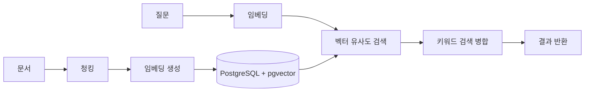
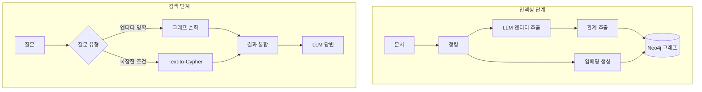
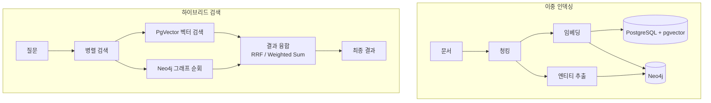

# Phase 4: 유연한 RAG 아키텍처 구현 계획

> **작성일**: 2025-12-27
> **선행 조건**: Phase 2-3 완료 (청킹/임베딩/의미검색, OAuth/Webhook/권한)
> **목표**: 3가지 RAG 모드 지원 - PgVector Only, Graph DB Only, Hybrid (PgVector + Graph DB)

---

## 1. 개요

### 1.1 배경

연구 문서 분석 결과, 각 RAG 접근법은 서로 다른 강점을 가집니다:

| 접근법 | 강점 | 약점 |
|--------|------|------|
| **Vector RAG (PgVector)** | 시맨틱 유사도, 비구조화 텍스트 | 관계 추론 어려움, 단일 홉 검색 |
| **Graph RAG (Neo4j)** | Multi-hop 추론, 설명 가능성 | 인덱싱 비용, 업데이트 복잡성 |
| **Hybrid RAG** | 두 강점 결합, 최대 커버리지 | 구현 복잡성 증가 |

### 1.2 핵심 원칙

```
"하이브리드 검색(벡터 + 키워드)으로 문제가 해결된다면 GraphRAG를 배포하지 마세요."
— Gradient Flow

"GraphRAG의 주요 장점은 검색 단계에서 정확한 매칭이 가능하다는 것입니다.
 규정 준수, 법률, 또는 고도로 큐레이션된 데이터셋에서 특히 가치가 있습니다."
— Gradient Flow
```

### 1.3 세 가지 모드

```
┌─────────────────────────────────────────────────────────────────────────┐
│                      Docst RAG Architecture                              │
├─────────────────────────────────────────────────────────────────────────┤
│                                                                         │
│  [Mode 1: PgVector Only]                                                │
│  ├── 청킹 → 임베딩 → pgvector                                            │
│  ├── 벡터 유사도 검색 + 키워드 검색                                        │
│  └── 적합: 단순 Q&A, 비구조화 문서, 빠른 시작                              │
│                                                                         │
│  [Mode 2: Graph DB Only (Neo4j)]                                        │
│  ├── 엔티티/관계 추출 → 지식 그래프                                       │
│  ├── 그래프 순회 + Text-to-Cypher                                        │
│  └── 적합: 관계 중심 도메인, 설명 가능성 필수                              │
│                                                                         │
│  [Mode 3: Hybrid (PgVector + Neo4j)]                                    │
│  ├── 벡터 검색 (진입점) → 그래프 순회 (확장)                              │
│  ├── 결과 융합 (RRF 또는 점수 정규화)                                     │
│  └── 적합: 복잡한 도메인, 최대 정확도 필요                                │
│                                                                         │
└─────────────────────────────────────────────────────────────────────────┘
```

---

## 2. 아키텍처 설계

### 2.1 전체 구조

```
┌─────────────────────────────────────────────────────────────────────────┐
│                          Docst Backend                                   │
├─────────────────────────────────────────────────────────────────────────┤
│                                                                         │
│  ┌─────────────────────────────────────────────────────────────────┐   │
│  │                    RAG Configuration                             │   │
│  │  docst.rag.mode: pgvector | neo4j | hybrid                      │   │
│  └─────────────────────────────────────────────────────────────────┘   │
│                              │                                          │
│              ┌───────────────┼───────────────┐                          │
│              ▼               ▼               ▼                          │
│  ┌─────────────────┐ ┌─────────────────┐ ┌─────────────────┐           │
│  │ PgVectorService │ │  Neo4jService   │ │ HybridService   │           │
│  │                 │ │                 │ │                 │           │
│  │ - 청킹          │ │ - 엔티티 추출   │ │ - 벡터 검색     │           │
│  │ - 임베딩        │ │ - 관계 추출    │ │ - 그래프 순회   │           │
│  │ - 벡터 검색     │ │ - 그래프 순회  │ │ - 결과 융합     │           │
│  └────────┬────────┘ └────────┬────────┘ └────────┬────────┘           │
│           │                   │                   │                     │
│           ▼                   ▼                   ▼                     │
│  ┌─────────────────┐ ┌─────────────────┐ ┌─────────────────┐           │
│  │   PostgreSQL    │ │     Neo4j       │ │ PostgreSQL +    │           │
│  │   + pgvector    │ │  Graph + Vector │ │ Neo4j           │           │
│  └─────────────────┘ └─────────────────┘ └─────────────────┘           │
│                                                                         │
└─────────────────────────────────────────────────────────────────────────┘
```

### 2.2 설정 기반 모드 선택

**application.yml**:
```yaml
docst:
  rag:
    mode: hybrid  # pgvector, neo4j, hybrid

    # Mode 1: PgVector 설정 (pgvector, hybrid 모드에서 사용)
    pgvector:
      enabled: true
      embedding:
        provider: ollama  # ollama, openai
        model: nomic-embed-text
        dimension: 768
      search:
        default-top-k: 10
        similarity-threshold: 0.7

    # Mode 2: Neo4j 설정 (neo4j, hybrid 모드에서 사용)
    neo4j:
      enabled: true
      uri: ${NEO4J_URI:bolt://localhost:7687}
      username: ${NEO4J_USERNAME:neo4j}
      password: ${NEO4J_PASSWORD:password}
      entity-extraction:
        enabled: true
        model: gpt-4o-mini  # 엔티티 추출용 LLM
      search:
        max-hop: 2
        text-to-cypher: true

    # Mode 3: Hybrid 설정
    hybrid:
      fusion-strategy: rrf  # rrf, weighted_sum
      vector-weight: 0.6
      graph-weight: 0.4
      rrf-k: 60  # RRF 상수
```

### 2.3 인터페이스 설계

```java
/**
 * RAG 검색 전략 인터페이스
 */
public interface RagSearchStrategy {

    /**
     * 검색 실행
     */
    List<SearchResult> search(UUID projectId, String query, SearchOptions options);

    /**
     * 문서 인덱싱
     */
    void indexDocument(DocumentVersion documentVersion);

    /**
     * 지원 여부 확인
     */
    boolean supports(RagMode mode);
}

/**
 * RAG 모드 열거형
 */
public enum RagMode {
    PGVECTOR,    // Mode 1: 벡터 검색만
    NEO4J,       // Mode 2: 그래프 검색만
    HYBRID       // Mode 3: 하이브리드
}
```

---

## 3. Mode 1: PgVector Only 구현

### 3.1 개요

Phase 2에서 구현한 기본 의미 검색 기능의 확장입니다.



### 3.2 기존 구현 활용

Phase 2에서 구현한 항목:
- [x] DocChunk 엔티티
- [x] DocEmbedding 엔티티
- [x] ChunkingService
- [x] EmbeddingService
- [x] 벡터 검색 쿼리

### 3.3 추가 구현 항목

| 항목 | 설명 |
|------|------|
| PgVectorSearchStrategy | RagSearchStrategy 구현체 |
| 검색 모드 분기 | mode 파라미터에 따른 전략 선택 |
| 키워드 + 벡터 융합 | 하이브리드 검색 (BM25 + 벡터) |

---

## 4. Mode 2: Graph DB (Neo4j) 구현

### 4.1 개요

Neo4j를 활용한 지식 그래프 기반 RAG입니다.



### 4.2 Spring AI + Neo4j 통합

Spring AI가 Neo4j Vector Store를 공식 지원하므로 이를 활용합니다.

**의존성 추가** (build.gradle.kts):
```kotlin
dependencies {
    // Spring AI Neo4j
    implementation("org.springframework.ai:spring-ai-starter-vector-store-neo4j")

    // Spring Data Neo4j
    implementation("org.springframework.boot:spring-boot-starter-data-neo4j")
}
```

### 4.3 그래프 스키마 설계

Docst 도메인에 맞는 지식 그래프 스키마:

```cypher
// 노드 레이블
(:Document {id, path, title, docType})
(:Chunk {id, text, summary, embedding})
(:Entity {id, name, type})
(:Concept {id, name, description})
(:API {id, name, endpoint})
(:Component {id, name, description})

// 관계
(:Document)-[:HAS_CHUNK]->(:Chunk)
(:Chunk)-[:MENTIONS]->(:Entity)
(:Entity)-[:RELATED_TO]->(:Entity)
(:Entity)-[:PART_OF]->(:Component)
(:API)-[:DEPENDS_ON]->(:API)
(:Component)-[:USES]->(:Technology)
```

### 4.4 엔티티 추출 파이프라인

```java
@Service
public class EntityExtractionService {

    private final ChatClient chatClient;

    public List<ExtractedEntity> extractEntities(String chunkText) {
        String prompt = """
            다음 텍스트에서 엔티티와 관계를 추출하세요:

            텍스트: %s

            추출할 엔티티 유형:
            - Concept: 개념, 용어
            - API: API 엔드포인트, 함수
            - Component: 시스템 컴포넌트
            - Technology: 기술, 프레임워크

            JSON 형식으로 반환:
            {
              "entities": [
                {"name": "...", "type": "...", "description": "..."}
              ],
              "relationships": [
                {"source": "...", "target": "...", "type": "...", "description": "..."}
              ]
            }
            """.formatted(chunkText);

        String response = chatClient.prompt()
            .user(prompt)
            .call()
            .content();

        return parseEntities(response);
    }
}
```

### 4.5 Neo4j 검색 서비스

```java
@Service
@ConditionalOnProperty(name = "docst.rag.neo4j.enabled", havingValue = "true")
public class Neo4jSearchStrategy implements RagSearchStrategy {

    private final VectorStore vectorStore;
    private final Neo4jClient neo4jClient;
    private final ChatClient chatClient;

    @Override
    public List<SearchResult> search(UUID projectId, String query, SearchOptions options) {
        // 1. 벡터 검색으로 관련 청크 찾기 (진입점)
        List<Document> vectorResults = vectorStore.similaritySearch(
            SearchRequest.builder()
                .query(query)
                .topK(options.getTopK() * 2)
                .build()
        );

        // 2. 그래프 순회로 관련 엔티티 확장
        List<String> chunkIds = vectorResults.stream()
            .map(Document::getId)
            .collect(Collectors.toList());

        List<Map<String, Object>> graphContext = neo4jClient.query("""
            MATCH (c:Chunk) WHERE c.id IN $chunkIds
            OPTIONAL MATCH (c)-[:MENTIONS]->(e:Entity)
            OPTIONAL MATCH (e)-[:RELATED_TO]-(related:Entity)
            RETURN c.id AS chunkId,
                   c.text AS text,
                   collect(DISTINCT e.name) AS entities,
                   collect(DISTINCT related.name) AS relatedEntities
            """)
            .bind(chunkIds).to("chunkIds")
            .fetch()
            .all();

        // 3. 결과 통합
        return mergeResults(vectorResults, graphContext);
    }

    /**
     * Text-to-Cypher: 자연어를 Cypher 쿼리로 변환
     */
    public List<Map<String, Object>> textToCypher(String naturalQuery) {
        String cypher = chatClient.prompt()
            .system(s -> s.text("""
                You are a Neo4j Cypher expert.
                Generate a Cypher query for the following schema:

                Nodes: Chunk, Entity, Concept, API, Component
                Relationships: HAS_CHUNK, MENTIONS, RELATED_TO, DEPENDS_ON, USES

                Return ONLY the Cypher query.
                """))
            .user(naturalQuery)
            .call()
            .content();

        try {
            return neo4jClient.query(cypher).fetch().all();
        } catch (Exception e) {
            // Self-healing: 오류 시 재생성
            return retryWithError(naturalQuery, cypher, e.getMessage());
        }
    }

    @Override
    public boolean supports(RagMode mode) {
        return mode == RagMode.NEO4J || mode == RagMode.HYBRID;
    }
}
```

### 4.6 Neo4j 인덱스 설정

```cypher
-- 벡터 인덱스 (청크 임베딩)
CREATE VECTOR INDEX chunkEmbedding IF NOT EXISTS
FOR (c:Chunk)
ON (c.embedding)
OPTIONS {
    indexConfig: {
        `vector.dimensions`: 768,
        `vector.similarity_function`: 'cosine'
    }
}

-- 전문 인덱스 (키워드 검색)
CREATE FULLTEXT INDEX chunkFulltext IF NOT EXISTS
FOR (c:Chunk)
ON EACH [c.text, c.summary]

-- 엔티티 인덱스
CREATE INDEX entityName IF NOT EXISTS
FOR (e:Entity)
ON (e.name)
```

---

## 5. Mode 3: Hybrid (PgVector + Neo4j) 구현

### 5.1 개요

두 검색 방식의 장점을 결합하는 하이브리드 모드입니다.



### 5.2 결과 융합 전략

#### 전략 1: RRF (Reciprocal Rank Fusion)

```java
public class RrfFusionStrategy implements FusionStrategy {

    private final int k = 60;  // RRF 상수

    @Override
    public List<SearchResult> fuse(
            List<SearchResult> vectorResults,
            List<SearchResult> graphResults) {

        Map<String, Double> rrfScores = new HashMap<>();

        // 벡터 검색 결과에 RRF 점수 부여
        for (int i = 0; i < vectorResults.size(); i++) {
            String docId = vectorResults.get(i).getDocumentId();
            rrfScores.merge(docId, 1.0 / (k + i + 1), Double::sum);
        }

        // 그래프 검색 결과에 RRF 점수 부여
        for (int i = 0; i < graphResults.size(); i++) {
            String docId = graphResults.get(i).getDocumentId();
            rrfScores.merge(docId, 1.0 / (k + i + 1), Double::sum);
        }

        // 점수 기준 정렬
        return rrfScores.entrySet().stream()
            .sorted(Map.Entry.<String, Double>comparingByValue().reversed())
            .map(entry -> buildResult(entry.getKey(), entry.getValue()))
            .collect(Collectors.toList());
    }
}
```

#### 전략 2: 가중 합산 (Weighted Sum)

```java
public class WeightedSumFusionStrategy implements FusionStrategy {

    private final double vectorWeight;
    private final double graphWeight;

    @Override
    public List<SearchResult> fuse(
            List<SearchResult> vectorResults,
            List<SearchResult> graphResults) {

        Map<String, Double> fusedScores = new HashMap<>();

        // 벡터 점수 정규화 및 가중
        double maxVectorScore = vectorResults.stream()
            .mapToDouble(SearchResult::getScore)
            .max().orElse(1.0);

        for (SearchResult result : vectorResults) {
            double normalizedScore = result.getScore() / maxVectorScore;
            fusedScores.merge(
                result.getDocumentId(),
                normalizedScore * vectorWeight,
                Double::sum
            );
        }

        // 그래프 점수 정규화 및 가중
        double maxGraphScore = graphResults.stream()
            .mapToDouble(SearchResult::getScore)
            .max().orElse(1.0);

        for (SearchResult result : graphResults) {
            double normalizedScore = result.getScore() / maxGraphScore;
            fusedScores.merge(
                result.getDocumentId(),
                normalizedScore * graphWeight,
                Double::sum
            );
        }

        return fusedScores.entrySet().stream()
            .sorted(Map.Entry.<String, Double>comparingByValue().reversed())
            .map(entry -> buildResult(entry.getKey(), entry.getValue()))
            .collect(Collectors.toList());
    }
}
```

### 5.3 하이브리드 검색 서비스

```java
@Service
@ConditionalOnProperty(name = "docst.rag.mode", havingValue = "hybrid")
public class HybridSearchStrategy implements RagSearchStrategy {

    private final PgVectorSearchStrategy pgVectorStrategy;
    private final Neo4jSearchStrategy neo4jStrategy;
    private final FusionStrategy fusionStrategy;

    @Override
    public List<SearchResult> search(UUID projectId, String query, SearchOptions options) {
        // 병렬 검색 실행
        CompletableFuture<List<SearchResult>> vectorFuture =
            CompletableFuture.supplyAsync(() ->
                pgVectorStrategy.search(projectId, query, options));

        CompletableFuture<List<SearchResult>> graphFuture =
            CompletableFuture.supplyAsync(() ->
                neo4jStrategy.search(projectId, query, options));

        // 결과 대기 및 융합
        List<SearchResult> vectorResults = vectorFuture.join();
        List<SearchResult> graphResults = graphFuture.join();

        // 결과 융합
        List<SearchResult> fusedResults = fusionStrategy.fuse(vectorResults, graphResults);

        // Top-K 반환
        return fusedResults.stream()
            .limit(options.getTopK())
            .collect(Collectors.toList());
    }

    @Override
    public void indexDocument(DocumentVersion documentVersion) {
        // 양쪽 저장소에 인덱싱
        pgVectorStrategy.indexDocument(documentVersion);
        neo4jStrategy.indexDocument(documentVersion);
    }

    @Override
    public boolean supports(RagMode mode) {
        return mode == RagMode.HYBRID;
    }
}
```

---

## 6. 동적 전략 선택

### 6.1 쿼리 라우터

질문 유형에 따라 최적의 검색 전략을 동적으로 선택합니다.

```java
@Component
public class QueryRouter {

    private final ChatClient chatClient;

    /**
     * 질문 분석 후 최적 검색 전략 추천
     */
    public SearchStrategy analyzeAndRoute(String query) {
        String analysis = chatClient.prompt()
            .system("""
                질문을 분석하고 최적의 검색 전략을 선택하세요:

                - VECTOR: 시맨틱 유사도 검색이 적합 (개념 설명, 유사한 내용 찾기)
                - GRAPH: 관계 기반 검색이 적합 (X의 Y는?, A와 B의 관계는?)
                - HYBRID: 둘 다 필요 (복잡한 질문, 여러 정보 종합)

                응답 형식: VECTOR | GRAPH | HYBRID
                """)
            .user(query)
            .call()
            .content()
            .trim();

        return switch (analysis) {
            case "VECTOR" -> SearchStrategy.VECTOR;
            case "GRAPH" -> SearchStrategy.GRAPH;
            default -> SearchStrategy.HYBRID;
        };
    }
}
```

### 6.2 프로젝트별 설정 지원

프로젝트마다 다른 RAG 모드를 설정할 수 있습니다.

```java
@Entity
@Table(name = "dm_project")
public class Project {
    // ... 기존 필드

    @Enumerated(EnumType.STRING)
    @Column(name = "rag_mode")
    private RagMode ragMode = RagMode.PGVECTOR;  // 기본값

    @Column(name = "rag_config", columnDefinition = "jsonb")
    private String ragConfig;  // 프로젝트별 RAG 설정 JSON
}
```

---

## 7. MCP Tools 확장

### 7.1 새로운 Tools

| Tool | 설명 | 모드 |
|------|------|------|
| `search_documents` | 문서 검색 (모드별 동작) | 전체 |
| `search_with_graph` | 그래프 순회 검색 | Neo4j, Hybrid |
| `get_entity_relations` | 엔티티 관계 조회 | Neo4j, Hybrid |
| `text_to_cypher` | 자연어 → Cypher 쿼리 | Neo4j, Hybrid |
| `get_related_documents` | 관련 문서 추천 | 전체 |

### 7.2 search_documents 확장

```json
{
  "name": "search_documents",
  "description": "문서 검색 (keyword/semantic/graph/hybrid)",
  "inputSchema": {
    "type": "object",
    "required": ["projectId", "query"],
    "properties": {
      "projectId": { "type": "string", "format": "uuid" },
      "query": { "type": "string", "minLength": 1 },
      "mode": {
        "type": "string",
        "enum": ["keyword", "semantic", "graph", "hybrid", "auto"],
        "default": "auto",
        "description": "auto: 질문 분석 후 최적 전략 선택"
      },
      "topK": { "type": "integer", "minimum": 1, "maximum": 50, "default": 10 },
      "includeEntities": {
        "type": "boolean",
        "default": false,
        "description": "관련 엔티티 정보 포함 여부"
      },
      "maxHop": {
        "type": "integer",
        "minimum": 1,
        "maximum": 5,
        "default": 2,
        "description": "그래프 순회 최대 hop 수"
      }
    }
  }
}
```

### 7.3 get_entity_relations

```json
{
  "name": "get_entity_relations",
  "description": "엔티티의 관계 정보 조회",
  "inputSchema": {
    "type": "object",
    "required": ["entityName"],
    "properties": {
      "entityName": { "type": "string" },
      "projectId": { "type": "string", "format": "uuid" },
      "depth": {
        "type": "integer",
        "minimum": 1,
        "maximum": 3,
        "default": 1
      },
      "relationTypes": {
        "type": "array",
        "items": { "type": "string" },
        "description": "필터링할 관계 유형 (비어있으면 전체)"
      }
    }
  }
}
```

---

## 8. 프론트엔드 UI

### 8.1 검색 모드 선택 UI

```tsx
// components/search/search-mode-select.tsx
export function SearchModeSelect({
  mode,
  onChange,
  ragMode  // 프로젝트의 RAG 모드
}: SearchModeSelectProps) {

  const availableModes = useMemo(() => {
    const modes = [
      { value: 'keyword', label: 'Keyword' },
      { value: 'semantic', label: 'Semantic' },
    ];

    if (ragMode === 'neo4j' || ragMode === 'hybrid') {
      modes.push({ value: 'graph', label: 'Graph' });
    }

    if (ragMode === 'hybrid') {
      modes.push({ value: 'hybrid', label: 'Hybrid (Recommended)' });
    }

    modes.push({ value: 'auto', label: 'Auto' });

    return modes;
  }, [ragMode]);

  return (
    <Select value={mode} onValueChange={onChange}>
      {availableModes.map(m => (
        <SelectItem key={m.value} value={m.value}>
          {m.label}
        </SelectItem>
      ))}
    </Select>
  );
}
```

### 8.2 검색 결과에 엔티티 표시

```tsx
// components/search/search-result-card.tsx
export function SearchResultCard({ result }: { result: EnhancedSearchResult }) {
  return (
    <Card>
      <CardHeader>
        <div className="flex justify-between">
          <CardTitle className="text-sm">{result.path}</CardTitle>
          <Badge variant="outline">{(result.score * 100).toFixed(1)}%</Badge>
        </div>
        {result.headingPath && (
          <p className="text-xs text-muted-foreground">{result.headingPath}</p>
        )}
      </CardHeader>
      <CardContent>
        <p className="text-sm" dangerouslySetInnerHTML={{ __html: result.highlightedSnippet }} />

        {/* 관련 엔티티 표시 (Graph/Hybrid 모드) */}
        {result.entities && result.entities.length > 0 && (
          <div className="mt-2 flex flex-wrap gap-1">
            {result.entities.map(entity => (
              <Badge key={entity.id} variant="secondary" className="text-xs">
                {entity.type}: {entity.name}
              </Badge>
            ))}
          </div>
        )}

        {/* 관계 경로 표시 (Graph 모드) */}
        {result.relationPath && (
          <div className="mt-2 text-xs text-muted-foreground">
            <span className="font-medium">경로: </span>
            {result.relationPath}
          </div>
        )}
      </CardContent>
    </Card>
  );
}
```

### 8.3 프로젝트 RAG 설정 페이지

```tsx
// app/[locale]/projects/[projectId]/settings/rag/page.tsx
export default function RagSettingsPage() {
  const { projectId } = useParams();
  const [ragMode, setRagMode] = useState<RagMode>('pgvector');

  return (
    <div className="space-y-6">
      <h1 className="text-2xl font-bold">RAG 설정</h1>

      <Card>
        <CardHeader>
          <CardTitle>검색 모드</CardTitle>
          <CardDescription>
            프로젝트에 적합한 RAG 모드를 선택하세요.
          </CardDescription>
        </CardHeader>
        <CardContent>
          <RadioGroup value={ragMode} onValueChange={setRagMode}>
            <div className="flex items-center space-x-2">
              <RadioGroupItem value="pgvector" id="pgvector" />
              <Label htmlFor="pgvector">
                <span className="font-medium">PgVector Only</span>
                <span className="text-sm text-muted-foreground ml-2">
                  빠른 시맨틱 검색. 단순 Q&A에 적합
                </span>
              </Label>
            </div>
            <div className="flex items-center space-x-2">
              <RadioGroupItem value="neo4j" id="neo4j" />
              <Label htmlFor="neo4j">
                <span className="font-medium">Graph DB (Neo4j)</span>
                <span className="text-sm text-muted-foreground ml-2">
                  관계 기반 검색. 설명 가능성 필요 시
                </span>
              </Label>
            </div>
            <div className="flex items-center space-x-2">
              <RadioGroupItem value="hybrid" id="hybrid" />
              <Label htmlFor="hybrid">
                <span className="font-medium">Hybrid (권장)</span>
                <span className="text-sm text-muted-foreground ml-2">
                  벡터 + 그래프. 최대 정확도
                </span>
              </Label>
            </div>
          </RadioGroup>
        </CardContent>
      </Card>

      {/* 모드별 상세 설정 */}
      {ragMode === 'neo4j' || ragMode === 'hybrid' ? (
        <Card>
          <CardHeader>
            <CardTitle>Neo4j 설정</CardTitle>
          </CardHeader>
          <CardContent className="space-y-4">
            <div>
              <Label>엔티티 추출</Label>
              <Switch defaultChecked />
            </div>
            <div>
              <Label>최대 Hop 수</Label>
              <Slider defaultValue={[2]} max={5} min={1} />
            </div>
            <div>
              <Label>Text-to-Cypher 활성화</Label>
              <Switch defaultChecked />
            </div>
          </CardContent>
        </Card>
      ) : null}
    </div>
  );
}
```

---

## 9. Docker Compose 확장

### 9.1 Neo4j 서비스 추가

```yaml
services:
  postgres:
    # ... 기존 설정

  neo4j:
    image: neo4j:5.15
    container_name: docst-neo4j
    ports:
      - "7474:7474"  # HTTP
      - "7687:7687"  # Bolt
    environment:
      NEO4J_AUTH: neo4j/${NEO4J_PASSWORD:-password}
      NEO4J_PLUGINS: '["apoc"]'
      NEO4J_dbms_memory_heap_max__size: 1G
    volumes:
      - neo4j_data:/data
      - neo4j_logs:/logs
    healthcheck:
      test: ["CMD", "wget", "-qO-", "http://localhost:7474"]
      interval: 10s
      timeout: 5s
      retries: 5

  backend:
    # ... 기존 설정
    environment:
      DOCST_RAG_MODE: ${DOCST_RAG_MODE:-pgvector}
      NEO4J_URI: bolt://neo4j:7687
      NEO4J_USERNAME: neo4j
      NEO4J_PASSWORD: ${NEO4J_PASSWORD:-password}
    depends_on:
      postgres:
        condition: service_healthy
      neo4j:
        condition: service_healthy

volumes:
  postgres_data:
  neo4j_data:
  neo4j_logs:
```

### 9.2 모드별 프로파일

```yaml
# docker-compose.pgvector.yml (Mode 1)
services:
  backend:
    environment:
      DOCST_RAG_MODE: pgvector
      DOCST_RAG_NEO4J_ENABLED: false

# docker-compose.neo4j.yml (Mode 2)
services:
  backend:
    environment:
      DOCST_RAG_MODE: neo4j
      DOCST_RAG_PGVECTOR_ENABLED: false

# docker-compose.hybrid.yml (Mode 3, 기본)
services:
  backend:
    environment:
      DOCST_RAG_MODE: hybrid
```

**실행 예시**:
```bash
# PgVector Only
docker compose -f docker-compose.yml -f docker-compose.pgvector.yml up

# Neo4j Only
docker compose -f docker-compose.yml -f docker-compose.neo4j.yml up

# Hybrid (기본)
docker compose up
```

---

## 10. Flyway 마이그레이션

### V8: RAG 설정 테이블

```sql
-- V8__add_rag_config.sql

-- 프로젝트별 RAG 모드 컬럼 추가
ALTER TABLE dm_project
ADD COLUMN rag_mode text NOT NULL DEFAULT 'pgvector'
    CHECK (rag_mode IN ('pgvector', 'neo4j', 'hybrid'));

ALTER TABLE dm_project
ADD COLUMN rag_config jsonb;

-- 엔티티 추출 결과 저장 테이블
CREATE TABLE dm_entity (
    id uuid PRIMARY KEY DEFAULT gen_random_uuid(),
    project_id uuid NOT NULL REFERENCES dm_project(id) ON DELETE CASCADE,
    name text NOT NULL,
    type text NOT NULL,
    description text,
    source_chunk_id uuid REFERENCES dm_doc_chunk(id) ON DELETE SET NULL,
    created_at timestamptz NOT NULL DEFAULT now(),
    UNIQUE (project_id, name, type)
);

CREATE INDEX idx_entity_project ON dm_entity(project_id);
CREATE INDEX idx_entity_name ON dm_entity(name);

-- 엔티티 관계 테이블 (PostgreSQL용, Neo4j 미사용 시)
CREATE TABLE dm_entity_relation (
    id uuid PRIMARY KEY DEFAULT gen_random_uuid(),
    source_entity_id uuid NOT NULL REFERENCES dm_entity(id) ON DELETE CASCADE,
    target_entity_id uuid NOT NULL REFERENCES dm_entity(id) ON DELETE CASCADE,
    relation_type text NOT NULL,
    description text,
    created_at timestamptz NOT NULL DEFAULT now()
);

CREATE INDEX idx_entity_rel_source ON dm_entity_relation(source_entity_id);
CREATE INDEX idx_entity_rel_target ON dm_entity_relation(target_entity_id);
```

---

## 11. 패키지 구조

```
backend/src/main/java/com/docst/
├── rag/                                    # RAG 모듈
│   ├── RagMode.java                        # 열거형
│   ├── RagSearchStrategy.java              # 인터페이스
│   ├── RagConfig.java                      # 설정 클래스
│   ├── QueryRouter.java                    # 동적 전략 선택
│   │
│   ├── pgvector/                           # Mode 1: PgVector
│   │   └── PgVectorSearchStrategy.java
│   │
│   ├── neo4j/                              # Mode 2: Neo4j
│   │   ├── Neo4jSearchStrategy.java
│   │   ├── Neo4jConfig.java
│   │   ├── EntityExtractionService.java
│   │   └── Text2CypherService.java
│   │
│   ├── hybrid/                             # Mode 3: Hybrid
│   │   ├── HybridSearchStrategy.java
│   │   ├── FusionStrategy.java
│   │   ├── RrfFusionStrategy.java
│   │   └── WeightedSumFusionStrategy.java
│   │
│   └── entity/                             # 공통 엔티티
│       ├── ExtractedEntity.java
│       └── EntityRelation.java
│
├── domain/
│   ├── DocEntity.java                      # 추가
│   └── DocEntityRelation.java              # 추가
│
└── repository/
    ├── DocEntityRepository.java            # 추가
    └── DocEntityRelationRepository.java    # 추가
```

```
frontend/
├── app/[locale]/projects/[projectId]/
│   ├── search/
│   │   └── page.tsx                        # 수정: 모드 선택 추가
│   └── settings/
│       └── rag/
│           └── page.tsx                    # 추가: RAG 설정
│
└── components/
    ├── search/
    │   ├── search-mode-select.tsx          # 추가
    │   └── search-result-card.tsx          # 수정: 엔티티 표시
    └── entity/
        └── entity-badge.tsx                # 추가
```

---

## 12. 구현 순서

### Phase 4-A: 기반 구조 (1-2주)

- [ ] RagMode 열거형 및 RagSearchStrategy 인터페이스
- [ ] RagConfig 설정 클래스
- [ ] Flyway V8 마이그레이션
- [ ] Project 엔티티에 ragMode 컬럼 추가
- [ ] 프론트엔드 RAG 설정 페이지 기본 틀

### Phase 4-B: PgVector 전략 정리 (1주)

- [ ] PgVectorSearchStrategy 구현 (기존 코드 리팩토링)
- [ ] 모드 분기 로직 추가
- [ ] 단위 테스트

### Phase 4-C: Neo4j 통합 (2-3주)

- [ ] Spring AI Neo4j 의존성 추가
- [ ] Neo4jConfig 설정
- [ ] EntityExtractionService 구현
- [ ] Neo4jSearchStrategy 구현
- [ ] Text2CypherService 구현
- [ ] Docker Compose Neo4j 서비스 추가
- [ ] Neo4j 인덱스 초기화 스크립트
- [ ] 통합 테스트

### Phase 4-D: Hybrid 전략 (1-2주)

- [ ] FusionStrategy 인터페이스
- [ ] RrfFusionStrategy 구현
- [ ] WeightedSumFusionStrategy 구현
- [ ] HybridSearchStrategy 구현
- [ ] 병렬 검색 최적화
- [ ] 통합 테스트

### Phase 4-E: 동적 라우팅 및 MCP (1주)

- [ ] QueryRouter 구현
- [ ] MCP search_documents 확장
- [ ] MCP get_entity_relations 추가
- [ ] MCP text_to_cypher 추가

### Phase 4-F: 프론트엔드 (1주)

- [ ] 검색 모드 선택 UI
- [ ] 검색 결과 엔티티 표시
- [ ] RAG 설정 페이지 완성
- [ ] E2E 테스트

---

## 13. 완료 기준 (Definition of Done)

### 기능
- [ ] PgVector Only 모드 동작 확인
- [ ] Neo4j Only 모드 동작 확인
- [ ] Hybrid 모드 동작 확인
- [ ] 프로젝트별 RAG 모드 설정 가능
- [ ] 동적 쿼리 라우팅 동작
- [ ] MCP Tools에서 모드별 검색 지원

### 성능
- [ ] 하이브리드 검색 응답 시간 < 2초
- [ ] 엔티티 추출 처리량 > 50 chunks/min
- [ ] 병렬 검색 시 리소스 사용 최적화

### 품질
- [ ] 그래프 검색 정확도 테스트
- [ ] RRF vs Weighted Sum 비교 평가
- [ ] 설명 가능성 (검색 경로 추적) 확인

---

## 14. 참고 자료

### 내부 문서
- [01-rag-fundamentals.md](../research/graph-rag/01-rag-fundamentals.md)
- [02-rag-vs-graph-rag.md](../research/graph-rag/02-rag-vs-graph-rag.md)
- [04-hybrid-rag.md](../research/graph-rag/04-hybrid-rag.md)
- [06-neo4j-hybrid-rag.md](../research/graph-rag/06-neo4j-hybrid-rag.md)
- [07-graph-rag-faq.md](../research/graph-rag/07-graph-rag-faq.md)

### 외부 자료
- [Spring AI Neo4j 공식 문서](https://docs.spring.io/spring-ai/reference/api/vectordbs/neo4j.html)
- [Neo4j GraphRAG Python](https://neo4j.com/docs/neo4j-graphrag-python/current/)
- [Neo4j Spring AI Starter Kit](https://github.com/neo4j-examples/spring-ai-starter-kit/)
- [Gradient Flow - GraphRAG Design Patterns](https://gradientflow.substack.com/p/graphrag-design-patterns-challenges)
