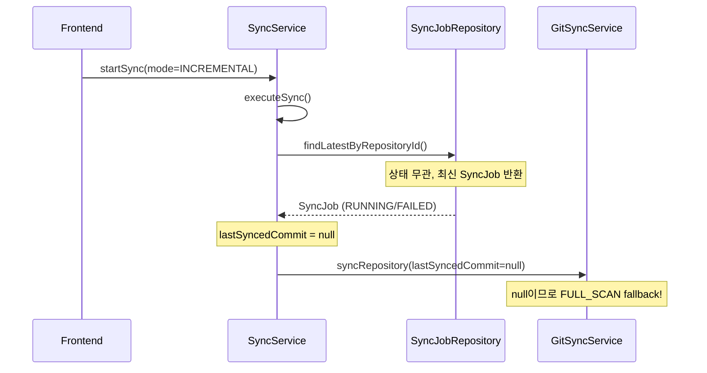
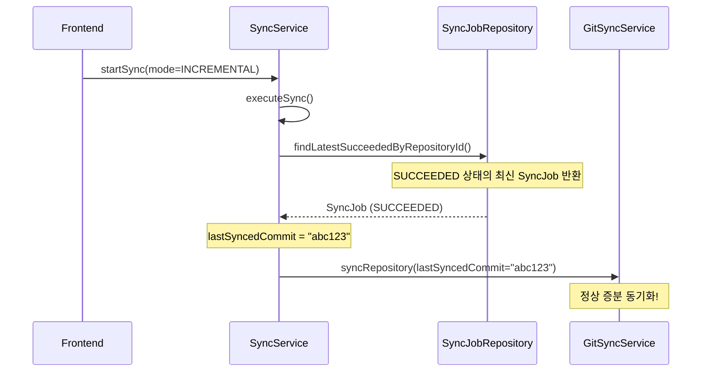

# Phase 11: 증분 Sync(INCREMENTAL) 버그 수정 계획

## 1. 문제 요약

**증상**: INCREMENTAL 모드로 Sync를 요청해도 전체 문서를 다시 동기화함

**근본 원인**: `SyncService.executeSync()`에서 `lastSyncedCommit`을 조회할 때 **상태와 관계없이** 가장 최근 SyncJob을 사용함

---

## 2. 상세 분석

### 2.1 현재 코드 흐름



### 2.2 문제 코드

**SyncService.java:157-160**
```java
// 문제: 상태와 관계없이 최근 작업 조회
String lastSyncedCommit = findLatestByRepositoryId(repo.getId())
        .map(SyncJob::getLastSyncedCommit)
        .orElse(null);
```

### 2.3 SyncJob 상태별 lastSyncedCommit 값

| SyncStatus | lastSyncedCommit | 이유 |
|------------|------------------|------|
| PENDING | null | 아직 시작 안 됨 |
| RUNNING | null | 진행 중 |
| FAILED | null | complete() 호출 안 됨 |
| SUCCEEDED | 커밋 SHA | complete(lastCommit) 호출됨 |

---

## 3. 해결 방안

### 3.1 수정 후 코드 흐름



### 3.2 수정 사항

#### (1) SyncService.java - 새 메서드 추가

```java
/**
 * 레포지토리의 가장 최근 성공한 동기화 작업을 조회한다.
 * INCREMENTAL 모드에서 lastSyncedCommit을 조회할 때 사용한다.
 *
 * @param repositoryId 레포지토리 ID
 * @return 최근 성공한 동기화 작업 (존재하지 않으면 empty)
 */
public Optional<SyncJob> findLatestSucceededByRepositoryId(UUID repositoryId) {
    return syncJobRepository.findFirstByRepositoryIdAndStatusOrderByCreatedAtDesc(
            repositoryId, SyncStatus.SUCCEEDED);
}
```

#### (2) SyncService.java - executeSync() 수정

**Before**:
```java
String lastSyncedCommit = findLatestByRepositoryId(repo.getId())
        .map(SyncJob::getLastSyncedCommit)
        .orElse(null);
```

**After**:
```java
// 마지막 성공한 동기화 작업에서 커밋 조회 (INCREMENTAL 모드에서 사용)
String lastSyncedCommit = findLatestSucceededByRepositoryId(repo.getId())
        .map(SyncJob::getLastSyncedCommit)
        .orElse(null);

if (lastSyncedCommit == null && job.getSyncMode() == SyncMode.INCREMENTAL) {
    log.info("INCREMENTAL requested but no previous successful sync found, will fallback to FULL_SCAN");
}
```

---

## 4. 엣지 케이스 처리

| 시나리오 | 현재 동작 | 수정 후 동작 |
|----------|-----------|--------------|
| 첫 번째 INCREMENTAL 요청 | FULL_SCAN fallback | 동일 (정상) |
| FAILED 후 INCREMENTAL | FULL_SCAN fallback (버그) | 그 전 SUCCEEDED 기준 증분 |
| RUNNING 중 INCREMENTAL | 중복 실행 체크로 거부 | 동일 |
| SUCCEEDED만 있을 때 INCREMENTAL | FULL_SCAN fallback (버그) | 정상 증분 |

---

## 5. 수정 대상 파일

| 파일 | 작업 | 우선순위 |
|------|------|----------|
| `backend/src/main/java/com/docst/service/SyncService.java` | 메서드 추가 + 로직 수정 | 필수 |

### 참조 파일 (수정 불필요)

- `backend/src/main/java/com/docst/repository/SyncJobRepository.java` - 기존 메서드 활용
- `backend/src/main/java/com/docst/domain/SyncJob.java` - SyncStatus enum 참조
- `backend/src/main/java/com/docst/service/GitSyncService.java` - fallback 로직 이해

---

## 6. 검증 방법

### 6.1 수동 테스트

1. **첫 번째 Sync 실행** (FULL_SCAN)
   - 문서들이 정상 동기화되는지 확인
   - SyncJob이 SUCCEEDED 상태인지 확인

2. **원격에서 문서 1개 수정 후 INCREMENTAL Sync**
   - 변경된 문서만 처리되는지 로그 확인
   - `FULL_SCAN: Found N document files` 대신 `INCREMENTAL: Found 1 commits to process` 로그 확인

3. **INCREMENTAL Sync 실패 후 다시 INCREMENTAL**
   - 이전 SUCCEEDED 작업 기준으로 증분 동기화되는지 확인

### 6.2 로그 확인

**정상 INCREMENTAL 동작 시 로그**:
```
INFO  Starting sync for repository: owner/repo branch: main mode: INCREMENTAL embedding: true
INFO  INCREMENTAL: Syncing from abc123 to def456 (embedding: true)
INFO  INCREMENTAL: Found 2 commits to process
```

**FULL_SCAN fallback 시 로그**:
```
INFO  Starting sync for repository: owner/repo branch: main mode: INCREMENTAL embedding: true
INFO  INCREMENTAL requested but no previous successful sync found, will fallback to FULL_SCAN
WARN  INCREMENTAL: No lastSyncedCommit, falling back to FULL_SCAN
INFO  FULL_SCAN: Found 50 document files
```

---

## 7. 구현 순서

1. `SyncService.java`에 `findLatestSucceededByRepositoryId()` 메서드 추가
2. `executeSync()` 메서드의 `lastSyncedCommit` 조회 로직 수정
3. 로그 메시지 추가 (INCREMENTAL fallback 이유 명시)
4. 서버 재시작 후 수동 테스트

---

## 8. 예상 소요

- 코드 수정: 10분
- 테스트: 10분
- 총: 20분

---

## 9. 롤백 계획

문제 발생 시 `findLatestSucceededByRepositoryId()` 호출을 `findLatestByRepositoryId()`로 되돌리면 됨.

---

## 10. 추가 수정: SPECIFIC_COMMIT 초기 커밋 처리

### 문제

`SPECIFIC_COMMIT` 모드로 레포지토리의 **첫 번째 커밋(Initial Commit)**을 동기화하면 아무 파일도 처리되지 않음.

### 원인

**GitCommitWalker.java:157-161 (수정 전)**:
```java
if (parents.length == 0) {
    // 최초 커밋 - 모든 파일이 ADDED
    log.debug("Initial commit, all files are added");
    return changedFiles; // TODO: 초기 커밋 처리  ← 빈 목록 반환!
}
```

초기 커밋은 부모가 없어 diff를 계산할 수 없었고, 빈 목록을 반환하고 있었음.

### 해결

**GitCommitWalker.java** - `getAllFilesInCommit()` 메서드 추가:

```java
/**
 * 초기 커밋의 모든 파일을 ADDED로 반환한다.
 */
private List<ChangedFile> getAllFilesInCommit(Repository repo, RevCommit commit) throws IOException {
    List<ChangedFile> files = new ArrayList<>();

    try (TreeWalk treeWalk = new TreeWalk(repo)) {
        treeWalk.addTree(commit.getTree());
        treeWalk.setRecursive(true);

        while (treeWalk.next()) {
            String path = treeWalk.getPathString();
            files.add(new ChangedFile(path, ChangeType.ADDED, null));
        }
    }

    log.debug("Initial commit contains {} files", files.size());
    return files;
}
```

**getChangedFiles() 수정**:
```java
if (parents.length == 0) {
    log.debug("Initial commit, extracting all files as ADDED");
    changedFiles = getAllFilesInCommit(repo, commit);
    return changedFiles;
}
```

### 수정 파일

| 파일 | 작업 |
|------|------|
| `backend/src/main/java/com/docst/git/GitCommitWalker.java` | `getAllFilesInCommit()` 추가, `getChangedFiles()` 수정 |

### 검증

1. 새 레포지토리 연결
2. `SPECIFIC_COMMIT` 모드로 첫 번째 커밋 동기화
3. 모든 문서가 정상 처리되는지 확인