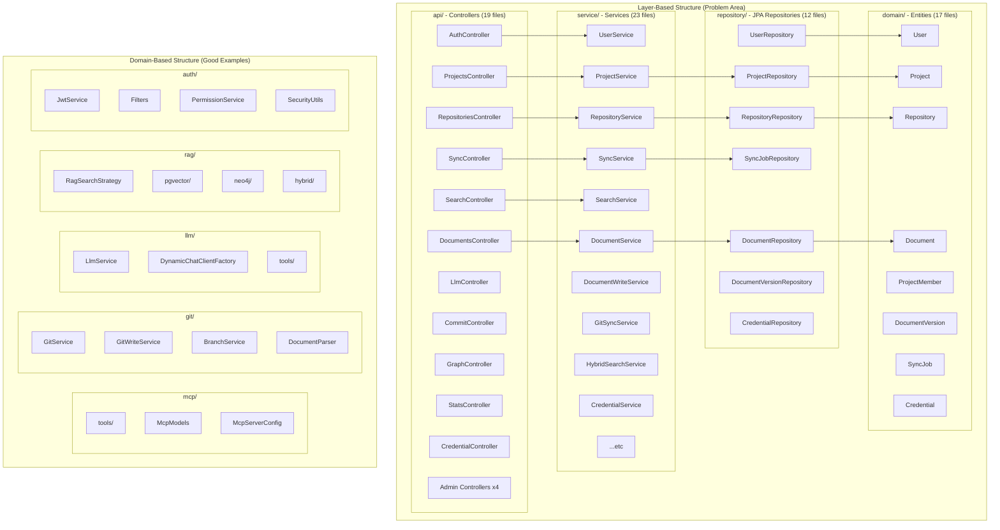
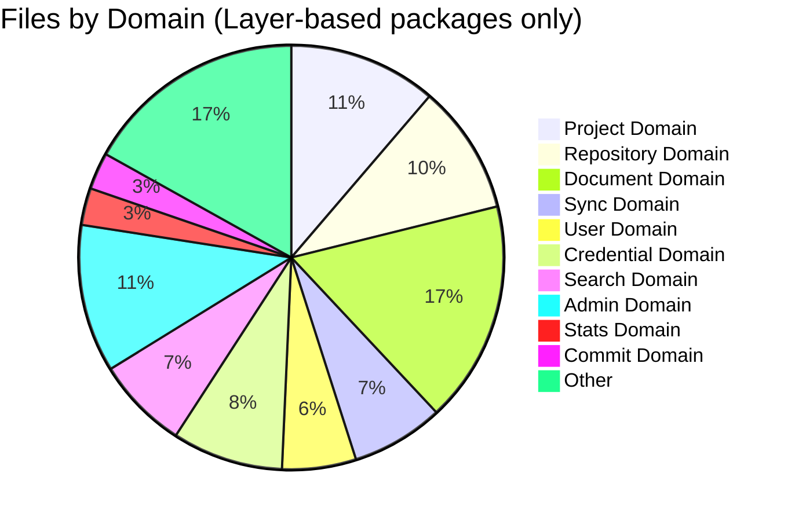
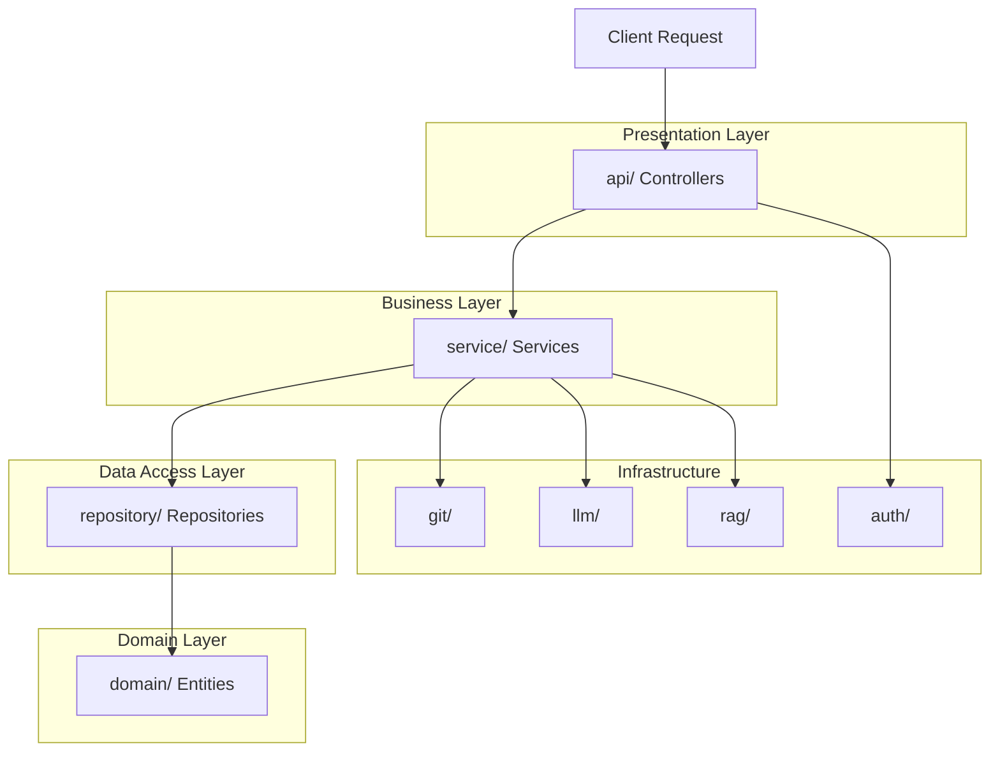

# Current Architecture - Layered Structure

## Overview

현재 백엔드 프로젝트는 **하이브리드 구조**를 가지고 있습니다:
- 일부 패키지는 이미 **도메인 기반**으로 분리되어 있음 (mcp, git, llm, rag 등)
- 나머지는 전통적인 **레이어 기반** 구조로 되어 있음 (api, service, repository, domain)

## Architecture Diagram

## Package Statistics

| Package | Files | Type | Status |
|---------|-------|------|--------|
| `api/` | 19 | Layer-based | Needs refactoring |
| `service/` | 23 | Layer-based | Needs refactoring |
| `repository/` | 12 | Layer-based | Needs refactoring |
| `domain/` | 17 | Layer-based | Needs refactoring |
| `config/` | 9 | Mixed | Needs cleanup |
| `mcp/` | 5 | Domain-based | Good |
| `git/` | 7 | Domain-based | Good |
| `llm/` | 12 | Domain-based | Good |
| `rag/` | 15 | Domain-based | Good |
| `embedding/` | 3 | Domain-based | Good |
| `chunking/` | 5 | Domain-based | Good |
| `auth/` | 15 | Domain-based | Good |
| `webhook/` | 2 | Domain-based | Good |

## Problems with Current Structure

### 1. Low Cohesion
- 관련 코드가 여러 패키지에 분산됨
- 예: Project 관련 코드가 `api/`, `service/`, `repository/`, `domain/` 4곳에 분산

### 2. Unclear Domain Boundaries
- 도메인 간 경계가 코드 구조에서 드러나지 않음
- 새로운 기능 추가 시 여러 패키지를 수정해야 함

### 3. Navigation Difficulty
- 특정 도메인의 전체 코드를 파악하려면 4개 패키지를 확인해야 함
- IDE에서 관련 파일을 찾기 어려움

### 4. DTO Monolith
- `ApiModels.java`에 모든 Request/Response DTO가 통합
- 1000줄 이상의 거대 파일로 관리 어려움

## File Distribution by Domain

## Layer Flow

## Identified Domains

현재 레이어 기반 구조에서 식별된 도메인들:

1. **User Domain**: User 엔티티, 인증, 프로필 관리
2. **Project Domain**: Project, ProjectMember, 권한 관리
3. **Repository Domain**: Git Repository, 브랜치, 커밋
4. **Document Domain**: Document, DocumentVersion, DocChunk, DocumentLink
5. **Sync Domain**: SyncJob, 동기화 실행
6. **Credential Domain**: Credential, 암호화
7. **Search Domain**: 키워드/시맨틱/그래프 검색
8. **Admin Domain**: SystemConfig, 시스템 관리
9. **Stats Domain**: 통계
10. **Commit Domain**: Git 커밋 조회
