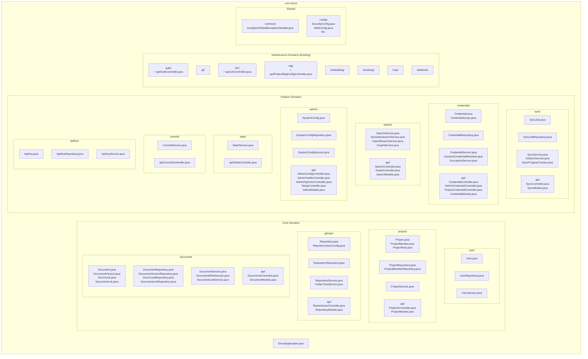
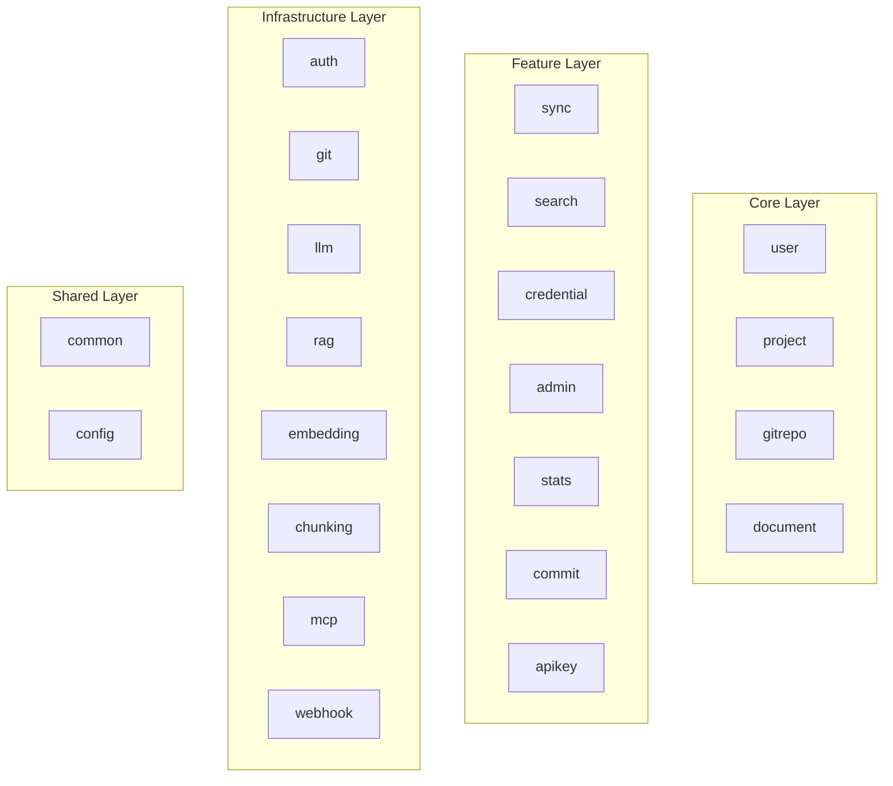

# Target Architecture - Domain-Based Structure

## Overview

목표 아키텍처는 **도메인 기반 패키지 구조**로, 각 도메인이 자체적인 Entity, Repository, Service, Controller, DTO를 포함합니다.

## Architecture Diagram



## Package Structure (Text)

```
com.docst/
├── DocstApplication.java
│
├── user/                              # User Domain
│   ├── User.java                      # Entity
│   ├── UserRepository.java            # Repository
│   └── UserService.java               # Service
│
├── project/                           # Project Domain
│   ├── Project.java                   # Entity
│   ├── ProjectMember.java             # Entity
│   ├── ProjectRole.java               # Enum
│   ├── ProjectRepository.java         # Repository
│   ├── ProjectMemberRepository.java   # Repository
│   ├── ProjectService.java            # Service
│   └── api/
│       ├── ProjectsController.java    # REST Controller
│       └── ProjectModels.java         # Request/Response DTOs
│
├── gitrepo/                           # Git Repository Domain
│   ├── Repository.java                # Entity (Git repo metadata)
│   ├── RepositorySyncConfig.java      # Embedded Value Object
│   ├── RepositoryRepository.java      # JPA Repository
│   ├── RepositoryService.java         # Service
│   ├── FolderTreeService.java         # Service
│   └── api/
│       ├── RepositoriesController.java
│       └── RepositoryModels.java
│
├── document/                          # Document Domain
│   ├── Document.java                  # Entity
│   ├── DocumentVersion.java           # Entity
│   ├── DocChunk.java                  # Entity (for semantic search)
│   ├── DocumentLink.java              # Entity (for graph)
│   ├── DocumentRepository.java        # Repository
│   ├── DocumentVersionRepository.java # Repository
│   ├── DocChunkRepository.java        # Repository
│   ├── DocumentLinkRepository.java    # Repository
│   ├── DocumentService.java           # Read Service
│   ├── DocumentWriteService.java      # Write Service
│   ├── DocumentLinkService.java       # Link Service
│   └── api/
│       ├── DocumentsController.java
│       └── DocumentModels.java
│
├── sync/                              # Sync Domain
│   ├── SyncJob.java                   # Entity
│   ├── SyncJobRepository.java         # Repository
│   ├── SyncService.java               # Orchestration Service
│   ├── GitSyncService.java            # Git sync execution
│   ├── SyncProgressTracker.java       # SSE progress tracking
│   └── api/
│       ├── SyncController.java
│       └── SyncModels.java
│
├── credential/                        # Credential Domain
│   ├── Credential.java                # Entity
│   ├── CredentialScope.java           # Enum
│   ├── CredentialRepository.java      # Repository
│   ├── CredentialService.java         # CRUD Service
│   ├── DynamicCredentialResolver.java # Scope-based resolution
│   ├── EncryptionService.java         # AES-256 encryption
│   └── api/
│       ├── CredentialController.java  # User credentials
│       ├── AdminCredentialController.java  # System credentials
│       ├── ProjectCredentialController.java # Project credentials
│       └── CredentialModels.java
│
├── search/                            # Search Domain
│   ├── SearchService.java             # Keyword search
│   ├── SemanticSearchService.java     # Vector search
│   ├── HybridSearchService.java       # Combined search
│   ├── GraphService.java              # Graph traversal
│   └── api/
│       ├── SearchController.java
│       ├── GraphController.java
│       └── SearchModels.java
│
├── admin/                             # Admin Domain
│   ├── SystemConfig.java              # Entity
│   ├── SystemConfigRepository.java    # Repository
│   ├── SystemConfigService.java       # Service
│   └── api/
│       ├── AdminConfigController.java
│       ├── AdminHealthController.java
│       ├── AdminPgVectorController.java
│       ├── SetupController.java
│       └── AdminModels.java
│
├── stats/                             # Stats Domain
│   ├── StatsService.java
│   └── api/
│       ├── StatsController.java
│       └── StatsModels.java
│
├── commit/                            # Commit Domain
│   ├── CommitService.java
│   └── api/
│       ├── CommitController.java
│       └── CommitModels.java
│
├── apikey/                            # API Key Domain
│   ├── ApiKey.java                    # Entity
│   ├── ApiKeyRepository.java          # Repository
│   └── ApiKeyService.java             # Service
│
├── auth/                              # Auth Domain (existing + api/)
│   ├── JwtService.java
│   ├── JwtConfig.java
│   ├── JwtAuthenticationFilter.java
│   ├── ApiKeyAuthenticationFilter.java
│   ├── SecurityUtils.java
│   ├── UserPrincipal.java
│   ├── PermissionService.java
│   ├── ProjectPermissionAspect.java
│   ├── RequireProjectRole.java
│   ├── RequireRepositoryAccess.java
│   ├── PasswordValidator.java
│   ├── AdminInitializer.java
│   ├── GitHubOAuthService.java
│   ├── GitHubOAuthController.java
│   └── api/
│       └── AuthController.java        # Moved from api/
│
├── git/                               # Git Domain (existing)
│   ├── GitService.java
│   ├── GitWriteService.java
│   ├── BranchService.java
│   ├── GitFileScanner.java
│   ├── GitCommitWalker.java
│   ├── DocumentParser.java
│   └── LinkParser.java
│
├── llm/                               # LLM Domain (existing + api/)
│   ├── LlmService.java
│   ├── DynamicChatClientFactory.java
│   ├── LlmConfig.java
│   ├── LlmProvider.java
│   ├── PromptTemplate.java
│   ├── RateLimitService.java
│   ├── CitationCollector.java
│   ├── tools/
│   ├── model/
│   └── api/
│       └── LlmController.java         # Moved from api/
│
├── rag/                               # RAG Domain (existing + api/)
│   ├── RagMode.java
│   ├── RagSearchStrategy.java
│   ├── config/
│   ├── pgvector/
│   ├── neo4j/
│   ├── hybrid/
│   └── api/
│       └── ProjectRagConfigController.java  # Moved from api/
│
├── embedding/                         # Embedding Domain (existing)
│   ├── DynamicEmbeddingClientFactory.java
│   ├── DocstEmbeddingService.java
│   └── ReEmbeddingService.java
│
├── chunking/                          # Chunking Domain (existing)
│   ├── ChunkingService.java
│   ├── MarkdownChunker.java
│   ├── ChunkResult.java
│   ├── ChunkingConfig.java
│   └── TokenCounter.java
│
├── mcp/                               # MCP Domain (existing)
│   ├── McpModels.java
│   └── tools/
│
├── webhook/                           # Webhook Domain (existing)
│   ├── GitHubWebhookController.java
│   └── WebhookService.java
│
├── common/                            # Shared Components
│   └── exception/
│       └── GlobalExceptionHandler.java
│
└── config/                            # Global Configuration
    ├── SecurityConfig.java
    ├── WebConfig.java
    ├── CorsConfig.java
    ├── CorsProperties.java
    ├── OpenApiConfig.java
    ├── AdminProperties.java
    ├── VectorStoreConfig.java
    └── DynamicNeo4jConfig.java
```

## Benefits of Target Architecture

### 1. High Cohesion
- 도메인 관련 모든 코드가 한 패키지에 위치
- 변경 범위가 도메인 내로 제한됨

### 2. Clear Domain Boundaries
- 패키지 구조가 곧 도메인 경계
- 새 개발자도 구조 파악이 쉬움

### 3. Easy Navigation
- 특정 도메인 작업 시 해당 패키지만 확인
- IDE 탐색이 직관적

### 4. Distributed DTOs
- 각 도메인에 `api/XxxModels.java`로 DTO 분리
- 관리 용이성 향상

### 5. Future-Ready
- 마이크로서비스 분리 시 도메인 단위로 가능
- 도메인 간 의존성이 명확

## Domain Layer Classification



## Comparison

| Aspect | Before (Layer) | After (Domain) |
|--------|----------------|----------------|
| File location | 4 directories | 1 directory |
| Related code | Scattered | Grouped |
| New feature | Touch 4 packages | Touch 1 package |
| Domain boundary | Implicit | Explicit |
| DTO management | 1 huge file | Per-domain files |
| Navigation | Hard | Easy |
| Microservice-ready | No | Yes |
