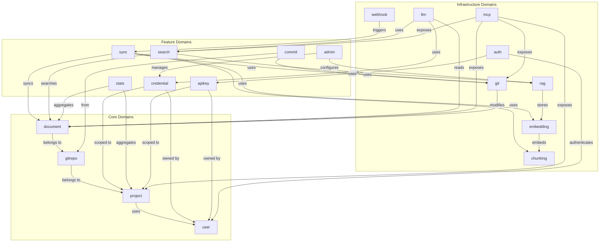
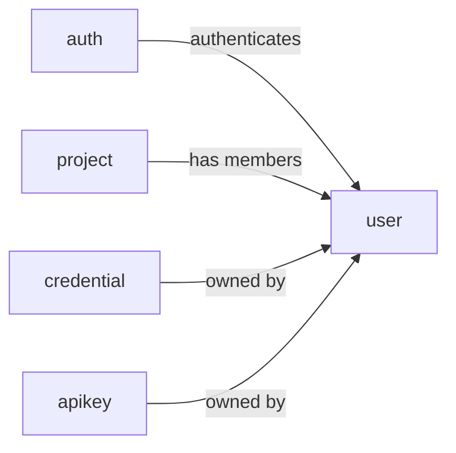
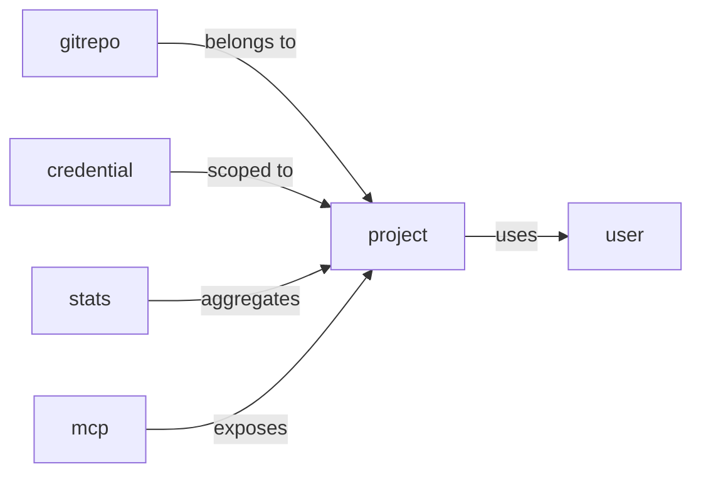
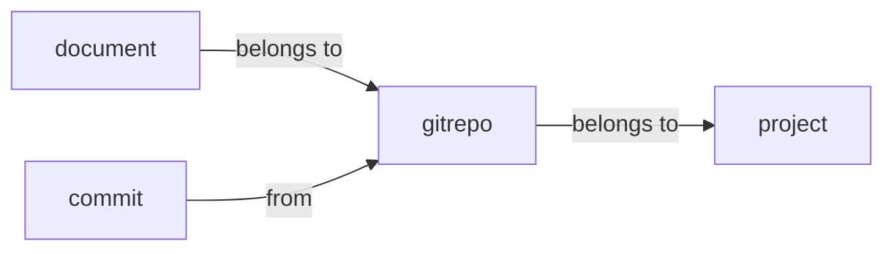
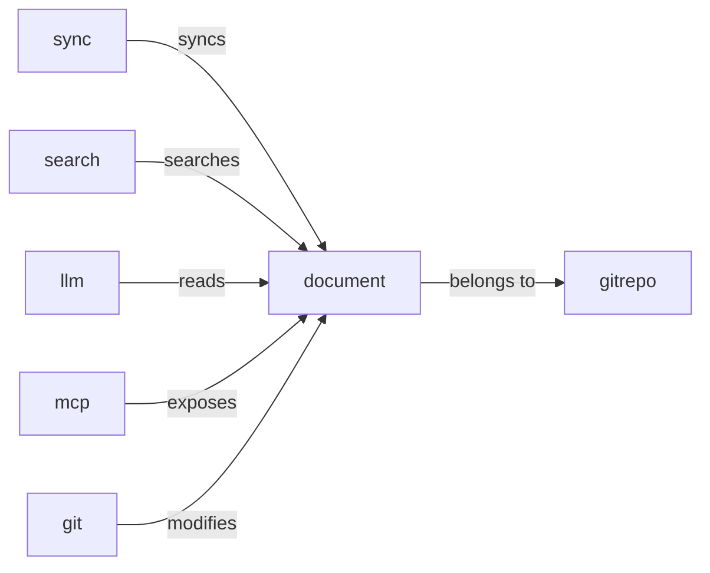
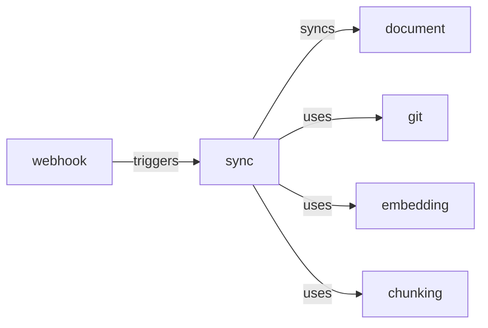
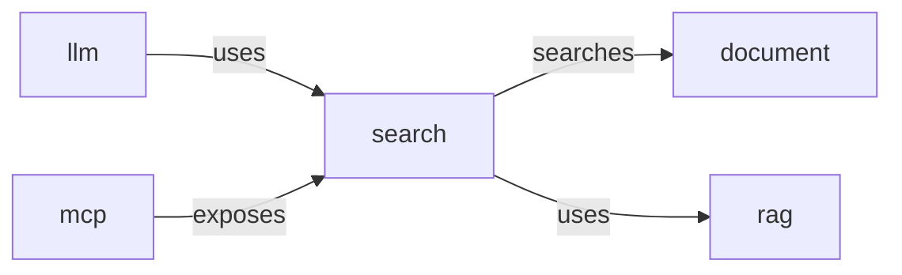
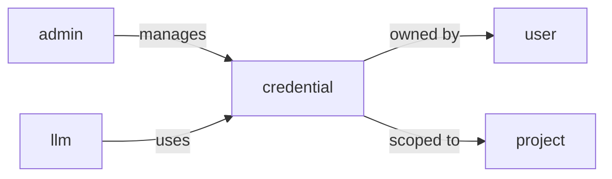
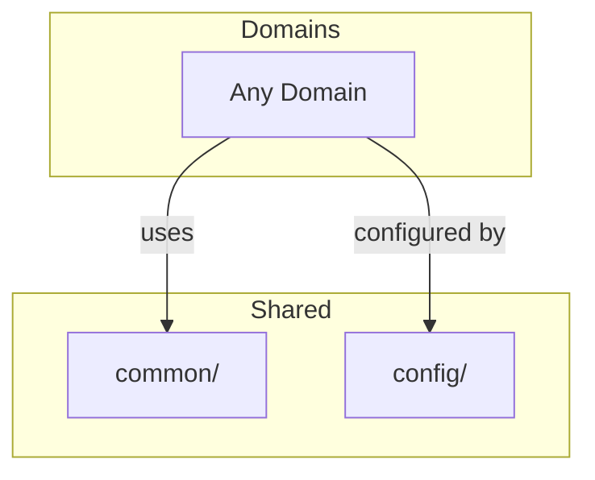

# Domain Dependencies

## Overview

도메인 간 의존성을 명확히 정의하여 순환 의존성을 방지하고 단방향 의존성을 유지합니다.

## Dependency Diagram



## Dependency Matrix

| From \ To | user | project | gitrepo | document | sync | search | credential | admin | git | llm | rag | embedding | chunking |
|-----------|------|---------|---------|----------|------|--------|------------|-------|-----|-----|-----|-----------|----------|
| **user** | - | | | | | | | | | | | | |
| **project** | O | - | | | | | | | | | | | |
| **gitrepo** | | O | - | | | | | | | | | | |
| **document** | | | O | - | | | | | | | | | |
| **sync** | | | | O | - | | | | O | | | O | O |
| **search** | | | | O | | - | | | | | O | | |
| **credential** | O | O | | | | | - | | | | | | |
| **admin** | | | | | | | O | - | | | O | | |
| **stats** | | O | | O | | | | | - | | | | |
| **commit** | | | O | | | | | | O | - | | | |
| **apikey** | O | O | | | | | | | | | - | | |
| **auth** | O | | | | | | | | | | | | - |
| **git** | | | | O | | | | | - | | | | |
| **llm** | | | | O | | O | O | | | - | | | |
| **rag** | | | | | | | | | | | - | O | |
| **embedding** | | | | | | | | | | | | - | O |
| **mcp** | | O | | O | | O | | | O | | | | - |
| **webhook** | | | | | O | | | | | | | | |

## Dependency Rules

### Rule 1: Unidirectional Core Dependencies
```
user <- project <- gitrepo <- document
```
- Core 도메인은 단방향 의존성 유지
- 상위 도메인이 하위 도메인에 의존하지 않음

### Rule 2: Feature to Core Only
```
Feature Domains -> Core Domains (O)
Core Domains -> Feature Domains (X)
```
- Feature 도메인은 Core 도메인에 의존 가능
- Core 도메인은 Feature 도메인에 의존 불가

### Rule 3: Infrastructure is Utility
```
Any Domain -> Infrastructure Domains (O)
Infrastructure Domains -> Any Domain (X, except core)
```
- Infrastructure는 유틸리티 역할
- Infrastructure 간 제한적 의존성 허용

### Rule 4: No Circular Dependencies
```
A -> B -> C -> A (X)
```
- 순환 의존성 절대 금지
- 순환 발생 시 interface 추출로 해결

## Detailed Dependencies by Domain

### user (User Domain)


**Depends on**: (none - root domain)
**Depended by**: auth, project, credential, apikey

---

### project (Project Domain)


**Depends on**: user
**Depended by**: gitrepo, credential, stats, mcp

---

### gitrepo (Git Repository Domain)


**Depends on**: project
**Depended by**: document, commit

---

### document (Document Domain)


**Depends on**: gitrepo
**Depended by**: sync, search, llm, mcp, git, stats

---

### sync (Sync Domain)


**Depends on**: document, git, embedding, chunking
**Depended by**: webhook

---

### search (Search Domain)


**Depends on**: document, rag
**Depended by**: llm, mcp

---

### credential (Credential Domain)


**Depends on**: user, project
**Depended by**: admin, llm

## Cross-Cutting Concerns

### Common Dependencies (All Domains)
- `common/exception/GlobalExceptionHandler` - 예외 처리
- `config/SecurityConfig` - 보안 설정
- `auth/SecurityUtils` - 현재 사용자 조회

### Shared Utilities


## Refactoring Considerations

### Breaking Circular Dependencies

**Before** (Potential circular):
```
DocumentService -> GitSyncService -> DocumentService
```

**After** (Interface extraction):
```
DocumentService -> GitSyncService -> DocumentWriter (interface)
                                            ^
                                            |
                                    DocumentService (implements)
```

### Interface Boundaries

도메인 간 통신이 필요한 경우 interface를 사용:

```java
// document 도메인에 정의
public interface DocumentWriter {
    void upsert(Document doc);
}

// sync 도메인에서 사용
@Service
public class GitSyncService {
    private final DocumentWriter documentWriter;  // interface 사용
}
```

## Dependency Validation

빌드 시 ArchUnit으로 의존성 규칙 검증:

```java
@ArchTest
static final ArchRule core_domain_dependencies =
    classes().that().resideInAPackage("..user..")
        .should().onlyHaveDependentClassesThat()
        .resideInAnyPackage("..project..", "..auth..", "..credential..", "..apikey..");

@ArchTest
static final ArchRule no_circular_dependencies =
    slices().matching("com.docst.(*)..")
        .should().beFreeOfCycles();
```
