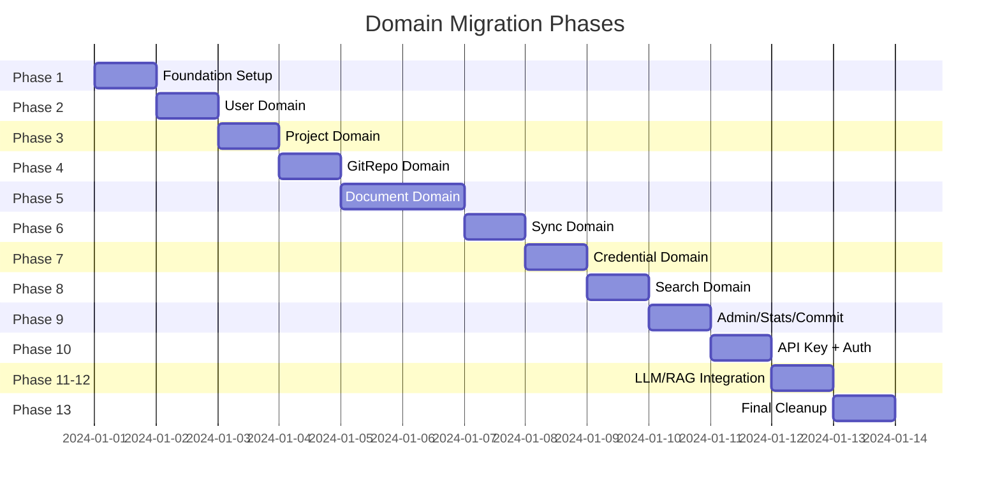

# Migration Plan - Domain-Based Structure Refactoring

## Overview

레이어 기반 구조에서 도메인 기반 구조로의 점진적 마이그레이션 계획입니다.

## Migration Timeline



## Phase 1: Foundation Setup

### 목표
- `common/` 패키지 생성
- `GlobalExceptionHandler` 이동
- `ApiModels.java` 분석

### 작업 상세

#### 1.1 common 패키지 생성
```bash
mkdir -p backend/src/main/java/com/docst/common/exception
```

#### 1.2 GlobalExceptionHandler 이동
```
FROM: config/GlobalExceptionHandler.java
TO:   common/exception/GlobalExceptionHandler.java
```

**변경 내용:**
```java
// Before
package com.docst.config;

// After
package com.docst.common.exception;
```

#### 1.3 ApiModels.java 분석

현재 `api/ApiModels.java`에 포함된 Record들을 도메인별로 분류:

| Domain | Records |
|--------|---------|
| Project | `ProjectResponse`, `CreateProjectRequest`, `UpdateProjectRequest`, `ProjectMemberResponse` |
| Repository | `RepositoryResponse`, `CreateRepositoryRequest`, `UpdateRepositoryRequest`, `MoveRepositoryRequest`, `FolderTreeResponse`, `FolderTreeItem` |
| Document | `DocumentResponse`, `DocumentDetailResponse`, `DocumentVersionResponse`, `UpdateDocumentRequest`, `UpdateDocumentResponse` |
| Sync | `SyncJobResponse`, `SyncRequest`, `SyncMode` |
| Search | `SearchResultResponse`, `SearchRequest` |
| Credential | `CredentialResponse`, `CreateCredentialRequest`, `SystemCredentialResponse`, `ProjectCredentialResponse` |
| Admin | `SystemConfigResponse`, `HealthCheckResponse`, `ServiceHealth` |
| Stats | `StatsResponse` |
| Commit | `CommitResponse`, `CommitDetailResponse`, `ChangedFileResponse` |
| Auth | `LoginRequest`, `LoginResponse`, `SignupRequest`, `ChangePasswordRequest`, `ApiKeyResponse` |
| LLM | `ChatRequest`, `ChatMessage`, `PromptTemplateResponse` |
| RAG | `ProjectRagConfigResponse`, `EmbeddingConfigRequest`, `PgVectorConfigRequest`, `Neo4jConfigRequest` |

### 검증
```bash
./gradlew compileJava
```

---

## Phase 2: User Domain

### 목표
- `user/` 패키지 생성
- User 관련 파일 이동

### 작업 상세

#### 2.1 패키지 생성
```bash
mkdir -p backend/src/main/java/com/docst/user
```

#### 2.2 파일 이동

| From | To |
|------|-----|
| `domain/User.java` | `user/User.java` |
| `repository/UserRepository.java` | `user/UserRepository.java` |
| `service/UserService.java` | `user/UserService.java` |

#### 2.3 Import 업데이트

영향받는 파일들:
```
api/AuthController.java
auth/AdminInitializer.java
auth/JwtAuthenticationFilter.java
auth/ApiKeyAuthenticationFilter.java
auth/GitHubOAuthService.java
service/ProjectService.java
service/CredentialService.java
service/ApiKeyService.java
mcp/tools/McpProjectTools.java
```

#### 2.4 User.java 변경
```java
// Before
package com.docst.domain;

// After
package com.docst.user;
```

### 검증
```bash
./gradlew compileJava
./gradlew test
```

---

## Phase 3: Project Domain

### 목표
- `project/` 패키지 생성
- Project 관련 파일 이동
- `ProjectModels.java` 생성

### 작업 상세

#### 3.1 패키지 생성
```bash
mkdir -p backend/src/main/java/com/docst/project/api
```

#### 3.2 파일 이동

| From | To |
|------|-----|
| `domain/Project.java` | `project/Project.java` |
| `domain/ProjectMember.java` | `project/ProjectMember.java` |
| `domain/ProjectRole.java` | `project/ProjectRole.java` |
| `repository/ProjectRepository.java` | `project/ProjectRepository.java` |
| `repository/ProjectMemberRepository.java` | `project/ProjectMemberRepository.java` |
| `service/ProjectService.java` | `project/ProjectService.java` |
| `api/ProjectsController.java` | `project/api/ProjectsController.java` |

#### 3.3 ProjectModels.java 생성

```java
// project/api/ProjectModels.java
package com.docst.project.api;

import java.time.LocalDateTime;
import java.util.List;
import java.util.UUID;

public class ProjectModels {

    public record ProjectResponse(
        UUID id,
        String name,
        String description,
        boolean active,
        LocalDateTime createdAt
    ) {}

    public record CreateProjectRequest(
        String name,
        String description
    ) {}

    public record UpdateProjectRequest(
        String name,
        String description,
        Boolean active
    ) {}

    public record ProjectMemberResponse(
        UUID userId,
        String email,
        String displayName,
        String role,
        LocalDateTime joinedAt
    ) {}
}
```

### 검증
```bash
./gradlew compileJava
```

---

## Phase 4: GitRepo Domain

### 목표
- `gitrepo/` 패키지 생성 (JPA Repository와 이름 충돌 방지)
- Repository 관련 파일 이동

### 작업 상세

#### 4.1 패키지 생성
```bash
mkdir -p backend/src/main/java/com/docst/gitrepo/api
```

#### 4.2 파일 이동

| From | To |
|------|-----|
| `domain/Repository.java` | `gitrepo/Repository.java` |
| `domain/RepositorySyncConfig.java` | `gitrepo/RepositorySyncConfig.java` |
| `repository/RepositoryRepository.java` | `gitrepo/RepositoryRepository.java` |
| `service/RepositoryService.java` | `gitrepo/RepositoryService.java` |
| `service/FolderTreeService.java` | `gitrepo/FolderTreeService.java` |
| `api/RepositoriesController.java` | `gitrepo/api/RepositoriesController.java` |

#### 4.3 RepositoryModels.java 생성

```java
// gitrepo/api/RepositoryModels.java
package com.docst.gitrepo.api;

public class RepositoryModels {

    public record RepositoryResponse(
        UUID id,
        UUID projectId,
        String provider,
        String owner,
        String name,
        String cloneUrl,
        String defaultBranch,
        boolean active,
        LocalDateTime createdAt
    ) {}

    public record CreateRepositoryRequest(
        String provider,
        String owner,
        String name,
        String cloneUrl,
        String defaultBranch,
        UUID credentialId
    ) {}

    // ... etc
}
```

### 검증
```bash
./gradlew compileJava
```

---

## Phase 5: Document Domain

### 목표
- `document/` 패키지 생성
- Document 관련 파일 이동 (4 entities, 4 repositories, 3 services)

### 작업 상세

#### 5.1 패키지 생성
```bash
mkdir -p backend/src/main/java/com/docst/document/api
```

#### 5.2 파일 이동

**Entities:**
| From | To |
|------|-----|
| `domain/Document.java` | `document/Document.java` |
| `domain/DocumentVersion.java` | `document/DocumentVersion.java` |
| `domain/DocChunk.java` | `document/DocChunk.java` |
| `domain/DocumentLink.java` | `document/DocumentLink.java` |

**Repositories:**
| From | To |
|------|-----|
| `repository/DocumentRepository.java` | `document/DocumentRepository.java` |
| `repository/DocumentVersionRepository.java` | `document/DocumentVersionRepository.java` |
| `repository/DocChunkRepository.java` | `document/DocChunkRepository.java` |
| `repository/DocumentLinkRepository.java` | `document/DocumentLinkRepository.java` |

**Services:**
| From | To |
|------|-----|
| `service/DocumentService.java` | `document/DocumentService.java` |
| `service/DocumentWriteService.java` | `document/DocumentWriteService.java` |
| `service/DocumentLinkService.java` | `document/DocumentLinkService.java` |

**Controller:**
| From | To |
|------|-----|
| `api/DocumentsController.java` | `document/api/DocumentsController.java` |

#### 5.3 DocumentModels.java 생성

```java
// document/api/DocumentModels.java
package com.docst.document.api;

public class DocumentModels {

    public record DocumentResponse(
        UUID id,
        UUID repositoryId,
        String path,
        String title,
        String docType,
        String latestCommitSha,
        boolean deleted,
        LocalDateTime createdAt
    ) {}

    public record DocumentDetailResponse(
        UUID id,
        String path,
        String title,
        String docType,
        String content,
        String latestCommitSha,
        LocalDateTime createdAt
    ) {}

    // ... etc
}
```

### 검증
```bash
./gradlew compileJava
./gradlew test
```

---

## Phase 6: Sync Domain

### 목표
- `sync/` 패키지 생성
- Sync 관련 파일 이동

### 작업 상세

#### 6.1 파일 이동

| From | To |
|------|-----|
| `domain/SyncJob.java` | `sync/SyncJob.java` |
| `repository/SyncJobRepository.java` | `sync/SyncJobRepository.java` |
| `service/SyncService.java` | `sync/SyncService.java` |
| `service/GitSyncService.java` | `sync/GitSyncService.java` |
| `service/SyncProgressTracker.java` | `sync/SyncProgressTracker.java` |
| `api/SyncController.java` | `sync/api/SyncController.java` |

### 검증
```bash
./gradlew compileJava
```

---

## Phase 7: Credential Domain

### 목표
- `credential/` 패키지 생성
- Credential 관련 파일 이동

### 작업 상세

#### 7.1 파일 이동

| From | To |
|------|-----|
| `domain/Credential.java` | `credential/Credential.java` |
| `domain/CredentialScope.java` | `credential/CredentialScope.java` |
| `repository/CredentialRepository.java` | `credential/CredentialRepository.java` |
| `service/CredentialService.java` | `credential/CredentialService.java` |
| `service/DynamicCredentialResolver.java` | `credential/DynamicCredentialResolver.java` |
| `service/EncryptionService.java` | `credential/EncryptionService.java` |
| `api/CredentialController.java` | `credential/api/CredentialController.java` |
| `api/AdminCredentialController.java` | `credential/api/AdminCredentialController.java` |
| `api/ProjectCredentialController.java` | `credential/api/ProjectCredentialController.java` |

### 검증
```bash
./gradlew compileJava
./gradlew test
```

---

## Phase 8: Search Domain

### 목표
- `search/` 패키지 생성
- Search 관련 파일 이동

### 작업 상세

#### 8.1 파일 이동

| From | To |
|------|-----|
| `service/SearchService.java` | `search/SearchService.java` |
| `service/SemanticSearchService.java` | `search/SemanticSearchService.java` |
| `service/HybridSearchService.java` | `search/HybridSearchService.java` |
| `service/GraphService.java` | `search/GraphService.java` |
| `api/SearchController.java` | `search/api/SearchController.java` |
| `api/GraphController.java` | `search/api/GraphController.java` |

### 검증
```bash
./gradlew compileJava
```

---

## Phase 9: Admin/Stats/Commit Domains

### 목표
- `admin/`, `stats/`, `commit/` 패키지 생성
- 관련 파일 이동

### 작업 상세

#### 9.1 Admin Domain

| From | To |
|------|-----|
| `domain/SystemConfig.java` | `admin/SystemConfig.java` |
| `repository/SystemConfigRepository.java` | `admin/SystemConfigRepository.java` |
| `service/SystemConfigService.java` | `admin/SystemConfigService.java` |
| `api/AdminConfigController.java` | `admin/api/AdminConfigController.java` |
| `api/AdminHealthController.java` | `admin/api/AdminHealthController.java` |
| `api/AdminPgVectorController.java` | `admin/api/AdminPgVectorController.java` |
| `api/SetupController.java` | `admin/api/SetupController.java` |

#### 9.2 Stats Domain

| From | To |
|------|-----|
| `service/StatsService.java` | `stats/StatsService.java` |
| `api/StatsController.java` | `stats/api/StatsController.java` |

#### 9.3 Commit Domain

| From | To |
|------|-----|
| `service/CommitService.java` | `commit/CommitService.java` |
| `api/CommitController.java` | `commit/api/CommitController.java` |

### 검증
```bash
./gradlew compileJava
```

---

## Phase 10: API Key + Auth Cleanup

### 목표
- `apikey/` 패키지 생성
- AuthController를 `auth/api/`로 이동

### 작업 상세

#### 10.1 API Key Domain

| From | To |
|------|-----|
| `domain/ApiKey.java` | `apikey/ApiKey.java` |
| `repository/ApiKeyRepository.java` | `apikey/ApiKeyRepository.java` |
| `service/ApiKeyService.java` | `apikey/ApiKeyService.java` |

#### 10.2 Auth Controller 이동

| From | To |
|------|-----|
| `api/AuthController.java` | `auth/api/AuthController.java` |

### 검증
```bash
./gradlew compileJava
```

---

## Phase 11-12: LLM/RAG Controller Integration

### 목표
- LlmController를 `llm/api/`로 이동
- ProjectRagConfigController를 `rag/api/`로 이동

### 작업 상세

#### 11.1 LLM Controller

| From | To |
|------|-----|
| `api/LlmController.java` | `llm/api/LlmController.java` |

#### 12.1 RAG Controller

| From | To |
|------|-----|
| `api/ProjectRagConfigController.java` | `rag/api/ProjectRagConfigController.java` |

### 검증
```bash
./gradlew compileJava
```

---

## Phase 13: Final Cleanup

### 목표
- 빈 패키지 삭제
- ApiModels.java 삭제
- 문서 업데이트

### 작업 상세

#### 13.1 빈 패키지 삭제
```bash
rm -rf backend/src/main/java/com/docst/api
rm -rf backend/src/main/java/com/docst/service
rm -rf backend/src/main/java/com/docst/repository
rm -rf backend/src/main/java/com/docst/domain
```

#### 13.2 ApiModels.java 삭제
- 모든 DTO가 각 도메인으로 이동 완료 확인 후 삭제

#### 13.3 문서 업데이트
- `CLAUDE.md` 업데이트
- `README.md` 업데이트 (있는 경우)

### 최종 검증
```bash
./gradlew clean build
./gradlew test
```

---

## Rollback Strategy

각 Phase 완료 후 문제 발생 시:

```bash
# Git을 사용한 롤백
git stash  # 현재 변경사항 임시 저장
git checkout <previous-commit>  # 이전 커밋으로 복원

# 또는 Phase별 커밋으로 관리
git commit -m "Phase N: [description]"
git revert HEAD  # 마지막 Phase 롤백
```

## Post-Migration Checklist

- [ ] 모든 테스트 통과
- [ ] API 엔드포인트 동작 확인
- [ ] Swagger/OpenAPI 문서 정상 생성
- [ ] MCP Tools 정상 동작
- [ ] 프론트엔드 연동 확인
- [ ] CLAUDE.md 업데이트 완료
- [ ] ArchUnit 의존성 규칙 추가
