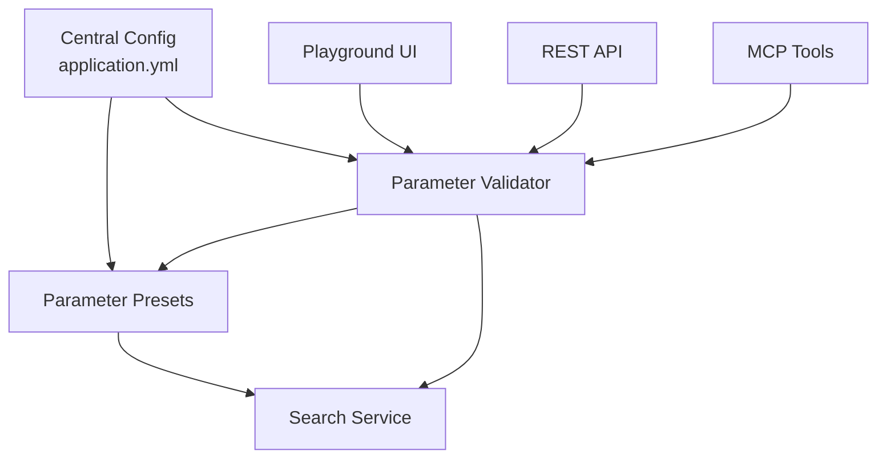

# Phase 14: RAG 시스템 파라미터 고도화 계획

> **목표**: RAG 검색 파라미터의 중앙 관리 및 인터페이스별 유연한 조정 기능 구현

---

## 1. 현황 분석

### 1.1 현재 구현 상태

#### API 인터페이스 (SearchController.java:27-53)
```java
@GetMapping
public ResponseEntity<List<SearchResultResponse>> search(
    @PathVariable UUID projectId,
    @RequestParam(name = "q") String query,
    @RequestParam String mode,              // ⚠️ 받기만 하고 미사용
    @RequestParam(required = false) Integer topK  // ⚠️ 기본값 10만 적용
)
```

**문제점**:
- `mode` 파라미터를 받지만 실제 검색 로직에서 사용하지 않음
- `topK` 외 다른 파라미터 없음 (similarity_threshold, rerank, filters 등)
- 파라미터 검증 로직 부재
- score가 하드코딩됨 (0.9 고정)

#### MCP 인터페이스
- **구현 상태**: ❌ 미구현 (문서만 존재)
- **계획된 파라미터**: projectId, query, mode, topK, includeContent
- **문제점**: 실제 구현이 없어 파라미터 전달 불가

#### 플레이그라운드 UI
- **구현 상태**: ❌ 미구현 (기본 랜딩 페이지만)
- **계획된 기능**: 검색 모드 선택, 결과 표시
- **문제점**: 파라미터를 조정할 UI가 없음

#### 설정 관리 (application.yml)
```yaml
server:
  port: 8080
spring:
  application:
    name: docst
```

**문제점**:
- RAG 관련 설정이 전혀 없음
- 임베딩 프로바이더 설정 없음
- 검색 파라미터 기본값 없음

### 1.2 Phase 2 계획과의 Gap

Phase 2에서는 다음을 계획했으나 아직 미구현:
- ✅ DocChunk, DocEmbedding 엔티티 (계획만)
- ✅ 청킹 서비스 (계획만)
- ✅ 임베딩 서비스 추상화 (계획만)
- ✅ 하이브리드 검색 (계획만)
- ✅ MCP semantic search (계획만)

---

## 2. 핵심 문제점

### 2.1 파라미터 관리의 문제

| 문제 영역 | 상세 |
|---------|------|
| **하드코딩** | score 0.9 고정, mode 미사용 |
| **제한적 파라미터** | topK만 지원, 다른 고급 옵션 없음 |
| **중앙 관리 부재** | application.yml에 기본값 없음 |
| **검증 로직 부재** | 잘못된 값 입력 시 오류 처리 없음 |
| **인터페이스 불일치** | API/MCP/UI 간 파라미터 명세 불일치 |
| **프리셋 부재** | 사용 사례별 파라미터 조합 없음 |

### 2.2 사용자 경험 문제

1. **개발자 (API 사용)**
   - 어떤 파라미터가 있는지 알기 어려움
   - 파라미터 효과를 테스트하기 어려움
   - 최적값을 찾기 어려움

2. **AI 에이전트 (MCP 사용)**
   - MCP 구현이 없어 사용 불가
   - 파라미터를 동적으로 조정할 방법 없음

3. **일반 사용자 (UI 사용)**
   - 검색 UI가 없어 테스트 불가
   - 파라미터를 이해하고 조정할 방법 없음

### 2.3 확장성 문제

- 새로운 파라미터 추가 시 여러 곳 수정 필요
- 파라미터별 최적화 가이드라인 부재
- A/B 테스트 또는 실험 기능 없음

---

## 3. 고도화 전략

### 3.1 아키텍처 원칙



**핵심 원칙**:
1. **Single Source of Truth**: application.yml에서 기본값 관리
2. **Validation Layer**: 모든 인터페이스에서 공통 검증
3. **Preset System**: 사용 사례별 파라미터 조합 제공
4. **Progressive Disclosure**: 기본→고급 파라미터 단계적 노출

---

## 4. 구현 계획

### Sprint 14-1: 중앙 설정 관리

#### 4.1.1 application.yml 확장
**파일**: `backend/src/main/resources/application.yml`

```yaml
docst:
  # 임베딩 설정
  embedding:
    provider: ollama              # openai, ollama, local
    model: nomic-embed-text
    dimension: 768
    batch-size: 32

  # 청킹 설정
  chunking:
    max-tokens: 512
    overlap-tokens: 50
    min-tokens: 100

  # 검색 파라미터 기본값
  search:
    # 기본 파라미터
    default-mode: hybrid          # keyword, semantic, hybrid
    default-top-k: 10
    max-top-k: 100

    # 고급 파라미터
    similarity-threshold: 0.7     # 의미 검색 최소 유사도
    rerank-enabled: false         # 재순위화 활성화
    rerank-top-k: 5              # 재순위화 대상 개수

    # 하이브리드 검색 파라미터
    hybrid:
      rrf-k: 60                  # RRF 상수
      keyword-weight: 0.5        # 키워드 검색 가중치
      semantic-weight: 0.5       # 의미 검색 가중치

    # 필터링 옵션
    filters:
      enabled: true
      max-doc-types: 10
      max-repositories: 50

  # 올라마 설정
  ollama:
    base-url: http://localhost:11434
    timeout: 30s

  # OpenAI 설정
  openai:
    api-key: ${OPENAI_API_KEY:}
    model: text-embedding-3-small
    timeout: 30s
```

#### 4.1.2 Configuration Properties 클래스
**파일**: `backend/src/main/java/com/docst/config/DocstProperties.java`

```java
package com.docst.config;

import java.time.Duration;
import org.springframework.boot.context.properties.ConfigurationProperties;
import org.springframework.boot.context.properties.bind.DefaultValue;

@ConfigurationProperties(prefix = "docst")
public record DocstProperties(
    EmbeddingProperties embedding,
    ChunkingProperties chunking,
    SearchProperties search,
    OllamaProperties ollama,
    OpenAiProperties openai
) {

    public record EmbeddingProperties(
        @DefaultValue("ollama") String provider,
        @DefaultValue("nomic-embed-text") String model,
        @DefaultValue("768") int dimension,
        @DefaultValue("32") int batchSize
    ) {}

    public record ChunkingProperties(
        @DefaultValue("512") int maxTokens,
        @DefaultValue("50") int overlapTokens,
        @DefaultValue("100") int minTokens
    ) {}

    public record SearchProperties(
        @DefaultValue("hybrid") String defaultMode,
        @DefaultValue("10") int defaultTopK,
        @DefaultValue("100") int maxTopK,
        @DefaultValue("0.7") double similarityThreshold,
        @DefaultValue("false") boolean rerankEnabled,
        @DefaultValue("5") int rerankTopK,
        HybridProperties hybrid,
        FilterProperties filters
    ) {
        public record HybridProperties(
            @DefaultValue("60") int rrfK,
            @DefaultValue("0.5") double keywordWeight,
            @DefaultValue("0.5") double semanticWeight
        ) {}

        public record FilterProperties(
            @DefaultValue("true") boolean enabled,
            @DefaultValue("10") int maxDocTypes,
            @DefaultValue("50") int maxRepositories
        ) {}
    }

    public record OllamaProperties(
        @DefaultValue("http://localhost:11434") String baseUrl,
        @DefaultValue("30s") Duration timeout
    ) {}

    public record OpenAiProperties(
        String apiKey,
        @DefaultValue("text-embedding-3-small") String model,
        @DefaultValue("30s") Duration timeout
    ) {}
}
```

### Sprint 14-2: 파라미터 검증 시스템

#### 4.2.1 SearchParameters DTO
**파일**: `backend/src/main/java/com/docst/api/SearchParameters.java`

```java
package com.docst.api;

import java.util.List;
import java.util.UUID;

import jakarta.validation.constraints.*;

public record SearchParameters(
    @NotNull UUID projectId,

    @NotBlank(message = "Query cannot be empty")
    @Size(min = 1, max = 500, message = "Query must be between 1 and 500 characters")
    String query,

    @Pattern(regexp = "keyword|semantic|hybrid", message = "Mode must be keyword, semantic, or hybrid")
    String mode,

    @Min(value = 1, message = "topK must be at least 1")
    @Max(value = 100, message = "topK cannot exceed 100")
    Integer topK,

    @Min(0) @Max(1)
    Double similarityThreshold,

    Boolean rerankEnabled,

    @Min(1) @Max(20)
    Integer rerankTopK,

    // 필터링 옵션
    List<String> docTypes,         // ["MD", "ADOC", "OPENAPI"]
    List<UUID> repositoryIds,
    String pathPrefix,

    // 고급 옵션
    Boolean includeContent,
    Boolean includeMetadata,

    // 하이브리드 가중치 (합이 1.0이어야 함)
    @Min(0) @Max(1) Double keywordWeight,
    @Min(0) @Max(1) Double semanticWeight
) {
    // 기본값 적용 생성자
    public SearchParameters {
        if (mode == null) mode = "hybrid";
        if (topK == null) topK = 10;
        if (similarityThreshold == null) similarityThreshold = 0.7;
        if (rerankEnabled == null) rerankEnabled = false;
        if (rerankTopK == null) rerankTopK = 5;
        if (includeContent == null) includeContent = false;
        if (includeMetadata == null) includeMetadata = false;

        // 하이브리드 가중치 기본값
        if (keywordWeight == null && semanticWeight == null) {
            keywordWeight = 0.5;
            semanticWeight = 0.5;
        }
    }

    // 검증 메서드
    public void validate() {
        if (keywordWeight != null && semanticWeight != null) {
            double sum = keywordWeight + semanticWeight;
            if (Math.abs(sum - 1.0) > 0.01) {
                throw new IllegalArgumentException(
                    "keywordWeight + semanticWeight must equal 1.0, got: " + sum
                );
            }
        }

        if (docTypes != null && docTypes.size() > 10) {
            throw new IllegalArgumentException(
                "Cannot filter by more than 10 document types"
            );
        }

        if (repositoryIds != null && repositoryIds.size() > 50) {
            throw new IllegalArgumentException(
                "Cannot filter by more than 50 repositories"
            );
        }
    }
}
```

#### 4.2.2 SearchController 개선
**파일**: `backend/src/main/java/com/docst/api/SearchController.java`

```java
package com.docst.api;

import java.util.List;
import java.util.UUID;

import org.springframework.http.ResponseEntity;
import org.springframework.validation.annotation.Validated;
import org.springframework.web.bind.annotation.*;

import com.docst.service.SearchService;

@RestController
@RequestMapping("/api/projects/{projectId}/search")
public class SearchController {
    private final SearchService searchService;
    private final DocstProperties properties;

    public SearchController(SearchService searchService, DocstProperties properties) {
        this.searchService = searchService;
        this.properties = properties;
    }

    @GetMapping
    public ResponseEntity<SearchResponse> search(
        @PathVariable UUID projectId,
        @Validated @ModelAttribute SearchParameters params
    ) {
        // 파라미터 검증
        params.validate();

        // 검색 실행
        List<SearchResult> results = searchService.search(params);

        // 메타데이터 포함 응답
        SearchMetadata metadata = new SearchMetadata(
            params.mode(),
            results.size(),
            searchService.getLastQueryTime()
        );

        return ResponseEntity.ok(new SearchResponse(results, metadata));
    }

    // 파라미터 정보 조회 API
    @GetMapping("/parameters")
    public ResponseEntity<SearchParameterInfo> getParameterInfo() {
        return ResponseEntity.ok(new SearchParameterInfo(
            properties.search().defaultMode(),
            properties.search().defaultTopK(),
            properties.search().maxTopK(),
            properties.search().similarityThreshold(),
            List.of("keyword", "semantic", "hybrid"),
            List.of("MD", "ADOC", "OPENAPI", "ADR")
        ));
    }
}

// 응답 모델
record SearchResponse(List<SearchResult> results, SearchMetadata metadata) {}

record SearchMetadata(String mode, int totalResults, String queryTime) {}

record SearchParameterInfo(
    String defaultMode,
    int defaultTopK,
    int maxTopK,
    double defaultSimilarityThreshold,
    List<String> supportedModes,
    List<String> supportedDocTypes
) {}
```

### Sprint 14-3: 파라미터 프리셋 시스템

#### 4.3.1 SearchPreset 엔티티
**파일**: `backend/src/main/java/com/docst/domain/SearchPreset.java`

```java
package com.docst.domain;

import java.time.Instant;
import java.util.List;
import java.util.UUID;

import jakarta.persistence.*;

@Entity
@Table(name = "dm_search_preset")
public class SearchPreset {
    @Id
    @GeneratedValue(strategy = GenerationType.UUID)
    private UUID id;

    @Column(nullable = false)
    private String name;

    @Column(columnDefinition = "TEXT")
    private String description;

    @Column(nullable = false)
    private boolean isSystem;  // 시스템 프리셋 vs 사용자 프리셋

    @Column(name = "user_id")
    private UUID userId;  // null이면 시스템 프리셋

    // 검색 파라미터
    @Column(nullable = false)
    private String mode;

    @Column(name = "top_k", nullable = false)
    private int topK;

    @Column(name = "similarity_threshold")
    private Double similarityThreshold;

    @Column(name = "rerank_enabled")
    private Boolean rerankEnabled;

    @Column(name = "keyword_weight")
    private Double keywordWeight;

    @Column(name = "semantic_weight")
    private Double semanticWeight;

    @ElementCollection
    @CollectionTable(name = "dm_search_preset_doc_types")
    private List<String> docTypes;

    @Column(name = "created_at", nullable = false)
    private Instant createdAt;

    @Column(name = "updated_at")
    private Instant updatedAt;

    // getters, setters, constructors
}
```

#### 4.3.2 시스템 프리셋 정의
**파일**: `backend/src/main/java/com/docst/service/SearchPresetService.java`

```java
package com.docst.service;

import java.util.List;

import org.springframework.stereotype.Service;

import com.docst.domain.SearchPreset;
import com.docst.repository.SearchPresetRepository;

@Service
public class SearchPresetService {
    private final SearchPresetRepository repository;

    public SearchPresetService(SearchPresetRepository repository) {
        this.repository = repository;
    }

    // 시스템 프리셋 초기화
    public void initializeSystemPresets() {
        List<SearchPreset> systemPresets = List.of(
            // 1. 빠른 검색 (키워드 기반)
            createPreset(
                "quick-search",
                "빠른 키워드 검색 (성능 우선)",
                "keyword",
                10,
                null,
                false,
                null,
                null
            ),

            // 2. 정확한 검색 (의미 기반)
            createPreset(
                "precise-search",
                "정확한 의미 기반 검색 (관련성 우선)",
                "semantic",
                10,
                0.8,  // 높은 threshold
                false,
                null,
                null
            ),

            // 3. 균형 검색 (하이브리드)
            createPreset(
                "balanced-search",
                "균형잡힌 하이브리드 검색 (기본 권장)",
                "hybrid",
                10,
                0.7,
                false,
                0.5,
                0.5
            ),

            // 4. 포괄적 검색 (넓은 범위)
            createPreset(
                "broad-search",
                "포괄적 검색 (많은 결과)",
                "hybrid",
                50,
                0.5,  // 낮은 threshold
                false,
                0.3,
                0.7
            ),

            // 5. 정밀 검색 (재순위화 포함)
            createPreset(
                "refined-search",
                "정밀 검색 (재순위화 포함, 느림)",
                "hybrid",
                20,
                0.7,
                true,   // rerank enabled
                0.5,
                0.5
            ),

            // 6. API 문서 전용
            createPreset(
                "api-docs-search",
                "API 문서 전용 검색",
                "hybrid",
                15,
                0.7,
                false,
                0.4,
                0.6
            ).withDocTypes(List.of("OPENAPI")),

            // 7. 아키텍처 문서 전용
            createPreset(
                "architecture-search",
                "아키텍처 및 설계 문서 검색",
                "semantic",
                10,
                0.75,
                false,
                null,
                null
            ).withDocTypes(List.of("MD", "ADOC", "ADR"))
        );

        systemPresets.forEach(preset -> {
            if (!repository.existsByNameAndIsSystemTrue(preset.getName())) {
                repository.save(preset);
            }
        });
    }

    private SearchPreset createPreset(
        String name,
        String description,
        String mode,
        int topK,
        Double similarityThreshold,
        Boolean rerankEnabled,
        Double keywordWeight,
        Double semanticWeight
    ) {
        SearchPreset preset = new SearchPreset();
        preset.setName(name);
        preset.setDescription(description);
        preset.setSystem(true);
        preset.setMode(mode);
        preset.setTopK(topK);
        preset.setSimilarityThreshold(similarityThreshold);
        preset.setRerankEnabled(rerankEnabled);
        preset.setKeywordWeight(keywordWeight);
        preset.setSemanticWeight(semanticWeight);
        return preset;
    }
}
```

#### 4.3.3 프리셋 API
**파일**: `backend/src/main/java/com/docst/api/PresetController.java`

```java
package com.docst.api;

import java.util.List;
import java.util.UUID;

import org.springframework.http.ResponseEntity;
import org.springframework.web.bind.annotation.*;

import com.docst.domain.SearchPreset;
import com.docst.service.SearchPresetService;

@RestController
@RequestMapping("/api/search/presets")
public class PresetController {
    private final SearchPresetService presetService;

    public PresetController(SearchPresetService presetService) {
        this.presetService = presetService;
    }

    // 시스템 프리셋 목록
    @GetMapping("/system")
    public ResponseEntity<List<SearchPreset>> getSystemPresets() {
        return ResponseEntity.ok(presetService.getSystemPresets());
    }

    // 사용자 프리셋 목록
    @GetMapping("/user")
    public ResponseEntity<List<SearchPreset>> getUserPresets(
        @RequestHeader("X-User-Id") UUID userId
    ) {
        return ResponseEntity.ok(presetService.getUserPresets(userId));
    }

    // 프리셋으로 검색
    @GetMapping("/{presetId}/search")
    public ResponseEntity<SearchResponse> searchWithPreset(
        @PathVariable UUID presetId,
        @RequestParam UUID projectId,
        @RequestParam String query
    ) {
        SearchPreset preset = presetService.getPreset(presetId);
        SearchParameters params = presetService.toSearchParameters(preset, projectId, query);

        // ... 검색 로직
        return ResponseEntity.ok(/* ... */);
    }

    // 사용자 프리셋 생성
    @PostMapping
    public ResponseEntity<SearchPreset> createUserPreset(
        @RequestHeader("X-User-Id") UUID userId,
        @RequestBody CreatePresetRequest request
    ) {
        SearchPreset preset = presetService.createUserPreset(userId, request);
        return ResponseEntity.ok(preset);
    }
}
```

### Sprint 14-4: 플레이그라운드 UI 개선

#### 4.4.1 고급 검색 UI
**파일**: `frontend/components/search/AdvancedSearchBar.tsx`

```tsx
'use client'

import { useState } from 'react'
import {
  Select, SelectContent, SelectItem, SelectTrigger, SelectValue
} from '@/components/ui/select'
import { Input } from '@/components/ui/input'
import { Button } from '@/components/ui/button'
import { Label } from '@/components/ui/label'
import { Slider } from '@/components/ui/slider'
import { Switch } from '@/components/ui/switch'
import { Collapsible, CollapsibleContent, CollapsibleTrigger } from '@/components/ui/collapsible'
import { ChevronDown, Search, Settings2 } from 'lucide-react'

interface SearchParams {
  query: string
  mode: 'keyword' | 'semantic' | 'hybrid'
  topK: number
  similarityThreshold: number
  rerankEnabled: boolean
  keywordWeight: number
  semanticWeight: number
}

export function AdvancedSearchBar() {
  const [params, setParams] = useState<SearchParams>({
    query: '',
    mode: 'hybrid',
    topK: 10,
    similarityThreshold: 0.7,
    rerankEnabled: false,
    keywordWeight: 0.5,
    semanticWeight: 0.5,
  })

  const [showAdvanced, setShowAdvanced] = useState(false)

  const handleSearch = () => {
    // API 호출
    console.log('Searching with params:', params)
  }

  const loadPreset = async (presetId: string) => {
    const response = await fetch(`/api/search/presets/${presetId}`)
    const preset = await response.json()
    setParams({
      query: params.query,  // 쿼리는 유지
      mode: preset.mode,
      topK: preset.topK,
      similarityThreshold: preset.similarityThreshold,
      rerankEnabled: preset.rerankEnabled,
      keywordWeight: preset.keywordWeight || 0.5,
      semanticWeight: preset.semanticWeight || 0.5,
    })
  }

  return (
    <div className="w-full space-y-4">
      {/* 기본 검색바 */}
      <div className="flex gap-2">
        <Input
          placeholder="문서 검색..."
          value={params.query}
          onChange={(e) => setParams({ ...params, query: e.target.value })}
          onKeyPress={(e) => e.key === 'Enter' && handleSearch()}
          className="flex-1"
        />

        <Select
          value={params.mode}
          onValueChange={(mode) => setParams({ ...params, mode: mode as any })}
        >
          <SelectTrigger className="w-[180px]">
            <SelectValue />
          </SelectTrigger>
          <SelectContent>
            <SelectItem value="keyword">키워드</SelectItem>
            <SelectItem value="semantic">의미 기반</SelectItem>
            <SelectItem value="hybrid">하이브리드 ⭐</SelectItem>
          </SelectContent>
        </Select>

        <Button onClick={handleSearch}>
          <Search className="h-4 w-4 mr-2" />
          검색
        </Button>
      </div>

      {/* 프리셋 선택 */}
      <div className="flex gap-2">
        <Label className="text-sm text-muted-foreground">빠른 프리셋:</Label>
        <Button variant="outline" size="sm" onClick={() => loadPreset('quick-search')}>
          빠른 검색
        </Button>
        <Button variant="outline" size="sm" onClick={() => loadPreset('precise-search')}>
          정확한 검색
        </Button>
        <Button variant="outline" size="sm" onClick={() => loadPreset('balanced-search')}>
          균형 검색
        </Button>
      </div>

      {/* 고급 옵션 */}
      <Collapsible open={showAdvanced} onOpenChange={setShowAdvanced}>
        <CollapsibleTrigger asChild>
          <Button variant="ghost" size="sm" className="w-full">
            <Settings2 className="h-4 w-4 mr-2" />
            고급 옵션
            <ChevronDown className={`h-4 w-4 ml-2 transition-transform ${showAdvanced ? 'rotate-180' : ''}`} />
          </Button>
        </CollapsibleTrigger>

        <CollapsibleContent className="space-y-4 pt-4">
          {/* Top K */}
          <div className="space-y-2">
            <div className="flex justify-between">
              <Label>결과 개수 (Top K)</Label>
              <span className="text-sm text-muted-foreground">{params.topK}</span>
            </div>
            <Slider
              value={[params.topK]}
              onValueChange={([value]) => setParams({ ...params, topK: value })}
              min={1}
              max={100}
              step={1}
            />
          </div>

          {/* Similarity Threshold */}
          {(params.mode === 'semantic' || params.mode === 'hybrid') && (
            <div className="space-y-2">
              <div className="flex justify-between">
                <Label>유사도 임계값</Label>
                <span className="text-sm text-muted-foreground">
                  {params.similarityThreshold.toFixed(2)}
                </span>
              </div>
              <Slider
                value={[params.similarityThreshold]}
                onValueChange={([value]) =>
                  setParams({ ...params, similarityThreshold: value })
                }
                min={0}
                max={1}
                step={0.05}
              />
              <p className="text-xs text-muted-foreground">
                낮을수록 더 많은 결과, 높을수록 더 정확한 결과
              </p>
            </div>
          )}

          {/* Hybrid Weights */}
          {params.mode === 'hybrid' && (
            <div className="space-y-2">
              <Label>검색 가중치 (키워드 vs 의미)</Label>
              <div className="flex items-center gap-2">
                <span className="text-sm w-12">키워드</span>
                <Slider
                  value={[params.keywordWeight]}
                  onValueChange={([value]) =>
                    setParams({
                      ...params,
                      keywordWeight: value,
                      semanticWeight: 1 - value
                    })
                  }
                  min={0}
                  max={1}
                  step={0.1}
                  className="flex-1"
                />
                <span className="text-sm w-12 text-right">의미</span>
              </div>
              <div className="flex justify-between text-xs text-muted-foreground">
                <span>{(params.keywordWeight * 100).toFixed(0)}%</span>
                <span>{(params.semanticWeight * 100).toFixed(0)}%</span>
              </div>
            </div>
          )}

          {/* Rerank */}
          <div className="flex items-center justify-between">
            <div className="space-y-0.5">
              <Label>재순위화 (Rerank)</Label>
              <p className="text-xs text-muted-foreground">
                더 정확하지만 느림
              </p>
            </div>
            <Switch
              checked={params.rerankEnabled}
              onCheckedChange={(checked) =>
                setParams({ ...params, rerankEnabled: checked })
              }
            />
          </div>
        </CollapsibleContent>
      </Collapsible>
    </div>
  )
}
```

#### 4.4.2 파라미터 효과 시각화
**파일**: `frontend/components/search/ParameterImpact.tsx`

```tsx
'use client'

import { Card, CardContent, CardHeader, CardTitle } from '@/components/ui/card'
import { Badge } from '@/components/ui/badge'
import { Info } from 'lucide-react'
import {
  Tooltip,
  TooltipContent,
  TooltipProvider,
  TooltipTrigger,
} from '@/components/ui/tooltip'

interface ParameterImpactProps {
  params: {
    mode: string
    topK: number
    similarityThreshold: number
    rerankEnabled: boolean
  }
}

export function ParameterImpact({ params }: ParameterImpactProps) {
  const getSpeedImpact = () => {
    let speed = 100
    if (params.mode === 'semantic') speed -= 20
    if (params.mode === 'hybrid') speed -= 30
    if (params.topK > 50) speed -= 10
    if (params.rerankEnabled) speed -= 30
    return Math.max(speed, 10)
  }

  const getQualityImpact = () => {
    let quality = 50
    if (params.mode === 'semantic') quality += 20
    if (params.mode === 'hybrid') quality += 30
    if (params.similarityThreshold > 0.7) quality += 10
    if (params.rerankEnabled) quality += 20
    return Math.min(quality, 100)
  }

  const speed = getSpeedImpact()
  const quality = getQualityImpact()

  return (
    <Card>
      <CardHeader>
        <CardTitle className="text-sm flex items-center gap-2">
          예상 효과
          <TooltipProvider>
            <Tooltip>
              <TooltipTrigger>
                <Info className="h-4 w-4 text-muted-foreground" />
              </TooltipTrigger>
              <TooltipContent>
                <p>현재 파라미터 설정의 예상 효과입니다.</p>
              </TooltipContent>
            </Tooltip>
          </TooltipProvider>
        </CardTitle>
      </CardHeader>
      <CardContent className="space-y-3">
        {/* 속도 */}
        <div>
          <div className="flex justify-between mb-1">
            <span className="text-sm">검색 속도</span>
            <Badge variant={speed > 70 ? 'default' : speed > 40 ? 'secondary' : 'destructive'}>
              {speed > 70 ? '빠름' : speed > 40 ? '보통' : '느림'}
            </Badge>
          </div>
          <div className="w-full bg-secondary rounded-full h-2">
            <div
              className="bg-primary rounded-full h-2 transition-all"
              style={{ width: `${speed}%` }}
            />
          </div>
        </div>

        {/* 품질 */}
        <div>
          <div className="flex justify-between mb-1">
            <span className="text-sm">결과 품질</span>
            <Badge variant={quality > 70 ? 'default' : quality > 40 ? 'secondary' : 'outline'}>
              {quality > 70 ? '높음' : quality > 40 ? '보통' : '낮음'}
            </Badge>
          </div>
          <div className="w-full bg-secondary rounded-full h-2">
            <div
              className="bg-green-500 rounded-full h-2 transition-all"
              style={{ width: `${quality}%` }}
            />
          </div>
        </div>
      </CardContent>
    </Card>
  )
}
```

### Sprint 14-5: MCP 파라미터 지원

#### 4.5.1 MCP search_documents Tool 확장
**파일**: `backend/src/main/java/com/docst/mcp/McpSearchTool.java`

```java
package com.docst.mcp;

import java.util.List;
import java.util.UUID;

import org.springframework.stereotype.Component;

import com.docst.api.SearchParameters;
import com.docst.service.SearchService;

@Component
public class McpSearchTool {

    private final SearchService searchService;

    public McpSearchTool(SearchService searchService) {
        this.searchService = searchService;
    }

    public ToolDefinition getDefinition() {
        return new ToolDefinition(
            "search_documents",
            "프로젝트 문서 검색 (keyword/semantic/hybrid)",
            new InputSchema(
                List.of("projectId", "query"),
                Map.of(
                    "projectId", new Property("string", "uuid", "프로젝트 ID"),
                    "query", new Property("string", null, "검색 쿼리", 1, 500),
                    "mode", new Property("string", null, "검색 모드",
                        List.of("keyword", "semantic", "hybrid"), "hybrid"),
                    "topK", new Property("integer", null, "반환 결과 개수", 1, 100, 10),
                    "similarityThreshold", new Property("number", null,
                        "의미 검색 유사도 임계값 (0.0-1.0)", 0.0, 1.0, 0.7),
                    "rerankEnabled", new Property("boolean", null,
                        "재순위화 활성화", false),
                    "includeContent", new Property("boolean", null,
                        "전체 콘텐츠 포함", false),

                    // 필터 옵션
                    "docTypes", new Property("array", null,
                        "문서 타입 필터 (예: [\"MD\", \"OPENAPI\"])"),
                    "repositoryIds", new Property("array", null,
                        "레포지토리 ID 필터"),
                    "pathPrefix", new Property("string", null,
                        "경로 접두사 필터 (예: \"docs/\")"),

                    // 하이브리드 가중치
                    "keywordWeight", new Property("number", null,
                        "키워드 검색 가중치 (0.0-1.0)", 0.0, 1.0, 0.5),
                    "semanticWeight", new Property("number", null,
                        "의미 검색 가중치 (0.0-1.0)", 0.0, 1.0, 0.5),

                    // 프리셋 지원
                    "presetId", new Property("string", "uuid",
                        "사용할 프리셋 ID (지정 시 다른 파라미터 무시)")
                )
            )
        );
    }

    public McpResponse execute(McpRequest request) {
        // 프리셋 사용 시
        if (request.has("presetId")) {
            UUID presetId = request.getUuid("presetId");
            SearchPreset preset = presetService.getPreset(presetId);

            SearchParameters params = new SearchParameters(
                request.getUuid("projectId"),
                request.getString("query"),
                preset.getMode(),
                preset.getTopK(),
                preset.getSimilarityThreshold(),
                preset.getRerankEnabled(),
                preset.getRerankTopK(),
                preset.getDocTypes(),
                null,  // repositoryIds
                null,  // pathPrefix
                request.getBoolean("includeContent", false),
                true,  // includeMetadata
                preset.getKeywordWeight(),
                preset.getSemanticWeight()
            );

            return executeSearch(params);
        }

        // 일반 파라미터 사용
        SearchParameters params = new SearchParameters(
            request.getUuid("projectId"),
            request.getString("query"),
            request.getString("mode", "hybrid"),
            request.getInteger("topK", 10),
            request.getDouble("similarityThreshold", 0.7),
            request.getBoolean("rerankEnabled", false),
            null,  // rerankTopK
            request.getStringList("docTypes"),
            request.getUuidList("repositoryIds"),
            request.getString("pathPrefix"),
            request.getBoolean("includeContent", false),
            true,  // includeMetadata
            request.getDouble("keywordWeight", 0.5),
            request.getDouble("semanticWeight", 0.5)
        );

        return executeSearch(params);
    }

    private McpResponse executeSearch(SearchParameters params) {
        // 검증
        params.validate();

        // 검색 실행
        List<SearchResult> results = searchService.search(params);

        return new McpResponse(
            Map.of(
                "results", results,
                "metadata", new SearchMetadata(
                    params.mode(),
                    results.size(),
                    searchService.getLastQueryTime()
                )
            )
        );
    }
}
```

#### 4.5.2 MCP 프리셋 지원
**파일**: `backend/src/main/java/com/docst/mcp/McpPresetTool.java`

```java
package com.docst.mcp;

import java.util.List;

import org.springframework.stereotype.Component;

import com.docst.service.SearchPresetService;

@Component
public class McpPresetTool {

    private final SearchPresetService presetService;

    public McpPresetTool(SearchPresetService presetService) {
        this.presetService = presetService;
    }

    public ToolDefinition getDefinition() {
        return new ToolDefinition(
            "list_search_presets",
            "사용 가능한 검색 프리셋 목록 조회",
            new InputSchema(
                List.of(),
                Map.of(
                    "includeUser", new Property("boolean", null,
                        "사용자 프리셋 포함 여부", false)
                )
            )
        );
    }

    public McpResponse execute(McpRequest request) {
        List<SearchPreset> systemPresets = presetService.getSystemPresets();

        List<PresetInfo> presets = systemPresets.stream()
            .map(p -> new PresetInfo(
                p.getId().toString(),
                p.getName(),
                p.getDescription(),
                p.getMode(),
                p.getTopK(),
                p.isSystem()
            ))
            .toList();

        return new McpResponse(Map.of("presets", presets));
    }
}

record PresetInfo(
    String id,
    String name,
    String description,
    String mode,
    int topK,
    boolean isSystem
) {}
```

### Sprint 14-6: 실시간 파라미터 튜닝

#### 4.6.1 A/B 테스트 지원
**파일**: `backend/src/main/java/com/docst/service/SearchExperimentService.java`

```java
package com.docst.service;

import java.util.*;

import org.springframework.stereotype.Service;

import com.docst.api.SearchParameters;

@Service
public class SearchExperimentService {

    private final SearchService searchService;

    public SearchExperimentService(SearchService searchService) {
        this.searchService = searchService;
    }

    /**
     * 여러 파라미터 조합으로 동시에 검색하고 결과 비교
     */
    public ExperimentResult runExperiment(
        UUID projectId,
        String query,
        List<SearchParameters> parameterVariants
    ) {
        List<VariantResult> variantResults = new ArrayList<>();

        for (int i = 0; i < parameterVariants.size(); i++) {
            SearchParameters params = parameterVariants.get(i);

            long startTime = System.currentTimeMillis();
            List<SearchResult> results = searchService.search(params);
            long duration = System.currentTimeMillis() - startTime;

            variantResults.add(new VariantResult(
                "Variant " + (i + 1),
                params,
                results,
                duration,
                calculateMetrics(results)
            ));
        }

        return new ExperimentResult(query, variantResults);
    }

    /**
     * 파라미터별 성능 메트릭 계산
     */
    private SearchMetrics calculateMetrics(List<SearchResult> results) {
        if (results.isEmpty()) {
            return new SearchMetrics(0, 0.0, 0.0, 0.0);
        }

        double avgScore = results.stream()
            .mapToDouble(SearchResult::score)
            .average()
            .orElse(0.0);

        double maxScore = results.stream()
            .mapToDouble(SearchResult::score)
            .max()
            .orElse(0.0);

        double minScore = results.stream()
            .mapToDouble(SearchResult::score)
            .min()
            .orElse(0.0);

        return new SearchMetrics(
            results.size(),
            avgScore,
            maxScore,
            minScore
        );
    }
}

record ExperimentResult(
    String query,
    List<VariantResult> variants
) {}

record VariantResult(
    String name,
    SearchParameters parameters,
    List<SearchResult> results,
    long durationMs,
    SearchMetrics metrics
) {}

record SearchMetrics(
    int totalResults,
    double avgScore,
    double maxScore,
    double minScore
) {}
```

#### 4.6.2 실험 API
**파일**: `backend/src/main/java/com/docst/api/ExperimentController.java`

```java
package com.docst.api;

import java.util.List;
import java.util.UUID;

import org.springframework.http.ResponseEntity;
import org.springframework.web.bind.annotation.*;

import com.docst.service.SearchExperimentService;

@RestController
@RequestMapping("/api/experiments/search")
public class ExperimentController {

    private final SearchExperimentService experimentService;

    public ExperimentController(SearchExperimentService experimentService) {
        this.experimentService = experimentService;
    }

    @PostMapping
    public ResponseEntity<ExperimentResult> runExperiment(
        @RequestBody ExperimentRequest request
    ) {
        ExperimentResult result = experimentService.runExperiment(
            request.projectId(),
            request.query(),
            request.variants()
        );

        return ResponseEntity.ok(result);
    }
}

record ExperimentRequest(
    UUID projectId,
    String query,
    List<SearchParameters> variants
) {}
```

#### 4.6.3 실험 UI
**파일**: `frontend/components/search/ExperimentMode.tsx`

```tsx
'use client'

import { useState } from 'react'
import { Button } from '@/components/ui/button'
import { Card, CardContent, CardHeader, CardTitle } from '@/components/ui/card'
import { Badge } from '@/components/ui/badge'
import { Tabs, TabsContent, TabsList, TabsTrigger } from '@/components/ui/tabs'

export function ExperimentMode() {
  const [results, setResults] = useState<any>(null)

  const runExperiment = async () => {
    const response = await fetch('/api/experiments/search', {
      method: 'POST',
      headers: { 'Content-Type': 'application/json' },
      body: JSON.stringify({
        projectId: '...',
        query: 'SSE streaming',
        variants: [
          { mode: 'keyword', topK: 10 },
          { mode: 'semantic', topK: 10, similarityThreshold: 0.7 },
          { mode: 'hybrid', topK: 10, keywordWeight: 0.5, semanticWeight: 0.5 },
        ]
      })
    })

    const data = await response.json()
    setResults(data)
  }

  if (!results) {
    return (
      <Card>
        <CardHeader>
          <CardTitle>파라미터 실험 모드</CardTitle>
        </CardHeader>
        <CardContent>
          <p className="text-sm text-muted-foreground mb-4">
            여러 파라미터 조합을 동시에 테스트하고 결과를 비교합니다.
          </p>
          <Button onClick={runExperiment}>실험 시작</Button>
        </CardContent>
      </Card>
    )
  }

  return (
    <div className="space-y-4">
      <Card>
        <CardHeader>
          <CardTitle>실험 결과: &quot;{results.query}&quot;</CardTitle>
        </CardHeader>
        <CardContent>
          <Tabs defaultValue="variant-0">
            <TabsList>
              {results.variants.map((v: any, i: number) => (
                <TabsTrigger key={i} value={`variant-${i}`}>
                  Variant {i + 1}
                  <Badge variant="outline" className="ml-2">
                    {v.durationMs}ms
                  </Badge>
                </TabsTrigger>
              ))}
            </TabsList>

            {results.variants.map((v: any, i: number) => (
              <TabsContent key={i} value={`variant-${i}`}>
                <div className="space-y-4">
                  {/* 파라미터 */}
                  <div>
                    <h3 className="font-semibold mb-2">파라미터</h3>
                    <pre className="bg-muted p-2 rounded text-xs">
                      {JSON.stringify(v.parameters, null, 2)}
                    </pre>
                  </div>

                  {/* 메트릭 */}
                  <div>
                    <h3 className="font-semibold mb-2">메트릭</h3>
                    <div className="grid grid-cols-2 gap-2">
                      <div className="bg-muted p-2 rounded">
                        <div className="text-xs text-muted-foreground">총 결과</div>
                        <div className="text-lg font-bold">{v.metrics.totalResults}</div>
                      </div>
                      <div className="bg-muted p-2 rounded">
                        <div className="text-xs text-muted-foreground">평균 점수</div>
                        <div className="text-lg font-bold">
                          {(v.metrics.avgScore * 100).toFixed(1)}%
                        </div>
                      </div>
                      <div className="bg-muted p-2 rounded">
                        <div className="text-xs text-muted-foreground">최고 점수</div>
                        <div className="text-lg font-bold">
                          {(v.metrics.maxScore * 100).toFixed(1)}%
                        </div>
                      </div>
                      <div className="bg-muted p-2 rounded">
                        <div className="text-xs text-muted-foreground">실행 시간</div>
                        <div className="text-lg font-bold">{v.durationMs}ms</div>
                      </div>
                    </div>
                  </div>

                  {/* 결과 */}
                  <div>
                    <h3 className="font-semibold mb-2">검색 결과</h3>
                    {v.results.slice(0, 5).map((r: any, j: number) => (
                      <Card key={j} className="mb-2">
                        <CardHeader className="py-2">
                          <div className="flex justify-between">
                            <span className="text-sm">{r.path}</span>
                            <Badge>{(r.score * 100).toFixed(1)}%</Badge>
                          </div>
                        </CardHeader>
                      </Card>
                    ))}
                  </div>
                </div>
              </TabsContent>
            ))}
          </Tabs>
        </CardContent>
      </Card>
    </div>
  )
}
```

---

## 5. 데이터베이스 마이그레이션

### 5.1 검색 프리셋 테이블
**파일**: `backend/src/main/resources/db/migration/V6__add_search_preset.sql`

```sql
-- 검색 프리셋 테이블
CREATE TABLE dm_search_preset (
    id uuid PRIMARY KEY DEFAULT gen_random_uuid(),
    name text NOT NULL,
    description text,
    is_system boolean NOT NULL DEFAULT false,
    user_id uuid REFERENCES dm_user(id) ON DELETE CASCADE,

    -- 검색 파라미터
    mode text NOT NULL CHECK (mode IN ('keyword', 'semantic', 'hybrid')),
    top_k integer NOT NULL DEFAULT 10,
    similarity_threshold numeric(3, 2),
    rerank_enabled boolean DEFAULT false,
    keyword_weight numeric(3, 2),
    semantic_weight numeric(3, 2),

    created_at timestamptz NOT NULL DEFAULT now(),
    updated_at timestamptz,

    UNIQUE (name, user_id),
    UNIQUE (name) WHERE is_system = true,
    CHECK (
        (is_system = true AND user_id IS NULL) OR
        (is_system = false AND user_id IS NOT NULL)
    )
);

CREATE INDEX idx_preset_system ON dm_search_preset(is_system);
CREATE INDEX idx_preset_user ON dm_search_preset(user_id);

-- 프리셋별 문서 타입 필터
CREATE TABLE dm_search_preset_doc_types (
    search_preset_id uuid NOT NULL REFERENCES dm_search_preset(id) ON DELETE CASCADE,
    doc_type text NOT NULL,
    PRIMARY KEY (search_preset_id, doc_type)
);
```

---

## 6. 완료 기준 (Definition of Done)

### 6.1 기능 요구사항

- [ ] application.yml에 RAG 관련 설정 추가
- [ ] SearchParameters DTO 구현 및 검증
- [ ] SearchController에서 모든 파라미터 지원
- [ ] 시스템 프리셋 7개 구현 및 초기화
- [ ] 사용자 프리셋 CRUD API 구현
- [ ] 플레이그라운드 고급 검색 UI 구현
- [ ] 파라미터 효과 시각화 컴포넌트
- [ ] MCP search_documents 파라미터 지원
- [ ] MCP 프리셋 지원
- [ ] 실험 모드 API 및 UI 구현

### 6.2 품질 요구사항

- [ ] 파라미터 검증 테스트 작성
- [ ] 잘못된 파라미터 입력 시 명확한 오류 메시지
- [ ] API 문서 업데이트 (OpenAPI 스펙)
- [ ] 프론트엔드 TypeScript 타입 정의

### 6.3 사용자 경험

- [ ] UI에서 파라미터 변경 시 즉시 반영
- [ ] 프리셋 선택 시 파라미터 자동 설정
- [ ] 파라미터 효과에 대한 가이드 제공
- [ ] 실험 모드로 최적값 찾기 지원

---

## 7. 기술적 고려사항

### 7.1 파라미터 튜닝 가이드

| 파라미터 | 기본값 | 범위 | 효과 | 권장 사용 사례 |
|---------|-------|------|------|--------------|
| **mode** | hybrid | keyword/semantic/hybrid | 검색 방식 | hybrid 권장 |
| **topK** | 10 | 1-100 | 반환 결과 수 | 일반: 10, 포괄적: 50 |
| **similarityThreshold** | 0.7 | 0.0-1.0 | 의미 검색 정확도 | 정확: 0.8, 포괄: 0.5 |
| **rerankEnabled** | false | true/false | 품질 향상 (느림) | 중요한 검색만 |
| **keywordWeight** | 0.5 | 0.0-1.0 | 키워드 비중 | API 문서: 0.6 |
| **semanticWeight** | 0.5 | 0.0-1.0 | 의미 비중 | 개념 문서: 0.7 |

### 7.2 성능 최적화

1. **파라미터 캐싱**
   - 동일 파라미터 조합 캐싱 (5분 TTL)
   - 프리셋은 앱 시작 시 미리 로드

2. **검증 최적화**
   - Bean Validation 사용으로 선언적 검증
   - 커스텀 검증은 필요한 경우만

3. **실험 모드**
   - 병렬 실행으로 성능 개선
   - 최대 5개 variant 동시 실행

### 7.3 확장 계획 (Phase 15)

1. **ML 기반 파라미터 추천**
   - 사용자 검색 패턴 학습
   - 자동 파라미터 최적화

2. **파라미터 분석 대시보드**
   - 파라미터별 성능 통계
   - 검색 품질 트렌드

3. **컨텍스트 기반 파라미터**
   - 문서 타입별 자동 조정
   - 시간대별 파라미터 변경

---

## 8. 파일 구조

```
backend/
├── src/main/java/com/docst/
│   ├── config/
│   │   └── DocstProperties.java          # NEW: 설정 프로퍼티
│   ├── domain/
│   │   └── SearchPreset.java             # NEW: 프리셋 엔티티
│   ├── repository/
│   │   └── SearchPresetRepository.java   # NEW
│   ├── api/
│   │   ├── SearchParameters.java         # NEW: 파라미터 DTO
│   │   ├── SearchController.java         # MODIFIED: 파라미터 지원
│   │   ├── PresetController.java         # NEW
│   │   └── ExperimentController.java     # NEW
│   ├── service/
│   │   ├── SearchPresetService.java      # NEW
│   │   └── SearchExperimentService.java  # NEW
│   └── mcp/
│       ├── McpSearchTool.java            # NEW
│       └── McpPresetTool.java            # NEW
├── src/main/resources/
│   ├── application.yml                    # MODIFIED: RAG 설정 추가
│   └── db/migration/
│       └── V6__add_search_preset.sql     # NEW

frontend/
├── components/search/
│   ├── AdvancedSearchBar.tsx             # NEW
│   ├── ParameterImpact.tsx               # NEW
│   └── ExperimentMode.tsx                # NEW
└── app/search/
    └── page.tsx                          # NEW: 검색 페이지
```

---

## 9. 구현 일정

| Sprint | 기간 | 태스크 | 우선순위 |
|--------|------|--------|---------|
| **14-1** | 3일 | 중앙 설정 관리 (application.yml + Properties) | ⭐⭐⭐ |
| **14-2** | 3일 | 파라미터 검증 시스템 (DTO + Validation) | ⭐⭐⭐ |
| **14-3** | 4일 | 프리셋 시스템 (Entity + Service + API) | ⭐⭐ |
| **14-4** | 5일 | 플레이그라운드 UI (고급 검색 + 시각화) | ⭐⭐ |
| **14-5** | 3일 | MCP 파라미터 지원 (Tools + Presets) | ⭐⭐ |
| **14-6** | 4일 | 실험 모드 (A/B Test + UI) | ⭐ |

**총 예상 기간**: 22일 (약 4-5주)

---

## 10. 리스크 및 완화 전략

| 리스크 | 영향 | 확률 | 완화 전략 |
|--------|------|------|----------|
| Phase 2 미구현으로 의미 검색 테스트 불가 | 높음 | 높음 | Phase 2 먼저 구현 또는 Mock 데이터 사용 |
| 파라미터 조합 폭발로 실험 느려짐 | 중간 | 중간 | 병렬 실행 + 최대 5개 제한 |
| UI 복잡도 증가로 사용자 혼란 | 중간 | 중간 | Progressive Disclosure + 프리셋 강조 |
| 프리셋 관리 복잡성 | 낮음 | 중간 | 시스템 프리셋만 먼저 구현 |

---

## 11. 성공 지표

### 11.1 정량적 지표

- [ ] API에서 모든 파라미터 정상 동작 (100% 커버리지)
- [ ] 플레이그라운드에서 파라미터 조정 가능 (7개 이상)
- [ ] MCP에서 프리셋 사용 가능 (최소 5개)
- [ ] 파라미터 검증 오류율 < 1%
- [ ] 실험 모드 실행 시간 < 5초 (3개 variant)

### 11.2 정성적 지표

- [ ] 개발자가 파라미터를 쉽게 이해하고 조정 가능
- [ ] AI 에이전트가 프리셋으로 빠르게 검색 가능
- [ ] 사용자가 최적 파라미터를 찾을 수 있음
- [ ] 파라미터 효과를 시각적으로 확인 가능

---

## 12. 다음 단계 (Phase 15)

1. **ML 기반 파라미터 최적화**
   - 사용자 검색 패턴 분석
   - 자동 파라미터 추천

2. **검색 품질 모니터링**
   - 클릭률(CTR) 추적
   - 검색 만족도 피드백

3. **고급 필터링**
   - 날짜 범위 필터
   - 작성자 필터
   - 태그 기반 필터

---

## 참고 자료

- [pgvector 성능 튜닝 가이드](https://github.com/pgvector/pgvector#performance)
- [RRF (Reciprocal Rank Fusion)](https://plg.uwaterloo.ca/~gvcormac/cormacksigir09-rrf.pdf)
- [Spring Boot Configuration Properties](https://docs.spring.io/spring-boot/docs/current/reference/html/features.html#features.external-config.typesafe-configuration-properties)
- [Bean Validation](https://beanvalidation.org/)
