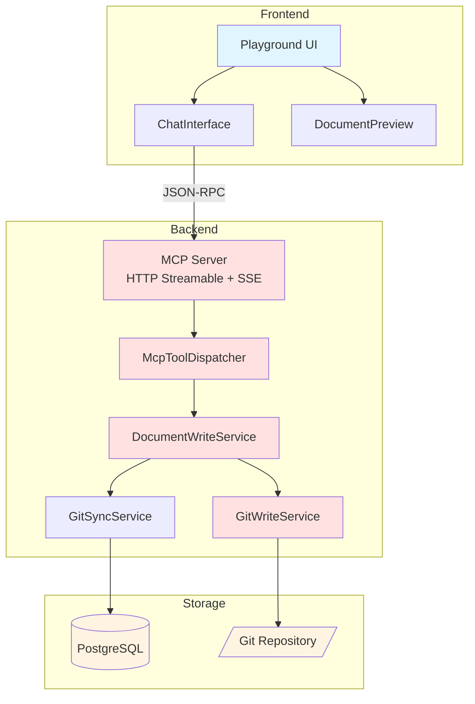

# Phase 5: LLM 통합 및 Playground

> **작성일**: 2026-01-01
> **목표**: MCP를 통한 문서 쓰기 및 LLM Playground 구현

---

## 개요

Phase 5에서는 LLM 에이전트가 MCP(Model Context Protocol)를 통해 문서를 읽고, 수정하고, Git에 커밋/푸시할 수 있는 기능을 구현합니다. 또한 이러한 기능을 테스트하고 사용할 수 있는 Playground UI를 제공합니다.

---

## 주요 기능

### 1. MCP Tools 확장 (쓰기 기능)

| Tool | 설명 | 상태 |
|------|------|------|
| `create_document` | 새 문서 생성 및 선택적 커밋 | **신규** |
| `update_document` | 문서 수정 및 선택적 커밋 | **신규** |
| `push_to_remote` | Git push to remote | **신규** |

### 2. MCP Transport 지원

| Transport | 설명 | 지원 |
|-----------|------|------|
| **HTTP Streamable** | POST + JSON-RPC | ✅ 기본 |
| **SSE** | Server-Sent Events 스트리밍 | ✅ |
| STDIO | 표준 입출력 (CLI) | ✅ 백엔드 |

### 3. LLM Playground

- **채팅 인터페이스**: LLM과 대화하며 문서 작업
- **Tool Call 시각화**: MCP Tools 호출 디버깅
- **문서 미리보기**: 실시간 문서 내용 확인
- **MCP Server 연결**: HTTP Streamable + SSE

---

## 계획 문서

| 파일 | 설명 |
|------|------|
| [`backend-plan.md`](./backend-plan.md) | 백엔드 구현 계획 (MCP Tools, Git Write) |
| [`frontend-plan.md`](./frontend-plan.md) | 프론트엔드 구현 계획 (Playground UI) |
| [`user-scenarios.md`](./user-scenarios.md) | 사용자 시나리오 (Mermaid 다이어그램) |

---

## 아키텍처



---

## 핵심 컴포넌트

### 백엔드

1. **McpTool Enum** (`mcp/McpTool.java`) - **신규**
   - Tool 이름/설명 중앙 관리
   - JSON Schema 생성
   - READ/WRITE 카테고리 분류

2. **McpToolDispatcher** (`mcp/McpToolDispatcher.java`) - **신규**
   - Enum 기반 Tool 라우팅
   - Handler 자동 등록

3. **McpTransportController** (`mcp/McpTransportController.java`) - **신규**
   - HTTP Streamable (POST /mcp)
   - SSE 스트림 (GET /mcp)
   - JSON-RPC 2.0 처리

4. **GitWriteService** (`git/GitWriteService.java`)
   - 파일 쓰기, Git commit, Git push

5. **DocumentWriteService** (`service/DocumentWriteService.java`)
   - 문서 생성/수정 비즈니스 로직
   - 권한 검사, Optimistic Locking

### 프론트엔드

1. **Playground 페이지** (`app/[locale]/playground/page.tsx`)
   - 메인 레이아웃, 프로젝트 선택

2. **ChatInterface** (`components/playground/chat-interface.tsx`)
   - 메시지 입력/표시, Tool Call 시각화

3. **MCP Protocol** (`lib/mcp-protocol.ts`) - **수정**
   - HTTP Streamable + SSE (WebSocket 제거)
   - JSON-RPC 클라이언트

---

## 구현 순서

### 백엔드

1. [x] 계획 수립
2. [ ] GitWriteService 구현
3. [ ] DocumentWriteService 구현
4. [ ] MCP Controller 확장
5. [ ] 권한 검사 로직
6. [ ] 테스트 작성

### 프론트엔드

1. [x] 계획 수립
2. [ ] Playground 페이지 레이아웃
3. [ ] ChatInterface 컴포넌트
4. [ ] MCP Protocol 구현
5. [ ] Tool Call 시각화
6. [ ] 문서 미리보기

---

## 사용자 시나리오

### 시나리오 1: 문서 검색 및 읽기

```
사용자: "프로젝트의 아키텍처 문서 찾아줘"
  ↓
LLM: search_documents(query: "architecture", mode: "hybrid")
  ↓
시스템: 검색 결과 반환 (architecture/overview.md)
  ↓
LLM: get_document(documentId: "...")
  ↓
사용자: 문서 내용 확인
```

### 시나리오 2: 문서 수정 및 커밋

```
사용자: "README.md의 설치 방법 업데이트해줘"
  ↓
LLM: get_document(documentId: "readme-id")
  ↓
LLM: 내용 분석 및 수정본 생성
  ↓
LLM: update_document(content: "...", createCommit: true)
  ↓
시스템: Git commit 생성 (by @username)
  ↓
사용자: "커밋 완료 (abc123)"
```

### 시나리오 3: Git Push

```
사용자: "변경사항을 원격 레포에 푸시해줘"
  ↓
LLM: push_to_remote(repositoryId: "...", branch: "main")
  ↓
시스템: Git push 실행
  ↓
사용자: "푸시 완료"
```

자세한 시나리오는 [`user-scenarios.md`](./user-scenarios.md)를 참고하세요.

---

## 설계 결정사항

| 항목 | 결정 | 이유 |
|------|------|------|
| **MCP Transport** | **HTTP Streamable + SSE** | 표준 프로토콜, WebSocket 불필요 |
| **Tool 관리** | **Enum 기반** | 타입 안전성, 중앙 관리 |
| LLM 통합 방식 | **MCP Server 직접 연결** | 표준 프로토콜, Claude Desktop 호환 |
| Git Author | **Bot + 사용자 명시** | 커밋 메시지에 "by @username" 추가 |
| 커밋 전략 | **즉시 커밋 vs 스테이징** | `createCommit` 플래그로 선택 가능 |
| 권한 검사 | **프로젝트 멤버십 확인** | Repository WRITE 권한 필요 |
| **동시성 제어** | **Optimistic Locking + ETag** | 충돌 감지, 데이터 무결성 |
| 동기화 | **커밋 후 자동 동기화** | DB와 Git 상태 일관성 유지 |

---

## 보안 고려사항

1. **권한 검사**
   - 프로젝트 멤버만 문서 수정 가능
   - Repository WRITE 권한 확인

2. **경로 탐색 공격 방지**
   - Git 레포지토리 내부로만 쓰기 허용
   - 경로 정규화 및 검증

3. **커밋 메시지 Sanitization**
   - XSS 방지
   - 길이 제한 (최대 500자)

4. **Rate Limiting**
   - MCP 쓰기 도구에 대한 속도 제한
   - LLM API 호출 제한

---

## 테스트 전략

### 단위 테스트

- GitWriteService: 파일 쓰기, 커밋 생성, push
- DocumentWriteService: 비즈니스 로직, 트랜잭션

### 통합 테스트

- MCP update_document 전체 플로우
- MCP push_to_remote 성공/실패 케이스

### E2E 테스트

- Playground에서 문서 검색
- 문서 수정 및 커밋
- Git push

---

## 완료 기준

### 백엔드

- [ ] GitWriteService 구현 및 테스트
- [ ] DocumentWriteService 구현 및 테스트
- [ ] MCP update_document 엔드포인트 동작
- [ ] MCP push_to_remote 엔드포인트 동작
- [ ] 권한 검사 동작
- [ ] 커밋 후 자동 동기화 동작
- [ ] 사용자 정보가 커밋 메시지에 포함됨

### 프론트엔드

- [ ] Playground 페이지 렌더링
- [ ] 프로젝트 선택 가능
- [ ] 메시지 입력 및 표시
- [ ] MCP Server 연결 동작
- [ ] Tool Call 시각화 동작
- [ ] 문서 미리보기 동작
- [ ] 다국어 지원

---

## 참고 자료

- [MCP Protocol Specification](https://modelcontextprotocol.io/)
- [Claude Desktop MCP Integration](https://docs.anthropic.com/claude/docs/mcp)
- [JGit Documentation](https://www.eclipse.org/jgit/documentation/)

---

## 다음 단계 (Phase 6)

- [ ] Webhook 기반 자동 동기화
- [ ] Branch 관리 UI
- [ ] Conflict 해결 인터페이스
- [ ] 대화 세션 저장 및 복원
- [ ] Tool Call 템플릿 (자주 사용하는 작업)