# Phase 5: 사용자 시나리오

> **작성일**: 2026-01-01
> **목표**: LLM 통합 및 Playground 사용자 플로우

---

## 개요

Phase 5에서는 LLM 에이전트와 대화하면서 문서를 검색, 읽기, 생성, 수정할 수 있는 기능을 제공합니다. 이 문서는 주요 사용자 시나리오를 Mermaid 다이어그램으로 설명합니다.

### MCP Transport

- **HTTP Streamable**: POST로 JSON-RPC 요청
- **SSE**: GET으로 스트리밍 응답 수신
- **STDIO**: CLI 도구 전용 (프론트엔드 미지원)

---

## 시나리오 1: 문서 검색 및 읽기

### 사용자 스토리

> "프로젝트의 아키텍처 문서를 찾아서 읽고 싶어요."

### 시퀀스 다이어그램

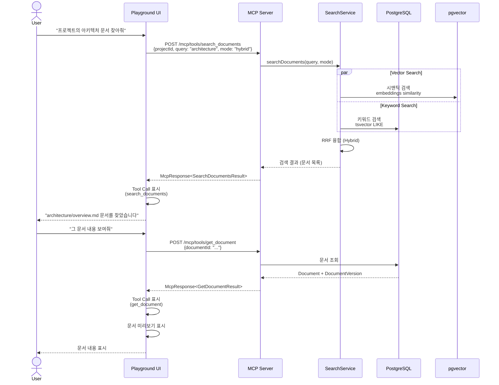
```mermaid
sequenceDiagram
    actor User
    participant UI as Playground UI
    participant MCP as MCP Server
    participant Search as SearchService
    participant DB as PostgreSQL
    participant Vector as pgvector

    User->>UI: "프로젝트의 아키텍처 문서 찾아줘"
    UI->>MCP: POST /mcp/tools/search_documents<br/>{projectId, query: "architecture", mode: "hybrid"}

    MCP->>Search: searchDocuments(query, mode)

    par Vector Search
        Search->>Vector: 시맨틱 검색<br/>embeddings similarity
    and Keyword Search
        Search->>DB: 키워드 검색<br/>tsvector LIKE
    end

    Search->>Search: RRF 융합 (Hybrid)
    Search-->>MCP: 검색 결과 (문서 목록)
    MCP-->>UI: McpResponse<SearchDocumentsResult>

    UI->>UI: Tool Call 표시<br/>(search_documents)
    UI-->>User: "architecture/overview.md 문서를 찾았습니다"

    User->>UI: "그 문서 내용 보여줘"
    UI->>MCP: POST /mcp/tools/get_document<br/>{documentId: "..."}
    MCP->>DB: 문서 조회
    DB-->>MCP: Document + DocumentVersion
    MCP-->>UI: McpResponse<GetDocumentResult>

    UI->>UI: Tool Call 표시<br/>(get_document)
    UI->>UI: 문서 미리보기 표시
    UI-->>User: 문서 내용 표시
```

---

## 시나리오 1.5: 키워드 검색 (벡터 미사용)

### 사용자 스토리

> "비용을 절약하면서 문서를 검색하고 싶어요."

### 비용 비교

| 검색 모드 | 벡터 사용 | LLM API 비용 | 사용 사례 |
|-----------|----------|-------------|----------|
| `keyword` | ❌ | **$0** | 정확한 키워드 검색 |
| `semantic` | ✅ | 임베딩 비용 | 의미 기반 검색 |
| `hybrid` | ✅ | 임베딩 비용 | 정확도 + 의미 결합 |

### 시퀀스 다이어그램

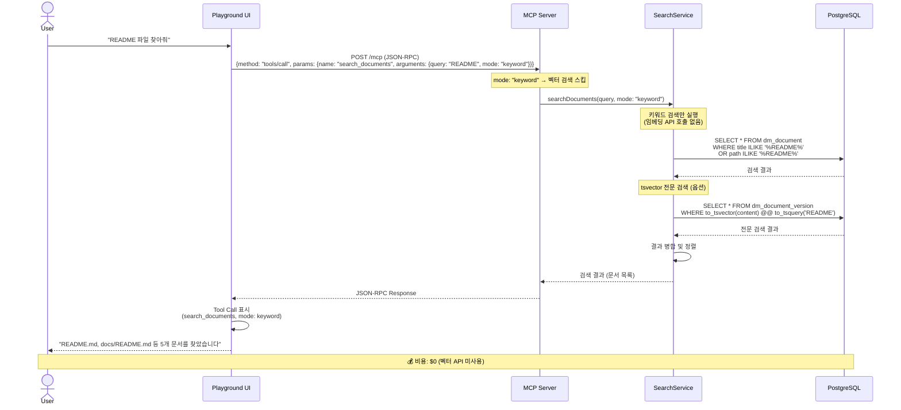
```mermaid
sequenceDiagram
    actor User
    participant UI as Playground UI
    participant MCP as MCP Server
    participant Search as SearchService
    participant DB as PostgreSQL

    User->>UI: "README 파일 찾아줘"
    UI->>MCP: POST /mcp (JSON-RPC)<br/>{method: "tools/call", params: {name: "search_documents", arguments: {query: "README", mode: "keyword"}}}

    Note over MCP: mode: "keyword" → 벡터 검색 스킵

    MCP->>Search: searchDocuments(query, mode: "keyword")

    Note over Search: 키워드 검색만 실행<br/>(임베딩 API 호출 없음)

    Search->>DB: SELECT * FROM dm_document<br/>WHERE title ILIKE '%README%'<br/>OR path ILIKE '%README%'
    DB-->>Search: 검색 결과

    Note over Search: tsvector 전문 검색 (옵션)
    Search->>DB: SELECT * FROM dm_document_version<br/>WHERE to_tsvector(content) @@ to_tsquery('README')
    DB-->>Search: 전문 검색 결과

    Search->>Search: 결과 병합 및 정렬
    Search-->>MCP: 검색 결과 (문서 목록)
    MCP-->>UI: JSON-RPC Response

    UI->>UI: Tool Call 표시<br/>(search_documents, mode: keyword)
    UI-->>User: "README.md, docs/README.md 등 5개 문서를 찾았습니다"

    Note over User,DB: 💰 비용: $0 (벡터 API 미사용)
```

### 플로우 다이어그램: 검색 모드 선택

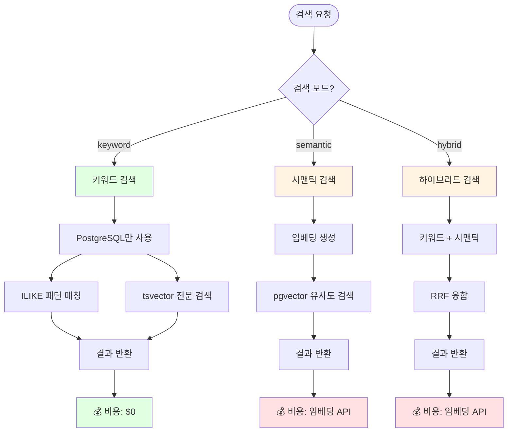
```mermaid
graph TB
    Start([검색 요청]) --> ModeCheck{검색 모드?}

    ModeCheck -->|keyword| Keyword[키워드 검색]
    ModeCheck -->|semantic| Semantic[시맨틱 검색]
    ModeCheck -->|hybrid| Hybrid[하이브리드 검색]

    Keyword --> DB_Only[PostgreSQL만 사용]
    DB_Only --> ILIKE[ILIKE 패턴 매칭]
    DB_Only --> TSVector[tsvector 전문 검색]

    Semantic --> Embedding[임베딩 생성]
    Embedding --> Vector[pgvector 유사도 검색]

    Hybrid --> Both[키워드 + 시맨틱]
    Both --> RRF[RRF 융합]

    ILIKE --> Result1[결과 반환]
    TSVector --> Result1
    Vector --> Result2[결과 반환]
    RRF --> Result3[결과 반환]

    Result1 --> Cost1[💰 비용: $0]
    Result2 --> Cost2[💰 비용: 임베딩 API]
    Result3 --> Cost3[💰 비용: 임베딩 API]

    style Keyword fill:#e1ffe1
    style Cost1 fill:#e1ffe1
    style Semantic fill:#fff4e1
    style Hybrid fill:#fff4e1
    style Cost2 fill:#ffe1e1
    style Cost3 fill:#ffe1e1
```

### 키워드 검색 최적화

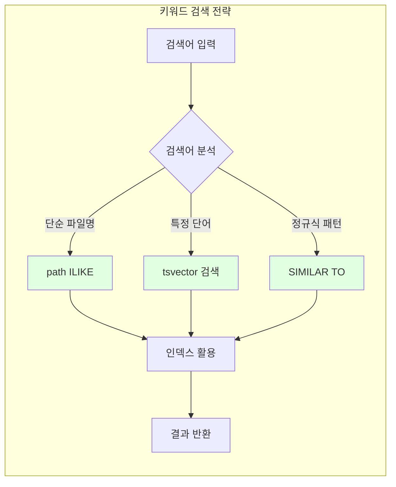
```mermaid
graph LR
    subgraph "키워드 검색 전략"
        A[검색어 입력] --> B{검색어 분석}

        B -->|단순 파일명| C[path ILIKE]
        B -->|특정 단어| D[tsvector 검색]
        B -->|정규식 패턴| E[SIMILAR TO]

        C --> F[인덱스 활용]
        D --> F
        E --> F

        F --> G[결과 반환]
    end

    style C fill:#e1ffe1
    style D fill:#e1ffe1
    style E fill:#e1ffe1
```

### 사용 예시

```
# 키워드 검색 (비용 없음)
사용자: "README 파일 찾아줘"
→ search_documents(query: "README", mode: "keyword")

# 시맨틱 검색 (임베딩 비용 발생)
사용자: "프로젝트 시작하는 방법 알려줘"
→ search_documents(query: "getting started guide", mode: "semantic")

# 하이브리드 검색 (임베딩 비용 발생, 최고 정확도)
사용자: "API 인증 관련 문서 찾아줘"
→ search_documents(query: "API authentication", mode: "hybrid")
```

---

## 시나리오 2: 문서 수정 및 커밋

### 사용자 스토리

> "README.md의 설치 방법을 업데이트하고 Git에 커밋하고 싶어요."

### 시퀀스 다이어그램

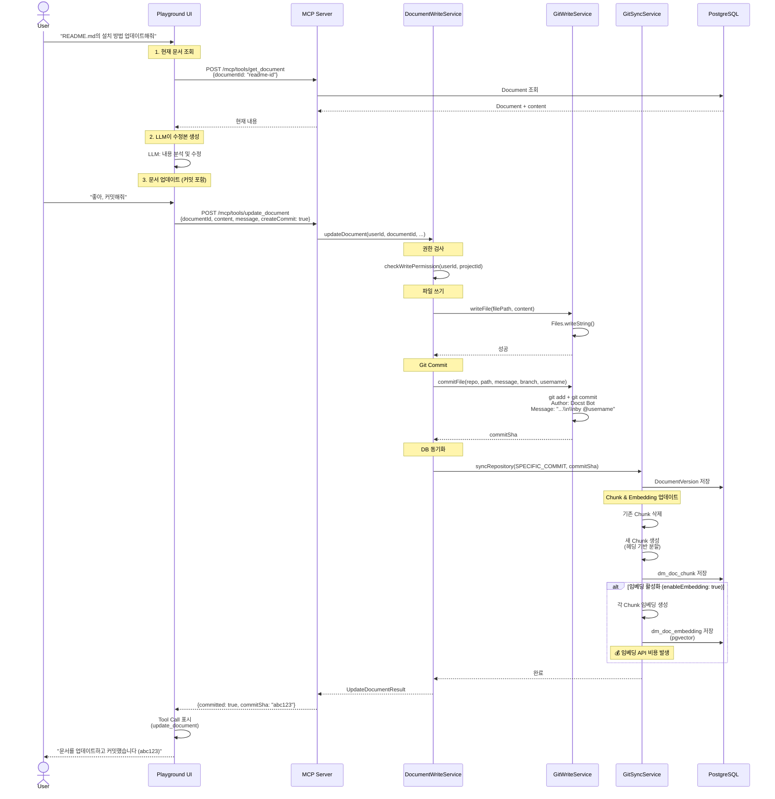
```mermaid
sequenceDiagram
    actor User
    participant UI as Playground UI
    participant MCP as MCP Server
    participant Write as DocumentWriteService
    participant Git as GitWriteService
    participant Sync as GitSyncService
    participant DB as PostgreSQL

    User->>UI: "README.md의 설치 방법 업데이트해줘"

    Note over UI: 1. 현재 문서 조회
    UI->>MCP: POST /mcp/tools/get_document<br/>{documentId: "readme-id"}
    MCP->>DB: Document 조회
    DB-->>MCP: Document + content
    MCP-->>UI: 현재 내용

    Note over UI: 2. LLM이 수정본 생성
    UI->>UI: LLM: 내용 분석 및 수정

    Note over UI: 3. 문서 업데이트 (커밋 포함)
    User->>UI: "좋아, 커밋해줘"
    UI->>MCP: POST /mcp/tools/update_document<br/>{documentId, content, message, createCommit: true}

    MCP->>Write: updateDocument(userId, documentId, ...)

    Note over Write: 권한 검사
    Write->>Write: checkWritePermission(userId, projectId)

    Note over Write: 파일 쓰기
    Write->>Git: writeFile(filePath, content)
    Git->>Git: Files.writeString()
    Git-->>Write: 성공

    Note over Write: Git Commit
    Write->>Git: commitFile(repo, path, message, branch, username)
    Git->>Git: git add + git commit<br/>Author: Docst Bot<br/>Message: "...\\n\\nby @username"
    Git-->>Write: commitSha

    Note over Write: DB 동기화
    Write->>Sync: syncRepository(SPECIFIC_COMMIT, commitSha)
    Sync->>DB: DocumentVersion 저장

    Note over Sync: Chunk & Embedding 업데이트
    Sync->>Sync: 기존 Chunk 삭제
    Sync->>Sync: 새 Chunk 생성<br/>(헤딩 기반 분할)
    Sync->>DB: dm_doc_chunk 저장

    alt 임베딩 활성화 (enableEmbedding: true)
        Sync->>Sync: 각 Chunk 임베딩 생성
        Sync->>DB: dm_doc_embedding 저장<br/>(pgvector)
        Note over Sync: 💰 임베딩 API 비용 발생
    end

    Sync-->>Write: 완료

    Write-->>MCP: UpdateDocumentResult
    MCP-->>UI: {committed: true, commitSha: "abc123"}

    UI->>UI: Tool Call 표시<br/>(update_document)
    UI-->>User: "문서를 업데이트하고 커밋했습니다 (abc123)"
```

### Chunk & Embedding 업데이트 상세

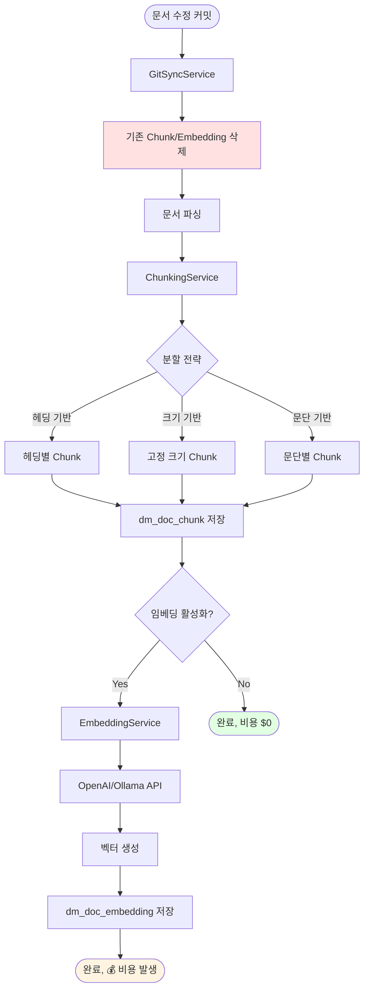
```mermaid
graph TB
    Start([문서 수정 커밋]) --> Sync[GitSyncService]

    Sync --> DeleteOld[기존 Chunk/Embedding 삭제]
    DeleteOld --> Parse[문서 파싱]

    Parse --> Chunk[ChunkingService]
    Chunk --> Split{분할 전략}

    Split -->|헤딩 기반| Heading[헤딩별 Chunk]
    Split -->|크기 기반| Size[고정 크기 Chunk]
    Split -->|문단 기반| Paragraph[문단별 Chunk]

    Heading --> SaveChunk[dm_doc_chunk 저장]
    Size --> SaveChunk
    Paragraph --> SaveChunk

    SaveChunk --> EmbedCheck{임베딩 활성화?}

    EmbedCheck -->|Yes| Embed[EmbeddingService]
    EmbedCheck -->|No| Done([완료, 비용 $0])

    Embed --> API[OpenAI/Ollama API]
    API --> Vector[벡터 생성]
    Vector --> SaveEmbed[dm_doc_embedding 저장]
    SaveEmbed --> DoneCost([완료, 💰 비용 발생])

    style DeleteOld fill:#ffe1e1
    style Done fill:#e1ffe1
    style DoneCost fill:#fff4e1
```

---

## 시나리오 3: Git Push

### 사용자 스토리

> "로컬 커밋을 원격 레포지토리에 푸시하고 싶어요."

### 시퀀스 다이어그램

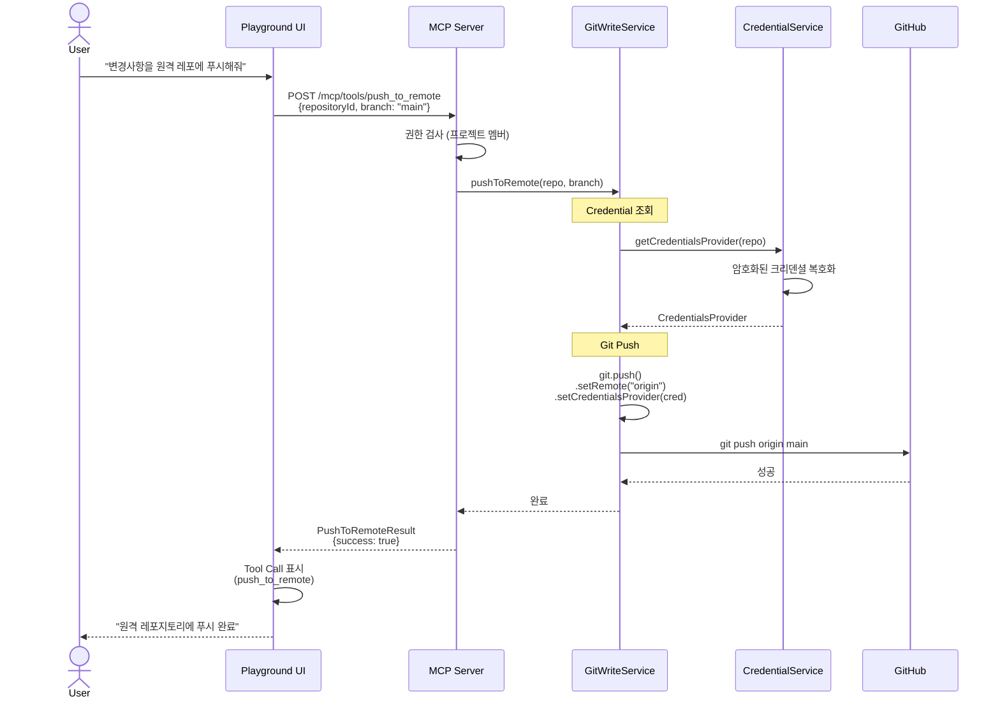
```mermaid
sequenceDiagram
    actor User
    participant UI as Playground UI
    participant MCP as MCP Server
    participant Git as GitWriteService
    participant Cred as CredentialService
    participant Remote as GitHub

    User->>UI: "변경사항을 원격 레포에 푸시해줘"
    UI->>MCP: POST /mcp/tools/push_to_remote<br/>{repositoryId, branch: "main"}

    MCP->>MCP: 권한 검사 (프로젝트 멤버)

    MCP->>Git: pushToRemote(repo, branch)

    Note over Git: Credential 조회
    Git->>Cred: getCredentialsProvider(repo)
    Cred->>Cred: 암호화된 크리덴셜 복호화
    Cred-->>Git: CredentialsProvider

    Note over Git: Git Push
    Git->>Git: git.push()<br/>.setRemote("origin")<br/>.setCredentialsProvider(cred)
    Git->>Remote: git push origin main
    Remote-->>Git: 성공

    Git-->>MCP: 완료
    MCP-->>UI: PushToRemoteResult<br/>{success: true}

    UI->>UI: Tool Call 표시<br/>(push_to_remote)
    UI-->>User: "원격 레포지토리에 푸시 완료"
```

---

## 시나리오 4: Playground 전체 플로우

### 사용자 스토리

> "프로젝트 문서를 탐색하고, 필요한 부분을 수정하고, 푸시하는 전체 플로우"

### 플로우 다이어그램

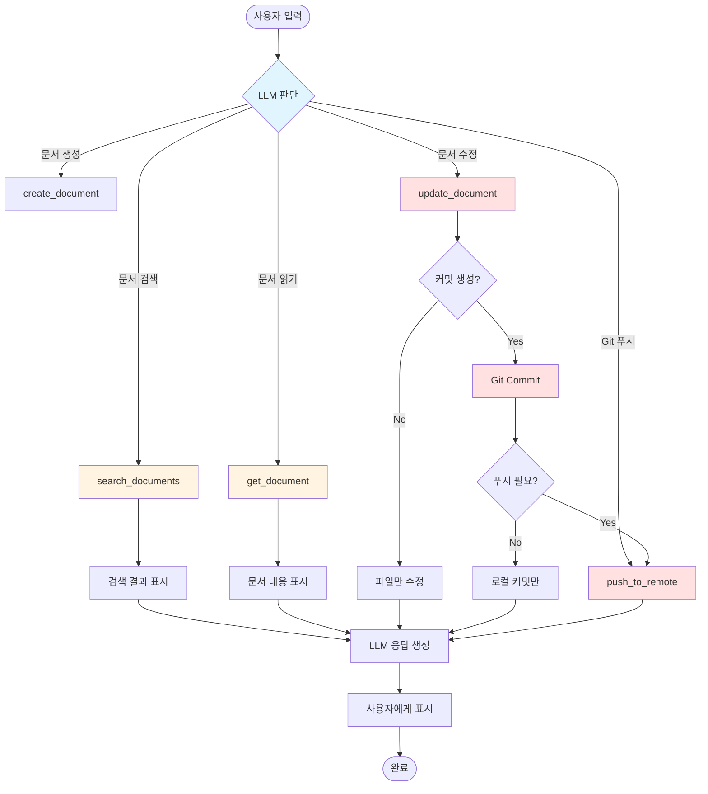
```mermaid
graph TB
    Start([사용자 입력]) --> LLM{LLM 판단}

    LLM -->|문서 검색| Search[search_documents]
    LLM -->|문서 읽기| Read[get_document]
    LLM -->|문서 생성| Create[create_document]
    LLM -->|문서 수정| Update[update_document]
    LLM -->|Git 푸시| Push[push_to_remote]

    Search --> SearchResult[검색 결과 표시]
    Read --> ReadResult[문서 내용 표시]
    Update --> UpdateCheck{커밋 생성?}

    UpdateCheck -->|Yes| Commit[Git Commit]
    UpdateCheck -->|No| Stage[파일만 수정]

    Commit --> PushCheck{푸시 필요?}
    PushCheck -->|Yes| Push
    PushCheck -->|No| LocalOnly[로컬 커밋만]

    SearchResult --> Response[LLM 응답 생성]
    ReadResult --> Response
    Stage --> Response
    LocalOnly --> Response
    Push --> Response

    Response --> Display[사용자에게 표시]
    Display --> End([완료])

    style LLM fill:#e1f5ff
    style Search fill:#fff4e1
    style Read fill:#fff4e1
    style Update fill:#ffe1e1
    style Push fill:#ffe1e1
    style Commit fill:#ffe1e1
```

---

## 시나리오 5: 문서 버전 비교

### 사용자 스토리

> "최신 버전과 이전 버전의 차이를 확인하고 싶어요."

### 시퀀스 다이어그램

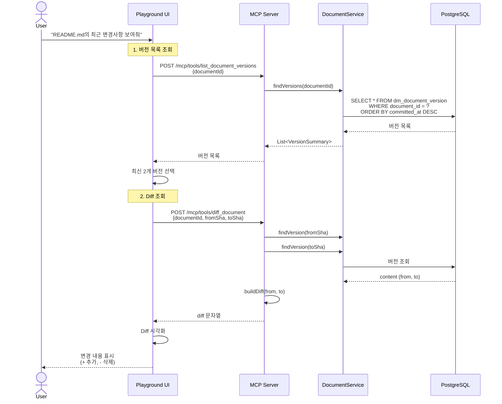
```mermaid
sequenceDiagram
    actor User
    participant UI as Playground UI
    participant MCP as MCP Server
    participant Doc as DocumentService
    participant DB as PostgreSQL

    User->>UI: "README.md의 최근 변경사항 보여줘"

    Note over UI: 1. 버전 목록 조회
    UI->>MCP: POST /mcp/tools/list_document_versions<br/>{documentId}
    MCP->>Doc: findVersions(documentId)
    Doc->>DB: SELECT * FROM dm_document_version<br/>WHERE document_id = ?<br/>ORDER BY committed_at DESC
    DB-->>Doc: 버전 목록
    Doc-->>MCP: List<VersionSummary>
    MCP-->>UI: 버전 목록

    UI->>UI: 최신 2개 버전 선택

    Note over UI: 2. Diff 조회
    UI->>MCP: POST /mcp/tools/diff_document<br/>{documentId, fromSha, toSha}
    MCP->>Doc: findVersion(fromSha)
    MCP->>Doc: findVersion(toSha)
    Doc->>DB: 버전 조회
    DB-->>Doc: content (from, to)
    MCP->>MCP: buildDiff(from, to)
    MCP-->>UI: diff 문자열

    UI->>UI: Diff 시각화
    UI-->>User: 변경 내용 표시<br/>(+ 추가, - 삭제)
```

---

## 시나리오 6: 새 문서 생성

### 사용자 스토리

> "프로젝트에 새로운 API 가이드 문서를 만들고 싶어요."

### 시퀀스 다이어그램

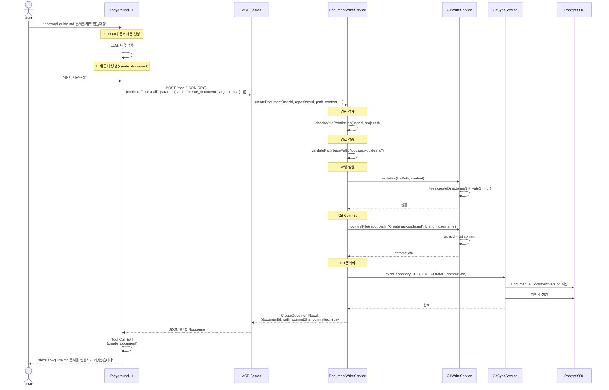
```mermaid
sequenceDiagram
    actor User
    participant UI as Playground UI
    participant MCP as MCP Server
    participant Write as DocumentWriteService
    participant Git as GitWriteService
    participant Sync as GitSyncService
    participant DB as PostgreSQL

    User->>UI: "docs/api-guide.md 문서를 새로 만들어줘"

    Note over UI: 1. LLM이 문서 내용 생성
    UI->>UI: LLM: 내용 생성<br/>"# API Guide\n\n..."

    Note over UI: 2. 새 문서 생성 (create_document)
    User->>UI: "좋아, 저장해줘"
    UI->>MCP: POST /mcp (JSON-RPC)<br/>{method: "tools/call", params: {name: "create_document", arguments: {...}}}

    MCP->>Write: createDocument(userId, repositoryId, path, content, ...)

    Note over Write: 권한 검사
    Write->>Write: checkWritePermission(userId, projectId)

    Note over Write: 경로 검증
    Write->>Write: validatePath(basePath, "docs/api-guide.md")

    Note over Write: 파일 생성
    Write->>Git: writeFile(filePath, content)
    Git->>Git: Files.createDirectories() + writeString()
    Git-->>Write: 성공

    Note over Write: Git Commit
    Write->>Git: commitFile(repo, path, "Create api-guide.md", branch, username)
    Git->>Git: git add + git commit
    Git-->>Write: commitSha

    Note over Write: DB 동기화
    Write->>Sync: syncRepository(SPECIFIC_COMMIT, commitSha)
    Sync->>DB: Document + DocumentVersion 저장
    Sync->>DB: 임베딩 생성
    Sync-->>Write: 완료

    Write-->>MCP: CreateDocumentResult<br/>{documentId, path, commitSha, committed: true}
    MCP-->>UI: JSON-RPC Response

    UI->>UI: Tool Call 표시<br/>(create_document)
    UI-->>User: "docs/api-guide.md 문서를 생성하고 커밋했습니다"
```

---

## 시나리오 7: 멀티 스텝 작업

### 사용자 스토리

> "여러 문서를 검색하고, 내용을 종합하여 새로운 문서를 작성하고 싶어요."

### 플로우 다이어그램

```mermaid
graph TB
    Start([사용자: "API 문서들을 종합해서<br/>새로운 통합 가이드 만들어줘"]) --> Step1[1. search_documents<br/>'API']

    Step1 --> Found{문서 발견?}
    Found -->|Yes| Step2[2. get_document<br/>(각 API 문서)]
    Found -->|No| NotFound[검색 결과 없음]

    Step2 --> Step3[3. LLM: 내용 분석 및<br/>통합 가이드 생성]

    Step3 --> Check{기존 가이드<br/>문서 존재?}
    Check -->|Yes| Step4a[4a. update_document<br/>(기존 문서 수정)]
    Check -->|No| Step4b[4b. update_document<br/>(새 문서 생성)]

    Step4a --> Step5[5. push_to_remote<br/>(선택)]
    Step4b --> Step5

    Step5 --> End([완료])
    NotFound --> End

    style Start fill:#e1f5ff
    style Step1 fill:#fff4e1
    style Step2 fill:#fff4e1
    style Step3 fill:#e1ffe1
    style Step4a fill:#ffe1e1
    style Step4b fill:#ffe1e1
    style Step5 fill:#ffe1e1
```

---

## UI 플로우: Playground 사용

### 화면 전환 다이어그램

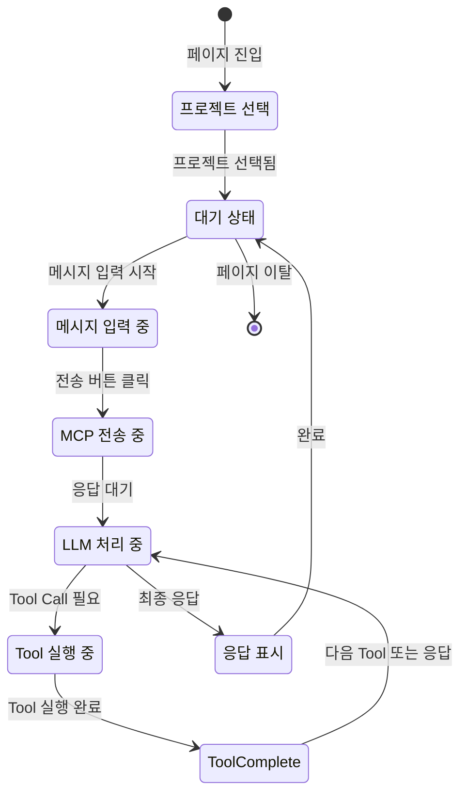
```mermaid
stateDiagram-v2
    [*] --> SelectProject: 페이지 진입

    SelectProject: 프로젝트 선택
    SelectProject --> Idle: 프로젝트 선택됨

    Idle: 대기 상태
    Idle --> Typing: 메시지 입력 시작

    Typing: 메시지 입력 중
    Typing --> Sending: 전송 버튼 클릭

    Sending: MCP 전송 중
    Sending --> Processing: 응답 대기

    Processing: LLM 처리 중
    Processing --> ToolCalling: Tool Call 필요
    Processing --> Responding: 최종 응답

    ToolCalling: Tool 실행 중
    ToolCalling --> ToolComplete: Tool 실행 완료
    ToolComplete --> Processing: 다음 Tool 또는 응답

    Responding: 응답 표시
    Responding --> Idle: 완료

    Idle --> [*]: 페이지 이탈
```

---

## 데이터 플로우: 문서 수정

### 아키텍처 다이어그램

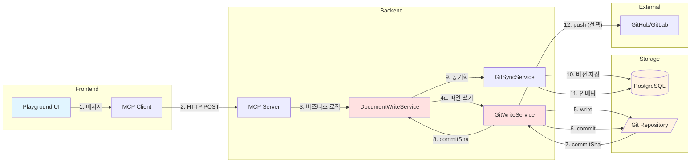
```mermaid
graph LR
    subgraph Frontend
        UI[Playground UI]
        MCP_Client[MCP Client]
    end

    subgraph Backend
        MCP_Server[MCP Server]
        Doc_Write[DocumentWriteService]
        Git_Write[GitWriteService]
        Sync[GitSyncService]
    end

    subgraph Storage
        DB[(PostgreSQL)]
        FS[/Git Repository/]
    end

    subgraph External
        Remote[GitHub/GitLab]
    end

%% 연결 정의
    UI -->|1. 메시지| MCP_Client
    MCP_Client -->|2. HTTP POST| MCP_Server
    MCP_Server -->|3. 비즈니스 로직| Doc_Write

    Doc_Write -->|4a. 파일 쓰기| Git_Write
    Git_Write -->|5. write| FS

    Git_Write -->|6. commit| FS
    FS -->|7. commitSha| Git_Write
    Git_Write -->|8. commitSha| Doc_Write

    Doc_Write -->|9. 동기화| Sync
    Sync -->|10. 버전 저장| DB
    Sync -->|11. 임베딩| DB

%% 오류 수정 부분: 라벨을 따옴표로 감싸고 줄 끝 불필요 텍스트 제거
    Git_Write -->|"12. push (선택)"| Remote

%% 스타일 정의
    style UI fill:#e1f5ff
    style Doc_Write fill:#ffe1e1
    style Git_Write fill:#ffe1e1
    style DB fill:#fff4e1
    style FS fill:#fff4e1
```

---

## 에러 처리 플로우

### 에러 시나리오

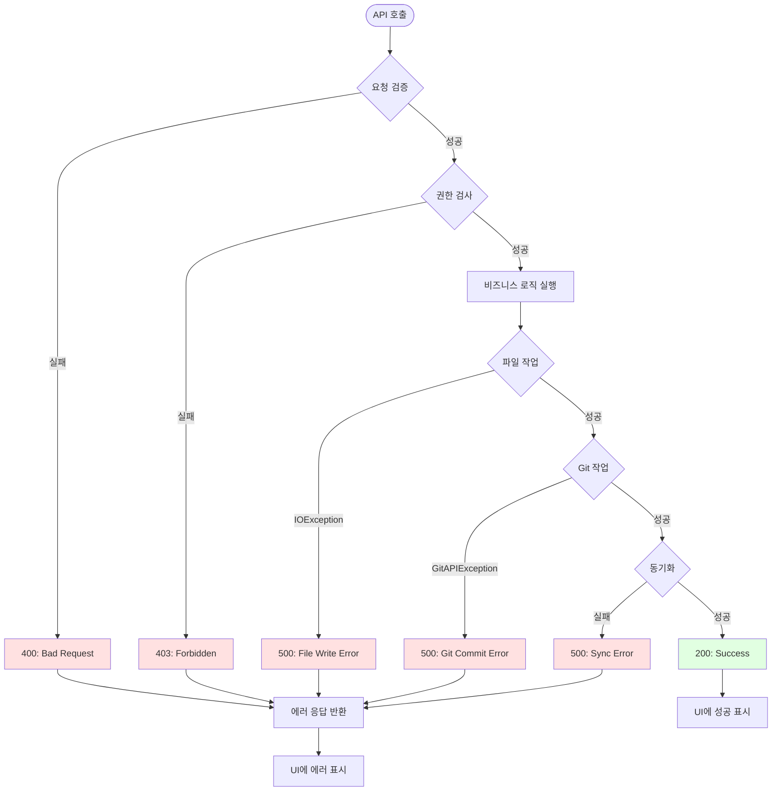
```mermaid
graph TB
    Start([API 호출]) --> Check{요청 검증}

    Check -->|실패| Error1[400: Bad Request]
    Check -->|성공| Auth{권한 검사}

    Auth -->|실패| Error2[403: Forbidden]
    Auth -->|성공| Process[비즈니스 로직 실행]

    Process --> FileOp{파일 작업}
    FileOp -->|IOException| Error3[500: File Write Error]
    FileOp -->|성공| GitOp{Git 작업}

    GitOp -->|GitAPIException| Error4[500: Git Commit Error]
    GitOp -->|성공| SyncOp{동기화}

    SyncOp -->|실패| Error5[500: Sync Error]
    SyncOp -->|성공| Success[200: Success]

    Error1 --> ErrorResponse[에러 응답 반환]
    Error2 --> ErrorResponse
    Error3 --> ErrorResponse
    Error4 --> ErrorResponse
    Error5 --> ErrorResponse

    ErrorResponse --> UI[UI에 에러 표시]
    Success --> UI2[UI에 성공 표시]

    style Error1 fill:#ffe1e1
    style Error2 fill:#ffe1e1
    style Error3 fill:#ffe1e1
    style Error4 fill:#ffe1e1
    style Error5 fill:#ffe1e1
    style Success fill:#e1ffe1
```

---

## 동시성 처리

### 전략: Optimistic Locking + ETag

동시 편집 충돌을 방지하기 위해 **Optimistic Locking**과 **ETag**를 사용합니다.

| 요소 | 설명 |
|------|------|
| **ETag** | 문서의 현재 버전 해시 (commitSha 기반) |
| **If-Match** | 클라이언트가 알고 있는 ETag 전송 |
| **412 Precondition Failed** | ETag 불일치 시 반환 |

### 시퀀스 다이어그램 (Optimistic Locking)

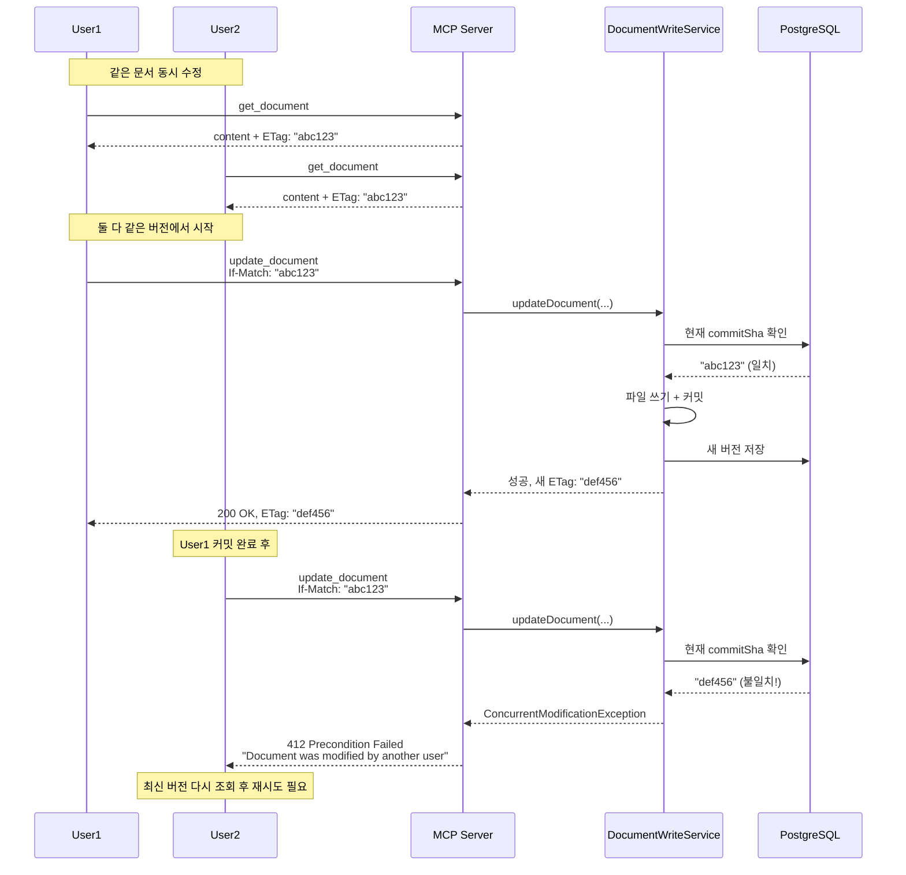
```mermaid
sequenceDiagram
    participant User1
    participant User2
    participant MCP as MCP Server
    participant Doc as DocumentWriteService
    participant DB as PostgreSQL

    Note over User1,User2: 같은 문서 동시 수정

    User1->>MCP: get_document
    MCP-->>User1: content + ETag: "abc123"

    User2->>MCP: get_document
    MCP-->>User2: content + ETag: "abc123"

    Note over User1,User2: 둘 다 같은 버전에서 시작

    User1->>MCP: update_document<br/>If-Match: "abc123"
    MCP->>Doc: updateDocument(...)

    Doc->>DB: 현재 commitSha 확인
    DB-->>Doc: "abc123" (일치)

    Doc->>Doc: 파일 쓰기 + 커밋
    Doc->>DB: 새 버전 저장
    Doc-->>MCP: 성공, 새 ETag: "def456"
    MCP-->>User1: 200 OK, ETag: "def456"

    Note over User2: User1 커밋 완료 후

    User2->>MCP: update_document<br/>If-Match: "abc123"
    MCP->>Doc: updateDocument(...)

    Doc->>DB: 현재 commitSha 확인
    DB-->>Doc: "def456" (불일치!)

    Doc-->>MCP: ConcurrentModificationException
    MCP-->>User2: 412 Precondition Failed<br/>"Document was modified by another user"

    Note over User2: 최신 버전 다시 조회 후 재시도 필요
```

### 충돌 해결 플로우

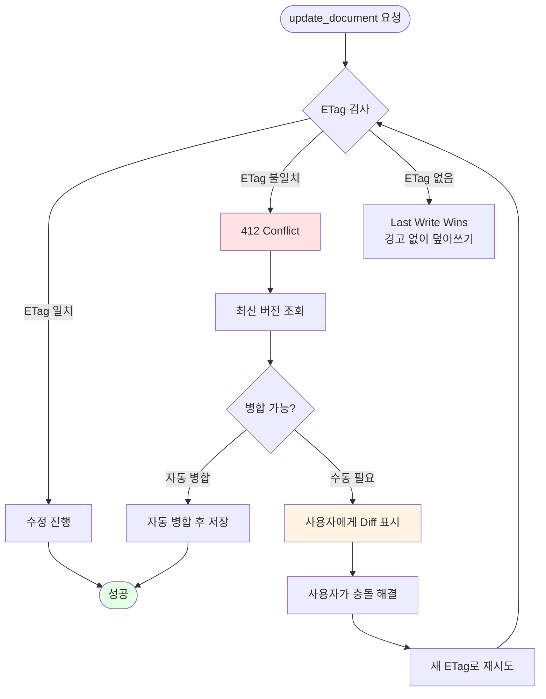
```mermaid
graph TB
    Start([update_document 요청]) --> Check{ETag 검사}

    Check -->|ETag 일치| Proceed[수정 진행]
    Check -->|ETag 불일치| Conflict[412 Conflict]
    Check -->|ETag 없음| LastWriteWins[Last Write Wins<br/>경고 없이 덮어쓰기]

    Conflict --> Fetch[최신 버전 조회]
    Fetch --> Merge{병합 가능?}

    Merge -->|자동 병합| AutoMerge[자동 병합 후 저장]
    Merge -->|수동 필요| ManualMerge[사용자에게 Diff 표시]

    ManualMerge --> UserResolve[사용자가 충돌 해결]
    UserResolve --> Retry[새 ETag로 재시도]

    Proceed --> Success([성공])
    AutoMerge --> Success
    Retry --> Check

    style Conflict fill:#ffe1e1
    style Success fill:#e1ffe1
    style ManualMerge fill:#fff4e1
```

### Git Push 충돌 처리

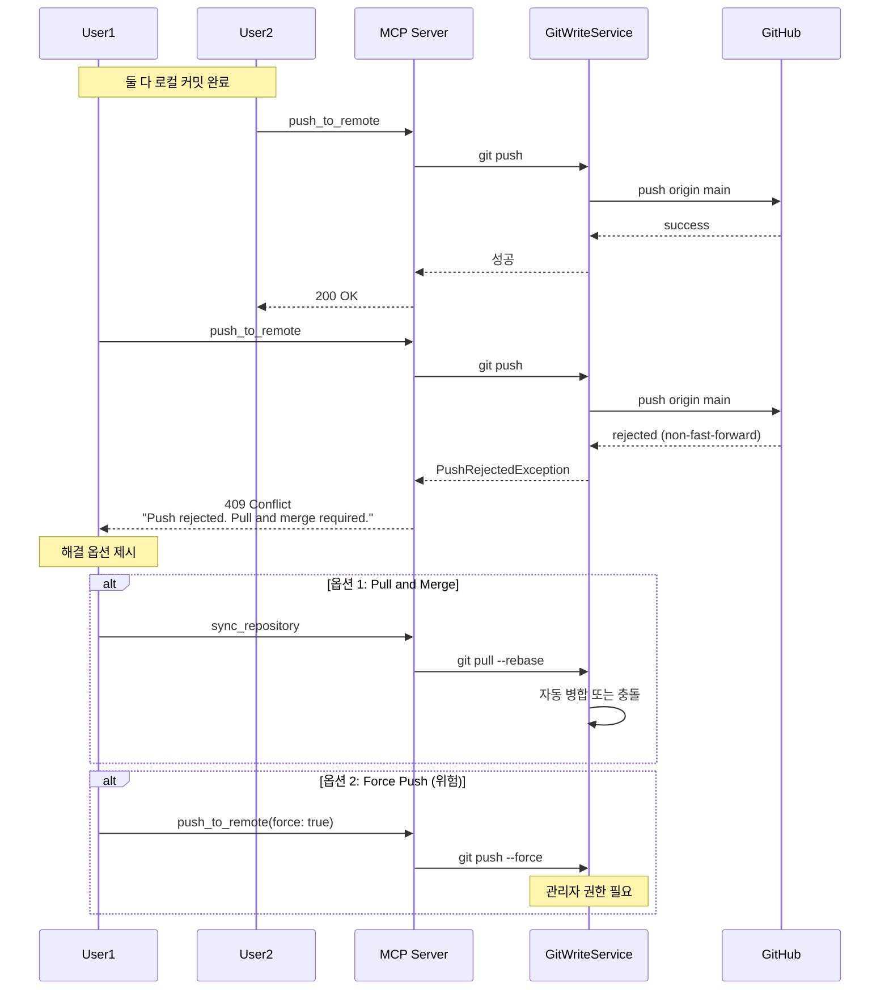
```mermaid
sequenceDiagram
    participant User1
    participant User2
    participant MCP as MCP Server
    participant Git as GitWriteService
    participant Remote as GitHub

    Note over User1,User2: 둘 다 로컬 커밋 완료

    User2->>MCP: push_to_remote
    MCP->>Git: git push
    Git->>Remote: push origin main
    Remote-->>Git: success
    Git-->>MCP: 성공
    MCP-->>User2: 200 OK

    User1->>MCP: push_to_remote
    MCP->>Git: git push
    Git->>Remote: push origin main
    Remote-->>Git: rejected (non-fast-forward)

    Git-->>MCP: PushRejectedException
    MCP-->>User1: 409 Conflict<br/>"Push rejected. Pull and merge required."

    Note over User1: 해결 옵션 제시

    alt 옵션 1: Pull and Merge
        User1->>MCP: sync_repository
        MCP->>Git: git pull --rebase
        Git->>Git: 자동 병합 또는 충돌
    end

    alt 옵션 2: Force Push (위험)
        User1->>MCP: push_to_remote(force: true)
        MCP->>Git: git push --force
        Note over Git: 관리자 권한 필요
    end
```

---

## 성능 최적화 플로우

### 임베딩 캐싱 및 배치 처리

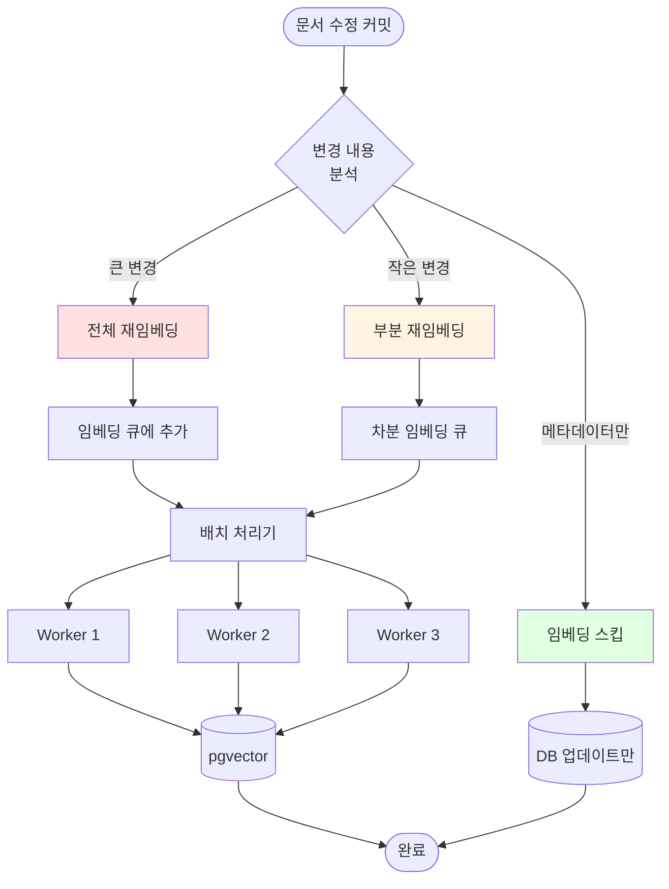
```mermaid
graph TB
    Start([문서 수정 커밋]) --> Check{변경 내용<br/>분석}

    Check -->|큰 변경| FullReembed[전체 재임베딩]
    Check -->|작은 변경| PartialReembed[부분 재임베딩]
    Check -->|메타데이터만| NoReembed[임베딩 스킵]

    FullReembed --> Queue1[임베딩 큐에 추가]
    PartialReembed --> Queue2[차분 임베딩 큐]
    NoReembed --> DB[(DB 업데이트만)]

    Queue1 --> Batch[배치 처리기]
    Queue2 --> Batch

    Batch --> Worker1[Worker 1]
    Batch --> Worker2[Worker 2]
    Batch --> Worker3[Worker 3]

    Worker1 --> Vector[(pgvector)]
    Worker2 --> Vector
    Worker3 --> Vector

    Vector --> Complete([완료])
    DB --> Complete

    style FullReembed fill:#ffe1e1
    style PartialReembed fill:#fff4e1
    style NoReembed fill:#e1ffe1
```

---

## 모니터링 및 로깅

### 관찰 가능성 다이어그램

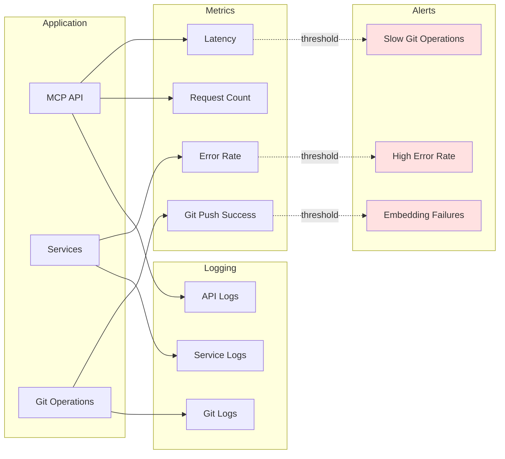
```mermaid
graph LR
    subgraph Application
        API[MCP API]
        Service[Services]
        Git[Git Operations]
    end

    subgraph Logging
        Log1[API Logs]
        Log2[Service Logs]
        Log3[Git Logs]
    end

    subgraph Metrics
        M1[Request Count]
        M2[Latency]
        M3[Error Rate]
        M4[Git Push Success]
    end

    subgraph Alerts
        A1[High Error Rate]
        A2[Slow Git Operations]
        A3[Embedding Failures]
    end

    API --> Log1
    Service --> Log2
    Git --> Log3

    API --> M1
    API --> M2
    Service --> M3
    Git --> M4

    M3 -.->|threshold| A1
    M2 -.->|threshold| A2
    M4 -.->|threshold| A3

    style A1 fill:#ffe1e1
    style A2 fill:#ffe1e1
    style A3 fill:#ffe1e1
```

---

## 요약

Phase 5는 다음 주요 사용자 플로우를 지원합니다:

| # | 시나리오 | 주요 Tool | 비용 | 설명 |
|---|----------|-----------|------|------|
| 1 | 문서 검색 (하이브리드) | `search_documents` (hybrid) | 💰 | Hybrid 검색으로 관련 문서 탐색 |
| 1.5 | **키워드 검색** | `search_documents` (keyword) | **$0** | 벡터 미사용, 비용 없음 |
| 2 | 문서 수정 및 커밋 | `update_document` | - | LLM이 문서를 수정하고 Git에 커밋 |
| 3 | Git Push | `push_to_remote` | - | 로컬 커밋을 원격 레포지토리에 푸시 |
| 4 | 버전 비교 | `list_document_versions`, `diff_document` | - | 문서 변경 이력 확인 |
| 5 | **새 문서 생성** | `create_document` | - | 새로운 문서 파일 생성 및 커밋 |
| 6 | 멀티 스텝 작업 | 여러 Tool 조합 | - | 복잡한 워크플로우 |

### 비용 최적화 가이드

| 사용 사례 | 권장 모드 | 비용 |
|-----------|----------|------|
| 파일명/경로 검색 | `keyword` | **$0** |
| 정확한 키워드 매칭 | `keyword` | **$0** |
| 의미 기반 검색 | `semantic` | 임베딩 비용 |
| 최고 정확도 필요 | `hybrid` | 임베딩 비용 |

### MCP Transport 지원

- **HTTP Streamable**: POST + JSON-RPC (기본)
- **SSE**: 스트리밍 응답 (실시간 피드백)
- **STDIO**: CLI 도구 전용

### 동시성 처리

- **Optimistic Locking**: ETag 기반 충돌 감지
- **412 Precondition Failed**: 충돌 시 에러 반환
- **자동 병합 / 수동 해결**: 충돌 해결 옵션 제공

모든 시나리오는 MCP(Model Context Protocol)를 통해 표준화되어 있으며, Playground UI에서 직관적으로 사용할 수 있습니다.