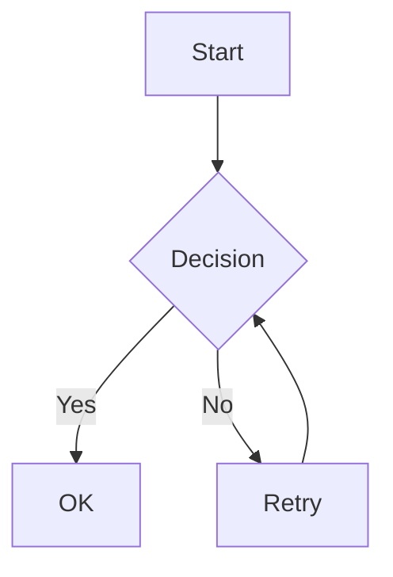

# Phase 7: Document Rendering UI Enhancement

> **작성일**: 2026-01-09
> **전제 조건**: Phase 6 완료 (LLM 통합, Playground)
> **목표**: 문서 렌더링 페이지 고도화 - Frontmatter, Syntax Highlighting, LaTeX, Mermaid 지원

---

## 개요

문서 상세 페이지(`/documents/[id]`)의 Markdown 렌더링을 고도화하여, 기술 문서 작성에 필요한 다양한 포맷을 지원합니다.

### 현재 상태 (Phase 6)
- **MarkdownViewer**: `react-markdown` + `remark-gfm` 기본 렌더링
- **Syntax Highlighting**: 미지원 (`rehype-highlight` 설치되어 있으나 미사용)
- **YAML Frontmatter**: 미지원
- **LaTeX 수식**: 미지원
- **Mermaid 다이어그램**: 미지원

### Phase 7 목표
- **YAML Frontmatter**: 문서 메타데이터 파싱 및 카드 UI 표시
- **Syntax Highlighting**: Java, Python, JS, TypeScript, Dart 등 코드 하이라이팅
- **Copy Button**: 코드 블록 복사 기능
- **LaTeX Rendering**: 인라인/블록 수식 렌더링
- **Mermaid Diagrams**: 플로우차트, 시퀀스 다이어그램 등 시각화

---

## 기능 상세

### 1. YAML Frontmatter Support

문서 상단의 YAML 메타데이터를 파싱하여 카드 UI로 표시합니다.

```yaml
---
title: API Documentation
author: John Doe
date: 2024-01-15
tags: [api, rest, guide]
description: REST API 가이드 문서
---
```

**표시 항목**:
- Title, Author, Date
- Description
- Tags (Badge 컴포넌트)
- 커스텀 필드 지원

### 2. Code Block Syntax Highlighting

지원 언어:

| Language | Extension |
|----------|-----------|
| Java | `.java` |
| Python | `.py` |
| JavaScript | `.js` |
| TypeScript | `.ts`, `.tsx` |
| Dart | `.dart` |
| JSON | `.json` |
| YAML | `.yaml`, `.yml` |
| Bash/Shell | `.sh` |
| SQL | `.sql` |
| HTML/CSS | `.html`, `.css` |

**기능**:
- 언어 자동 감지 및 라벨 표시
- Copy-to-clipboard 버튼
- Dark/Light 테마 지원

### 3. LaTeX/Math Rendering

KaTeX 기반 수식 렌더링:

- **인라인 수식**: `$E = mc^2$`
- **블록 수식**:
  ```latex
  $$
  \int_0^\infty e^{-x^2} dx = \frac{\sqrt{\pi}}{2}
  $$
  ```

### 4. Mermaid Diagram Rendering

지원 다이어그램:
- Flowchart
- Sequence Diagram
- Class Diagram
- State Diagram
- ER Diagram
- Gantt Chart



---

## 아키텍처

### 컴포넌트 구조

```
frontend/components/
├── markdown-viewer.tsx              # 메인 컴포넌트 (리팩토링)
└── markdown/                         # 신규 서브 컴포넌트
    ├── index.ts                      # Barrel export
    ├── frontmatter-card.tsx          # YAML 메타데이터 카드
    ├── code-block.tsx                # Syntax Highlighting + Copy
    └── mermaid-diagram.tsx           # Mermaid 다이어그램 (Lazy Load)
```

### 플러그인 체인

```
Markdown Content
    │
    ▼
gray-matter (YAML Frontmatter 분리)
    │
    ▼
react-markdown
    │
    ├── remarkPlugins
    │   ├── remark-gfm (GFM 지원)
    │   └── remark-math (수식 파싱)
    │
    └── rehypePlugins
        ├── rehype-highlight (Syntax Highlighting)
        └── rehype-katex (수식 렌더링)
    │
    ▼
Custom Components
    ├── FrontmatterCard
    ├── CodeBlock (+ Copy Button)
    └── MermaidDiagram (Lazy Loaded)
```

---

## 의존성

### 신규 설치

```bash
npm install gray-matter remark-math rehype-katex katex mermaid
npm install -D @types/katex
```

| Package | Version | Purpose |
|---------|---------|---------|
| `gray-matter` | ^4.0.3 | YAML frontmatter 파싱 |
| `remark-math` | ^6.0.0 | 수식 구문 파싱 |
| `rehype-katex` | ^7.0.1 | KaTeX 렌더링 |
| `katex` | ^0.16.x | 수식 렌더링 엔진 |
| `mermaid` | ^11.x | 다이어그램 렌더링 |

### 기존 활용 (미사용 → 활성화)

| Package | Status |
|---------|--------|
| `rehype-highlight@7.0.2` | 설치됨, 활성화 필요 |

---

## 파일 변경 목록

### 수정 파일

| File | Changes |
|------|---------|
| `frontend/package.json` | 의존성 추가 |
| `frontend/components/markdown-viewer.tsx` | 플러그인 통합, 컴포넌트 연동 |
| `frontend/app/globals.css` | highlight.js, KaTeX 스타일 추가 |

### 신규 파일

| File | Description |
|------|-------------|
| `frontend/components/markdown/index.ts` | Barrel export |
| `frontend/components/markdown/frontmatter-card.tsx` | YAML 메타데이터 카드 |
| `frontend/components/markdown/code-block.tsx` | 코드 블록 + Copy 버튼 |
| `frontend/components/markdown/mermaid-diagram.tsx` | Mermaid 다이어그램 |

---

## 기술적 고려사항

### SSR Compatibility
- **Mermaid**: `'use client'` + dynamic import 필수
- **KaTeX**: Server-safe, CSS import만 필요
- **gray-matter**: Node.js 호환, SSR 가능

### Performance
- **Mermaid Lazy Loading**: Dynamic import로 초기 번들에서 제외 (~300KB)
- **컴포넌트 분리**: Tree-shaking 지원

### Dark Mode
- **Syntax Highlighting**: CSS 변수 기반 테마
- **KaTeX**: `dark:` 클래스로 색상 조정
- **Mermaid**: `MutationObserver`로 테마 변경 감지, 다이어그램 재렌더링

### Mobile Responsiveness
- 코드 블록: `overflow-x-auto` 수평 스크롤
- 수식: 긴 수식 `overflow-x-auto` 처리
- 다이어그램: 중앙 정렬, 최대 너비 제한

---

## 세부 계획 문서

- [Frontend 구현 계획](./frontend-plan.md) - 컴포넌트 상세 구현

---

## 검증 계획

### 테스트 케이스

1. **Frontmatter**: YAML 헤더 문서에서 카드 표시 확인
2. **Code Blocks**: Java, Python, JS, Dart 하이라이팅 확인
3. **Copy Button**: 코드 복사 기능 동작 확인
4. **LaTeX**: 인라인/블록 수식 렌더링 확인
5. **Mermaid**: 다양한 다이어그램 타입 렌더링 확인
6. **Dark Mode**: 모든 기능 다크 모드 전환 확인

### 테스트 문서

```markdown
---
title: Test Document
author: Tester
tags: [test, markdown]
---

# Code Block Test
\`\`\`java
public class Hello {
    public static void main(String[] args) {
        System.out.println("Hello!");
    }
}
\`\`\`

# Math Test
Inline: $E = mc^2$

Block:
$$\int_0^\infty e^{-x^2} dx = \frac{\sqrt{\pi}}{2}$$

# Diagram Test
\`\`\`mermaid
flowchart TD
    A[Start] --> B{Decision}
    B -->|Yes| C[OK]
    B -->|No| D[Retry]
\`\`\`
```

### 실행 방법

```bash
cd frontend
npm install
npm run dev
# http://localhost:3000/ko/documents/{docId} 접속
```

---

## 다음 단계

Phase 7 완료 후:
- **Phase 8**: Multi-tenant 지원, 팀 협업
- **Phase 9**: Advanced RAG (Hybrid Search 고도화, Re-ranking)
- **Phase 10**: 모니터링 & 분석 (사용 패턴, 비용 분석)
