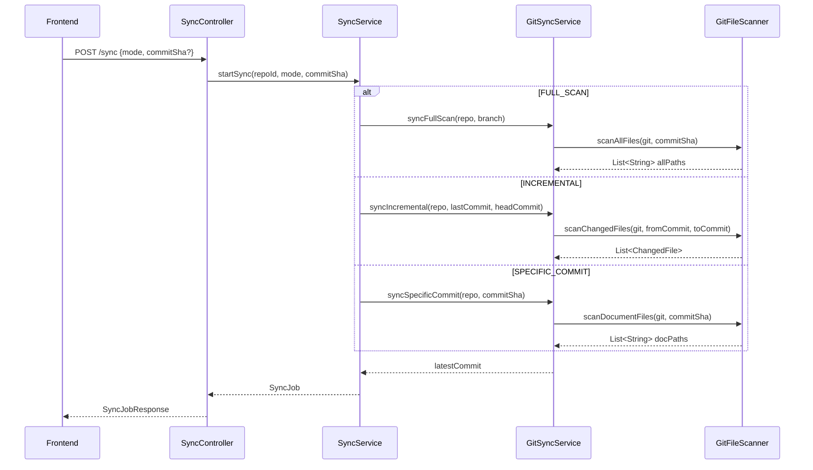
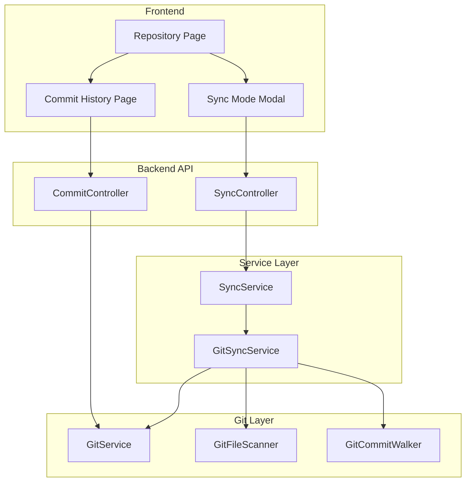
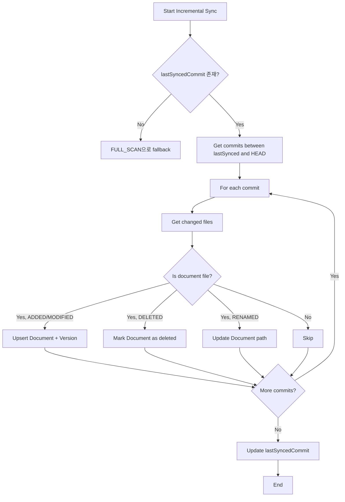

# Sync Mode Enhancement - 동기화 모드 확장

> **목표**: 다양한 동기화 모드를 제공하여 문서 인덱싱 유연성 확보

---

## 배경

현재 동기화 로직은 **최신 커밋의 파일 트리**만 스캔합니다. 이로 인해:
- 문서가 존재해도 패턴에 맞지 않으면 누락
- 과거 커밋의 문서 변경 이력을 추적하지 못함
- 증분 동기화(incremental sync)가 불가능

---

## 요구사항

### 동기화 모드

| 모드 | 설명 | 사용 시나리오 |
|------|------|---------------|
| `FULL_SCAN` | 전체 파일 트리 재귀 탐색 | 초기 동기화, 패턴 변경 후 재스캔 |
| `INCREMENTAL` | 마지막 동기화 이후 변경된 커밋만 처리 | 정기 동기화, Webhook 트리거 |
| `SPECIFIC_COMMIT` | 특정 커밋에서 문서 추출 | 특정 버전 복원, 디버깅 |

### 커밋 히스토리 UI

- 레포지토리별 커밋 목록 조회
- 커밋별 변경된 파일 목록
- 특정 커밋에서 동기화 실행

---

## 아키텍처

### 전체 흐름



### 컴포넌트 구조



---

## 상세 설계

### 1. API 변경

#### 1.1 Sync Request 확장

```java
// ApiModels.java
public record SyncRequest(
    String branch,
    SyncMode mode,           // FULL_SCAN, INCREMENTAL, SPECIFIC_COMMIT
    String targetCommitSha   // SPECIFIC_COMMIT 모드에서 사용
) {}

public enum SyncMode {
    FULL_SCAN,       // 전체 파일 트리 스캔
    INCREMENTAL,     // 마지막 동기화 이후 변경분만
    SPECIFIC_COMMIT  // 특정 커밋 기준
}
```

#### 1.2 Commit History API

```java
// CommitController.java (신규)
@RestController
@RequestMapping("/api/repositories/{repoId}/commits")
public class CommitController {

    // 커밋 목록 조회 (페이징)
    @GetMapping
    public Page<CommitResponse> listCommits(
        @PathVariable UUID repoId,
        @RequestParam(defaultValue = "0") int page,
        @RequestParam(defaultValue = "20") int size,
        @RequestParam(required = false) String branch
    );

    // 특정 커밋 상세 (변경된 파일 목록 포함)
    @GetMapping("/{commitSha}")
    public CommitDetailResponse getCommit(
        @PathVariable UUID repoId,
        @PathVariable String commitSha
    );

    // 커밋 간 diff 파일 목록
    @GetMapping("/diff")
    public List<ChangedFileResponse> getCommitDiff(
        @PathVariable UUID repoId,
        @RequestParam String from,
        @RequestParam String to
    );
}
```

#### 1.3 Response Models

```java
public record CommitResponse(
    String sha,
    String shortSha,
    String message,
    String authorName,
    String authorEmail,
    Instant committedAt,
    int changedFilesCount
) {}

public record CommitDetailResponse(
    String sha,
    String message,
    String authorName,
    String authorEmail,
    Instant committedAt,
    List<ChangedFileResponse> changedFiles
) {}

public record ChangedFileResponse(
    String path,
    ChangeType changeType,  // ADDED, MODIFIED, DELETED, RENAMED
    boolean isDocument      // 문서 패턴에 매칭되는지
) {}
```

---

### 2. Backend 구현

#### 2.1 GitCommitWalker (신규)

```java
// git/GitCommitWalker.java
@Component
public class GitCommitWalker {

    /**
     * 커밋 목록을 조회한다.
     */
    public List<CommitInfo> listCommits(Git git, String branch, int skip, int limit);

    /**
     * 특정 커밋의 변경된 파일 목록을 조회한다.
     */
    public List<ChangedFile> getChangedFiles(Git git, String commitSha);

    /**
     * 두 커밋 간 변경된 파일 목록을 조회한다.
     */
    public List<ChangedFile> getChangedFilesBetween(Git git, String fromSha, String toSha);

    /**
     * fromSha ~ toSha 사이의 모든 커밋을 순회한다.
     */
    public List<CommitInfo> walkCommits(Git git, String fromSha, String toSha);
}

public record ChangedFile(
    String path,
    ChangeType changeType,
    String oldPath  // RENAMED인 경우
) {}

public enum ChangeType {
    ADDED, MODIFIED, DELETED, RENAMED
}
```

#### 2.2 GitFileScanner 확장

```java
// git/GitFileScanner.java
@Component
public class GitFileScanner {

    // 기존 메서드 유지
    public List<String> scanDocumentFiles(Git git, String commitSha);

    /**
     * 전체 파일을 재귀적으로 스캔한다 (모든 파일, 패턴 무관).
     * 이후 isDocumentFile()로 필터링 가능.
     */
    public List<String> scanAllFiles(Git git, String commitSha);

    /**
     * 변경된 파일 중 문서 파일만 필터링한다.
     */
    public List<ChangedFile> filterDocumentFiles(List<ChangedFile> changedFiles);
}
```

#### 2.3 GitSyncService 모드별 처리

```java
// service/GitSyncService.java
@Service
public class GitSyncService {

    /**
     * 동기화 모드에 따라 적절한 메서드를 호출한다.
     */
    @Transactional
    public String syncRepository(UUID jobId, UUID repositoryId, String branch,
                                  SyncMode mode, String targetCommitSha) {
        return switch (mode) {
            case FULL_SCAN -> syncFullScan(jobId, repositoryId, branch);
            case INCREMENTAL -> syncIncremental(jobId, repositoryId, branch);
            case SPECIFIC_COMMIT -> syncSpecificCommit(jobId, repositoryId, targetCommitSha);
        };
    }

    /**
     * 전체 스캔: 최신 커밋의 모든 문서 파일을 스캔한다.
     */
    private String syncFullScan(UUID jobId, UUID repositoryId, String branch);

    /**
     * 증분 동기화: 마지막 동기화 커밋 이후 변경된 파일만 처리한다.
     */
    private String syncIncremental(UUID jobId, UUID repositoryId, String branch);

    /**
     * 특정 커밋: 지정된 커밋에서 문서를 추출한다.
     */
    private String syncSpecificCommit(UUID jobId, UUID repositoryId, String commitSha);
}
```

#### 2.4 Incremental Sync 로직



---

### 3. Frontend 구현

#### 3.1 라우팅 구조

```
frontend/app/
└── projects/
    └── [projectId]/
        └── repositories/
            └── [repoId]/
                ├── page.tsx              # 레포 상세 (기존)
                ├── commits/
                │   └── page.tsx          # 커밋 히스토리 (신규)
                └── documents/
                    └── page.tsx          # 문서 목록 (기존)
```

#### 3.2 Commit History Page

```tsx
// commits/page.tsx
export default function CommitsPage() {
  const { repoId } = useParams();
  const { data: commits, isLoading } = useCommits(repoId);

  return (
    <div>
      <h1>Commit History</h1>
      <CommitList commits={commits} />
    </div>
  );
}

// components/CommitList.tsx
function CommitList({ commits }) {
  return (
    <div className="space-y-2">
      {commits.map((commit) => (
        <CommitCard
          key={commit.sha}
          commit={commit}
          onSyncClick={() => handleSyncFromCommit(commit.sha)}
        />
      ))}
    </div>
  );
}
```

#### 3.3 Sync Mode Modal

```tsx
// components/SyncModeModal.tsx
function SyncModeModal({ repoId, onClose }) {
  const [mode, setMode] = useState<SyncMode>('FULL_SCAN');
  const [targetCommit, setTargetCommit] = useState<string | null>(null);
  const { startSync } = useSync(repoId);

  const handleSync = () => {
    startSync({ mode, targetCommitSha: targetCommit });
    onClose();
  };

  return (
    <Dialog>
      <DialogHeader>
        <DialogTitle>Sync Options</DialogTitle>
      </DialogHeader>
      <DialogContent>
        <RadioGroup value={mode} onValueChange={setMode}>
          <RadioGroupItem value="FULL_SCAN">
            <Label>Full Scan</Label>
            <Description>전체 파일 트리를 스캔합니다</Description>
          </RadioGroupItem>
          <RadioGroupItem value="INCREMENTAL">
            <Label>Incremental</Label>
            <Description>마지막 동기화 이후 변경분만 처리합니다</Description>
          </RadioGroupItem>
          <RadioGroupItem value="SPECIFIC_COMMIT">
            <Label>Specific Commit</Label>
            <Description>특정 커밋 기준으로 동기화합니다</Description>
          </RadioGroupItem>
        </RadioGroup>

        {mode === 'SPECIFIC_COMMIT' && (
          <CommitSelector
            repoId={repoId}
            onSelect={setTargetCommit}
          />
        )}
      </DialogContent>
      <DialogFooter>
        <Button onClick={handleSync}>Start Sync</Button>
      </DialogFooter>
    </Dialog>
  );
}
```

#### 3.4 UI Mockup

```
┌─────────────────────────────────────────────────────────────┐
│  Repository: NtoZero/quroup_v2_plan                         │
│  Branch: main                                               │
├─────────────────────────────────────────────────────────────┤
│  [Sync ▼]  [Documents]  [Commits]                           │
│   ├─ Full Scan                                              │
│   ├─ Incremental (since abc1234)                            │
│   └─ From Specific Commit...                                │
└─────────────────────────────────────────────────────────────┘

┌─────────────────────────────────────────────────────────────┐
│  Commit History                                             │
├─────────────────────────────────────────────────────────────┤
│  ● abc1234  Add documentation for API endpoints    2h ago   │
│             @john.doe  +3 -1 files                [Sync]    │
│  ─────────────────────────────────────────────────────────  │
│  ○ def5678  Update README                         1d ago    │
│             @jane.doe  +1 -0 files                [Sync]    │
│  ─────────────────────────────────────────────────────────  │
│  ○ 789ghij  Initial commit                        3d ago    │
│             @john.doe  +10 -0 files               [Sync]    │
└─────────────────────────────────────────────────────────────┘
```

---

### 4. 데이터베이스 변경

#### 4.1 dm_sync_job 테이블 확장

```sql
-- V4__add_sync_mode.sql
ALTER TABLE dm_sync_job
ADD COLUMN sync_mode VARCHAR(20) DEFAULT 'FULL_SCAN',
ADD COLUMN target_commit_sha VARCHAR(64);

COMMENT ON COLUMN dm_sync_job.sync_mode IS 'FULL_SCAN, INCREMENTAL, SPECIFIC_COMMIT';
COMMENT ON COLUMN dm_sync_job.target_commit_sha IS 'SPECIFIC_COMMIT 모드에서 대상 커밋';
```

---

## 구현 순서

### Phase 1: Backend Core (1단계)

1. **GitCommitWalker** 구현
   - `listCommits()`: 커밋 목록 조회
   - `getChangedFiles()`: 커밋별 변경 파일
   - `getChangedFilesBetween()`: 커밋 간 diff

2. **GitFileScanner** 확장
   - `scanAllFiles()`: 전체 파일 스캔
   - `filterDocumentFiles()`: 문서 파일 필터링

3. **Commit API** 구현
   - `GET /api/repositories/{id}/commits`
   - `GET /api/repositories/{id}/commits/{sha}`

### Phase 2: Sync Modes (2단계)

4. **SyncMode enum** 및 **SyncRequest** 확장

5. **GitSyncService** 모드별 로직
   - `syncFullScan()`: 기존 로직 리팩토링
   - `syncIncremental()`: 증분 동기화 구현
   - `syncSpecificCommit()`: 특정 커밋 동기화

6. **DB Migration**: `V4__add_sync_mode.sql`

### Phase 3: Frontend (3단계)

7. **API Hooks** 추가
   - `useCommits()`: 커밋 목록
   - `useCommitDetail()`: 커밋 상세

8. **Commit History Page** 구현

9. **Sync Mode Modal** 구현

10. **Repository Page** 연동

---

## 완료 기준

### 기능

- [ ] Full Scan 모드로 전체 문서 동기화 가능
- [ ] Incremental 모드로 변경분만 동기화 가능
- [ ] 특정 커밋 지정하여 동기화 가능
- [ ] 커밋 히스토리 목록 조회 가능
- [ ] 커밋별 변경 파일 목록 확인 가능

### 비기능

- [ ] 1000개 커밋 히스토리 조회 시 < 2초
- [ ] Incremental 동기화가 Full Scan 대비 50% 이상 빠름
- [ ] UI에서 동기화 모드 선택 직관적

---

## 관련 파일

### 신규 생성

| 파일 | 설명 |
|------|------|
| `backend/.../git/GitCommitWalker.java` | 커밋 순회 로직 |
| `backend/.../api/CommitController.java` | 커밋 API |
| `backend/.../resources/db/migration/V4__add_sync_mode.sql` | DB 스키마 |
| `frontend/app/.../commits/page.tsx` | 커밋 히스토리 페이지 |
| `frontend/components/SyncModeModal.tsx` | 동기화 모드 선택 |
| `frontend/components/CommitList.tsx` | 커밋 목록 |

### 수정

| 파일 | 변경 내용 |
|------|-----------|
| `ApiModels.java` | SyncRequest 확장, SyncMode enum |
| `GitFileScanner.java` | scanAllFiles() 추가 |
| `GitSyncService.java` | 모드별 동기화 로직 |
| `SyncService.java` | 모드 파라미터 전달 |
| `SyncController.java` | 모드 파라미터 수용 |
| `frontend/lib/types.ts` | SyncMode, CommitResponse 타입 |
| `frontend/hooks/use-api.ts` | useCommits 훅 |
