# 엔티티 정규화(Entity Resolution)와 온톨로지 매핑(Ontology Mapping)

> **목적**: 지식 그래프 구축 파이프라인에서 핵심 단계인 엔티티 정규화와 온톨로지 매핑의 개념 및 구현 방법 정리

---

## 목차

1. [개요](#1-개요)
2. [엔티티 정규화 (Entity Resolution)](#2-엔티티-정규화-entity-resolution)
3. [온톨로지 매핑 (Ontology Mapping)](#3-온톨로지-매핑-ontology-mapping)
4. [파이프라인에서의 위치와 순서](#4-파이프라인에서의-위치와-순서)
5. [구현 시 고려사항](#5-구현-시-고려사항)

---

## 1. 개요

### 1.1 지식 그래프 구축 파이프라인에서의 위치

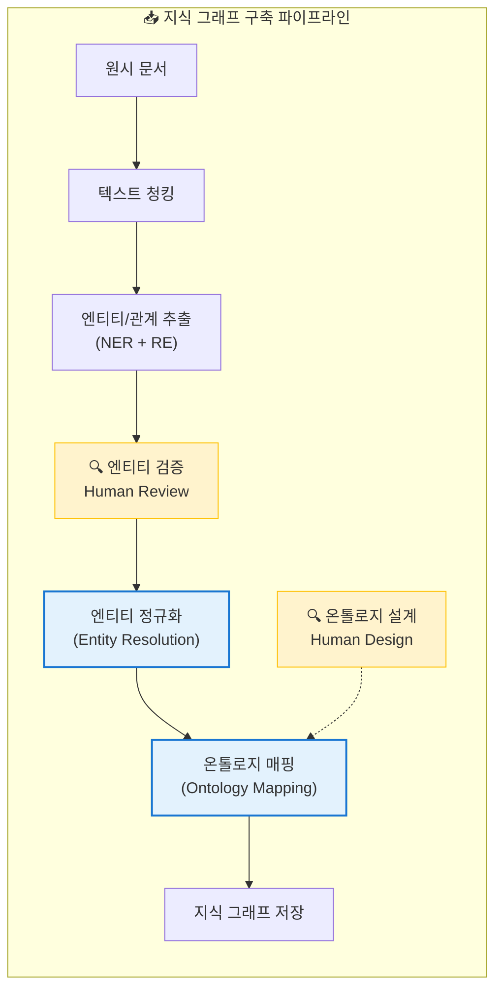

### 1.2 두 개념의 핵심 차이

| 구분 | 엔티티 정규화 | 온톨로지 매핑 |
|------|---------------|---------------|
| **핵심 질문** | "이것들이 같은 대상인가?" | "이 엔티티는 어떤 타입인가?" |
| **목적** | 중복 제거, 대표명 통합 | 타입/관계 체계에 연결 |
| **입력** | 추출된 엔티티 목록 | 정규화된 엔티티 |
| **출력** | 통합된 고유 엔티티 | 타입이 지정된 엔티티 |
| **의존성** | 없음 | 온톨로지 스키마 필요 |

---

## 2. 엔티티 정규화 (Entity Resolution)

### 2.1 정의

**"같은 대상을 가리키는 다양한 표현을 하나의 대표 엔티티로 통합하는 과정"**

Entity Resolution은 다음과 같은 용어로도 불린다:
- **Entity Matching**: 엔티티 매칭
- **Record Linkage**: 레코드 연결
- **Deduplication**: 중복 제거
- **Coreference Resolution**: 상호참조 해결

### 2.2 문제 상황

NER(Named Entity Recognition)로 추출하면 동일한 엔티티가 여러 형태로 나타난다:

```
┌─────────────────────────────────────────────────────────────┐
│  문서에서 추출된 엔티티들 (같은 회사를 지칭)                    │
├─────────────────────────────────────────────────────────────┤
│  • "삼성전자"           (한글 정식 명칭)                      │
│  • "Samsung Electronics" (영문 명칭)                        │
│  • "삼성"               (약칭)                              │
│  • "SEC"                (영문 약어)                         │
│  • "삼성전자(주)"        (법인 표기)                         │
│  • "samsung"            (소문자)                            │
└─────────────────────────────────────────────────────────────┘
```

**문제점**: 이대로 지식 그래프에 저장하면 같은 회사가 6개의 다른 노드로 생성됨

### 2.3 정규화 프로세스

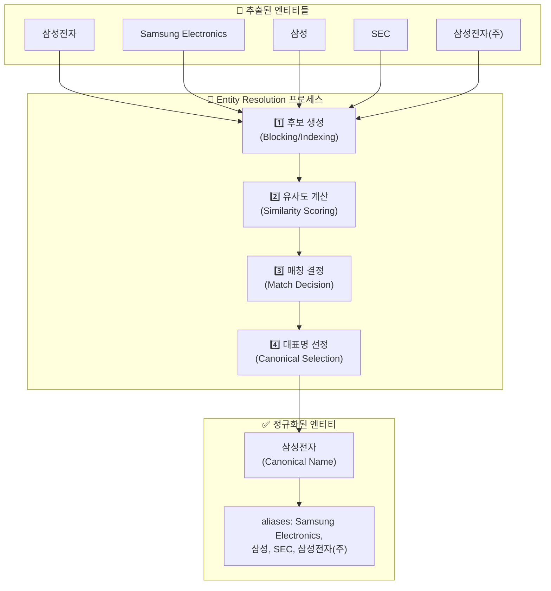

### 2.4 주요 기법

#### 2.4.1 문자열 기반 유사도

| 기법 | 설명 | 적용 예시 |
|------|------|-----------|
| **편집 거리 (Levenshtein)** | 한 문자열을 다른 문자열로 변환하는 최소 연산 수 | "삼성전자" ↔ "삼성 전자" (거리: 1) |
| **자카드 유사도** | 두 집합의 교집합/합집합 비율 | 토큰 집합 비교 |
| **N-gram 유사도** | 연속된 N개 문자 단위 비교 | "삼성" → {삼성} |
| **음성 유사도 (Soundex)** | 발음 기반 비교 | 영문 이름 변형 처리 |

```python
# 예시: 편집 거리 계산
from Levenshtein import distance

distance("삼성전자", "삼성 전자")  # 결과: 1
distance("Samsung", "Samseong")    # 결과: 2
```

#### 2.4.2 별칭 사전 (Alias Dictionary)

미리 정의된 동의어/약어 매핑 테이블 활용:

```json
{
  "삼성전자": {
    "canonical": "삼성전자",
    "aliases": [
      "Samsung Electronics",
      "Samsung Electronics Co., Ltd.",
      "SEC",
      "삼성",
      "삼성전자(주)",
      "005930"
    ],
    "type": "Organization"
  }
}
```

#### 2.4.3 임베딩 기반 유사도

벡터 공간에서 의미적 유사성 비교:

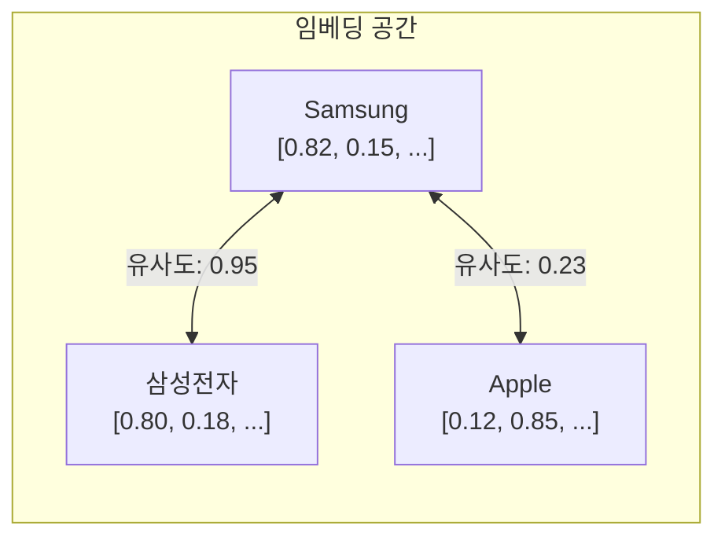

```python
# 예시: 임베딩 유사도
from sentence_transformers import SentenceTransformer

model = SentenceTransformer('sentence-transformers/paraphrase-multilingual-MiniLM-L12-v2')

emb1 = model.encode("Samsung Electronics")
emb2 = model.encode("삼성전자")
emb3 = model.encode("Apple Inc")

# 코사인 유사도 계산
similarity_1_2 = cosine_similarity(emb1, emb2)  # 높음 (~0.85)
similarity_1_3 = cosine_similarity(emb1, emb3)  # 낮음 (~0.30)
```

#### 2.4.4 LLM 기반 판단

문맥을 고려한 엔티티 동일성 판단:

```
프롬프트 예시:
"다음 두 엔티티가 같은 대상을 가리키는지 판단하세요.

엔티티 1: "애플" (문맥: "애플이 새로운 아이폰을 발표했다")
엔티티 2: "Apple Inc" (문맥: "Apple Inc reported quarterly earnings")

같은 대상인가요? (예/아니오)
이유:"
```

### 2.5 Entity Resolution 전략 비교

| 전략 | 장점 | 단점 | 적합 상황 |
|------|------|------|-----------|
| **규칙 기반** | 빠름, 예측 가능 | 유연성 부족 | 정형화된 도메인 |
| **ML 기반** | 패턴 학습 가능 | 학습 데이터 필요 | 대량 데이터 |
| **임베딩 기반** | 의미적 유사성 포착 | 계산 비용 | 다국어, 변형 많음 |
| **LLM 기반** | 문맥 이해, 유연함 | 비용, 속도 | 복잡한 케이스 |
| **하이브리드** | 균형점 | 구현 복잡 | 실무 환경 |

---

## 3. 온톨로지 매핑 (Ontology Mapping)

### 3.1 정의

**"정규화된 엔티티를 미리 정의된 온톨로지(개념 체계)의 클래스와 관계에 연결하는 과정"**

### 3.2 온톨로지란?

온톨로지는 특정 도메인의 **개념(클래스), 속성, 관계를 형식적으로 정의한 체계**이다.

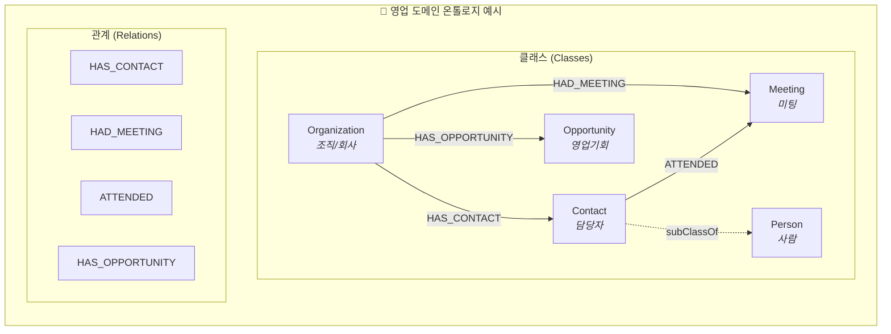

### 3.3 매핑 프로세스

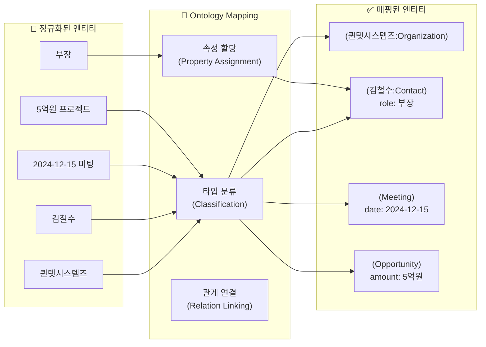

### 3.4 매핑 상세 예시

**입력 텍스트:**
```
"김철수 부장이 퀸텟시스템즈와 5억원 규모의 클라우드 마이그레이션 
프로젝트 관련 미팅을 2024년 12월 15일에 진행했다."
```

**NER + RE 추출 결과:**
```
엔티티:
- 김철수 (PERSON)
- 부장 (ROLE)
- 퀸텟시스템즈 (ORGANIZATION)
- 5억원 (MONEY)
- 클라우드 마이그레이션 (PROJECT)
- 2024년 12월 15일 (DATE)

관계:
- (김철수, HAS_ROLE, 부장)
- (김철수, MET_WITH, 퀸텟시스템즈)
- (미팅, HAS_VALUE, 5억원)
- (미팅, OCCURRED_ON, 2024-12-15)
```

**온톨로지 매핑 결과:**

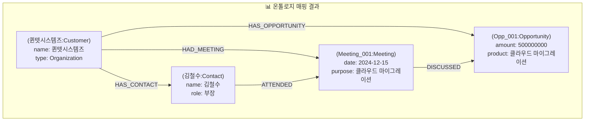

### 3.5 매핑 규칙 정의

#### 3.5.1 타입 매핑 규칙

```yaml
# 엔티티 타입 → 온톨로지 클래스 매핑
type_mapping:
  PERSON:
    default: Person
    with_role: Contact  # role 속성이 있으면 Contact로
  
  ORGANIZATION:
    rules:
      - condition: "is_customer == true"
        class: Customer
      - condition: "is_partner == true"
        class: Partner
      - default: Organization
  
  MONEY:
    class: null  # 독립 노드가 아닌 속성으로 처리
    property_of: Opportunity.amount
  
  DATE:
    class: null
    property_of: Meeting.date | Contract.signDate
```

#### 3.5.2 관계 매핑 규칙

```yaml
# 추출된 관계 → 온톨로지 관계 매핑
relation_mapping:
  MET_WITH:
    maps_to: HAD_MEETING
    subject_type: Organization
    object_type: Meeting
    
  WORKS_AT:
    maps_to: HAS_CONTACT
    subject_type: Organization
    object_type: Contact
    inverse: true  # 방향 반전 필요
    
  HAS_ROLE:
    maps_to: null  # 관계가 아닌 속성으로 처리
    property: Contact.role
```

### 3.6 온톨로지 매핑 방식

| 방식 | 설명 | 장점 | 단점 |
|------|------|------|------|
| **규칙 기반** | 미리 정의된 매핑 테이블 | 정확함, 예측 가능 | 유연성 부족 |
| **분류 모델** | ML 모델로 타입 예측 | 새로운 패턴 처리 | 학습 데이터 필요 |
| **LLM 기반** | 프롬프트로 타입 판단 | 유연함, 문맥 이해 | 비용, 일관성 |
| **하이브리드** | 규칙 + LLM fallback | 균형점 | 구현 복잡 |

---

## 4. 파이프라인에서의 위치와 순서

### 4.1 처리 순서의 중요성

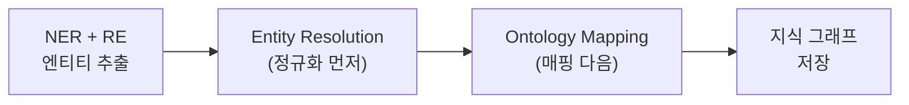

**왜 이 순서인가?**

| 순서 | 이유 |
|------|------|
| **1. 정규화 먼저** | 중복을 먼저 제거해야 같은 엔티티가 여러 노드로 생성되지 않음 |
| **2. 매핑 다음** | 통합된 엔티티에 대해 한 번만 타입을 지정하면 됨 |

### 4.2 순서가 잘못되면?

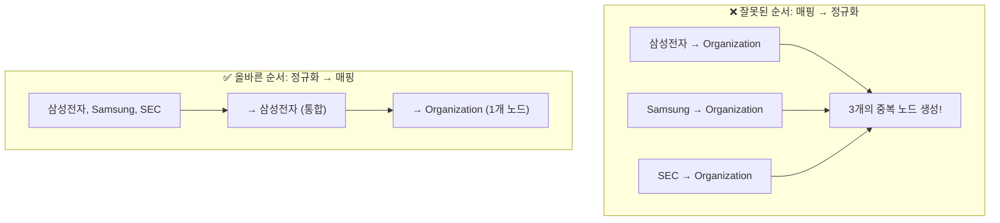

### 4.3 전체 파이프라인 상세

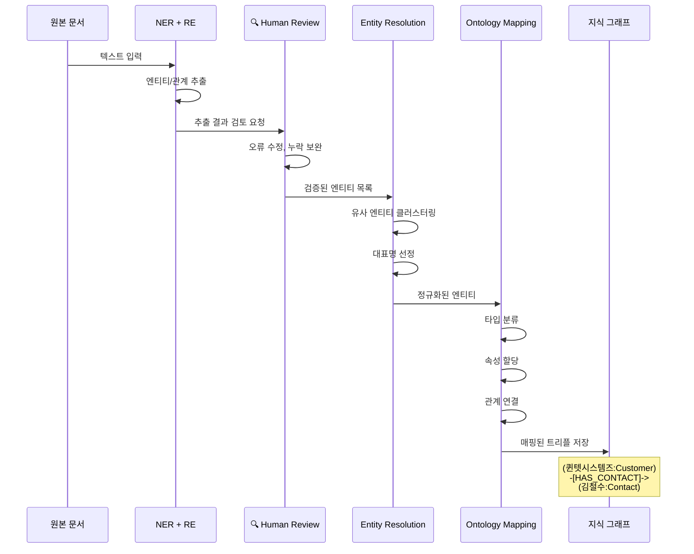

---

## 5. 구현 시 고려사항

### 5.1 Human-in-the-Loop 포인트

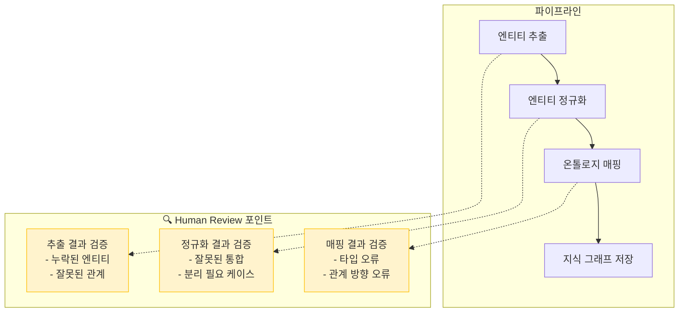

### 5.2 주요 에러 케이스

| 단계 | 에러 유형 | 예시 | 해결 방법 |
|------|-----------|------|-----------|
| **정규화** | 과도한 통합 | "애플"(회사) = "애플"(과일) | 문맥 정보 활용, 타입 힌트 |
| **정규화** | 분리 실패 | "삼성전자" ≠ "삼성생명" 미인식 | 별칭 사전 정교화 |
| **매핑** | 타입 오류 | 사람을 조직으로 분류 | 분류 규칙 강화 |
| **매핑** | 관계 방향 오류 | A→B를 B→A로 저장 | 관계 방향 규칙 명확화 |
| **매핑** | 누락된 타입 | 온톨로지에 없는 개념 | 온톨로지 확장 또는 기본 타입 |

### 5.3 품질 지표

| 지표 | 설명 | 측정 방법 |
|------|------|-----------|
| **정규화 정밀도** | 통합된 엔티티가 실제로 같은 대상인 비율 | 샘플링 검토 |
| **정규화 재현율** | 같은 대상인 엔티티 중 통합된 비율 | 샘플링 검토 |
| **매핑 정확도** | 올바른 타입으로 매핑된 비율 | Ground Truth 비교 |
| **관계 정확도** | 올바른 관계로 연결된 비율 | Ground Truth 비교 |

### 5.4 도구 및 라이브러리

| 카테고리 | 도구 | 설명 |
|----------|------|------|
| **Entity Resolution** | dedupe | Python 기반 중복 제거 |
| **Entity Resolution** | splink | Spark 기반 대규모 처리 |
| **Entity Resolution** | sentence-transformers | 임베딩 기반 유사도 |
| **Ontology** | Protégé | 온톨로지 설계 도구 |
| **Ontology** | OWL/RDF | 온톨로지 표현 언어 |
| **Knowledge Graph** | Neo4j | 그래프 DB |
| **Knowledge Graph** | LangChain/LlamaIndex | LLM 기반 추출/매핑 |

---

## 요약

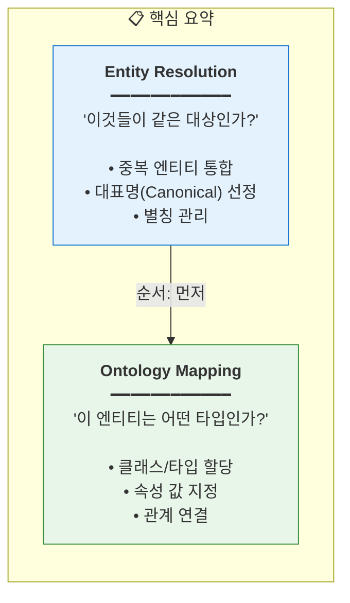

| 항목 | Entity Resolution | Ontology Mapping |
|------|-------------------|------------------|
| **질문** | "같은 대상인가?" | "어떤 타입인가?" |
| **순서** | 먼저 | 다음 |
| **입력** | 추출된 엔티티들 | 정규화된 엔티티 |
| **출력** | 통합된 고유 엔티티 | 타입이 지정된 노드/관계 |
| **필요 리소스** | 유사도 모델, 별칭 사전 | 온톨로지 스키마 |

---

> **참고**: 이 문서는 지식 그래프 구축 파이프라인의 핵심 개념을 설명하며, 실제 구현 시에는 도메인 특성에 맞게 조정이 필요합니다.
