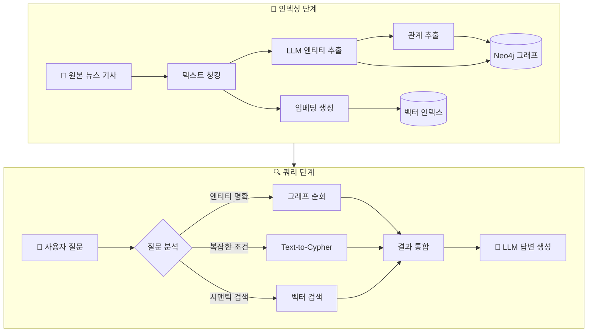
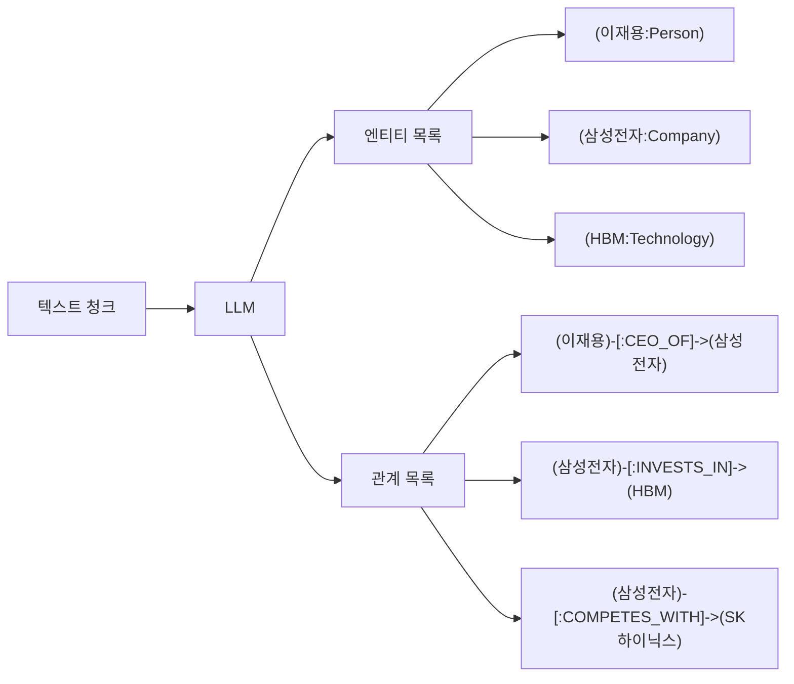
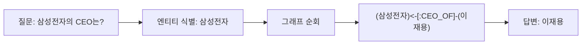
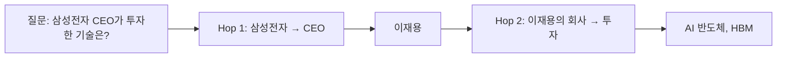
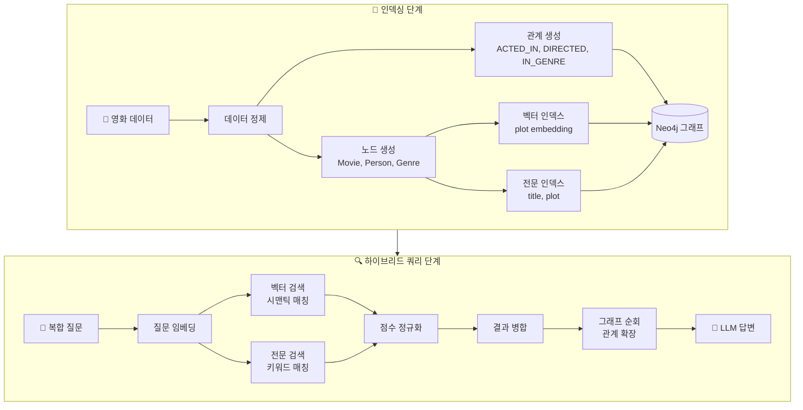
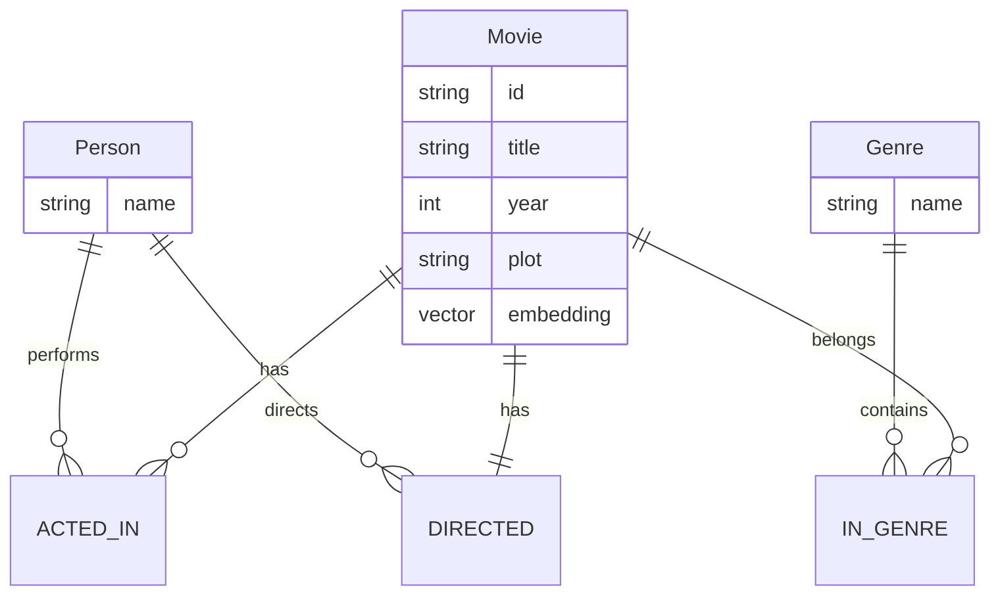
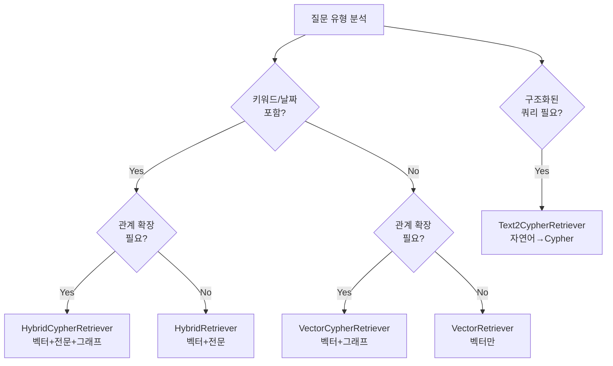
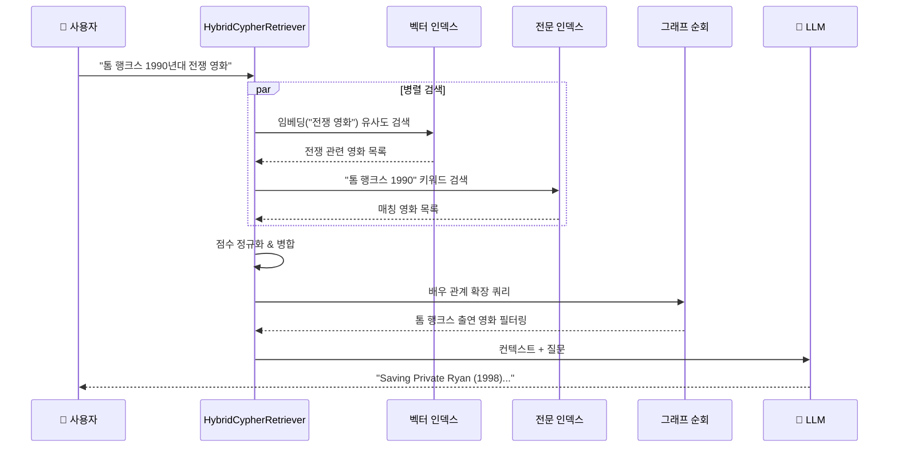
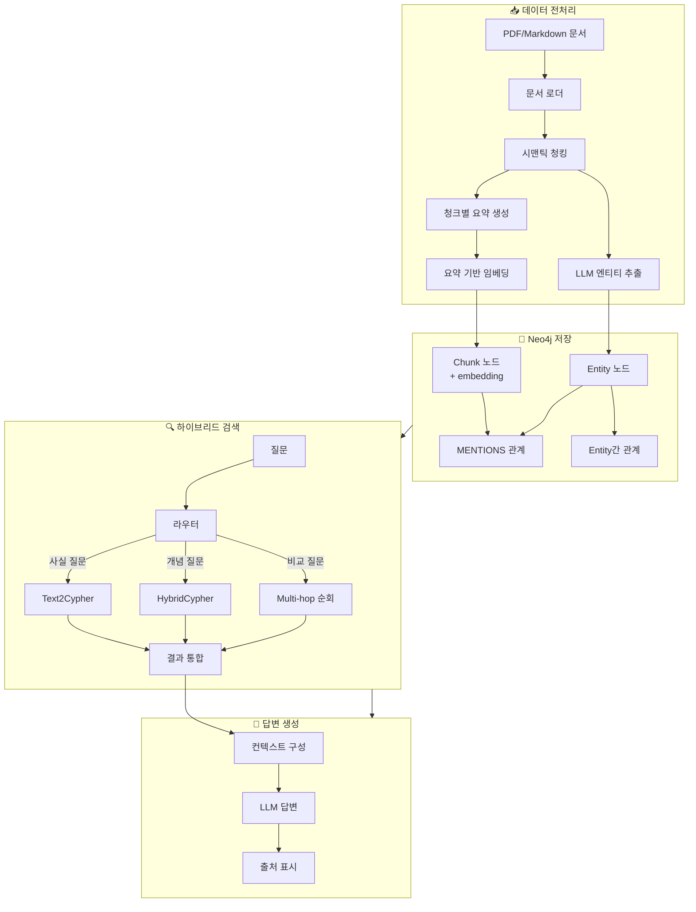
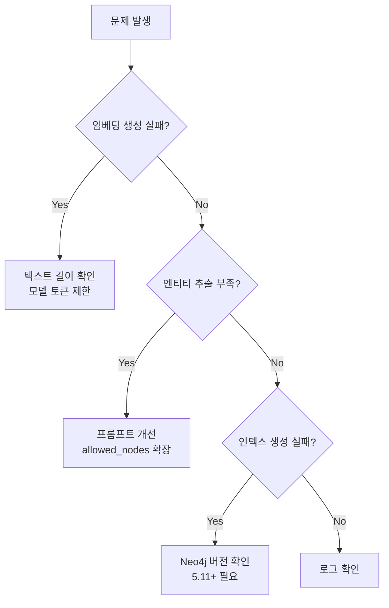

# Graph RAG 실전 시나리오 가이드

> 이 문서는 **05-graph-rag-fundamentals.md** (범용 Graph RAG)와 **06-neo4j-hybrid-rag.md** (Neo4j 하이브리드 RAG)를 기반으로 **데이터 전처리부터 쿼리까지** 전체 흐름을 실전 예제로 설명합니다.

---

## 시나리오 1: 기업 뉴스 분석 시스템 (범용 Graph RAG)

### 1.1 시나리오 개요

**목표:** 기업 뉴스를 분석하여 기업, 인물, 제품 간의 관계를 추출하고 Multi-hop 질문에 답변

**질문 예시:**
- "삼성전자 CEO가 발표한 신제품은?"
- "이재용이 투자한 기술 분야와 관련 경쟁사는?"

### 1.2 전체 흐름 (Mermaid)



### 1.3 데이터 전처리

#### Step 1: 원본 데이터 준비

```python
# 뉴스 기사 예시
raw_documents = [
    {
        "id": "news-001",
        "title": "삼성전자, AI 반도체 투자 확대 발표",
        "content": """
        삼성전자 이재용 회장은 2024년 3월 15일 서울 삼성타운에서 기자회견을 열고
        AI 반도체 분야에 10조원을 추가 투자한다고 발표했다.
        이번 투자는 NVIDIA와의 경쟁에서 우위를 점하기 위한 전략으로,
        HBM(고대역폭메모리) 생산 능력을 2배로 확대할 계획이다.
        업계에서는 SK하이닉스와의 경쟁이 더욱 치열해질 것으로 전망하고 있다.
        """,
        "date": "2024-03-15"
    },
    # ... 더 많은 문서
]
```

#### Step 2: 텍스트 청킹

```python
from langchain.text_splitter import RecursiveCharacterTextSplitter

text_splitter = RecursiveCharacterTextSplitter(
    chunk_size=500,
    chunk_overlap=50,
    separators=["\n\n", "\n", ".", " "]
)

chunks = []
for doc in raw_documents:
    doc_chunks = text_splitter.split_text(doc["content"])
    for i, chunk_text in enumerate(doc_chunks):
        chunks.append({
            "id": f"{doc['id']}-chunk-{i}",
            "text": chunk_text,
            "source_doc": doc["id"],
            "title": doc["title"]
        })
```

#### Step 3: LLM 엔티티/관계 추출



```python
from langchain_experimental.graph_transformers import LLMGraphTransformer
from langchain_openai import ChatOpenAI

llm = ChatOpenAI(model="gpt-4o", temperature=0)
transformer = LLMGraphTransformer(
    llm=llm,
    allowed_nodes=["Person", "Company", "Technology", "Product", "Event"],
    allowed_relationships=[
        "CEO_OF", "WORKS_AT", "INVESTS_IN", "PRODUCES",
        "COMPETES_WITH", "PARTNERS_WITH", "ANNOUNCED"
    ]
)

# 문서를 그래프 문서로 변환
from langchain_core.documents import Document

graph_documents = []
for chunk in chunks:
    doc = Document(page_content=chunk["text"], metadata=chunk)
    graph_doc = transformer.convert_to_graph_documents([doc])
    graph_documents.extend(graph_doc)
```

#### Step 4: Neo4j 그래프 구축

```python
from langchain_neo4j import Neo4jGraph

graph = Neo4jGraph(
    url="bolt://localhost:7687",
    username="neo4j",
    password="password"
)

# 그래프 문서 저장
graph.add_graph_documents(
    graph_documents,
    include_source=True,  # 원본 청크와 연결
    baseEntityLabel=True  # 모든 노드에 __Entity__ 레이블 추가
)
```

**생성된 그래프 스키마:**

```cypher
-- 노드
(:Person {name: "이재용"})
(:Company {name: "삼성전자"})
(:Company {name: "SK하이닉스"})
(:Company {name: "NVIDIA"})
(:Technology {name: "HBM"})
(:Technology {name: "AI 반도체"})
(:Chunk {id: "news-001-chunk-0", text: "..."})

-- 관계
(이재용)-[:CEO_OF]->(삼성전자)
(삼성전자)-[:INVESTS_IN]->(AI 반도체)
(삼성전자)-[:INVESTS_IN]->(HBM)
(삼성전자)-[:COMPETES_WITH]->(SK하이닉스)
(삼성전자)-[:COMPETES_WITH]->(NVIDIA)
(Chunk)-[:MENTIONS]->(이재용)
(Chunk)-[:MENTIONS]->(삼성전자)
```

#### Step 5: 벡터 인덱스 생성

```python
from langchain_openai import OpenAIEmbeddings

embeddings = OpenAIEmbeddings(model="text-embedding-3-small")

# 청크 노드에 임베딩 추가
for chunk in chunks:
    embedding = embeddings.embed_query(chunk["text"])
    graph.query("""
        MATCH (c:Chunk {id: $chunk_id})
        SET c.embedding = $embedding
    """, {"chunk_id": chunk["id"], "embedding": embedding})

# 벡터 인덱스 생성
graph.query("""
    CREATE VECTOR INDEX chunkEmbedding IF NOT EXISTS
    FOR (c:Chunk)
    ON (c.embedding)
    OPTIONS {
        indexConfig: {
            `vector.dimensions`: 1536,
            `vector.similarity_function`: 'cosine'
        }
    }
""")
```

### 1.4 쿼리 실행

#### 패턴 1: 그래프 순회 (1-hop)



```cypher
-- Cypher 쿼리
MATCH (c:Company {name: "삼성전자"})<-[:CEO_OF]-(p:Person)
RETURN p.name AS ceo
```

```python
result = graph.query("""
    MATCH (c:Company {name: "삼성전자"})<-[:CEO_OF]-(p:Person)
    RETURN p.name AS ceo
""")
# 결과: [{"ceo": "이재용"}]
```

#### 패턴 2: Multi-hop 순회 (2-hop)



```cypher
-- 2-hop Cypher 쿼리
MATCH (c:Company {name: "삼성전자"})<-[:CEO_OF]-(p:Person)
MATCH (c)-[:INVESTS_IN]->(t:Technology)
RETURN p.name AS ceo, collect(t.name) AS invested_technologies
```

#### 패턴 3: Text-to-Cypher

```python
from neo4j_graphrag.retrievers import Text2CypherRetriever

# 스키마 정보 추출
schema = graph.get_schema

retriever = Text2CypherRetriever(
    driver=driver,
    llm=llm,
    neo4j_schema=schema,
    examples=[
        {
            "question": "회사의 CEO는 누구인가?",
            "cypher": "MATCH (c:Company {name: $company})<-[:CEO_OF]-(p:Person) RETURN p.name"
        },
        {
            "question": "어떤 회사가 기술에 투자했나?",
            "cypher": "MATCH (c:Company)-[:INVESTS_IN]->(t:Technology {name: $tech}) RETURN c.name"
        }
    ]
)

# 자연어 질문
result = retriever.search(
    query_text="삼성전자와 경쟁하는 회사들이 투자한 기술 분야는?"
)
```

**LLM이 생성한 Cypher:**
```cypher
MATCH (samsung:Company {name: "삼성전자"})-[:COMPETES_WITH]->(competitor:Company)
MATCH (competitor)-[:INVESTS_IN]->(tech:Technology)
RETURN competitor.name, collect(DISTINCT tech.name) AS technologies
```

---

## 시나리오 2: 영화 추천 시스템 (Neo4j 하이브리드 RAG)

### 2.1 시나리오 개요

**목표:** 영화 데이터를 벡터 + 전문 검색 + 그래프 순회로 통합 검색하여 복합적인 질문에 답변

**질문 예시:**
- "톰 행크스가 출연한 1990년대 전쟁 영화" (키워드 + 시맨틱 + 관계)
- "스티븐 스필버그 감독의 SF 영화에 출연한 배우들이 다른 작품에서 함께한 영화"

### 2.2 전체 흐름 (Mermaid)



### 2.3 데이터 전처리

#### Step 1: 영화 데이터 준비

```python
# 영화 데이터 예시
movies_data = [
    {
        "id": "movie-001",
        "title": "Saving Private Ryan",
        "year": 1998,
        "plot": "2차 세계대전 중 노르망디 상륙작전 이후, 라이언 일병을 구출하기 위해 위험한 임무를 수행하는 미군 레인저 부대의 이야기",
        "genres": ["War", "Drama"],
        "director": "Steven Spielberg",
        "actors": ["Tom Hanks", "Matt Damon", "Tom Sizemore"]
    },
    {
        "id": "movie-002",
        "title": "Inception",
        "year": 2010,
        "plot": "꿈 속에서 아이디어를 훔치는 특수 기술을 가진 도둑이 불가능한 임무를 수행하는 SF 스릴러",
        "genres": ["Sci-Fi", "Thriller"],
        "director": "Christopher Nolan",
        "actors": ["Leonardo DiCaprio", "Tom Hardy", "Ellen Page"]
    },
    # ... 더 많은 영화
]
```

#### Step 2: 그래프 스키마 설계



#### Step 3: Neo4j 데이터 로드

```python
from neo4j import GraphDatabase
from langchain_openai import OpenAIEmbeddings

driver = GraphDatabase.driver("bolt://localhost:7687", auth=("neo4j", "password"))
embeddings = OpenAIEmbeddings(model="text-embedding-3-small")

def load_movie_data(tx, movie, embedding):
    # 영화 노드 생성
    tx.run("""
        MERGE (m:Movie {id: $id})
        SET m.title = $title,
            m.year = $year,
            m.plot = $plot,
            m.embedding = $embedding
    """, id=movie["id"], title=movie["title"],
         year=movie["year"], plot=movie["plot"],
         embedding=embedding)

    # 감독 노드 및 관계
    tx.run("""
        MERGE (p:Person {name: $director})
        WITH p
        MATCH (m:Movie {id: $movie_id})
        MERGE (p)-[:DIRECTED]->(m)
    """, director=movie["director"], movie_id=movie["id"])

    # 배우 노드 및 관계
    for actor in movie["actors"]:
        tx.run("""
            MERGE (p:Person {name: $actor})
            WITH p
            MATCH (m:Movie {id: $movie_id})
            MERGE (p)-[:ACTED_IN]->(m)
        """, actor=actor, movie_id=movie["id"])

    # 장르 노드 및 관계
    for genre in movie["genres"]:
        tx.run("""
            MERGE (g:Genre {name: $genre})
            WITH g
            MATCH (m:Movie {id: $movie_id})
            MERGE (m)-[:IN_GENRE]->(g)
        """, genre=genre, movie_id=movie["id"])

# 데이터 로드 실행
with driver.session() as session:
    for movie in movies_data:
        embedding = embeddings.embed_query(movie["plot"])
        session.execute_write(load_movie_data, movie, embedding)
```

#### Step 4: 인덱스 생성

```cypher
-- 벡터 인덱스 (시맨틱 검색용)
CREATE VECTOR INDEX moviePlotsEmbedding IF NOT EXISTS
FOR (m:Movie)
ON (m.embedding)
OPTIONS {
    indexConfig: {
        `vector.dimensions`: 1536,
        `vector.similarity_function`: 'cosine'
    }
}

-- 전문 인덱스 (키워드 검색용)
CREATE FULLTEXT INDEX movieFulltext IF NOT EXISTS
FOR (m:Movie)
ON EACH [m.title, m.plot]
```

### 2.4 하이브리드 쿼리 실행

#### 검색기 선택 가이드



#### 예제 1: HybridCypherRetriever (풀 하이브리드)

**질문:** "톰 행크스가 출연한 1990년대 전쟁 영화"



```python
from neo4j_graphrag.retrievers import HybridCypherRetriever
from neo4j_graphrag.embeddings import OpenAIEmbeddings
from neo4j_graphrag.llm import OpenAILLM
from neo4j_graphrag.generation import GraphRAG

embedder = OpenAIEmbeddings(model="text-embedding-3-small")
llm = OpenAILLM(model="gpt-4o")

# 그래프 순회 쿼리: 배우 정보 확장
retrieval_query = """
MATCH (node)<-[:ACTED_IN]-(actor:Person)
MATCH (node)-[:IN_GENRE]->(genre:Genre)
OPTIONAL MATCH (node)<-[:DIRECTED]-(director:Person)
WHERE node.year >= 1990 AND node.year < 2000
RETURN node.title AS title,
       node.year AS year,
       node.plot AS plot,
       collect(DISTINCT actor.name) AS actors,
       collect(DISTINCT genre.name) AS genres,
       director.name AS director
"""

retriever = HybridCypherRetriever(
    driver=driver,
    vector_index_name="moviePlotsEmbedding",
    fulltext_index_name="movieFulltext",
    retrieval_query=retrieval_query,
    embedder=embedder
)

# RAG 파이프라인
rag = GraphRAG(retriever=retriever, llm=llm)

response = rag.search(
    query_text="톰 행크스가 출연한 1990년대 전쟁 영화",
    retriever_config={"top_k": 5}
)

print(response.answer)
```

#### 예제 2: VectorCypherRetriever (시맨틱 + 그래프)

**질문:** "꿈과 현실을 넘나드는 SF 영화에서 주연 배우들"

```python
from neo4j_graphrag.retrievers import VectorCypherRetriever

retrieval_query = """
MATCH (node)<-[:ACTED_IN]-(actor:Person)
MATCH (node)-[:IN_GENRE]->(genre:Genre)
RETURN node.title AS title,
       node.plot AS plot,
       collect(actor.name) AS actors,
       collect(genre.name) AS genres,
       score  -- 벡터 유사도 점수 포함
"""

retriever = VectorCypherRetriever(
    driver=driver,
    index_name="moviePlotsEmbedding",
    retrieval_query=retrieval_query,
    embedder=embedder
)

result = retriever.search(
    query_text="꿈과 현실을 넘나드는 SF 영화",
    top_k=5
)

for item in result.items:
    print(f"제목: {item.content['title']}")
    print(f"배우: {', '.join(item.content['actors'])}")
    print(f"유사도: {item.score}")
    print("---")
```

#### 예제 3: Multi-hop 질문

**질문:** "스티븐 스필버그 감독의 영화에 출연한 배우가 다른 감독과 작업한 영화"


```python
# 3-hop 쿼리
multi_hop_query = """
MATCH (director:Person {name: "Steven Spielberg"})-[:DIRECTED]->(m1:Movie)
MATCH (actor:Person)-[:ACTED_IN]->(m1)
MATCH (actor)-[:ACTED_IN]->(m2:Movie)
MATCH (other_director:Person)-[:DIRECTED]->(m2)
WHERE other_director <> director
RETURN DISTINCT
    m1.title AS spielberg_movie,
    actor.name AS actor,
    m2.title AS other_movie,
    other_director.name AS other_director
LIMIT 10
"""

result = driver.execute_query(multi_hop_query)
```

---

## 시나리오 3: 기술 문서 Q&A 시스템 (실무 통합)

### 3.1 시나리오 개요

**목표:** 기술 문서를 청크로 분할하고, 엔티티 추출 후 하이브리드 검색으로 정확한 답변 제공

### 3.2 End-to-End 파이프라인



### 3.3 구현 코드

```python
from langchain_community.document_loaders import DirectoryLoader, PyPDFLoader
from langchain.text_splitter import RecursiveCharacterTextSplitter
from langchain_experimental.graph_transformers import LLMGraphTransformer
from langchain_neo4j import Neo4jGraph, Neo4jVector
from langchain_openai import ChatOpenAI, OpenAIEmbeddings

# 1. 문서 로드
loader = DirectoryLoader(
    "./docs/",
    glob="**/*.pdf",
    loader_cls=PyPDFLoader
)
documents = loader.load()

# 2. 시맨틱 청킹
text_splitter = RecursiveCharacterTextSplitter(
    chunk_size=1000,
    chunk_overlap=100,
    separators=["\n## ", "\n### ", "\n\n", "\n", ". ", " "]
)
chunks = text_splitter.split_documents(documents)

# 3. LLM 기반 요약 생성 (임베딩 품질 향상)
llm = ChatOpenAI(model="gpt-4o-mini")

def generate_summary(chunk_text):
    response = llm.invoke(
        f"다음 텍스트의 핵심 내용을 2-3문장으로 요약:\n\n{chunk_text}"
    )
    return response.content

for chunk in chunks:
    chunk.metadata["summary"] = generate_summary(chunk.page_content)

# 4. Neo4j 연결 및 데이터 저장
graph = Neo4jGraph(
    url="bolt://localhost:7687",
    username="neo4j",
    password="password"
)

# 5. 엔티티/관계 추출
transformer = LLMGraphTransformer(
    llm=llm,
    allowed_nodes=["Concept", "Technology", "API", "Component", "Pattern"],
    allowed_relationships=["USES", "IMPLEMENTS", "DEPENDS_ON", "EXTENDS", "PART_OF"]
)

graph_documents = transformer.convert_to_graph_documents(chunks)
graph.add_graph_documents(graph_documents, include_source=True)

# 6. 벡터 스토어 설정 (요약 기반 임베딩)
embeddings = OpenAIEmbeddings(model="text-embedding-3-small")

vector_store = Neo4jVector.from_existing_graph(
    embeddings,
    graph=graph,
    node_label="Chunk",
    text_node_properties=["summary"],  # 요약으로 임베딩
    embedding_node_property="embedding"
)

# 7. 하이브리드 검색기 설정
from neo4j_graphrag.retrievers import HybridCypherRetriever

retrieval_query = """
// 청크와 연결된 엔티티 확장
MATCH (node)-[:MENTIONS]->(entity:__Entity__)
OPTIONAL MATCH (entity)-[r]-(related:__Entity__)
RETURN node.text AS text,
       node.summary AS summary,
       collect(DISTINCT entity.id) AS entities,
       collect(DISTINCT {
           entity: related.id,
           relation: type(r)
       }) AS related_entities
"""

retriever = HybridCypherRetriever(
    driver=driver,
    vector_index_name="chunk_embedding",
    fulltext_index_name="chunk_fulltext",
    retrieval_query=retrieval_query,
    embedder=embeddings
)

# 8. RAG 파이프라인 실행
from neo4j_graphrag.generation import GraphRAG

rag = GraphRAG(
    retriever=retriever,
    llm=OpenAILLM(model="gpt-4o")
)

# 질문 응답
response = rag.search(
    query_text="GraphRAG에서 Multi-hop 추론이 필요한 경우는?",
    retriever_config={"top_k": 5}
)

print(response.answer)
```

---

## 시나리오 비교 요약

| 항목 | 시나리오 1<br/>(기업 뉴스) | 시나리오 2<br/>(영화 추천) | 시나리오 3<br/>(기술 문서) |
|------|--------------------------|--------------------------|--------------------------|
| **주요 검색기** | Text2Cypher | HybridCypher | HybridCypher |
| **강조점** | Multi-hop 관계 추론 | 벡터+키워드 융합 | 요약 기반 임베딩 |
| **그래프 깊이** | 2-3 hop | 1-2 hop | 1-2 hop |
| **전문 검색** | 선택적 | 필수 (날짜, 이름) | 선택적 |
| **적합한 질문** | 관계 기반 분석 | 복합 조건 검색 | 개념 설명, 비교 |

---

## 트러블슈팅 체크리스트

### 인덱싱 단계



### 쿼리 단계

| 증상 | 원인 | 해결책 |
|------|------|--------|
| 벡터 검색 결과 없음 | 임베딩 차원 불일치 | 인덱스와 embedder 차원 확인 |
| 전문 검색 결과 없음 | 프로시저 미사용 | `db.index.fulltext.queryNodes()` 사용 |
| 그래프 순회 느림 | hop 수 제한 없음 | `[*1..2]`로 제한 |
| Text2Cypher 오류 | 스키마 정보 부족 | Few-shot 예제 추가 |
| Multi-hop 결과 부정확 | 관계 유형 불명확 | 스키마 정규화 |

---

## 참고 자료

- [05-graph-rag-fundamentals.md](./05-graph-rag-fundamentals.md) - 범용 Graph RAG 원론
- [06-neo4j-hybrid-rag.md](./06-neo4j-hybrid-rag.md) - Neo4j 하이브리드 RAG 구현
- [Neo4j GraphRAG Python](https://neo4j.com/docs/neo4j-graphrag-python/current/)
- [LangChain Neo4j Integration](https://python.langchain.com/docs/integrations/providers/neo4j/)
