# 벡터 RAG 및 그래프DB RAG 데이터 파이프라인 종합 연구

> **작성일**: 2025년 12월 29일  
> **목적**: 벡터 기반 RAG와 그래프 기반 RAG의 데이터 파이프라인 및 검색 시나리오에 대한 일반론적 지식 정리

---

## 목차

1. [개요](#1-개요)
2. [벡터 DB 파이프라인 시나리오 (Vector RAG)](#2-벡터-db-파이프라인-시나리오-vector-rag)
3. [그래프 DB 파이프라인 시나리오 (Graph RAG)](#3-그래프-db-파이프라인-시나리오-graph-rag)
4. [하이브리드 파이프라인 시나리오](#4-하이브리드-파이프라인-시나리오)
5. [Human-in-the-Loop 액션 포인트](#5-human-in-the-loop-액션-포인트)
6. [참고: Microsoft GraphRAG 특화 개념](#6-참고-microsoft-graphrag-특화-개념)
7. [실전 비즈니스 시나리오: 영업 지원 AI 시스템](#7-실전-비즈니스-시나리오-영업-지원-ai-시스템)
8. [구현 가이드라인](#8-구현-가이드라인)
9. [참고 자료](#9-참고-자료)

---

## 1. 개요

### 1.1 RAG(Retrieval-Augmented Generation)란?

RAG는 대규모 언어 모델(LLM)의 응답 생성 전에 외부 지식 저장소에서 관련 정보를 검색하여 컨텍스트로 제공하는 기술이다. 이를 통해 환각(Hallucination)을 줄이고, 최신 정보 및 도메인 특화 지식을 활용한 정확한 응답 생성이 가능하다.

### 1.2 Vector RAG vs Graph RAG 비교

| 구분 | Vector RAG | Graph RAG |
|------|------------|-----------|
| **검색 방식** | 의미적 유사도 기반 | 관계 기반 / 키워드 기반 |
| **데이터 구조** | 고차원 벡터 임베딩 | 노드-엣지 그래프 구조 |
| **장점** | 유사 개념/패러프레이즈 검색 우수 | 복잡한 관계 추론, 멀티홉 질의 가능 |
| **단점** | 정확한 키워드 매칭 취약, 관계 추론 한계 | 초기 구축 비용 높음, 스키마 설계 필요 |
| **적합 유스케이스** | 문서 검색, FAQ, 일반 Q&A | 지식 그래프 질의, 관계 분석 |

---

## 2. 벡터 DB 파이프라인 시나리오 (Vector RAG)

### 2.1 파이프라인 전체 아키텍처

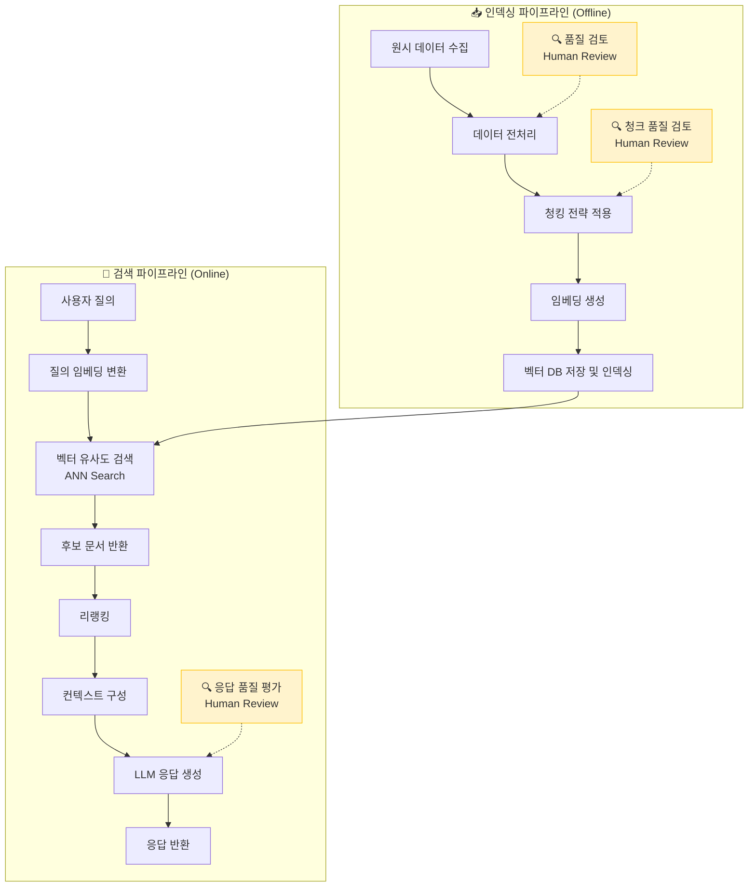
```mermaid
flowchart TB
    subgraph 인덱싱["📥 인덱싱 파이프라인 (Offline)"]
        direction TB
        A[원시 데이터 수집] --> B[데이터 전처리]
        B --> C[청킹 전략 적용]
        C --> D[임베딩 생성]
        D --> E[벡터 DB 저장 및 인덱싱]
        
        B1[🔍 품질 검토<br/>Human Review] -.-> B
        C1[🔍 청크 품질 검토<br/>Human Review] -.-> C
    end
    
    subgraph 검색["🔎 검색 파이프라인 (Online)"]
        direction TB
        F[사용자 질의] --> G[질의 임베딩 변환]
        G --> H[벡터 유사도 검색<br/>ANN Search]
        H --> I[후보 문서 반환]
        I --> J[리랭킹]
        J --> K[컨텍스트 구성]
        K --> L[LLM 응답 생성]
        L --> M[응답 반환]
        
        N[🔍 응답 품질 평가<br/>Human Review] -.-> L
    end
    
    E --> H
    
    style B1 fill:#fff3cd,stroke:#ffc107
    style C1 fill:#fff3cd,stroke:#ffc107
    style N fill:#fff3cd,stroke:#ffc107
```

### 2.2 인덱싱 파이프라인 상세

#### 2.2.1 데이터 수집 및 전처리

**주요 단계:**
- 다양한 소스(PDF, 웹페이지, DB, API)에서 데이터 수집
- 데이터 클리닝: 헤더/푸터, 특수문자, 노이즈 제거
- 형식 정규화: 인코딩 통일, 메타데이터 추출

**🔧 Human Action Point:**
- 도메인 전문가의 데이터 소스 선정 및 우선순위 결정
- 데이터 품질 검토 및 부적합 데이터 필터링 기준 수립

#### 2.2.2 청킹 전략 (Chunking Strategies)

| 전략 | 설명 | 장점 | 단점 |
|------|------|------|------|
| **고정 크기 청킹** | 일정 토큰/문자 수로 분할 | 구현 간단, 예측 가능 | 의미적 경계 무시 |
| **문맥 인식 청킹** | 문장/단락 경계 기반 분할 | 의미 단위 보존 | 청크 크기 불균일 |
| **시맨틱 청킹** | 임베딩 유사도 기반 분할 | 주제 일관성 유지 | 계산 비용 높음 |
| **재귀적 청킹** | 계층적 분할(문서→섹션→단락) | 컨텍스트 계층 유지 | 복잡한 구현 |

**권장 시작점:**
- 청크 크기: 512 토큰
- 오버랩: 50-100 토큰

**🔧 Human Action Point:**
- 청킹 결과물에 대한 샘플링 검토
- 도메인 특성에 맞는 청킹 전략 선정 및 파라미터 튜닝

#### 2.2.3 임베딩 생성

**핵심 고려사항:**
- 임베딩 모델의 최대 토큰 한도 확인 (예: 512 토큰)
- 도메인 특화 모델 파인튜닝 검토
- 모델 크기 vs 성능 vs 비용 트레이드오프

#### 2.2.4 벡터 DB 저장 및 인덱싱

**인덱싱이란?**

임베딩 벡터를 효율적으로 검색할 수 있도록 **인덱스 구조(HNSW, IVF 등)를 생성**하는 과정이다. 수백만 개 벡터에서 밀리초 단위 검색을 가능하게 한다.

**주요 인덱싱 알고리즘:**

| 알고리즘 | 설명 | 특징 |
|----------|------|------|
| **HNSW** | 계층적 그래프 구조 탐색 | 가장 널리 사용, 높은 정확도 |
| **IVF** | 클러스터 기반 검색 범위 축소 | 대용량에 적합 |
| **Flat** | 전체 검색 (인덱스 없음) | 정확도 100%, 느림 |

**메타데이터 강화 예시:**
```json
{
  "text": "문서 청크 내용...",
  "vector": [0.012, 0.56, ...],
  "metadata": {
    "source": "manual_2024.pdf",
    "page": 12,
    "section": "installation",
    "language": "ko",
    "timestamp": "2024-01-15T10:30:00Z",
    "content_hash": "abc123..."
  }
}
```

### 2.3 검색 파이프라인 상세

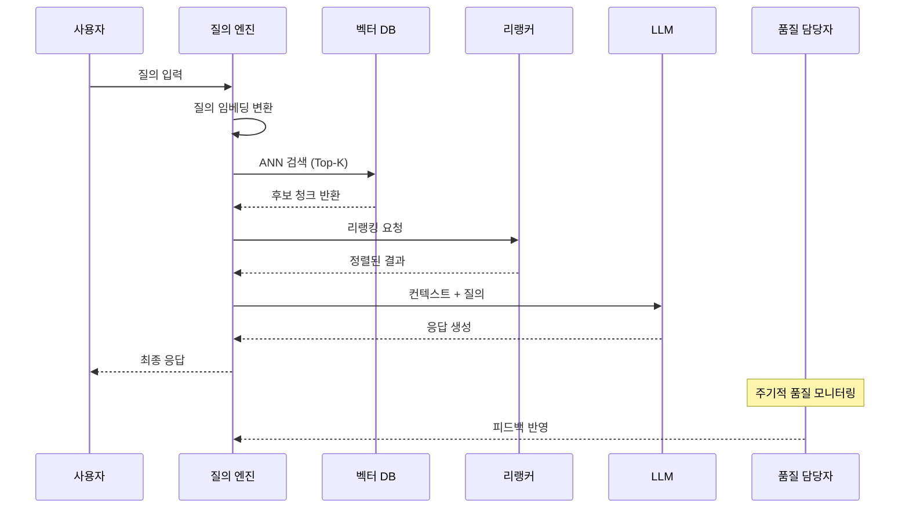
```mermaid
sequenceDiagram
    participant User as 사용자
    participant QE as 질의 엔진
    participant VDB as 벡터 DB
    participant RR as 리랭커
    participant LLM as LLM
    participant QA as 품질 담당자
    
    User->>QE: 질의 입력
    QE->>QE: 질의 임베딩 변환
    QE->>VDB: ANN 검색 (Top-K)
    VDB-->>QE: 후보 청크 반환
    QE->>RR: 리랭킹 요청
    RR-->>QE: 정렬된 결과
    QE->>LLM: 컨텍스트 + 질의
    LLM-->>QE: 응답 생성
    QE-->>User: 최종 응답
    
    Note over QA: 주기적 품질 모니터링
    QA-->>QE: 피드백 반영
```

#### 2.3.1 리랭킹 (Reranking)

**목적:** 초기 검색 결과의 정확도 향상

**주요 방식:**
- **Cross-Encoder**: 질의-문서 쌍을 트랜스포머로 직접 스코어링 (고정확도, 고비용)
- **ColBERT (Late Interaction)**: 토큰 레벨 유사도 계산 (균형점)
- **RRF (Reciprocal Rank Fusion)**: 여러 검색 결과 순위 통합

**🔧 Human Action Point:**
- 리랭킹 결과 샘플링 평가
- 도메인별 리랭킹 모델 성능 검증

---

## 3. 그래프 DB 파이프라인 시나리오 (Graph RAG)

### 3.1 파이프라인 전체 아키텍처

> ⚠️ **참고**: 이 섹션은 일반적인 Graph RAG 파이프라인을 다룹니다. Microsoft GraphRAG의 커뮤니티 요약 기반 Global Search는 [섹션 6](#6-참고-microsoft-graphrag-특화-개념)에서 별도로 설명합니다.

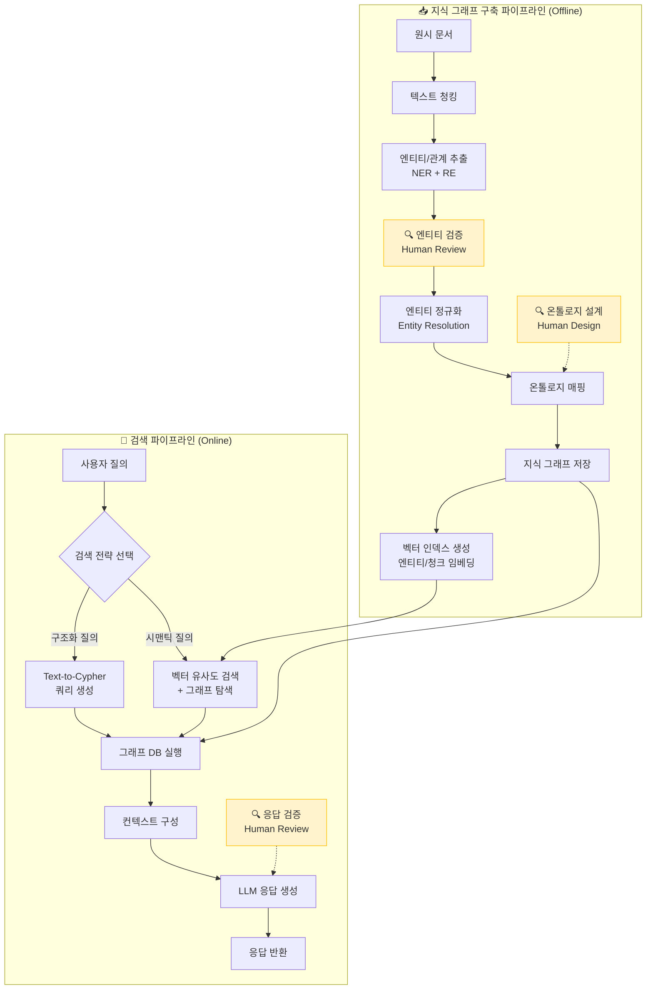
```mermaid
flowchart TB
    subgraph 인덱싱["📥 지식 그래프 구축 파이프라인 (Offline)"]
        direction TB
        A[원시 문서] --> B[텍스트 청킹]
        B --> C[엔티티/관계 추출<br/>NER + RE]
        C --> D[🔍 엔티티 검증<br/>Human Review]
        D --> E[엔티티 정규화<br/>Entity Resolution]
        E --> F[온톨로지 매핑]
        F --> G[지식 그래프 저장]
        G --> H[벡터 인덱스 생성<br/>엔티티/청크 임베딩]
        
        I[🔍 온톨로지 설계<br/>Human Design] -.-> F
    end
    
    subgraph 검색["🔎 검색 파이프라인 (Online)"]
        direction TB
        J[사용자 질의] --> K{검색 전략 선택}
        K -->|구조화 질의| L[Text-to-Cypher<br/>쿼리 생성]
        K -->|시맨틱 질의| M[벡터 유사도 검색<br/>+ 그래프 탐색]
        L --> N[그래프 DB 실행]
        M --> N
        N --> O[컨텍스트 구성]
        O --> P[LLM 응답 생성]
        P --> Q[응답 반환]
        
        R[🔍 응답 검증<br/>Human Review] -.-> P
    end
    
    G --> N
    H --> M
    
    style D fill:#fff3cd,stroke:#ffc107
    style I fill:#fff3cd,stroke:#ffc107
    style R fill:#fff3cd,stroke:#ffc107
```

### 3.2 지식 그래프 구축 파이프라인

#### 3.2.1 엔티티 및 관계 추출 (NER + RE)

**NER (Named Entity Recognition) - 개체명 인식:**

텍스트에서 의미 있는 엔티티를 식별하고 분류하는 작업이다.

```
입력: "김철수 부장은 퀸텟시스템즈에서 근무한다."

NER 결과:
├── 김철수      → PERSON (인물)
├── 부장        → ROLE (직책)
└── 퀸텟시스템즈 → ORGANIZATION (조직)
```

**RE (Relation Extraction) - 관계 추출:**

엔티티 간의 관계를 추출하여 트리플(Subject, Predicate, Object)을 생성한다.

```
RE 결과:
├── (김철수, HAS_ROLE, 부장)
└── (김철수, WORKS_AT, 퀸텟시스템즈)
```

**추출 방식 비교:**

| 방식 | 설명 | 장점 | 단점 |
|------|------|------|------|
| **전통적 NER** | spaCy, BERT-NER 등 | 빠름, 일관성 | 유연성 부족 |
| **LLM 기반 추출** | GPT/Claude 프롬프트 | 유연함, 복잡한 관계 가능 | 비용 높음, 환각 위험 |
| **하이브리드** | NER + LLM 검증 | 균형점 | 파이프라인 복잡 |

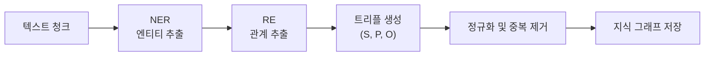
```mermaid
flowchart LR
    A[텍스트 청크] --> B[NER<br/>엔티티 추출]
    B --> C[RE<br/>관계 추출]
    C --> D["트리플 생성<br/>(S, P, O)"]
    D --> E[정규화 및 중복 제거]
    E --> F[지식 그래프 저장]
```

**🔧 Human Action Point:**
- 추출된 엔티티/관계의 정확성 검증 (샘플링)
- 환각된 트리플 필터링 기준 수립
- 도메인 특화 엔티티 타입 정의

#### 3.2.2 온톨로지 vs 그래프 DB 스키마

> 💡 **핵심 차이**: 온톨로지는 "개념과 의미의 정의"이고, 스키마는 "데이터 저장 구조"이다.

| 측면 | 온톨로지 | 그래프 DB 스키마 |
|------|----------|------------------|
| **목적** | 도메인 지식의 의미론적 표현 | 데이터 저장 및 쿼리 최적화 |
| **수준** | 개념적/논리적 | 물리적/기술적 |
| **표현 언어** | OWL, RDF, RDFS | Cypher DDL, Gremlin |
| **추론 가능** | ✅ 예 (Reasoning Engine) | ❌ 아니오 |
| **의미 정의** | ✅ 자연어 설명 포함 | ❌ 필드명만 |

**온톨로지 예시 (개념적 정의):**
```
"고객(Customer)은 제품이나 서비스를 구매하는 법인 조직이다.
고객은 하나 이상의 담당자(Contact)를 가질 수 있다.
담당자 중 의사결정권자를 키맨(KeyMan)이라 한다."
```

**그래프 DB 스키마 예시 (기술적 구현):**
```cypher
-- 노드 제약조건
CREATE CONSTRAINT customer_name_unique 
FOR (c:Customer) REQUIRE c.name IS UNIQUE;

-- 인덱스 생성
CREATE INDEX contact_email FOR (c:Contact) ON (c.email);

-- 벡터 인덱스 (Neo4j 5.x+)
CREATE VECTOR INDEX chunk_embedding
FOR (c:Chunk) ON (c.embedding)
OPTIONS {indexConfig: {`vector.dimensions`: 1536}};
```

**🔧 Human Action Point:**
- 도메인 전문가 주도의 온톨로지 스키마 설계
- 기존 표준 온톨로지 재사용 검토 (예: Schema.org, FOAF)

### 3.3 검색 파이프라인 상세

#### 3.3.1 검색 전략

| 검색 유형 | 설명 | 적합 질의 |
|-----------|------|-----------|
| **Text-to-Cypher** | 자연어 → Cypher 쿼리 변환 | "퀸텟시스템즈의 담당자는?" |
| **벡터 검색 + 그래프 탐색** | 시맨틱 유사 노드 찾기 → 이웃 탐색 | "클라우드 관련 제안 사례" |
| **키워드 기반 검색** | 속성 값 매칭 | "김철수 과장 연락처" |

#### 3.3.2 Text-to-Cypher 플로우

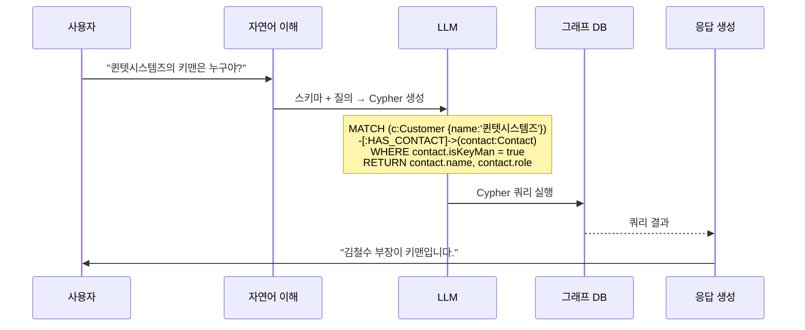
```mermaid
sequenceDiagram
    participant User as 사용자
    participant NLU as 자연어 이해
    participant LLM as LLM
    participant GDB as 그래프 DB
    participant Gen as 응답 생성
    
    User->>NLU: "퀸텟시스템즈의 키맨은 누구야?"
    NLU->>LLM: 스키마 + 질의 → Cypher 생성
    
    Note over LLM: MATCH (c:Customer {name:'퀸텟시스템즈'})<br/>-[:HAS_CONTACT]->(contact:Contact)<br/>WHERE contact.isKeyMan = true<br/>RETURN contact.name, contact.role
    
    LLM->>GDB: Cypher 쿼리 실행
    GDB-->>Gen: 쿼리 결과
    Gen->>User: "김철수 부장이 키맨입니다."
```

#### 3.3.3 그래프 DB 스키마 예시 (고객 도메인)

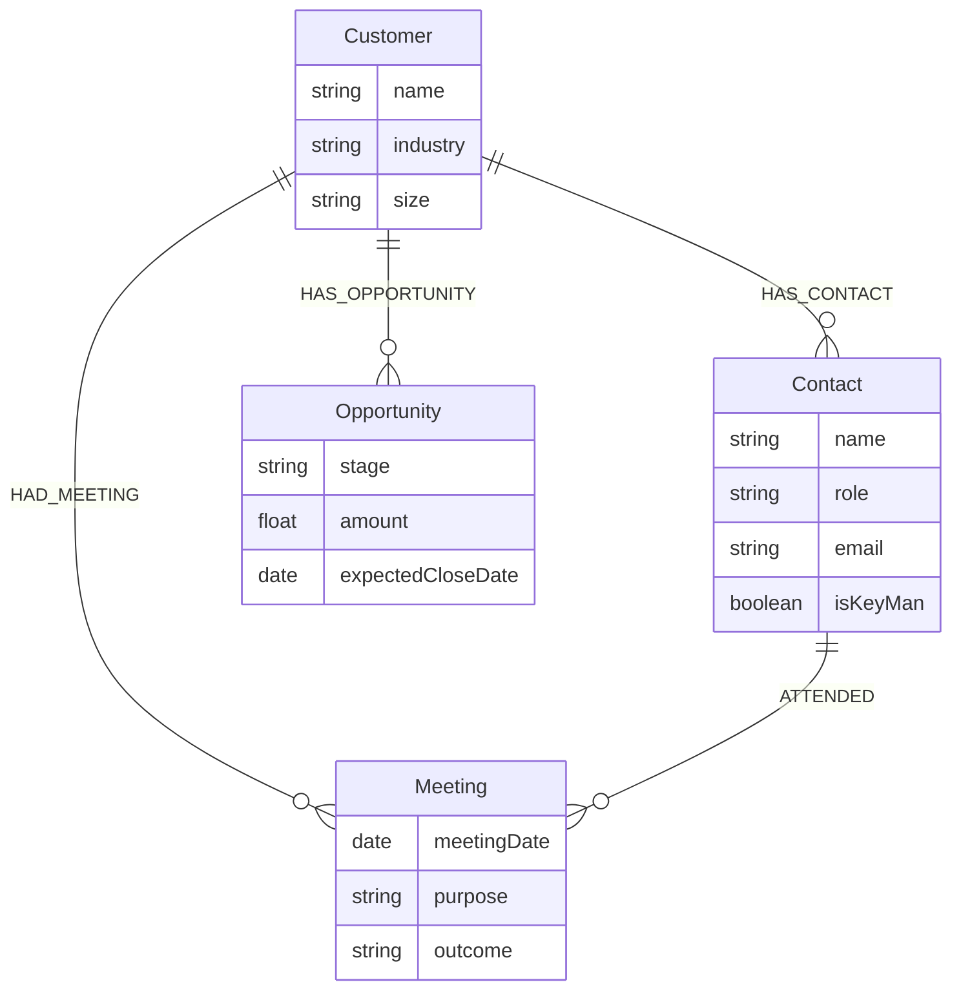
```mermaid
erDiagram
    Customer ||--o{ Contact : HAS_CONTACT
    Customer ||--o{ Meeting : HAD_MEETING
    Customer ||--o{ Opportunity : HAS_OPPORTUNITY
    
    Contact ||--o{ Meeting : ATTENDED
    Contact {
        string name
        string role
        string email
        boolean isKeyMan
    }
    
    Meeting {
        date meetingDate
        string purpose
        string outcome
    }
    
    Opportunity {
        string stage
        float amount
        date expectedCloseDate
    }
    
    Customer {
        string name
        string industry
        string size
    }
```

---

## 4. 하이브리드 파이프라인 시나리오

### 4.1 하이브리드 아키텍처 개요

하이브리드 RAG는 벡터 검색의 의미적 유사도 강점과 그래프 검색의 구조적 추론 강점을 결합한다.

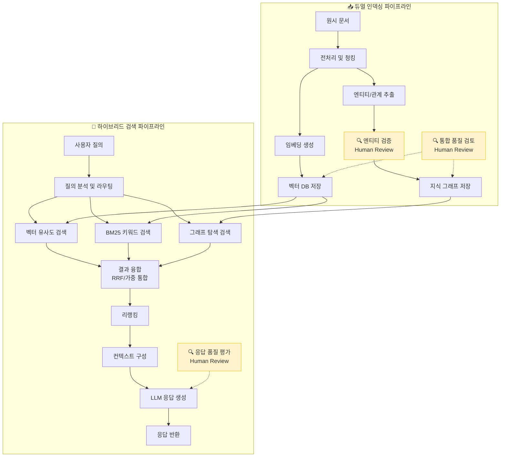
```mermaid
flowchart TB
    subgraph 인덱싱["📥 듀얼 인덱싱 파이프라인"]
        direction TB
        A[원시 문서] --> B[전처리 및 청킹]
        
        B --> C1[임베딩 생성]
        C1 --> D1[벡터 DB 저장]
        
        B --> C2[엔티티/관계 추출]
        C2 --> D2[🔍 엔티티 검증<br/>Human Review]
        D2 --> E2[지식 그래프 저장]
        
        H[🔍 통합 품질 검토<br/>Human Review] -.-> D1
        H -.-> E2
    end
    
    subgraph 검색["🔎 하이브리드 검색 파이프라인"]
        direction TB
        I[사용자 질의] --> J[질의 분석 및 라우팅]
        
        J --> K1[벡터 유사도 검색]
        J --> K2[BM25 키워드 검색]
        J --> K3[그래프 탐색 검색]
        
        K1 --> L[결과 융합<br/>RRF/가중 통합]
        K2 --> L
        K3 --> L
        
        L --> M[리랭킹]
        M --> N[컨텍스트 구성]
        N --> O[LLM 응답 생성]
        O --> P[응답 반환]
        
        Q[🔍 응답 품질 평가<br/>Human Review] -.-> O
    end
    
    D1 --> K1
    D1 --> K2
    E2 --> K3
    
    style D2 fill:#fff3cd,stroke:#ffc107
    style H fill:#fff3cd,stroke:#ffc107
    style Q fill:#fff3cd,stroke:#ffc107
```

### 4.2 검색 시나리오 상세 플로우

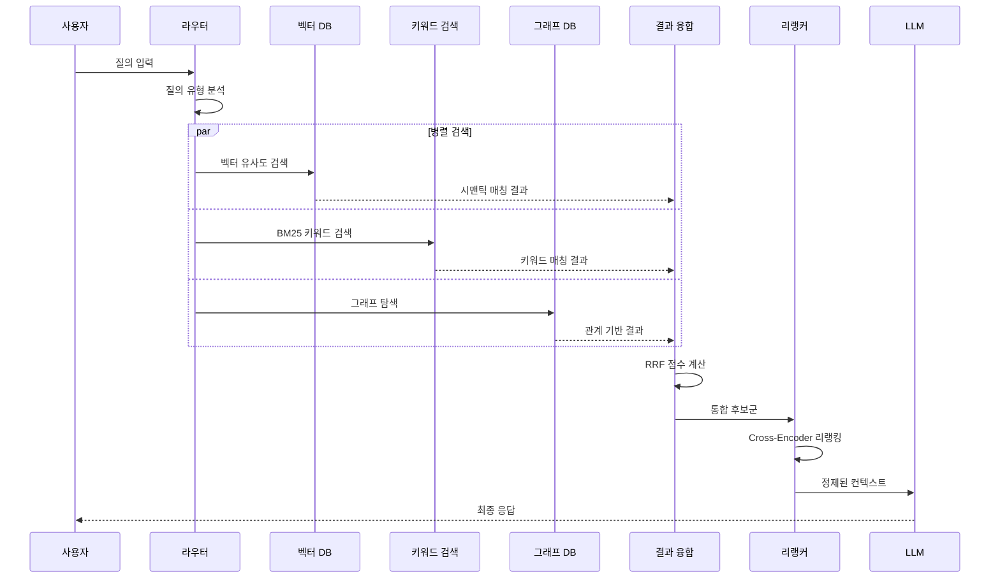
```mermaid
sequenceDiagram
    participant User as 사용자
    participant Router as 라우터
    participant VDB as 벡터 DB
    participant KW as 키워드 검색
    participant GDB as 그래프 DB
    participant Fusion as 결과 융합
    participant Reranker as 리랭커
    participant LLM as LLM
    
    User->>Router: 질의 입력
    Router->>Router: 질의 유형 분석
    
    par 병렬 검색
        Router->>VDB: 벡터 유사도 검색
        VDB-->>Fusion: 시맨틱 매칭 결과
    and
        Router->>KW: BM25 키워드 검색
        KW-->>Fusion: 키워드 매칭 결과
    and
        Router->>GDB: 그래프 탐색
        GDB-->>Fusion: 관계 기반 결과
    end
    
    Fusion->>Fusion: RRF 점수 계산
    Fusion->>Reranker: 통합 후보군
    Reranker->>Reranker: Cross-Encoder 리랭킹
    Reranker->>LLM: 정제된 컨텍스트
    LLM-->>User: 최종 응답
```

### 4.3 결과 융합 전략

#### 4.3.1 Reciprocal Rank Fusion (RRF)

여러 검색 결과의 순위를 통합하는 대표적 방법:

```
RRF_score(d) = Σ 1 / (k + rank_i(d))
```

- `k`: 상수 (일반적으로 60)
- `rank_i(d)`: i번째 검색 결과에서 문서 d의 순위

#### 4.3.2 가중 통합

도메인/질의 유형에 따른 가중치 조정:

```
Final_score(d) = w_vector × score_vector(d) 
               + w_keyword × score_keyword(d) 
               + w_graph × score_graph(d)
```

**🔧 Human Action Point:**
- 질의 유형별 최적 가중치 실험 및 결정
- A/B 테스트를 통한 융합 전략 검증

### 4.4 HybridRAG 성능 비교

| 지표 | VectorRAG | GraphRAG | HybridRAG |
|------|-----------|----------|-----------|
| **Faithfulness** | 0.94 | 0.96 | 0.96 |
| **Answer Relevancy** | 0.91 | 0.89 | 0.96 |
| **추출적 질문** | 약함 | 강함 | 강함 |
| **추상적 질문** | 강함 | 약함 | 강함 |

---

## 5. Human-in-the-Loop 액션 포인트

### 5.1 파이프라인 단계별 액션 포인트 요약

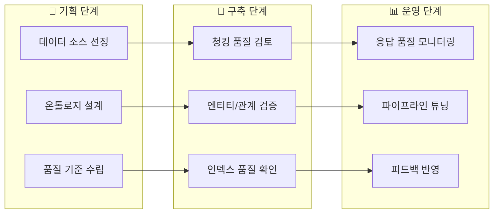
```mermaid
flowchart LR
    subgraph 기획["🎯 기획 단계"]
        A1[데이터 소스 선정]
        A2[온톨로지 설계]
        A3[품질 기준 수립]
    end
    
    subgraph 구축["🔧 구축 단계"]
        B1[청킹 품질 검토]
        B2[엔티티/관계 검증]
        B3[인덱스 품질 확인]
    end
    
    subgraph 운영["📊 운영 단계"]
        C1[응답 품질 모니터링]
        C2[파이프라인 튜닝]
        C3[피드백 반영]
    end
    
    A1 --> B1 --> C1
    A2 --> B2 --> C2
    A3 --> B3 --> C3
```

### 5.2 상세 액션 포인트

| 단계 | 액션 포인트 | 담당자 | 빈도 | 산출물 |
|------|-------------|--------|------|--------|
| **기획** | 데이터 소스 선정 및 우선순위 | 도메인 전문가 | 초기 1회 | 데이터 소스 목록 |
| **기획** | 온톨로지/스키마 설계 | 도메인 전문가 + 엔지니어 | 초기 1회 + 주기적 갱신 | 온톨로지 문서 |
| **기획** | 품질 기준 및 평가 지표 정의 | PM + QA | 초기 1회 | 평가 가이드라인 |
| **구축** | 청킹 결과 샘플링 검토 | QA | 배포 전 | 품질 리포트 |
| **구축** | 엔티티/관계 추출 결과 검증 | 도메인 전문가 | 배포 전 + 주기적 | 검증 리포트 |
| **운영** | 응답 품질 모니터링 (샘플링) | QA | 일간/주간 | 품질 대시보드 |
| **운영** | 사용자 피드백 분석 | PM + 엔지니어 | 주간 | 개선 백로그 |
| **운영** | 파이프라인 파라미터 튜닝 | 엔지니어 | 월간 | 튜닝 결과 리포트 |

### 5.3 품질 검토 프로세스

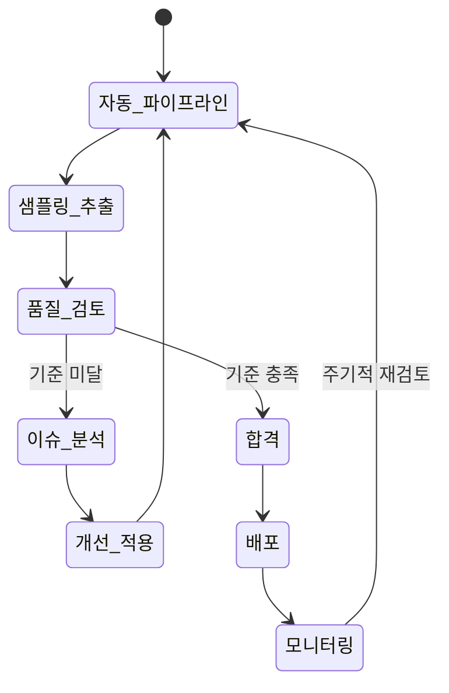
```mermaid
stateDiagram-v2
    [*] --> 자동_파이프라인
    자동_파이프라인 --> 샘플링_추출
    샘플링_추출 --> 품질_검토
    품질_검토 --> 합격: 기준 충족
    품질_검토 --> 이슈_분석: 기준 미달
    이슈_분석 --> 개선_적용
    개선_적용 --> 자동_파이프라인
    합격 --> 배포
    배포 --> 모니터링
    모니터링 --> 자동_파이프라인: 주기적 재검토
```

---

## 6. 참고: Microsoft GraphRAG 특화 개념

> ⚠️ **주의**: 이 섹션의 내용은 **Microsoft GraphRAG의 특화된 아키텍처**입니다. 일반적인 Graph RAG와 혼동하지 않도록 주의하세요.

### 6.1 Microsoft GraphRAG란?

Microsoft GraphRAG는 지식 그래프에 **커뮤니티 탐지 및 요약**을 추가하여 "Global Query" (전체 데이터셋에 대한 요약 질의)를 지원하는 특화된 RAG 아키텍처이다.

**일반 Graph RAG와의 차이:**

| 구분 | 일반 Graph RAG | Microsoft GraphRAG |
|------|----------------|-------------------|
| **검색 방식** | 엔티티 중심 탐색 | 커뮤니티 요약 기반 |
| **Global Query 지원** | ❌ 어려움 | ✅ 핵심 기능 |
| **추가 구성요소** | 없음 | 커뮤니티 탐지 + 요약 |
| **비용** | 상대적 저렴 | 인덱싱 비용 높음 |

### 6.2 커뮤니티 탐지란?

**커뮤니티 탐지**는 그래프에서 밀집 연결된 노드 그룹을 찾는 **그래프 알고리즘**이다. Neo4j GDS 라이브러리에서 Louvain, Leiden 등의 알고리즘으로 제공된다.

```cypher
-- Neo4j GDS에서 커뮤니티 탐지 실행 예시
CALL gds.louvain.stream('myGraph')
YIELD nodeId, communityId
RETURN gds.util.asNode(nodeId).name AS name, communityId
ORDER BY communityId
```

> 💡 **핵심**: 커뮤니티 탐지 자체는 일반적인 그래프 알고리즘이지만, **"커뮤니티 요약 → Global Search"** 패턴은 Microsoft GraphRAG만의 특화 기능이다.

### 6.3 Microsoft GraphRAG 파이프라인

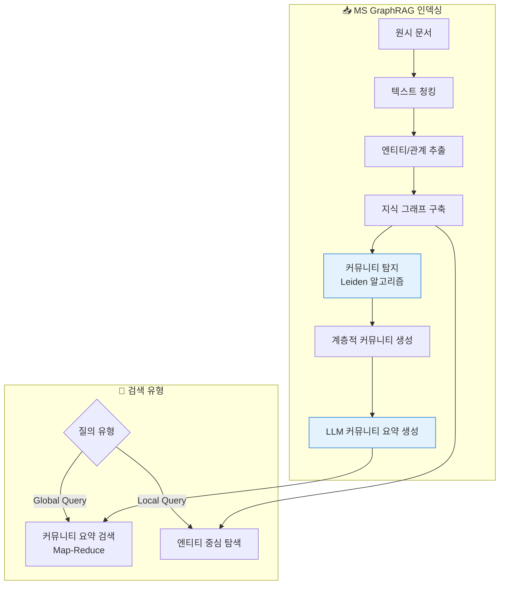
```mermaid
flowchart TB
    subgraph 인덱싱["📥 MS GraphRAG 인덱싱"]
        direction TB
        A[원시 문서] --> B[텍스트 청킹]
        B --> C[엔티티/관계 추출]
        C --> D[지식 그래프 구축]
        D --> E[커뮤니티 탐지<br/>Leiden 알고리즘]
        E --> F[계층적 커뮤니티 생성]
        F --> G[LLM 커뮤니티 요약 생성]
        
        style E fill:#e3f2fd,stroke:#1976d2
        style G fill:#e3f2fd,stroke:#1976d2
    end
    
    subgraph 검색["🔎 검색 유형"]
        H{질의 유형}
        H -->|Global Query| I[커뮤니티 요약 검색<br/>Map-Reduce]
        H -->|Local Query| J[엔티티 중심 탐색]
    end
    
    G --> I
    D --> J
```

### 6.4 Global Search (MS GraphRAG 전용)

**Global Query 예시:** "이 문서 전체의 주요 테마는 무엇인가?"

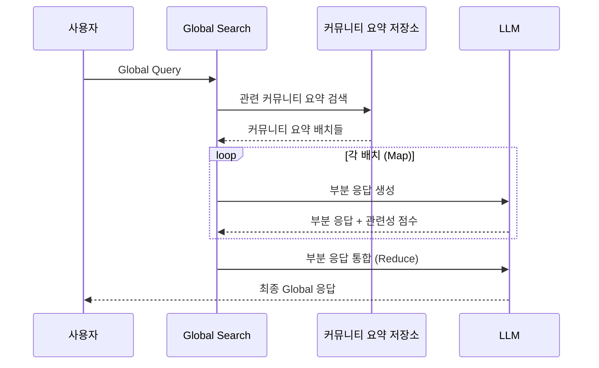
```mermaid
sequenceDiagram
    participant User as 사용자
    participant GS as Global Search
    participant CS as 커뮤니티 요약 저장소
    participant LLM as LLM
    
    User->>GS: Global Query
    GS->>CS: 관련 커뮤니티 요약 검색
    CS-->>GS: 커뮤니티 요약 배치들
    
    loop 각 배치 (Map)
        GS->>LLM: 부분 응답 생성
        LLM-->>GS: 부분 응답 + 관련성 점수
    end
    
    GS->>LLM: 부분 응답 통합 (Reduce)
    LLM-->>User: 최종 Global 응답
```

### 6.5 MS GraphRAG 사용 시 고려사항

| 장점 | 단점 |
|------|------|
| Global Query 지원 | 인덱싱 비용 높음 (LLM 요약 필요) |
| 전체 데이터 요약 가능 | 복잡한 파이프라인 |
| 계층적 추상화 | 실시간 업데이트 어려움 |

---

## 7. 실전 비즈니스 시나리오: 영업 지원 AI 시스템

### 7.1 시나리오 개요

실제 AI 시장에서 요구되는 영업 지원 시스템의 핵심 기능을 RAG 파이프라인 관점에서 구체화한다.

| 기능 영역 | 주요 유스케이스 | RAG 유형 |
|-----------|----------------|----------|
| **인사이트 생성** | 미팅 전 고객 분석, 제안 전략 수립 | Hybrid RAG |
| **보고서 생성** | 회의록 기반 레포트, 액션 아이템 추출 | Vector RAG + LLM |
| **지식 검색** | 고객 정보, 미팅 이력 조회 | Graph RAG |
| **비즈니스 자동화** | 컨택 정보 생성, CRM 연동, 이메일 발송 | Graph RAG + API |

### 7.2 전체 시스템 아키텍처

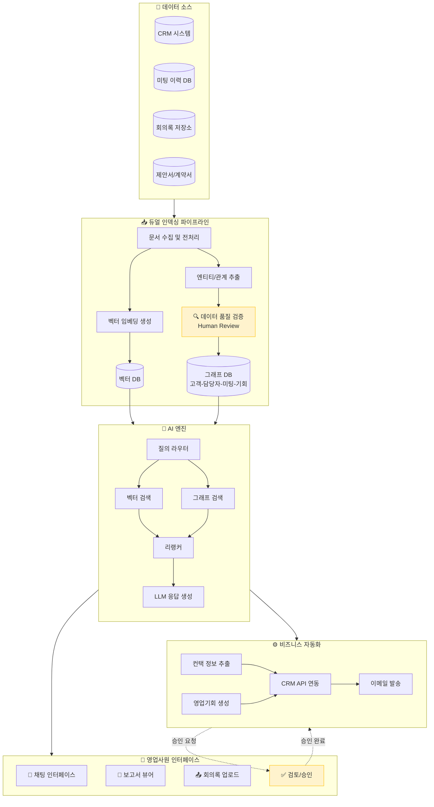
```mermaid
flowchart TB
    subgraph 데이터소스["📂 데이터 소스"]
        DS1[(CRM 시스템)]
        DS2[(미팅 이력 DB)]
        DS3[(회의록 저장소)]
        DS4[(제안서/계약서)]
    end
    
    subgraph 인덱싱["📥 듀얼 인덱싱 파이프라인"]
        direction TB
        IDX1[문서 수집 및 전처리]
        IDX2[벡터 임베딩 생성]
        IDX3[엔티티/관계 추출]
        IDX4[🔍 데이터 품질 검증<br/>Human Review]
        
        IDX1 --> IDX2 --> VDB[(벡터 DB)]
        IDX1 --> IDX3 --> IDX4 --> GDB[(그래프 DB<br/>고객-담당자-미팅-기회)]
    end
    
    subgraph AI엔진["🤖 AI 엔진"]
        direction TB
        QR[질의 라우터]
        VS[벡터 검색]
        GS[그래프 검색]
        RR[리랭커]
        LLM[LLM 응답 생성]
        
        QR --> VS
        QR --> GS
        VS --> RR
        GS --> RR
        RR --> LLM
    end
    
    subgraph 자동화["⚙️ 비즈니스 자동화"]
        AUTO1[컨택 정보 추출]
        AUTO2[영업기회 생성]
        AUTO3[CRM API 연동]
        AUTO4[이메일 발송]
        
        AUTO1 --> AUTO3
        AUTO2 --> AUTO3
        AUTO3 --> AUTO4
    end
    
    subgraph 사용자["👤 영업사원 인터페이스"]
        UI1[💬 채팅 인터페이스]
        UI2[📄 보고서 뷰어]
        UI3[📤 회의록 업로드]
        UI4[✅ 검토/승인]
    end
    
    데이터소스 --> 인덱싱
    VDB --> AI엔진
    GDB --> AI엔진
    AI엔진 --> 사용자
    AI엔진 --> 자동화
    자동화 -.->|승인 요청| UI4
    UI4 -.->|승인 완료| 자동화
    
    style IDX4 fill:#fff3cd,stroke:#ffc107
    style UI4 fill:#fff3cd,stroke:#ffc107
```

---

### 7.3 시나리오 1: 미팅 전 인사이트 생성

**사용자 스토리**: *"지금 퀸텟시스템즈라는 고객과 미팅을 할 건데, 클라우드 마이그레이션 제안을 할 거야. 어떤 액션이나 문구를 기반으로 대화를 해야 할까?"*

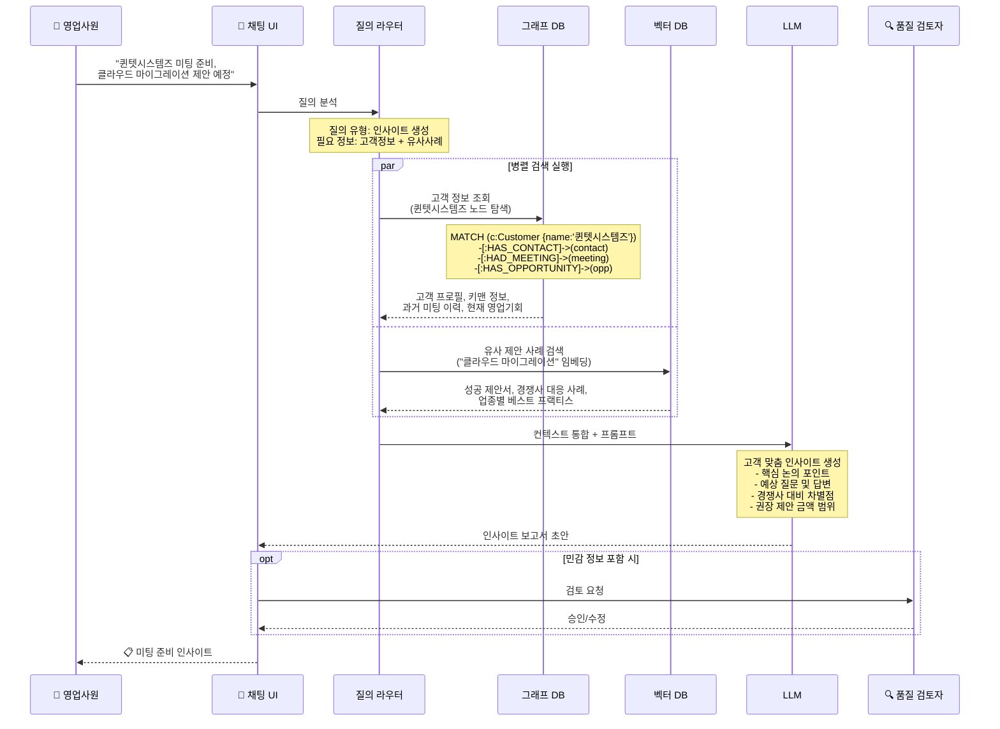
```mermaid
sequenceDiagram
    participant 영업사원 as 👤 영업사원
    participant UI as 💬 채팅 UI
    participant Router as 질의 라우터
    participant GDB as 그래프 DB
    participant VDB as 벡터 DB
    participant LLM as LLM
    participant Review as 🔍 품질 검토자
    
    영업사원->>UI: "퀸텟시스템즈 미팅 준비,<br/>클라우드 마이그레이션 제안 예정"
    UI->>Router: 질의 분석
    
    Note over Router: 질의 유형: 인사이트 생성<br/>필요 정보: 고객정보 + 유사사례
    
    par 병렬 검색 실행
        Router->>GDB: 고객 정보 조회<br/>(퀸텟시스템즈 노드 탐색)
        Note over GDB: MATCH (c:Customer {name:'퀸텟시스템즈'})<br/>-[:HAS_CONTACT]->(contact)<br/>-[:HAD_MEETING]->(meeting)<br/>-[:HAS_OPPORTUNITY]->(opp)
        GDB-->>Router: 고객 프로필, 키맨 정보,<br/>과거 미팅 이력, 현재 영업기회
    and
        Router->>VDB: 유사 제안 사례 검색<br/>("클라우드 마이그레이션" 임베딩)
        VDB-->>Router: 성공 제안서, 경쟁사 대응 사례,<br/>업종별 베스트 프랙티스
    end
    
    Router->>LLM: 컨텍스트 통합 + 프롬프트
    Note over LLM: 고객 맞춤 인사이트 생성<br/>- 핵심 논의 포인트<br/>- 예상 질문 및 답변<br/>- 경쟁사 대비 차별점<br/>- 권장 제안 금액 범위
    
    LLM-->>UI: 인사이트 보고서 초안
    
    opt 민감 정보 포함 시
        UI->>Review: 검토 요청
        Review-->>UI: 승인/수정
    end
    
    UI-->>영업사원: 📋 미팅 준비 인사이트
```

---

### 7.4 시나리오 2: 회의록 기반 보고서 생성 및 자동화

**사용자 스토리**: *"미팅을 갔다왔어. 회의록을 업로드할게. 레포트 자료 만들어주고, 새로 알게 된 담당자 정보도 CRM에 등록해줘."*

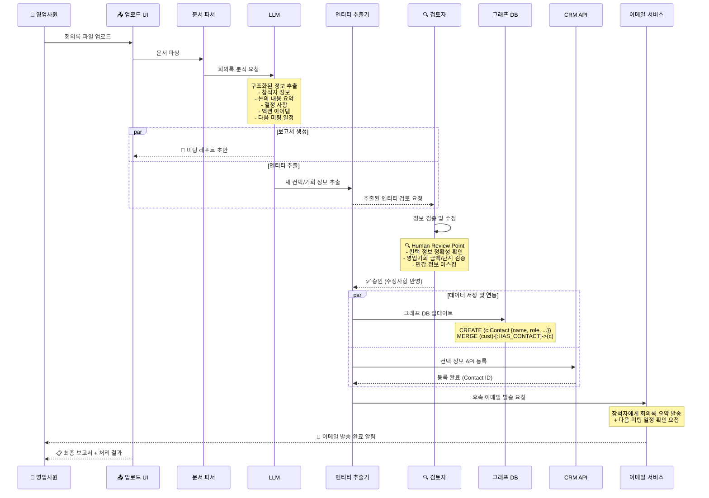
```mermaid
sequenceDiagram
    participant 영업사원 as 👤 영업사원
    participant UI as 📤 업로드 UI
    participant Parser as 문서 파서
    participant LLM as LLM
    participant Extractor as 엔티티 추출기
    participant Review as 🔍 검토자
    participant GDB as 그래프 DB
    participant CRM as CRM API
    participant Email as 이메일 서비스
    
    영업사원->>UI: 회의록 파일 업로드
    UI->>Parser: 문서 파싱
    Parser->>LLM: 회의록 분석 요청
    
    Note over LLM: 구조화된 정보 추출<br/>- 참석자 정보<br/>- 논의 내용 요약<br/>- 결정 사항<br/>- 액션 아이템<br/>- 다음 미팅 일정
    
    par 보고서 생성
        LLM-->>UI: 📄 미팅 레포트 초안
    and 엔티티 추출
        LLM->>Extractor: 새 컨택/기회 정보 추출
        Extractor-->>Review: 추출된 엔티티 검토 요청
    end
    
    Review->>Review: 정보 검증 및 수정
    Note over Review: 🔍 Human Review Point<br/>- 컨택 정보 정확성 확인<br/>- 영업기회 금액/단계 검증<br/>- 민감 정보 마스킹
    
    Review-->>Extractor: ✅ 승인 (수정사항 반영)
    
    par 데이터 저장 및 연동
        Extractor->>GDB: 그래프 DB 업데이트
        Note over GDB: CREATE (c:Contact {name, role, ...})<br/>MERGE (cust)-[:HAS_CONTACT]->(c)
    and
        Extractor->>CRM: 컨택 정보 API 등록
        CRM-->>Extractor: 등록 완료 (Contact ID)
    end
    
    Extractor->>Email: 후속 이메일 발송 요청
    Note over Email: 참석자에게 회의록 요약 발송<br/>+ 다음 미팅 일정 확인 요청
    
    Email-->>영업사원: 📧 이메일 발송 완료 알림
    UI-->>영업사원: 📋 최종 보고서 + 처리 결과
```

#### 7.4.1 회의록 처리 상세 플로우

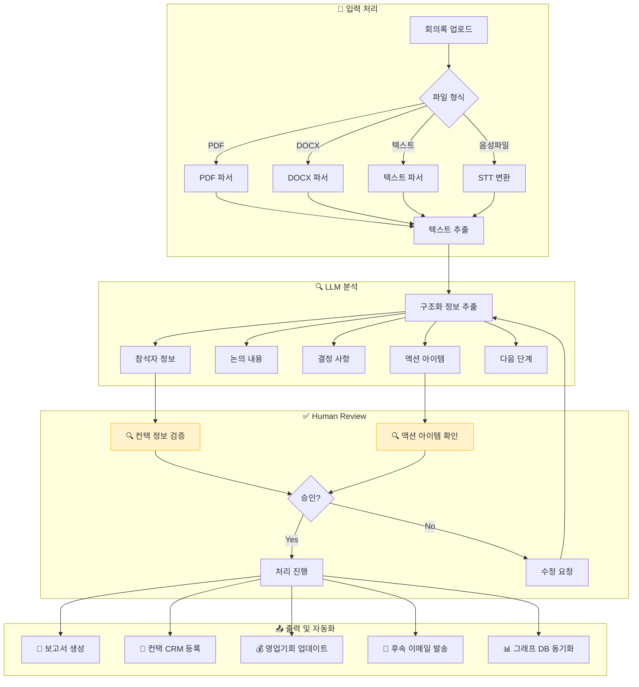
```mermaid
flowchart TB
    subgraph 입력["📄 입력 처리"]
        A[회의록 업로드] --> B{파일 형식}
        B -->|PDF| C1[PDF 파서]
        B -->|DOCX| C2[DOCX 파서]
        B -->|텍스트| C3[텍스트 파서]
        B -->|음성파일| C4[STT 변환]
        C1 --> D[텍스트 추출]
        C2 --> D
        C3 --> D
        C4 --> D
    end
    
    subgraph 분석["🔍 LLM 분석"]
        D --> E[구조화 정보 추출]
        E --> F1[참석자 정보]
        E --> F2[논의 내용]
        E --> F3[결정 사항]
        E --> F4[액션 아이템]
        E --> F5[다음 단계]
    end
    
    subgraph 검증["✅ Human Review"]
        F1 --> G1[🔍 컨택 정보 검증]
        F4 --> G2[🔍 액션 아이템 확인]
        G1 --> H{승인?}
        G2 --> H
        H -->|Yes| I[처리 진행]
        H -->|No| J[수정 요청]
        J --> E
    end
    
    subgraph 출력["📤 출력 및 자동화"]
        I --> K1[📄 보고서 생성]
        I --> K2[👤 컨택 CRM 등록]
        I --> K3[💰 영업기회 업데이트]
        I --> K4[📧 후속 이메일 발송]
        I --> K5[📊 그래프 DB 동기화]
    end
    
    style G1 fill:#fff3cd,stroke:#ffc107
    style G2 fill:#fff3cd,stroke:#ffc107
```

---

### 7.5 시나리오 3: 지식 검색 (고객 정보 및 미팅 이력)

**사용자 스토리**: *"퀸텟시스템즈라는 고객 정보와 미팅 이력을 알려줘."*

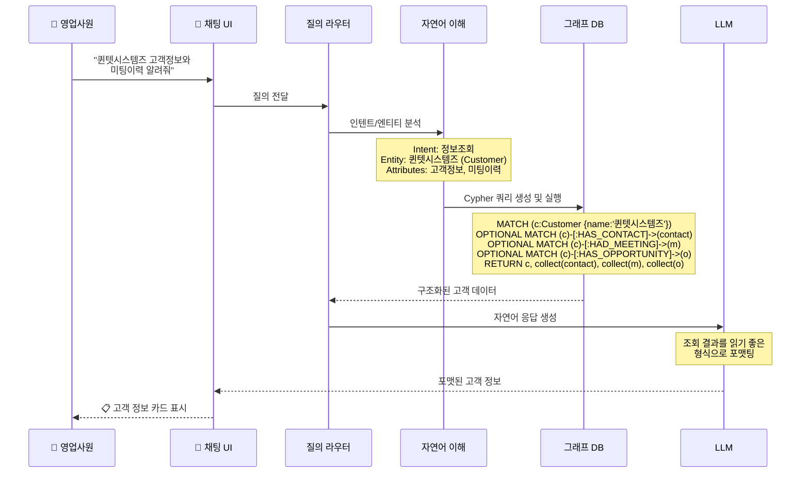
```mermaid
sequenceDiagram
    participant 영업사원 as 👤 영업사원
    participant UI as 💬 채팅 UI
    participant Router as 질의 라우터
    participant NLU as 자연어 이해
    participant GDB as 그래프 DB
    participant LLM as LLM
    
    영업사원->>UI: "퀸텟시스템즈 고객정보와<br/>미팅이력 알려줘"
    UI->>Router: 질의 전달
    Router->>NLU: 인텐트/엔티티 분석
    
    Note over NLU: Intent: 정보조회<br/>Entity: 퀸텟시스템즈 (Customer)<br/>Attributes: 고객정보, 미팅이력
    
    NLU->>GDB: Cypher 쿼리 생성 및 실행
    
    Note over GDB: MATCH (c:Customer {name:'퀸텟시스템즈'})<br/>OPTIONAL MATCH (c)-[:HAS_CONTACT]->(contact)<br/>OPTIONAL MATCH (c)-[:HAD_MEETING]->(m)<br/>OPTIONAL MATCH (c)-[:HAS_OPPORTUNITY]->(o)<br/>RETURN c, collect(contact), collect(m), collect(o)
    
    GDB-->>Router: 구조화된 고객 데이터
    
    Router->>LLM: 자연어 응답 생성
    Note over LLM: 조회 결과를 읽기 좋은<br/>형식으로 포맷팅
    
    LLM-->>UI: 포맷된 고객 정보
    UI-->>영업사원: 📋 고객 정보 카드 표시
```

---

### 7.6 시나리오 4: 비즈니스 자동화 전체 플로우

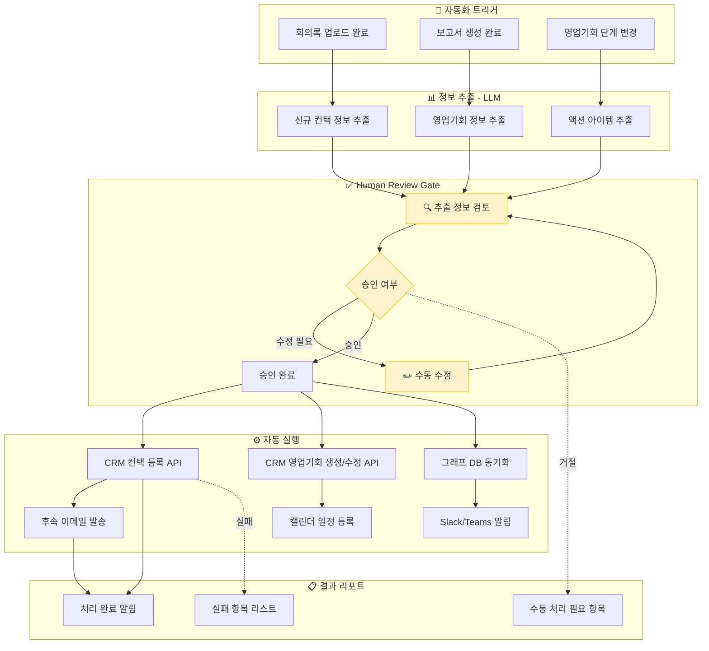
```mermaid
flowchart TB
    subgraph 트리거["🎯 자동화 트리거"]
        T1[회의록 업로드 완료]
        T2[보고서 생성 완료]
        T3[영업기회 단계 변경]
    end
    
    subgraph 추출["📊 정보 추출 - LLM"]
        E1[신규 컨택 정보 추출]
        E2[영업기회 정보 추출]
        E3[액션 아이템 추출]
    end
    
    subgraph 검증["✅ Human Review Gate"]
        direction TB
        V1[🔍 추출 정보 검토]
        V2{승인 여부}
        V3[✏️ 수동 수정]
        
        V1 --> V2
        V2 -->|수정 필요| V3
        V3 --> V1
        V2 -->|승인| PASS[승인 완료]
    end
    
    subgraph 자동실행["⚙️ 자동 실행"]
        direction TB
        A1[CRM 컨택 등록 API]
        A2[CRM 영업기회 생성/수정 API]
        A3[그래프 DB 동기화]
        A4[후속 이메일 발송]
        A5[캘린더 일정 등록]
        A6[Slack/Teams 알림]
    end
    
    subgraph 결과["📋 결과 리포트"]
        R1[처리 완료 알림]
        R2[실패 항목 리스트]
        R3[수동 처리 필요 항목]
    end
    
    T1 --> E1
    T2 --> E2
    T3 --> E3
    
    E1 --> V1
    E2 --> V1
    E3 --> V1
    
    PASS --> A1
    PASS --> A2
    PASS --> A3
    A1 --> A4
    A2 --> A5
    A3 --> A6
    
    A1 --> R1
    A4 --> R1
    A1 -.->|실패| R2
    V2 -.->|거절| R3
    
    style V1 fill:#fff3cd,stroke:#ffc107
    style V2 fill:#fff3cd,stroke:#ffc107
    style V3 fill:#fff3cd,stroke:#ffc107
```

---

### 7.7 Human-in-the-Loop 체크포인트 상세

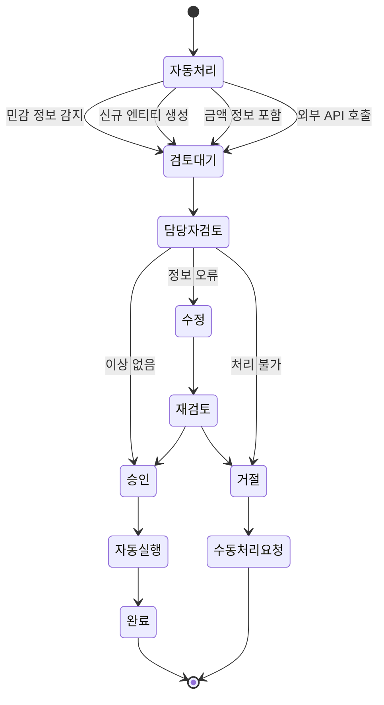
```mermaid
stateDiagram-v2
    [*] --> 자동처리
    
    자동처리 --> 검토대기: 민감 정보 감지
    자동처리 --> 검토대기: 신규 엔티티 생성
    자동처리 --> 검토대기: 금액 정보 포함
    자동처리 --> 검토대기: 외부 API 호출
    
    검토대기 --> 담당자검토
    
    담당자검토 --> 승인: 이상 없음
    담당자검토 --> 수정: 정보 오류
    담당자검토 --> 거절: 처리 불가
    
    수정 --> 재검토
    재검토 --> 승인
    재검토 --> 거절
    
    승인 --> 자동실행
    자동실행 --> 완료
    
    거절 --> 수동처리요청
    수동처리요청 --> [*]
    완료 --> [*]
```

**Human Review 트리거 조건:**
- 신규 컨택 정보 CRM 등록
- 영업기회 금액 > 1억원
- 외부 이메일 발송
- 계약/법률 문서 관련

---

### 7.8 시나리오별 RAG 파이프라인 매핑

| 시나리오 | 주요 RAG 유형 | 검색 대상 | 자동화 연동 | Human Review 포인트 |
|----------|---------------|-----------|-------------|---------------------|
| **미팅 전 인사이트** | Hybrid (Graph + Vector) | 고객 그래프 + 유사 제안서 | - | 민감 정보 포함 시 |
| **회의록 → 보고서** | Vector RAG | 회의록 임베딩 | 보고서 생성 | 최종 보고서 검토 |
| **회의록 → 자동화** | Graph RAG | 엔티티 추출 → 그래프 | CRM API, 이메일 | 컨택/기회 정보 검증 |
| **고객 정보 조회** | Graph RAG | 고객 중심 그래프 탐색 | - | - |
| **유사 사례 검색** | Vector RAG | 제안서/계약서 임베딩 | - | - |

---

## 8. 구현 가이드라인

### 8.1 단계별 구현 로드맵

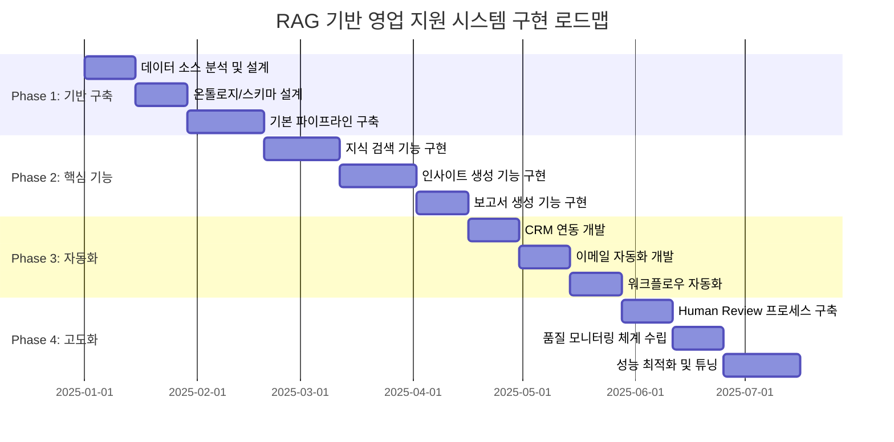
```mermaid
gantt
    title RAG 기반 영업 지원 시스템 구현 로드맵
    dateFormat  YYYY-MM-DD
    section Phase 1: 기반 구축
    데이터 소스 분석 및 설계     :a1, 2025-01-01, 2w
    온톨로지/스키마 설계        :a2, after a1, 2w
    기본 파이프라인 구축        :a3, after a2, 3w
    
    section Phase 2: 핵심 기능
    지식 검색 기능 구현         :b1, after a3, 3w
    인사이트 생성 기능 구현     :b2, after b1, 3w
    보고서 생성 기능 구현       :b3, after b2, 2w
    
    section Phase 3: 자동화
    CRM 연동 개발              :c1, after b3, 2w
    이메일 자동화 개발         :c2, after c1, 2w
    워크플로우 자동화          :c3, after c2, 2w
    
    section Phase 4: 고도화
    Human Review 프로세스 구축  :d1, after c3, 2w
    품질 모니터링 체계 수립     :d2, after d1, 2w
    성능 최적화 및 튜닝        :d3, after d2, 3w
```

### 8.2 핵심 성공 요인

| 영역 | 핵심 요인 | 체크포인트 |
|------|-----------|------------|
| **데이터 품질** | 정확한 고객/컨택 데이터 | 데이터 정합성 검증 자동화 |
| **온톨로지 설계** | 비즈니스 요구사항 반영 | 도메인 전문가 검토 |
| **검색 정확도** | 적절한 청킹 및 임베딩 | Hit Rate, MRR 모니터링 |
| **자동화 신뢰성** | Human Review 게이트 | 승인율, 수정율 추적 |
| **사용자 경험** | 빠른 응답 시간 | P95 latency < 3초 |

---

## 9. 참고 자료

### 9.1 기술 블로그 및 공식 문서

| 출처 | 제목 | URL |
|------|------|-----|
| **Microsoft Research** | GraphRAG: New tool for complex data discovery | https://www.microsoft.com/en-us/research/blog/graphrag-new-tool-for-complex-data-discovery-now-on-github/ |
| **Neo4j** | RAG Tutorial: How to Build a RAG System on a Knowledge Graph | https://neo4j.com/blog/developer/knowledge-graph-rag-application/ |
| **Neo4j** | Advanced RAG Techniques for High-Performance LLM Applications | https://neo4j.com/blog/genai/advanced-rag-techniques/ |
| **Neo4j GDS** | Community Detection Algorithms | https://neo4j.com/docs/graph-data-science/current/algorithms/community/ |
| **NVIDIA** | RAG 101: Demystifying Retrieval-Augmented Generation Pipelines | https://developer.nvidia.com/blog/rag-101-demystifying-retrieval-augmented-generation-pipelines/ |
| **Databricks** | Improve RAG data pipeline quality | https://docs.databricks.com/aws/en/generative-ai/tutorials/ai-cookbook/quality-data-pipeline-rag |
| **Qdrant** | GraphRAG with Qdrant and Neo4j | https://qdrant.tech/documentation/examples/graphrag-qdrant-neo4j/ |
| **Weaviate** | Chunking Strategies to Improve Your RAG Performance | https://weaviate.io/blog/chunking-strategies-for-rag |
| **Elasticsearch Labs** | Graph RAG: Navigating graphs for RAG using Elasticsearch | https://www.elastic.co/search-labs/blog/rag-graph-traversal |

### 9.2 학술 논문 및 기술 보고서

| 출처 | 제목 |
|------|------|
| **arXiv** | From Local to Global: A Graph RAG Approach to Query-Focused Summarization (Microsoft) |
| **arXiv** | HybridRAG: Integrating Knowledge Graphs and Vector Retrieval Augmented Generation |
| **arXiv** | KGGen: Extracting Knowledge Graphs from Plain Text with Language Models |

### 9.3 오픈소스 프로젝트

| 프로젝트 | 설명 | URL |
|----------|------|-----|
| **neo4j-graphrag-python** | Neo4j 공식 GraphRAG Python 라이브러리 | https://github.com/neo4j/neo4j-graphrag-python |
| **Microsoft GraphRAG** | Microsoft의 GraphRAG 구현 | https://github.com/microsoft/graphrag |
| **ms-graphrag-neo4j** | Neo4j 기반 MS GraphRAG 구현 (커뮤니티) | https://github.com/neo4j-contrib/ms-graphrag-neo4j |
| **LangChain** | LLM 애플리케이션 프레임워크 | https://github.com/langchain-ai/langchain |
| **LlamaIndex** | 데이터 프레임워크 for LLM 애플리케이션 | https://github.com/run-llama/llama_index |

---

> **면책조항**: 이 문서는 일반적인 아키텍처 패턴과 베스트 프랙티스를 정리한 것으로, 실제 구현 시에는 구체적인 요구사항과 기술 스택에 맞게 조정이 필요합니다.
