# 시나리오: GraphDB RAG + Hybrid RAG

<aside>
💡

목 차

</aside>

# Vector RAG + Graph RAG

---

# 벡터 RAG 및 그래프DB RAG 데이터 파이프라인 종합 연구

---

## 목차

1. [개요](https://www.notion.so/GraphDB-RAG-Hybrid-RAG-2d50d248dc8880509aacfdd4035e454c?pvs=21)
2. [벡터 DB 파이프라인 시나리오 (Vector RAG)](https://www.notion.so/GraphDB-RAG-Hybrid-RAG-2d50d248dc8880509aacfdd4035e454c?pvs=21)
3. [그래프 DB 파이프라인 시나리오 (Graph RAG)](https://www.notion.so/GraphDB-RAG-Hybrid-RAG-2d50d248dc8880509aacfdd4035e454c?pvs=21)
4. [하이브리드 파이프라인 시나리오](https://www.notion.so/GraphDB-RAG-Hybrid-RAG-2d50d248dc8880509aacfdd4035e454c?pvs=21)
5. [Human-in-the-Loop 액션 포인트](https://www.notion.so/GraphDB-RAG-Hybrid-RAG-2d50d248dc8880509aacfdd4035e454c?pvs=21)
6. [참고: Microsoft GraphRAG 특화 개념](https://www.notion.so/GraphDB-RAG-Hybrid-RAG-2d50d248dc8880509aacfdd4035e454c?pvs=21)
7. [실전 비즈니스 시나리오: 영업 지원 AI 시스템](https://www.notion.so/GraphDB-RAG-Hybrid-RAG-2d50d248dc8880509aacfdd4035e454c?pvs=21)
8. [구현 가이드라인](https://www.notion.so/GraphDB-RAG-Hybrid-RAG-2d50d248dc8880509aacfdd4035e454c?pvs=21)
9. [참고 자료](https://www.notion.so/GraphDB-RAG-Hybrid-RAG-2d50d248dc8880509aacfdd4035e454c?pvs=21)

---

## 1. 개요

### 1.1 RAG(Retrieval-Augmented Generation)란?

RAG는 대규모 언어 모델(LLM)의 응답 생성 전에 외부 지식 저장소에서 관련 정보를 검색하여 컨텍스트로 제공하는 기술이다. 이를 통해 환각(Hallucination)을 줄이고, 최신 정보 및 도메인 특화 지식을 활용한 정확한 응답 생성이 가능하다.

### 1.2 Vector RAG vs Graph RAG 비교

| 구분 | Vector RAG | Graph RAG |
| --- | --- | --- |
| **검색 방식** | 의미적 유사도 기반 | 관계 기반 / 키워드 기반 |
| **데이터 구조** | 고차원 벡터 임베딩 | 노드-엣지 그래프 구조 |
| **장점** | 유사 개념/패러프레이즈 검색 우수 | 복잡한 관계 추론, 멀티홉 질의 가능 |
| **단점** | 정확한 키워드 매칭 취약, 관계 추론 한계 | 초기 구축 비용 높음, 스키마 설계 필요 |
| **적합 유스케이스** | 문서 검색, FAQ, 일반 Q&A | 지식 그래프 질의, 관계 분석 |

---

## 2. 벡터 DB 파이프라인 시나리오 (Vector RAG)

### 2.1 파이프라인 전체 아키텍처

```mermaid
flowchart TB
    subgraph 인덱싱["📥 인덱싱 파이프라인 (Offline)"]
        direction TB
        A[원시 데이터 수집] --> B[데이터 전처리]
        B --> C[청킹 전략 적용]
        C --> D[임베딩 생성]
        D --> E[벡터 DB 저장 및 인덱싱]

        B1[🔍 품질 검토<br/>Human Review] -.-> B
        C1[🔍 청크 품질 검토<br/>Human Review] -.-> C
    end

    subgraph 검색["🔎 검색 파이프라인 (Online)"]
        direction TB
        F[사용자 질의] --> G[질의 임베딩 변환]
        G --> H[벡터 유사도 검색<br/>ANN Search]
        H --> I[후보 문서 반환]
        I --> J[리랭킹]
        J --> K[컨텍스트 구성]
        K --> L[LLM 응답 생성]
        L --> M[응답 반환]

        N[🔍 응답 품질 평가<br/>Human Review] -.-> L
    end

    E --> H

    style B1 fill:#fff3cd,stroke:#ffc107
    style C1 fill:#fff3cd,stroke:#ffc107
    style N fill:#fff3cd,stroke:#ffc107

```

### 2.2 인덱싱 파이프라인 상세

### 2.2.1 데이터 수집 및 전처리

**주요 단계:**

- 다양한 소스(PDF, 웹페이지, DB, API)에서 데이터 수집
- 데이터 클리닝: 헤더/푸터, 특수문자, 노이즈 제거
- 형식 정규화: 인코딩 통일, 메타데이터 추출

**🔧 Human Action Point:**

- 도메인 전문가의 데이터 소스 선정 및 우선순위 결정
- 데이터 품질 검토 및 부적합 데이터 필터링 기준 수립

### 2.2.2 청킹 전략 (Chunking Strategies)

| 전략 | 설명 | 장점 | 단점 |
| --- | --- | --- | --- |
| **고정 크기 청킹** | 일정 토큰/문자 수로 분할 | 구현 간단, 예측 가능 | 의미적 경계 무시 |
| **문맥 인식 청킹** | 문장/단락 경계 기반 분할 | 의미 단위 보존 | 청크 크기 불균일 |
| **시맨틱 청킹** | 임베딩 유사도 기반 분할 | 주제 일관성 유지 | 계산 비용 높음 |
| **재귀적 청킹** | 계층적 분할(문서→섹션→단락) | 컨텍스트 계층 유지 | 복잡한 구현 |

**권장 시작점:**

- 청크 크기: 512 토큰
- 오버랩: 50-100 토큰

**🔧 Human Action Point:**

- 청킹 결과물에 대한 샘플링 검토
- 도메인 특성에 맞는 청킹 전략 선정 및 파라미터 튜닝

### 2.2.3 임베딩 생성

**핵심 고려사항:**

- 임베딩 모델의 최대 토큰 한도 확인 (예: 512 토큰)
- 도메인 특화 모델 파인튜닝 검토
- 모델 크기 vs 성능 vs 비용 트레이드오프

### 2.2.4 벡터 DB 저장 및 인덱싱

**인덱싱이란?**

임베딩 벡터를 효율적으로 검색할 수 있도록 **인덱스 구조(HNSW, IVF 등)를 생성**하는 과정이다. 수백만 개 벡터에서 밀리초 단위 검색을 가능하게 한다.

**주요 인덱싱 알고리즘 [ANN Search (Approximate Nearest Neighbor Search, 근사 최근접 이웃 탐색)]:**

| 알고리즘 | 설명 | 특징 |
| --- | --- | --- |
| **HNSW** | 벡터들을 여러 층(Layer)의 **그래프**로 연결.
고속도로처럼 상위 층에서 대략적인 위치를 잡고, 하위 층으로 내려가며 정밀하게 찾기. | 가장 널리 사용, 높은 정확도SOTA(State-of-the-Art).
단, 데이터가 수십억 개로 늘어나면 메모리를 너무 많이 잡아먹음. |
| **DiskANN** | Vamana 그래프는 SSD에서 데이터를 읽어오는 횟수(I/O)를 최소화하도록 설계 | 값비싼 RAM 대신 **SSD(디스크)**를 활용하면서도, HNSW에 버금가는 속도.
단,  |
| **IVF** | 전체 벡터 공간을 여러 구역(Cluster)으로 나눔(Voronoi cells). | 대용량에 적합. 메모리 효율 좋음. |
| **LSH** | 유사한 벡터들이 같은 '해시 버킷'에 담기도록 설계된 특수 해시 함수를 사용 | 고차원 데이터 처리에 빠르지만 정확도가 떨어질 수 있음 |
| **Flat** | 전체 검색 (인덱스 없음) | 정확도 100%, 느림 |

**메타데이터 강화 예시:**

```json
{
  "text": "문서 청크 내용...",
  "vector": [0.012, 0.56, ...],
  "metadata": {
    "source": "manual_2024.pdf",
    "page": 12,
    "section": "installation",
    "language": "ko",
    "timestamp": "2024-01-15T10:30:00Z",
    "content_hash": "abc123..."
  }
}

```

### 2.3 검색 파이프라인 상세

```mermaid
sequenceDiagram
    participant User as 사용자
    participant QE as 질의 엔진
    participant VDB as 벡터 DB
    participant RR as 리랭커
    participant LLM as LLM
    participant QA as 품질 담당자

    User->>QE: 질의 입력
    QE->>QE: 질의 임베딩 변환
    QE->>VDB: ANN 검색 (Top-K)
    VDB-->>QE: 후보 청크 반환
    QE->>RR: 리랭킹 요청
    RR-->>QE: 정렬된 결과
    QE->>LLM: 컨텍스트 + 질의
    LLM-->>QE: 응답 생성
    QE-->>User: 최종 응답

    Note over QA: 주기적 품질 모니터링
    QA-->>QE: 피드백 반영

```

### 2.3.1 리랭킹 (Reranking)

**목적:** 초기 검색 결과의 정확도 향상

**주요 방식:**

- **Cross-Encoder**: 질의-문서 쌍을 트랜스포머로 직접 스코어링 (고정확도, 고비용)
- **ColBERT (Late Interaction)**: 토큰 레벨 유사도 계산 (균형점)
- **RRF (Reciprocal Rank Fusion)**: 여러 검색 결과 순위 통합

**🔧 Human Action Point:**

- 리랭킹 결과 샘플링 평가
- 도메인별 리랭킹 모델 성능 검증

---

## 3. 그래프 DB 파이프라인 시나리오 (Graph RAG)

### 3.1 파이프라인 전체 아키텍처

```mermaid
flowchart TB
    subgraph 인덱싱["📥 지식 그래프 구축 파이프라인 (Offline)"]
        direction TB
        A[원시 문서] --> B[텍스트 청킹]
        B --> C[엔티티/관계 추출<br/>NER + RE]
        C --> D[🔍 엔티티 검증<br/>Human Review]
        D --> E[엔티티 정규화<br/>Entity Resolution]
        E --> F[온톨로지 매핑]
        F --> G[지식 그래프 저장]
        G --> H[벡터 인덱스 생성<br/>엔티티/청크 임베딩]

        I[🔍 온톨로지 설계<br/>Human Design] -.-> F
    end

    subgraph 검색["🔎 검색 파이프라인 (Online)"]
        direction TB
        J[사용자 질의] --> K{검색 전략 선택}
        K -->|구조화 질의| L[Text-to-Cypher<br/>쿼리 생성]
        K -->|시맨틱 질의| M[벡터 유사도 검색<br/>+ 그래프 탐색]
        L --> N[그래프 DB 실행]
        M --> N
        N --> O[컨텍스트 구성]
        O --> P[LLM 응답 생성]
        P --> Q[응답 반환]

        R[🔍 응답 검증<br/>Human Review] -.-> P
    end

    G --> N
    H --> M

    style D fill:#fff3cd,stroke:#ffc107
    style I fill:#fff3cd,stroke:#ffc107
    style R fill:#fff3cd,stroke:#ffc107

```

### 3.2 지식 그래프 구축 파이프라인

### 3.2.1 엔티티 및 관계 추출 (NER + RE)

**NER (Named Entity Recognition) - 개체명 인식:**

텍스트에서 의미 있는 엔티티를 식별하고 분류하는 작업이다.

```
입력: "김철수 부장은 퀸텟시스템즈에서 근무한다."

NER 결과:
├── 김철수      → PERSON (인물)
├── 부장        → ROLE (직책)
└── 퀸텟시스템즈 → ORGANIZATION (조직)

```

**RE (Relation Extraction) - 관계 추출:**

엔티티 간의 관계를 추출하여 트리플(Subject, Predicate, Object)을 생성한다.

```
RE 결과:
├── (김철수, HAS_ROLE, 부장)
└── (김철수, WORKS_AT, 퀸텟시스템즈)

```

**추출 방식 비교:**

| 방식 | 설명 | 장점 | 단점 |
| --- | --- | --- | --- |
| **전통적 NER** | spaCy, BERT-NER 등 | 빠름, 일관성 | 유연성 부족 |
| **LLM 기반 추출** | GPT/Claude 프롬프트 | 유연함, 복잡한 관계 가능 | 비용 높음, 환각 위험 |
| **하이브리드** | NER + LLM 검증 | 균형점 | 파이프라인 복잡 |

```mermaid
flowchart LR
    A[텍스트 청크] --> B[NER<br/>엔티티 추출]
    B --> C[RE<br/>관계 추출]
    C --> D["트리플 생성<br/>(S, P, O)"]
    D --> E[정규화 및 중복 제거]
    E --> F[지식 그래프 저장]

```

**🔧 Human Action Point:**

- 추출된 엔티티/관계의 정확성 검증 (샘플링)
- 환각된 트리플 필터링 기준 수립
- 도메인 특화 엔티티 타입 정의

### 3.2.2 온톨로지 vs 그래프 DB 스키마

- 엔티티 정규화와 온톨로지 매핑

  # 엔티티 정규화 & 온톨로지 매핑
    
  ---

  ## 엔티티 정규화 vs 온톨로지 매핑

  | 구분 | 엔티티 정규화 (Entity Resolution) | 온톨로지 매핑 (Ontology Mapping) |
      | --- | --- | --- |
  | **핵심 질문** | "이것들이 같은 대상인가?" | "이 엔티티는 어떤 타입인가?" |
  | **목적** | 중복 제거, 대표명 통합 | 타입/관계 체계에 연결 |
  | **순서** | **먼저** | **다음** |
  | **입력** | 추출된 엔티티 목록 | 정규화된 엔티티 |
  | **출력** | 통합된 고유 엔티티 | 타입이 지정된 노드/관계 |
    
  ---

  ## 1. 엔티티 정규화 (Entity Resolution)

  **"같은 대상을 가리키는 다양한 표현을 하나로 통합"**

  ### 문제 상황

    ```
    추출된 엔티티들 (모두 같은 회사):
    • 삼성전자
    • Samsung Electronics
    • 삼성
    • SEC
    → 그대로 저장하면 4개의 중복 노드 생성!
    
    ```

  ### 정규화 결과

    ```
    삼성전자 (대표명)
    ├── aliases: Samsung Electronics, 삼성, SEC
    └── 1개의 통합된 노드
    
    ```

  ### 주요 기법

  | 기법 | 설명 |
      | --- | --- |
  | **문자열 유사도** | 편집 거리, 자카드 유사도 |
  | **별칭 사전** | 미리 정의된 동의어 매핑 |
  | **임베딩 유사도** | 벡터 공간에서 의미적 비교 |
  | **LLM 기반** | 문맥 고려한 동일성 판단 |
    
  ---

  ## 2. 온톨로지 매핑 (Ontology Mapping)

  **"정규화된 엔티티를 온톨로지 체계(클래스/관계)에 연결"**

  ### 매핑 예시

    ```
    입력: "김철수 부장이 퀸텟시스템즈와 5억원 미팅을 진행했다"
    
    온톨로지 매핑 결과:
    ├── 퀸텟시스템즈 → Customer (클래스)
    ├── 김철수 → Contact (클래스), role: 부장 (속성)
    ├── 5억원 → Opportunity.amount (속성)
    └── 관계: (퀸텟시스템즈)-[HAS_CONTACT]->(김철수)
    
    ```

  ### 매핑 대상

  | 대상 | 설명 | 예시 |
      | --- | --- | --- |
  | **클래스** | 엔티티 타입 | Person, Organization, Meeting |
  | **속성** | 엔티티 특성 | name, role, amount, date |
  | **관계** | 엔티티 간 연결 | HAS_CONTACT, HAD_MEETING |
    
  ---

  ## 3. 처리 순서

    ```
    NER + RE → 엔티티 정규화 → 온톨로지 매핑 → 지식 그래프 저장
               (먼저)          (다음)
    
    ```

  **왜 이 순서인가?**

    - **정규화 먼저**: 중복 제거 후 통합된 엔티티에 대해서만 타입 지정
    - **매핑 다음**: 1개의 노드에 1번만 타입 할당

    ---

  ## 4. Human Review 포인트

  | 단계 | 검토 항목 |
      | --- | --- |
  | **정규화** | 잘못된 통합 (다른 대상을 같다고 판단) |
  | **정규화** | 분리 실패 (같은 대상을 다르다고 판단) |
  | **매핑** | 타입 오류 (사람을 조직으로 분류) |
  | **매핑** | 관계 방향 오류 (A→B를 B→A로) |
    
  ---

  ## 요약 다이어그램

    ```
    ┌─────────────────────────────────────────────────────────────┐
    │                    지식 그래프 구축 흐름                       │
    ├─────────────────────────────────────────────────────────────┤
    │                                                             │
    │  [텍스트] → [NER+RE] → [정규화] → [매핑] → [그래프]          │
    │                          │          │                       │
    │                          ▼          ▼                       │
    │                     "같은 것     "어떤                       │
    │                      통합"      타입?"                       │
    │                                                             │
    └─────────────────────────────────────────────────────────────┘
    
    ```

  | 단계 | Entity Resolution | Ontology Mapping |
      | --- | --- | --- |
  | 질문 | 같은 대상인가? | 어떤 타입인가? |
  | 결과 | 통합된 엔티티 | 타입 지정된 노드 |

> 💡 핵심 차이: 온톨로지는 "개념과 의미의 정의"이고, 스키마는 "데이터 저장 구조"이다.
>

| 측면 | 온톨로지 | 그래프 DB 스키마 |
| --- | --- | --- |
| **목적** | 도메인 지식의 의미론적 표현 | 데이터 저장 및 쿼리 최적화 |
| **수준** | 개념적/논리적 | 물리적/기술적 |
| **표현 언어** | OWL, RDF, RDFS | Cypher DDL, Gremlin |
| **추론 가능** | ✅ 예 (Reasoning Engine) | ❌ 아니오 |
| **의미 정의** | ✅ 자연어 설명 포함 | ❌ 필드명만 |

**온톨로지 예시 (개념적 정의):**

```
"고객(Customer)은 제품이나 서비스를 구매하는 법인 조직이다.
고객은 하나 이상의 담당자(Contact)를 가질 수 있다.
담당자 중 의사결정권자를 키맨(KeyMan)이라 한다."

```

**그래프 DB 스키마 예시 (기술적 구현):**

```
-- 노드 제약조건
CREATE CONSTRAINT customer_name_unique
FOR (c:Customer) REQUIRE c.name IS UNIQUE;

-- 인덱스 생성
CREATE INDEX contact_email FOR (c:Contact) ON (c.email);

-- 벡터 인덱스 (Neo4j 5.x+)
CREATE VECTOR INDEX chunk_embedding
FOR (c:Chunk) ON (c.embedding)
OPTIONS {indexConfig: {`vector.dimensions`: 1536}};

```

**🔧 Human Action Point:**

- 도메인 전문가 주도의 온톨로지 스키마 설계
- 기존 표준 온톨로지 재사용 검토 (예: [Schema.org](http://schema.org/), FOAF)

### 3.3 검색 파이프라인 상세

### 3.3.1 검색 전략

| 검색 유형 | 설명 | 적합 질의 |
| --- | --- | --- |
| **Text-to-Cypher** | 자연어 → Cypher 쿼리 변환 | "퀸텟시스템즈의 담당자는?" |
| **벡터 검색 + 그래프 탐색** | 시맨틱 유사 노드 찾기 → 이웃 탐색 | "클라우드 관련 제안 사례" |
| **키워드 기반 검색** | 속성 값 매칭 | "김철수 과장 연락처" |

### 3.3.2 Text-to-Cypher 플로우

```mermaid
sequenceDiagram
    participant User as 사용자
    participant NLU as 자연어 이해
    participant LLM as LLM
    participant GDB as 그래프 DB
    participant Gen as 응답 생성

    User->>NLU: "퀸텟시스템즈의 키맨은 누구야?"
    NLU->>LLM: 스키마 + 질의 → Cypher 생성

    Note over LLM: MATCH (c:Customer {name:'퀸텟시스템즈'})<br/>-[:HAS_CONTACT]->(contact:Contact)<br/>WHERE contact.isKeyMan = true<br/>RETURN contact.name, contact.role

    LLM->>GDB: Cypher 쿼리 실행
    GDB-->>Gen: 쿼리 결과
    Gen->>User: "김철수 부장이 키맨입니다."

```

### 3.3.3 그래프 DB 스키마 예시 (고객 도메인)


---

## 4. 하이브리드 파이프라인 시나리오

### 4.1 하이브리드 아키텍처 개요 (분리형과 통합형)

하이브리드 RAG는 벡터 검색의 의미적 유사도 강점과 그래프 검색의 구조적 추론 강점을 결합한다.

- 분리형: Graph DB와 Vector DB 모두를 사용한 RAG (두 개의 독립적인 데이터베이스 시스템을 사용하는 방식)

    ```mermaid
    flowchart TB
        subgraph 인덱싱["📥 인덱싱 파이프라인 (Offline)"]
            direction TB
            A[원시 데이터 수집] --> B[데이터 전처리]
            B --> C[청킹 전략 적용]
            
            C --> D1[Chunk 임베딩 생성]
            C --> D2["엔티티/관계 추출<br/>(NER + RE)"]
            
            D2 --> E1[엔티티 정규화]
            E1 --> E2[온톨로지 매핑]
            E2 --> E3["🔍 엔티티 검증<br/>Human Review"]
            
            D1 --> VDB[("벡터 DB<br/>(Qdrant/Pinecone)")]
            E3 --> GDB[("그래프 DB<br/>(Neo4j)")]
            
            VDB -.->|"chunk_id 동기화"| GDB
            
            subgraph 벡터구조["벡터 DB 스키마"]
                V1["chunk_id (PK)"]
                V2["text"]
                V3["embedding"]
                V4["metadata"]
            end
            
            subgraph 그래프구조["그래프 DB 데이터 모델"]
                G1["Document"]
                G2["ChunkRef<br/>(chunk_id 참조)"]
                G3["Entity<br/>(name + source_chunk_ids)"]
                
                G1 -->|"PART_OF"| G2
                G2 -->|"NEXT_CHUNK"| G2
                G2 -->|"HAS_ENTITY"| G3
                G3 -->|"RELATED_TO"| G3
            end
            
            VDB --> 벡터구조
            GDB --> 그래프구조
            
            H1["🔍 데이터 품질 검토<br/>Human Review"] -.-> B
            H2["🔍 청크 품질 검토<br/>Human Review"] -.-> C
        end
    
        subgraph 검색["🔎 하이브리드 검색 파이프라인 (Online)"]
            direction TB
            I[사용자 질의] --> J[질의 분석 및 라우팅]
            
            J --> K1["벡터 유사도 검색<br/>(Chunk embedding)"]
            J --> K2["BM25 키워드 검색<br/>(Full-text index)"]
            J --> K3["Text-to-Cypher<br/>(그래프 쿼리)"]
            
            K1 --> L1["chunk_id 기반 조인"]
            K2 --> L1
            L1 --> L2["그래프 탐색 확장<br/>(HAS_ENTITY → RELATED_TO)"]
            K3 --> L3[구조화된 결과]
            
            L2 --> M[결과 융합 - RRF]
            L3 --> M
            
            M --> N[리랭킹]
            N --> O[컨텍스트 구성]
            O --> P[LLM 응답 생성]
            P --> Q[응답 반환]
            
            R["🔍 응답 품질 평가<br/>Human Review"] -.-> P
        end
        
        VDB --> K1
        VDB --> K2
        GDB --> K3
        GDB --> L2
        
        style H1 fill:#fff3cd,stroke:#ffc107
        style H2 fill:#fff3cd,stroke:#ffc107
        style E3 fill:#fff3cd,stroke:#ffc107
        style R fill:#fff3cd,stroke:#ffc107
        style V3 fill:#e1f5fe,stroke:#0288d1
        style G3 fill:#e8f5e9,stroke:#388e3c
    ```

    - 벡터 DB 스키마

        ```mermaid
        erDiagram
            CHUNK_COLLECTION {
                string chunk_id PK "UUID"
                string text "청크 원문 텍스트"
                float[] embedding "벡터 임베딩 (1536 dim)"
                string document_id FK "원본 문서 ID"
                int chunk_index "문서 내 청크 순서"
                int start_offset "시작 위치"
                int end_offset "끝 위치"
                json metadata "추가 메타데이터"
            }
        ```

    - 그래프 DB 스키마 (Neo4j)

        ```mermaid
        erDiagram
            Document ||--o{ ChunkRef : "PART_OF"
            ChunkRef ||--o| ChunkRef : "NEXT_CHUNK"
            ChunkRef ||--o{ Entity : "HAS_ENTITY"
            Entity ||--o{ Entity : "RELATED_TO"
            
            Document {
                string id PK
                string name
                string source
                string file_type
                datetime created_at
                json metadata
            }
            
            ChunkRef {
                string id PK
                string chunk_id UK "벡터DB chunk_id 참조"
                string document_id FK
                int chunk_index
                string text_preview "처음 200자 미리보기"
            }
            
            Entity {
                string id PK
                string name
                string type "Person/Organization/Location 등"
                string description
                string[] aliases "동의어 목록"
                string[] source_chunk_ids "추출된 청크 ID 목록"
                float confidence "추출 신뢰도"
            }
        ```

        - `ChunkRef` 노드는 벡터 DB의 `chunk_id`를 참조
        - `Entity.source_chunk_ids`에 해당 엔티티가 추출된 모든 청크 ID 저장
        - 실제 텍스트와 임베딩은 벡터 DB에만 저장 (중복 방지)
    - 관계(Relationship) 정의

        ```mermaid
        graph LR
            subgraph 관계타입["Relationship Types"]
                R1["PART_OF<br/>Document ← Chunk"]
                R2["NEXT_CHUNK<br/>Chunk → Chunk"]
                R3["HAS_ENTITY<br/>Chunk → Entity"]
                R4["RELATED_TO<br/>Entity ↔ Entity"]
            end
        ```

      | 관계 | 시작 노드 | 끝 노드 | 속성 | 설명 |
              | --- | --- | --- | --- | --- |
      | `PART_OF` | ChunkRef | Document | - | 청크가 속한 문서 |
      | `NEXT_CHUNK` | ChunkRef | ChunkRef | - | 문서 내 순서 |
      | `HAS_ENTITY` | ChunkRef | Entity | `confidence`, `mention_count` | 청크에서 엔티티 추출 |
      | `RELATED_TO` | Entity | Entity | `relation_type`, `confidence` | 엔티티 간 관계 |
    - **RELATED_TO 관계 속성 예시:**

        ```mermaid
        {
          "relation_type": "WORKS_FOR",
          "confidence": 0.92,
          "source_chunk_ids": ["chunk_001", "chunk_042"],
          "extracted_at": "2025-01-15T10:30:00Z"
        }
        ```

    - 엔티티 관계 추출 방식
        - 추출 파이프라인 상세

            ```mermaid
            flowchart TB
                subgraph 추출["엔티티/관계 추출 파이프라인"]
                    direction TB
                    A["청크 텍스트"] --> B["1️⃣ NER 추출<br/>(spaCy/LLM)"]
                    B --> C["2️⃣ 관계 추출<br/>(RE)"]
                    C --> D["3️⃣ 엔티티 정규화<br/>(중복 통합)"]
                    D --> E["4️⃣ 온톨로지 매핑"]
                    E --> F["5️⃣ chunk_id 매핑"]
                    F --> G["그래프 DB 저장"]
                    F --> H["벡터 DB chunk_id 동기화"]
                end
                
                subgraph 출력["추출 결과물"]
                    O1["Entity 노드<br/>+ source_chunk_ids"]
                    O2["RELATED_TO 관계<br/>+ source_chunk_ids"]
                    O3["HAS_ENTITY 관계<br/>ChunkRef → Entity"]
                end
                
                G --> O1
                G --> O2
                G --> O3
            ```

        - LLM 기반 추출 프롬프트 예시

            ```json
            ENTITY_EXTRACTION_PROMPT = """
            당신은 텍스트에서 엔티티와 관계를 추출하는 전문가입니다.
            
            ## 입력 정보
            - chunk_id: {chunk_id}
            - 텍스트: {text}
            
            ## 온톨로지 스키마
            엔티티 타입:
            - Customer: 제품/서비스를 구매하는 고객사
            - Contact: 고객사/파트너사의 담당자
            - Product: 제품 또는 서비스
            - Opportunity: 영업 기회
            
            관계 타입:
            - WORKS_FOR: 사람 → 조직
            - HAS_CONTACT: 조직 → 사람
            - INTERESTED_IN: 조직 → 제품
            
            ## 출력 형식 (JSON)
            {{
              "entities": [
                {{
                  "name": "엔티티명",
                  "type": "엔티티타입",
                  "description": "설명",
                  "aliases": ["별칭1", "별칭2"]
                }}
              ],
              "relations": [
                {{
                  "source": "소스 엔티티명",
                  "target": "타겟 엔티티명",
                  "relation_type": "관계타입",
                  "confidence": 0.95
                }}
              ],
              "chunk_id": "{chunk_id}"
            }}
            """
            ```

        - 추출 결과 → 그래프 저장 매핑 예시

            ```python
            # 추출 결과 예시
            extraction_result = {
                "entities": [
                    {"name": "퀸텟시스템즈", "type": "Customer", "description": "IT 솔루션 기업"},
                    {"name": "김철수", "type": "Contact", "description": "퀸텟시스템즈 부장"}
                ],
                "relations": [
                    {"source": "김철수", "target": "퀸텟시스템즈", "relation_type": "WORKS_FOR", "confidence": 0.95}
                ],
                "chunk_id": "chunk_00123"
            }
            
            # Neo4j 저장 로직
            def save_to_graph(extraction_result, neo4j_driver):
                chunk_id = extraction_result["chunk_id"]
                
                # 1. ChunkRef 노드 생성/업데이트
                # 2. Entity 노드 생성 (source_chunk_ids에 chunk_id 추가)
                # 3. HAS_ENTITY 관계 생성
                # 4. RELATED_TO 관계 생성
            ```

        - 핵심 Cypher 쿼리 예시
            - 스키마 생성 쿼리

                ```graphql
                // 1. 제약조건 생성
                CREATE CONSTRAINT document_id_unique IF NOT EXISTS
                FOR (d:Document) REQUIRE d.id IS UNIQUE;
                
                CREATE CONSTRAINT chunkref_id_unique IF NOT EXISTS
                FOR (c:ChunkRef) REQUIRE c.id IS UNIQUE;
                
                CREATE CONSTRAINT chunkref_chunk_id_unique IF NOT EXISTS
                FOR (c:ChunkRef) REQUIRE c.chunk_id IS UNIQUE;
                
                CREATE CONSTRAINT entity_id_unique IF NOT EXISTS
                FOR (e:Entity) REQUIRE e.id IS UNIQUE;
                
                // 2. 인덱스 생성
                CREATE INDEX entity_name_index IF NOT EXISTS
                FOR (e:Entity) ON (e.name);
                
                CREATE INDEX entity_type_index IF NOT EXISTS
                FOR (e:Entity) ON (e.type);
                
                CREATE INDEX chunkref_chunk_id_index IF NOT EXISTS
                FOR (c:ChunkRef) ON (c.chunk_id);
                
                // 3. Full-text 인덱스 생성 (BM25 검색용)
                CREATE FULLTEXT INDEX entity_fulltext IF NOT EXISTS
                FOR (e:Entity) ON EACH [e.name, e.description, e.aliases];
                ```

            - 데이터 삽입 쿼리

                ```graphql
                // Document 노드 생성
                CREATE (d:Document {
                    id: $document_id,
                    name: $name,
                    source: $source,
                    file_type: $file_type,
                    created_at: datetime()
                });
                
                // ChunkRef 노드 생성 및 Document 연결
                MATCH (d:Document {id: $document_id})
                CREATE (c:ChunkRef {
                    id: $chunkref_id,
                    chunk_id: $chunk_id,
                    document_id: $document_id,
                    chunk_index: $chunk_index,
                    text_preview: $text_preview
                })
                CREATE (c)-[:PART_OF]->(d);
                
                // 이전 ChunkRef와 NEXT_CHUNK 연결
                MATCH (prev:ChunkRef {document_id: $document_id, chunk_index: $chunk_index - 1})
                MATCH (curr:ChunkRef {chunk_id: $chunk_id})
                CREATE (prev)-[:NEXT_CHUNK]->(curr);
                
                // Entity 노드 생성 (MERGE로 중복 방지)
                MERGE (e:Entity {name: $entity_name})
                ON CREATE SET 
                    e.id = randomUUID(),
                    e.type = $entity_type,
                    e.description = $description,
                    e.source_chunk_ids = [$chunk_id],
                    e.created_at = datetime()
                ON MATCH SET
                    e.source_chunk_ids = e.source_chunk_ids + $chunk_id;
                
                // HAS_ENTITY 관계 생성
                MATCH (c:ChunkRef {chunk_id: $chunk_id})
                MATCH (e:Entity {name: $entity_name})
                MERGE (c)-[r:HAS_ENTITY]->(e)
                ON CREATE SET r.confidence = $confidence, r.mention_count = 1
                ON MATCH SET r.mention_count = r.mention_count + 1;
                
                // RELATED_TO 관계 생성
                MATCH (e1:Entity {name: $source_entity})
                MATCH (e2:Entity {name: $target_entity})
                MERGE (e1)-[r:RELATED_TO {relation_type: $relation_type}]->(e2)
                ON CREATE SET 
                    r.confidence = $confidence,
                    r.source_chunk_ids = [$chunk_id]
                ON MATCH SET
                    r.source_chunk_ids = r.source_chunk_ids + $chunk_id;
                ```

            - 실제 검색 Cypher 쿼리 예시
                - chunk_id 기반 그래프 탐색 확장
                    - 벡터 검색 결과로 받은 chunk_ids 기반으로 그래프를 탐색하는 쿼리:

                        ```graphql
                        // 입력: 벡터 검색에서 반환된 chunk_id 목록
                        // $chunk_ids = ["chunk_001", "chunk_002", "chunk_003"]
                        
                        // 1. ChunkRef 찾기 → Entity 탐색 → 관련 Entity → 관련 ChunkRef
                        UNWIND $chunk_ids AS chunk_id
                        MATCH (c:ChunkRef {chunk_id: chunk_id})
                        
                        // 2. 해당 청크에서 추출된 엔티티 찾기
                        OPTIONAL MATCH (c)-[:HAS_ENTITY]->(e:Entity)
                        
                        // 3. 관련 엔티티 탐색 (1-2 hop)
                        OPTIONAL MATCH (e)-[:RELATED_TO*1..2]-(related_entity:Entity)
                        
                        // 4. 관련 엔티티가 언급된 다른 청크 찾기
                        OPTIONAL MATCH (related_entity)<-[:HAS_ENTITY]-(related_chunk:ChunkRef)
                        WHERE related_chunk.chunk_id <> chunk_id
                        
                        // 5. 결과 반환
                        RETURN 
                            chunk_id AS original_chunk_id,
                            collect(DISTINCT e.name) AS direct_entities,
                            collect(DISTINCT related_entity.name) AS related_entities,
                            collect(DISTINCT related_chunk.chunk_id) AS related_chunk_ids
                        ```

                - Full-text 검색 → 그래프 탐색

                    ```graphql
                    // 입력: 사용자 질의에서 추출한 키워드
                    // $search_query = "퀸텟시스템즈 클라우드"
                    
                    // 1. Full-text 인덱스로 Entity 검색
                    CALL db.index.fulltext.queryNodes("entity_fulltext", $search_query)
                    YIELD node AS entity, score
                    WHERE score > 0.5
                    
                    // 2. Entity가 언급된 ChunkRef 찾기
                    MATCH (chunk:ChunkRef)-[:HAS_ENTITY]->(entity)
                    
                    // 3. 관련 Entity 탐색
                    OPTIONAL MATCH (entity)-[r:RELATED_TO]-(related:Entity)
                    
                    // 4. 결과 반환 (chunk_id 목록 → 벡터 DB에서 텍스트 조회용)
                    RETURN 
                        entity.name AS entity_name,
                        entity.type AS entity_type,
                        score AS relevance_score,
                        collect(DISTINCT chunk.chunk_id) AS chunk_ids,
                        collect(DISTINCT {
                            name: related.name, 
                            relation: r.relation_type
                        }) AS related_entities
                    ORDER BY score DESC
                    LIMIT 10
                    ```

                - Text-to-Cypher (구조화된 질의)

                    ```graphql
                    // 질의: "퀸텟시스템즈의 담당자와 관련 영업기회를 알려줘"
                    
                    MATCH (customer:Entity {name: '퀸텟시스템즈', type: 'Customer'})
                    
                    // 담당자 찾기
                    OPTIONAL MATCH (customer)-[:HAS_CONTACT]->(contact:Entity {type: 'Contact'})
                    
                    // 영업기회 찾기
                    OPTIONAL MATCH (customer)-[:HAS_OPPORTUNITY]->(opp:Entity {type: 'Opportunity'})
                    
                    // 관련 청크 ID 수집 (원문 조회용)
                    WITH customer, contact, opp
                    OPTIONAL MATCH (chunk:ChunkRef)-[:HAS_ENTITY]->(customer)
                    
                    RETURN 
                        customer.name AS customer_name,
                        customer.description AS customer_desc,
                        collect(DISTINCT {
                            name: contact.name,
                            role: contact.description
                        }) AS contacts,
                        collect(DISTINCT {
                            name: opp.name,
                            description: opp.description
                        }) AS opportunities,
                        collect(DISTINCT chunk.chunk_id) AS source_chunk_ids
                    ```

                - Multi-hop 관계 탐색

                    ```graphql
                    // 질의: "김철수와 2 hop 이내로 연결된 모든 고객사는?"
                    
                    MATCH (person:Entity {name: '김철수', type: 'Contact'})
                    
                    // 2 hop 이내 관계 탐색
                    MATCH path = (person)-[:RELATED_TO|WORKS_FOR|HAS_CONTACT*1..2]-(connected:Entity)
                    WHERE connected.type = 'Customer'
                    
                    // 경로 정보와 함께 반환
                    RETURN 
                        person.name AS start_person,
                        connected.name AS connected_customer,
                        length(path) AS hop_count,
                        [rel in relationships(path) | type(rel)] AS relation_path,
                        connected.source_chunk_ids AS source_chunks
                    ```

            - 검색 파이프라인 통합 (python 예시)

                ```python
                from qdrant_client import QdrantClient
                from neo4j import GraphDatabase
                
                class HybridRAGRetriever:
                    def __init__(self, qdrant_client, neo4j_driver):
                        self.qdrant = qdrant_client
                        self.neo4j = neo4j_driver
                    
                    def search(self, query: str, top_k: int = 5) -> dict:
                        # 1. 벡터 검색 (Qdrant)
                        query_embedding = self.embed(query)
                        vector_results = self.qdrant.search(
                            collection_name="chunks",
                            query_vector=query_embedding,
                            limit=top_k
                        )
                        chunk_ids = [hit.payload["chunk_id"] for hit in vector_results]
                        
                        # 2. 그래프 탐색 확장 (Neo4j)
                        with self.neo4j.session() as session:
                            graph_results = session.run("""
                                UNWIND $chunk_ids AS chunk_id
                                MATCH (c:ChunkRef {chunk_id: chunk_id})
                                OPTIONAL MATCH (c)-[:HAS_ENTITY]->(e:Entity)
                                OPTIONAL MATCH (e)-[:RELATED_TO*1..2]-(related:Entity)
                                OPTIONAL MATCH (related)<-[:HAS_ENTITY]-(related_chunk:ChunkRef)
                                WHERE related_chunk.chunk_id <> chunk_id
                                RETURN 
                                    chunk_id,
                                    collect(DISTINCT e.name) AS entities,
                                    collect(DISTINCT related_chunk.chunk_id) AS related_chunks
                            """, chunk_ids=chunk_ids)
                            
                            # 관련 chunk_ids 수집
                            all_chunk_ids = set(chunk_ids)
                            for record in graph_results:
                                all_chunk_ids.update(record["related_chunks"])
                        
                        # 3. 벡터 DB에서 텍스트 조회
                        chunks_with_text = self.qdrant.retrieve(
                            collection_name="chunks",
                            ids=list(all_chunk_ids)
                        )
                        
                        # 4. 컨텍스트 구성
                        context = self.build_context(chunks_with_text, graph_results)
                        
                        return {
                            "original_chunks": chunk_ids,
                            "expanded_chunks": list(all_chunk_ids),
                            "context": context
                        }
                ```

        - 데이터 동기화 전략
            - chunk_id 동기화 플로우

                ```mermaid
                sequenceDiagram
                    participant App as 애플리케이션
                    participant VDB as 벡터 DB
                    participant GDB as 그래프 DB
                    
                    App->>App: 청크 생성 + UUID 발급
                    App->>VDB: 청크 저장 (chunk_id, text, embedding)
                    VDB-->>App: 저장 완료
                    
                    App->>App: 엔티티/관계 추출
                    App->>GDB: ChunkRef 생성 (chunk_id 참조)
                    App->>GDB: Entity + 관계 저장
                    GDB-->>App: 저장 완료
                    
                    Note over VDB,GDB: chunk_id로 양방향 참조 가능
                ```

            - 동기화 검증 쿼리

                ```graphql
                // 그래프 DB에 있지만 벡터 DB에 없는 chunk_id 찾기
                MATCH (c:ChunkRef)
                WHERE NOT c.chunk_id IN $vector_db_chunk_ids
                RETURN c.chunk_id AS orphaned_chunk_id, c.document_id
                ```

- **통합형(Integrated)**: 단일 데이터베이스 시스템 내에서 벡터 검색과 그래프 쿼리를 모두 지원하는 방식

    ```mermaid
    flowchart TB
        subgraph 인덱싱["📥 인덱싱 파이프라인 (Offline)"]
            direction TB
            A[원시 데이터 수집] --> B[데이터 전처리]
            B --> C[청킹 전략 적용]
            
            C --> D1[Chunk 임베딩 생성]
            C --> D2["엔티티/관계 추출<br/>(NER + RE)"]
            
            D2 --> E1[엔티티 정규화]
            E1 --> E2[온톨로지 매핑]
            E2 --> E3["🔍 엔티티 검증<br/>Human Review"]
            
            D1 --> F[("Neo4j<br/>(Vector Index + Graph)")]
            E3 --> F
            
            subgraph 그래프구조["그래프 데이터 모델"]
                G1["Document"]
                G2["Chunk<br/>(text + embedding)"]
                G3["Entity<br/>(name + embedding)"]
                
                G1 -->|"PART_OF"| G2
                G2 -->|"NEXT_CHUNK"| G2
                G2 -->|"HAS_ENTITY"| G3
                G3 -->|"RELATED_TO"| G3
            end
            
            F --> 그래프구조
            
            H1["🔍 데이터 품질 검토<br/>Human Review"] -.-> B
            H2["🔍 청크 품질 검토<br/>Human Review"] -.-> C
        end
    
        subgraph 검색["🔎 하이브리드 검색 파이프라인 (Online)"]
            direction TB
            I[사용자 질의] --> J[질의 분석 및 라우팅]
            
            J --> K1["벡터 유사도 검색<br/>(Chunk embedding)"]
            J --> K2["BM25 키워드 검색<br/>(Full-text index)"]
            J --> K3["Text-to-Cypher<br/>(그래프 쿼리)"]
            
            K1 --> L1["그래프 탐색 확장<br/>(HAS_ENTITY → RELATED_TO)"]
            K2 --> L1
            K3 --> L2[구조화된 결과]
            
            L1 --> M[결과 융합 - RRF]
            L2 --> M
            
            M --> N[리랭킹]
            N --> O[컨텍스트 구성]
            O --> P[LLM 응답 생성]
            P --> Q[응답 반환]
            
            R["🔍 응답 품질 평가<br/>Human Review"] -.-> P
        end
        
        F --> K1
        F --> K2
        F --> K3
        
        style H1 fill:#fff3cd,stroke:#ffc107
        style H2 fill:#fff3cd,stroke:#ffc107
        style E3 fill:#fff3cd,stroke:#ffc107
        style R fill:#fff3cd,stroke:#ffc107
        style G2 fill:#e1f5fe,stroke:#0288d1
        style G3 fill:#e8f5e9,stroke:#388e3c
    ```

    - 상세 데이터 모델

        ```mermaid
        erDiagram
            Document ||--o{ Chunk : "PART_OF"
            Chunk ||--o| Chunk : "NEXT_CHUNK"
            Chunk ||--o{ Entity : "HAS_ENTITY"
            Entity ||--o{ Entity : "RELATED_TO"
            
            Document {
                string id PK
                string name
                string source
                string file_type
                datetime created_at
                json metadata
            }
            
            Chunk {
                string id PK
                string text
                float[] embedding
                int chunk_index
                int start_offset
                int end_offset
                string document_id FK
            }
            
            Entity {
                string id PK
                string name
                string type
                string description
                float[] embedding
                string[] aliases
                string[] source_chunk_ids
            }
        ```

    - 엔티티/관계 추출 방식

        ```mermaid
        flowchart TB
            subgraph 인덱싱["📥 듀얼 인덱싱 파이프라인 (상세)"]
                direction TB
                A[원시 문서] --> B[전처리 및 청킹]
                
                B --> C1[임베딩 생성]
                C1 --> D1[벡터 DB 저장]
                
                B --> C2["1️⃣ NER + RE<br/>(spaCy/LLM)"]
                C2 --> C3["2️⃣ 엔티티 정규화<br/>(중복 통합)"]
                C3 --> C4["3️⃣ 온톨로지 매핑<br/>(규칙/LLM)"]
                C4 --> D2["🔍 엔티티 검증<br/>Human Review"]
                D2 --> E2[지식 그래프 저장]
            end
            
            style C2 fill:#e3f2fd,stroke:#1565c0
            style C3 fill:#e3f2fd,stroke:#1565c0
            style C4 fill:#e3f2fd,stroke:#1565c0
            style D2 fill:#fff3cd,stroke:#ffc107
        ```

        - 전통적 NER
            - **미리 학습된 패턴 인식 모델**이 텍스트의 각 토큰을 분류
            - LLM처럼 생성하는 게 아니라, 각 단어에 **라벨을 붙이는 분류(Classification)** 작업
            - 그렇다면 NER은 필수인가?

              > **No. 바로 LLM 기반 엔티티 추출을 이용할 수도 있음.**
              >
              >
              > https://daddynkidsmakers.blogspot.com/2024/05/rag.html
              >
              > GraphRAG는 BERT NER 모델과 같은 전통적인 모델을 사용할 수도 있지만, 핵심적인 강점은 BERT와 같은 특정 모델에 의존하기보다 거대 언어 모델(LLM) 자체를 활용하는 데 있다. 기존의 BERT NER 모델은 '인물', '기관' 등 미리 정해진 유형(pre-defined type)의 개체를 추출하는 데 특화되어 있다. 하지만 이 방식은 새로운 도메인이나 새로운 유형의 개체를 인식하려면 별도의 데이터로 모델을 재학습(fine-tuning)해야 하는 번거로움이 있다.
              >
              > 반면, GraphRAG는 LLM의 강력한 제로샷/퓨샷(Zero-shot/Few-shot) 능력을 활용한다. 즉, 별도의 학습 없이 정교하게 설계된 프롬프트(prompt)를 통해 텍스트의 맥락에 맞는 핵심 개체와 관계를 동적으로 추출한다. 이는 훨씬 유연하고 강력한 접근법으로, 단순한 '개체명'을 넘어 '개념', '사건', '주장' 등 추상적인 요소까지 추출할 수 있게 한다.
              >
              > https://microsoft.github.io/graphrag/index/methods/
              >
              > - MS의 그래프 RAG에서는 LLM을 사용하는 표준 GraphRAG와 NER 모델을 사용하는 FastGraphRAG로 나누고 있음.
                  >     - Standard GraphRAG: 엔티티 추출, 관계 추출, 엔티티 요약, 관계 요약, 주장 추출에 LLM 사용
              >     - FastGraphRAG: 엔티티 추출에 전통적 NER 모델(`SpaCy` 등)을 사용함.
        - NER 출력 이후 온톨로지 매핑 방식
            - **방법 1: 규칙 기반 매핑 (LLM 없이)**

                ```python
                # 규칙 + 외부 데이터 활용
                def map_to_ontology(entity, entity_type, context):
                    
                    if entity_type == "ORG":
                        # 1. CRM 마스터 데이터 조회
                        if entity in crm_customer_list:
                            return "Customer"
                        elif entity in crm_partner_list:
                            return "Partner"
                        elif entity == MY_COMPANY_NAME:
                            return "InternalOrg"
                        else:
                            return "Organization"  # 기본값
                    
                    elif entity_type == "PER":
                        # 2. 문맥 규칙
                        if "부장" in context or "과장" in context:
                            return "Contact"  # 직책 언급 → 담당자
                        elif entity in internal_employee_list:
                            return "SalesRep"
                        else:
                            return "Person"  # 기본값
                    
                    elif entity_type == "MONEY":
                        # 3. 키워드 규칙
                        if "계약" in context:
                            return "Contract.amount"
                        elif "기회" in context or "제안" in context:
                            return "Opportunity.amount"
                ```

                - **한계:** 규칙이 복잡해지고, 예외 케이스 처리 어려움
            - **방법 2: 분류 모델 학습 (LLM 없이)**
                - 도메인 특화 분류 모델을 별도로 학습:

                ```python
                # 2단계 파이프라인
                # Step 1: 일반 NER
                ner_result = spacy_model("김철수 부장이 퀸텟시스템즈와 미팅")
                # → [("김철수", "PER"), ("퀸텟시스템즈", "ORG")]
                
                # Step 2: 도메인 특화 분류 모델
                for entity, general_type in ner_result:
                    context = get_surrounding_text(entity)
                    
                    if general_type == "PER":
                        # 학습된 분류 모델로 세부 타입 예측
                        specific_type = person_classifier.predict(entity, context)
                        # → "Contact" or "SalesRep" or "Person"
                    
                    elif general_type == "ORG":
                        specific_type = org_classifier.predict(entity, context)
                        # → "Customer" or "Partner" or "Organization"
                ```

                - **한계:** 도메인별 학습 데이터 필요, 모델 관리 복잡
            - **방법 3: LLM 기반 매핑 (가장 유연)**

                ```python
                prompt = """
                온톨로지 스키마:
                - Customer: 제품/서비스를 구매하는 고객사
                - Partner: 협력 파트너사
                - Contact: 고객사/파트너사의 담당자
                - SalesRep: 우리 회사 영업사원
                
                다음 엔티티를 온톨로지에 매핑하세요:
                
                텍스트: "김철수 부장이 퀸텟시스템즈와 클라우드 도입 미팅을 진행했다"
                추출된 엔티티:
                - 김철수 (PER)
                - 퀸텟시스템즈 (ORG)
                
                출력 형식:
                - 김철수 → ?
                - 퀸텟시스템즈 → ?
                """
                ```

    - 핵심 Cypher 쿼리 예시

        ```mermaid
        flowchart LR
            subgraph 검색흐름["Graph-Enhanced Vector Search"]
                A["1️⃣ 벡터 검색<br/>Top-K Chunks"] --> B["2️⃣ 엔티티 탐색<br/>HAS_ENTITY"]
                B --> C["3️⃣ 관계 확장<br/>RELATED_TO (1-2 hop)"]
                C --> D["4️⃣ 연관 Chunk 수집<br/>역방향 HAS_ENTITY"]
                D --> E["5️⃣ 컨텍스트 조합"]
            end
        ```

        - 실제 Cypher 쿼리

            ```graphql
            // 1. 벡터 검색으로 유사 Chunk 찾기
            CALL db.index.vector.queryNodes('chunk_embedding_index', 5, $query_embedding)
            YIELD node AS chunk, score
            
            // 2. 찾은 Chunk에서 Entity로 탐색
            MATCH (chunk)-[:HAS_ENTITY]->(entity:Entity)
            
            // 3. Entity 간 관계 확장 (1-2 hop)
            OPTIONAL MATCH (entity)-[:RELATED_TO*1..2]-(related_entity:Entity)
            
            // 4. 관련 Entity가 언급된 다른 Chunk 수집
            OPTIONAL MATCH (related_entity)<-[:HAS_ENTITY]-(related_chunk:Chunk)
            
            // 5. 결과 반환
            RETURN chunk.text AS original_text,
                   chunk.id AS chunk_id,
                   score,
                   collect(DISTINCT entity.name) AS entities,
                   collect(DISTINCT related_chunk.text) AS related_contexts
            ORDER BY score DESC
            ```

- 분리형과 통합형 비교 요약


    | 구분 | 통합형 (Neo4j) | 분리형 (VectorDB + Neo4j) |
    | --- | --- | --- |
    | **Chunk 저장** | Chunk 노드 (embedding 속성) | 벡터 DB (별도) |
    | **그래프 저장** | Entity + ChunkRef + 관계 | ChunkRef(참조만) + Entity + 관계 |
    | **검색 쿼리** | 단일 DB 쿼리 | 2개 DB 쿼리 + 조인 |
    | **동기화** | 불필요 | chunk_id 동기화 필수 |
    | **장점** | 단순한 아키텍처, 트랜잭션 일관성 | 각 DB 최적화, 대규모 확장성 |
    | **단점** | 대규모 벡터에서 성능 한계 | 복잡한 동기화, 조인 오버헤드 |
    - best practice
        
        ## 하이브리드 RAG Best Practice (2025)
        
        ## Best Practice 판단 기준
        
        | 상황 | 권장 방식 | 이유 |
        | --- | --- | --- |
        | 벡터 규모 < 1억 | **통합형 (Neo4j)** | 단일 쿼리, 트랜잭션 일관성 |
        | 벡터 규모 > 10억 | **분리형** | 전문 벡터 DB 성능 필요 |
        | 신규 프로젝트 | **통합형** | 아키텍처 단순화 |
        | 기존 벡터 DB 투자 있음 | **분리형** | 인프라 재활용 |
        | 관계 탐색 중심 | **통합형** | 그래프 탐색 확장이 핵심 |
        
        ---
        
        ## 참조 레퍼런스
        
        ### 1. Neo4j 공식 (통합형 권장)
        
        > 각 텍스트 청크는 Neo4j에 단일 고립 노드로 저장됩니다. 기본적으로 LangChain의 Neo4j 벡터 인덱스 구현은 Chunk 노드 레이블을 사용하여 문서를 표현하며, text 속성은 문서의 텍스트를 저장하고 embedding 속성은 텍스트의 벡터 표현을 보유합니다.
        > 
        
        **URL:** [https://neo4j.com/blog/developer/neo4j-langchain-vector-index-implementation/](https://neo4j.com/blog/developer/neo4j-langchain-vector-index-implementation/)
        
        ---
        
        ### 2. GraphRAG Pattern Catalog (통합형 - Lexical Graph)
        
        > Chunk 노드는 청크의 텍스트와 벡터 임베딩을 포함하고, Entity 노드는 엔티티 이름과 선택적으로 설명 및 벡터 임베딩을 포함합니다. 벡터 검색만으로는 질문에 답하기 위한 모든 관련 컨텍스트를 찾는 것이 어렵기 때문에, 청크에서 추출된 실세계 엔티티를 서로 연결하고 이러한 관계를 벡터 검색과 함께 검색하면 청크가 다루는 엔티티에 대한 추가 컨텍스트를 제공합니다.
        > 
        
        **URL:** [https://graphrag.com/reference/knowledge-graph/lexical-graph-extracted-entities/](https://graphrag.com/reference/knowledge-graph/lexical-graph-extracted-entities/)
        
        ---
        
        ### 3. Neo4j GenAI Chatbot 실제 구현 (통합형)
        
        > :Document 노드는 :Chunk 노드를 가지며, 이들은 :NEXT_CHUNK 관계로 문서 순서대로 연결됩니다. :Chunk 노드는 Neo4j 벡터 인덱스로 지원되는 임베딩 속성을 가집니다. 추출된 엔티티는 :Entity 노드로 인스턴스화되고 :HAS_ENTITY 관계를 통해 청크에 매핑됩니다(문서 내 및 문서 간). 이것을 렉시컬 그래프라고 합니다.
        > 
        
        **URL:** [https://neo4j.com/blog/genai/graphrag-chatbot-unstructured-io/](https://neo4j.com/blog/genai/graphrag-chatbot-unstructured-io/)
        
        ---
        
        ### 4. Memgraph HybridRAG (분리형 사례)
        
        > Cedars-Sinai의 알츠하이머 질병 지식 베이스(AlzKB)는 Memgraph의 그래프 데이터베이스와 벡터 데이터베이스를 결합하여 쿼리 정확도와 머신러닝 결과를 향상시키는 HybridRAG 접근 방식을 사용합니다. 그래프 데이터베이스는 생물의학 엔티티(예: 유전자, 약물, 질병)와 그들의 관계를 저장하여 멀티홉 추론과 동적 업데이트를 가능하게 하고, 벡터 데이터베이스는 자연어 쿼리를 관련 그래프 데이터와 매칭하는 시맨틱 유사성 검색을 가능하게 합니다.
        > 
        
        **URL:** [https://memgraph.com/blog/why-hybridrag](https://memgraph.com/blog/why-hybridrag)
        
        ---
        
        ### 5. [WhyHow.AI](http://whyhow.ai/) (Chunk-Entity 연결 중요성)
        
        > 지식 그래프에서 단일 단어 트리플만 반환하는 것에 지치셨나요? WhyHow.AI의 최신 업그레이드인 벡터 청크 링킹은 이제 그래프 구조를 사용하여 컨텍스트 윈도우에 반환할 원시 벡터 청크를 결정할 수 있게 해주며, 지식 그래프와 벡터 검색의 장점을 결합합니다.
        > 
        
        **URL:** [https://medium.com/enterprise-rag/whyhow-ai-kg-sdk-upgrade-vector-chunk-linking-with-graphs-increasing-explainability-accuracy-cc16c956ae42](https://medium.com/enterprise-rag/whyhow-ai-kg-sdk-upgrade-vector-chunk-linking-with-graphs-increasing-explainability-accuracy-cc16c956ae42)
        
        ---
        
        ### 6. Enterprise Hybrid RAG Guide (2025)
        
        > 하이브리드 RAG 성공을 위해서는 올바른 기술 스택 선택이 중요합니다. 벡터 데이터베이스와 지식 그래프 기술이 원활하게 통합되면서 엔터프라이즈 규모에서 성능을 유지해야 합니다. 벡터 데이터베이스 옵션: Pinecone(순수 벡터 연산에 탁월, 내장 필터링), Weaviate(벡터와 키워드 필터를 결합한 하이브리드 검색 네이티브 지원), Qdrant(고급 필터링과 페이로드 지원이 있는 고성능 옵션). 지식 그래프 기술: Neo4j(업계 표준, 우수한 Cypher 쿼리 언어와 엔터프라이즈 기능).
        > 
        
        **URL:** [https://ragaboutit.com/how-to-build-hybrid-rag-systems-with-vector-and-knowledge-graph-integration-the-complete-enterprise-guide/](https://ragaboutit.com/how-to-build-hybrid-rag-systems-with-vector-and-knowledge-graph-integration-the-complete-enterprise-guide/)
        
        ---
        
        | 아키텍처 유형 | 설명 | 링크 |
        | --- | --- | --- |
        | **통합형 (Integrated)** | 단일 그래프 DB에 벡터 인덱스를 네이티브로 통합하여 GSQL 같은 단일 쿼리 언어로 벡터 검색과 그래프 순회를 동시에 처리. TigerGraph의 TigerVector가 대표적이며, 세그먼트 기반으로 벡터와 그래프 데이터를 함께 관리함 [arxiv](https://arxiv.org/html/2501.11216v1). | [TigerVector Architecture](https://arxiv.org/html/2501.11216v1) |
        | **분리형 (Separate)** | 벡터 DB(Qdrant, Pinecone, Milvus)와 그래프 DB(Neo4j, Neptune)를 독립적으로 운영. 쿼리 시 벡터 검색으로 관련 노드를 먼저 찾고, 그래프 순회로 관계를 탐색한 후 결과를 병합함 [instaclustr+1](https://www.instaclustr.com/education/retrieval-augmented-generation/graph-rag-vs-vector-rag-3-differences-pros-and-cons-and-how-to-choose/). | [GraphRAG with Qdrant and Neo4j](https://qdrant.tech/documentation/examples/graphrag-qdrant-neo4j/) |
        | **하이브리드 인덱스** | 벡터 임베딩과 그래프 트리플렛을 모두 인덱싱하여, 사용자 쿼리에 대해 시맨틱 검색과 관계 추론을 동시에 수행. 검색된 그래프 컨텍스트와 벡터 컨텍스트를 결합하여 LLM에 전달함 [salfati](https://salfati.group/topics/graph-rag). | [Graph RAG Architecture Guide](https://salfati.group/topics/graph-rag) |
        | **그래프 임베딩 통합** | Node2Vec, GraphSAGE 같은 그래프 임베딩 알고리즘으로 구조적 정보를 벡터화하여 벡터 DB에 저장. 텍스트 임베딩과 그래프 임베딩을 동일한 벡터 공간에서 검색하여 관계적 신호를 통합함 [instaclustr](https://www.instaclustr.com/education/retrieval-augmented-generation/graph-rag-vs-vector-rag-3-differences-pros-and-cons-and-how-to-choose/). | [Hybrid Graph-Vector Implementation](https://www.instaclustr.com/education/retrieval-augmented-generation/graph-rag-vs-vector-rag-3-differences-pros-and-cons-and-how-to-choose/) |
        | **점진적 구현 전략** | 소규모 Knowledge Graph로 시작하여 그래프 쿼리 결과를 LLM 컨텍스트로 전달하는 실험부터 진행. Ray 같은 분산 프레임워크와 Kuzu 같은 고성능 그래프 DB를 활용하여 대규모 실험 및 최적화를 수행함 [gradientflow.substack](https://gradientflow.substack.com/p/graphrag-design-patterns-challenges). | [GraphRAG Design Patterns](https://gradientflow.substack.com/p/graphrag-design-patterns-challenges) |
        | **모듈화된 아키텍처** | 데이터 처리/인제스션 워크플로우와 검색 워크플로우를 분리하여 벡터 DB 업데이트와 쿼리 처리가 서로 간섭하지 않도록 설계. 제로 다운타임으로 데이터 동기화 가능 [dzone](https://dzone.com/articles/architectural-patterns-for-genai-dsft-rag-raft-graphrag). | [Enterprise RAG Patterns](https://dzone.com/articles/architectural-patterns-for-genai-dsft-rag-raft-graphrag) |
        | **성숙도 기반 접근** | Vanilla RAG로 시작하여 성능 갭을 측정하고, 필요에 따라 Graph RAG나 Hybrid 아키텍처로 전환. 비즈니스 목표와 기술 현실을 정렬하여 점진적으로 복잡도를 추가함 [optimumpartners+1](https://optimumpartners.com/insight/vector-vs-graph-rag-how-to-actually-architect-your-ai-memory/). | [RAG Architecture Guide](https://www.linkedin.com/pulse/complete-guide-rag-architecture-25-types-patterns-you-suresh-beekhani-a1btf) |
        
        ---
        
        ## 결론: 2025 Best Practice
        
        ```
        ┌─────────────────────────────────────────────────────────┐
        │  대부분의 경우 → 통합형 (Neo4j 5.11+) 권장              │
        │                                                         │
        │  이유:                                                  │
        │  1. 단일 쿼리로 벡터 검색 + 그래프 탐색 가능            │
        │  2. HAS_ENTITY 관계로 Chunk-Entity 직접 연결            │
        │  3. 트랜잭션 일관성 보장                                │
        │  4. 아키텍처 단순화                                     │
        │                                                         │
        │  분리형 선택 시:                                        │
        │  - 10억+ 벡터 규모                                      │
        │  - 기존 Pinecone/Qdrant 인프라 활용 필요                │
        │  - 반드시 chunk_id 동기화 구현 필수                     │
        └─────────────────────────────────────────────────────────┘
        
        ```
        
        **핵심은 "Chunk와 Entity 간 연결(HAS_ENTITY)"이 반드시 있어야 한다는 것**이고, 이건 통합형/분리형 모두 동일하다.


### 4.2 검색 시나리오 상세 플로우

```mermaid
sequenceDiagram
    participant User as 사용자
    participant Router as 라우터
    participant VDB as 벡터 DB
    participant KW as 키워드 검색
    participant GDB as 그래프 DB
    participant Fusion as 결과 융합
    participant Reranker as 리랭커
    participant LLM as LLM

    User->>Router: 질의 입력
    Router->>Router: 질의 유형 분석

    par 병렬 검색
        Router->>VDB: 벡터 유사도 검색
        VDB-->>Fusion: 시맨틱 매칭 결과
    and
        Router->>KW: BM25 키워드 검색
        KW-->>Fusion: 키워드 매칭 결과
    and
        Router->>GDB: 그래프 탐색
        GDB-->>Fusion: 관계 기반 결과
    end

    Fusion->>Fusion: RRF 점수 계산
    Fusion->>Reranker: 통합 후보군
    Reranker->>Reranker: Cross-Encoder 리랭킹
    Reranker->>LLM: 정제된 컨텍스트
    LLM-->>User: 최종 응답

```

### 4.3 결과 융합 전략

### 4.3.1 Reciprocal Rank Fusion (RRF)

여러 검색 결과의 순위를 통합하는 대표적 방법:

```
RRF_score(d) = Σ 1 / (k + rank_i(d))

```

- `k`: 상수 (일반적으로 60)
- `rank_i(d)`: i번째 검색 결과에서 문서 d의 순위

### 4.3.2 가중 통합

도메인/질의 유형에 따른 가중치 조정:

```
Final_score(d) = w_vector × score_vector(d)
               + w_keyword × score_keyword(d)
               + w_graph × score_graph(d)

```

**🔧 Human Action Point:**

- 질의 유형별 최적 가중치 실험 및 결정
- A/B 테스트를 통한 융합 전략 검증

### 4.4 HybridRAG 성능 비교

| 지표 | VectorRAG | GraphRAG | HybridRAG |
| --- | --- | --- | --- |
| **Faithfulness** | 0.94 | 0.96 | 0.96 |
| **Answer Relevancy** | 0.91 | 0.89 | 0.96 |
| **추출적 질문** | 약함 | 강함 | 강함 |
| **추상적 질문** | 강함 | 약함 | 강함 |

---

## 5. Human-in-the-Loop 액션 포인트

### 5.1 파이프라인 단계별 액션 포인트 요약

```mermaid
flowchart LR
    subgraph 기획["🎯 기획 단계"]
        A1[데이터 소스 선정]
        A2[온톨로지 설계]
        A3[품질 기준 수립]
    end

    subgraph 구축["🔧 구축 단계"]
        B1[청킹 품질 검토]
        B2[엔티티/관계 검증]
        B3[인덱스 품질 확인]
    end

    subgraph 운영["📊 운영 단계"]
        C1[응답 품질 모니터링]
        C2[파이프라인 튜닝]
        C3[피드백 반영]
    end

    A1 --> B1 --> C1
    A2 --> B2 --> C2
    A3 --> B3 --> C3

```

### 5.2 상세 액션 포인트

| 단계 | 액션 포인트 | 담당자 | 빈도 | 산출물 |
| --- | --- | --- | --- | --- |
| **기획** | 데이터 소스 선정 및 우선순위 | 도메인 전문가 | 초기 1회 | 데이터 소스 목록 |
| **기획** | 온톨로지/스키마 설계 | 도메인 전문가 + 엔지니어 | 초기 1회 + 주기적 갱신 | 온톨로지 문서 |
| **기획** | 품질 기준 및 평가 지표 정의 | PM + QA | 초기 1회 | 평가 가이드라인 |
| **구축** | 청킹 결과 샘플링 검토 | QA | 배포 전 | 품질 리포트 |
| **구축** | 엔티티/관계 추출 결과 검증 | 도메인 전문가 | 배포 전 + 주기적 | 검증 리포트 |
| **운영** | 응답 품질 모니터링 (샘플링) | QA | 일간/주간 | 품질 대시보드 |
| **운영** | 사용자 피드백 분석 | PM + 엔지니어 | 주간 | 개선 백로그 |
| **운영** | 파이프라인 파라미터 튜닝 | 엔지니어 | 월간 | 튜닝 결과 리포트 |

### 5.3 품질 검토 프로세스

```mermaid
stateDiagram-v2
    [*] --> 자동_파이프라인
    자동_파이프라인 --> 샘플링_추출
    샘플링_추출 --> 품질_검토
    품질_검토 --> 합격: 기준 충족
    품질_검토 --> 이슈_분석: 기준 미달
    이슈_분석 --> 개선_적용
    개선_적용 --> 자동_파이프라인
    합격 --> 배포
    배포 --> 모니터링
    모니터링 --> 자동_파이프라인: 주기적 재검토

```

---

## 6. 참고: Microsoft GraphRAG 특화 개념

> ⚠️ 주의: 이 섹션의 내용은 Microsoft GraphRAG의 특화된 아키텍처입니다. 일반적인 Graph RAG와 혼동하지 않도록 주의하세요.
>

### 6.1 Microsoft GraphRAG란?

Microsoft GraphRAG는 지식 그래프에 **커뮤니티 탐지 및 요약**을 추가하여 "Global Query" (전체 데이터셋에 대한 요약 질의)를 지원하는 특화된 RAG 아키텍처이다.

**일반 Graph RAG와의 차이:**

| 구분 | 일반 Graph RAG | Microsoft GraphRAG |
| --- | --- | --- |
| **검색 방식** | 엔티티 중심 탐색 | 커뮤니티 요약 기반 |
| **Global Query 지원** | ❌ 어려움 | ✅ 핵심 기능 |
| **추가 구성요소** | 없음 | 커뮤니티 탐지 + 요약 |
| **비용** | 상대적 저렴 | 인덱싱 비용 높음 |

### 6.2 커뮤니티 탐지란?

**커뮤니티 탐지**는 그래프에서 밀집 연결된 노드 그룹을 찾는 **그래프 알고리즘**이다. Neo4j GDS 라이브러리에서 Louvain, Leiden 등의 알고리즘으로 제공된다.

```
-- Neo4j GDS에서 커뮤니티 탐지 실행 예시
CALL gds.louvain.stream('myGraph')
YIELD nodeId, communityId
RETURN gds.util.asNode(nodeId).name AS name, communityId
ORDER BY communityId

```

> 커뮤니티 탐지 자체는 일반적인 그래프 알고리즘이지만, "커뮤니티 요약 → Global Search" 패턴은 Microsoft GraphRAG만의 특화 기능이다.
>

### 6.3 Microsoft GraphRAG 파이프라인

```mermaid
flowchart TB
    subgraph 인덱싱["📥 MS GraphRAG 인덱싱"]
        direction TB
        A[원시 문서] --> B[텍스트 청킹]
        B --> C[엔티티/관계 추출]
        C --> D[지식 그래프 구축]
        D --> E[커뮤니티 탐지<br/>Leiden 알고리즘]
        E --> F[계층적 커뮤니티 생성]
        F --> G[LLM 커뮤니티 요약 생성]

        style E fill:#e3f2fd,stroke:#1976d2
        style G fill:#e3f2fd,stroke:#1976d2
    end

    subgraph 검색["🔎 검색 유형"]
        H{질의 유형}
        H -->|Global Query| I[커뮤니티 요약 검색<br/>Map-Reduce]
        H -->|Local Query| J[엔티티 중심 탐색]
    end

    G --> I
    D --> J

```

### 6.4 Global Search (MS GraphRAG 전용)

**Global Query 예시:** "이 문서 전체의 주요 테마는 무엇인가?"

```mermaid
sequenceDiagram
    participant User as 사용자
    participant GS as Global Search
    participant CS as 커뮤니티 요약 저장소
    participant LLM as LLM

    User->>GS: Global Query
    GS->>CS: 관련 커뮤니티 요약 검색
    CS-->>GS: 커뮤니티 요약 배치들

    loop 각 배치 (Map)
        GS->>LLM: 부분 응답 생성
        LLM-->>GS: 부분 응답 + 관련성 점수
    end

    GS->>LLM: 부분 응답 통합 (Reduce)
    LLM-->>User: 최종 Global 응답

```

### 6.5 MS GraphRAG 사용 시 고려사항

| 장점 | 단점 |
| --- | --- |
| Global Query 지원 | 인덱싱 비용 높음 (LLM 요약 필요) |
| 전체 데이터 요약 가능 | 복잡한 파이프라인 |
| 계층적 추상화 | 실시간 업데이트 어려움 |

---

## 7. 실전 비즈니스 시나리오: 영업 지원 AI 시스템

### 7.1 시나리오 개요

실제 AI 시장에서 요구되는 영업 지원 시스템의 핵심 기능을 RAG 파이프라인 관점에서 구체화한다.

| 기능 영역 | 주요 유스케이스 | RAG 유형 |
| --- | --- | --- |
| **인사이트 생성** | 미팅 전 고객 분석, 제안 전략 수립 | Hybrid RAG |
| **보고서 생성** | 회의록 기반 레포트, 액션 아이템 추출 | Vector RAG + LLM |
| **지식 검색** | 고객 정보, 미팅 이력 조회 | Graph RAG |
| **비즈니스 자동화** | 컨택 정보 생성, CRM 연동, 이메일 발송 | Graph RAG + API |

### 7.2 전체 시스템 아키텍처

```mermaid
flowchart TB
    subgraph 데이터소스["📂 데이터 소스"]
        DS1[(CRM 시스템)]
        DS2[(SFA DB: 미팅 이력, 회의록 저장소, 제안서/계약서 등)]
    end

    subgraph 인덱싱["📥 듀얼 인덱싱 파이프라인"]
        direction TB
        IDX1[문서 수집 및 전처리]
        IDX2[벡터 임베딩 생성]
        IDX3[엔티티/관계 추출]
        IDX4[🔍 데이터 품질 검증<br/>Human Review]

        IDX1 --> IDX2 --> VDB[(벡터 DB)]
        IDX1 --> IDX3 --> IDX4 --> GDB[(그래프 DB<br/>고객-담당자-미팅-기회)]
    end

    subgraph AI엔진["🤖 AI 엔진"]
        direction TB
        QR[질의 라우터]
        VS[벡터 검색]
        GS[그래프 검색]
        RR[리랭커]
        LLM[LLM 응답 생성]

        QR --> VS
        QR --> GS
        VS --> RR
        GS --> RR
        RR --> LLM
    end

    subgraph 자동화["⚙️ 비즈니스 자동화"]
        AUTO1[컨택 정보 추출]
        AUTO2[영업기회 생성]
        AUTO3[CRM API 연동]
        AUTO4[이메일 발송]

        AUTO1 --> AUTO3
        AUTO2 --> AUTO3
        AUTO3 --> AUTO4
    end

    subgraph 사용자["👤 영업사원 인터페이스"]
        UI1[💬 채팅 인터페이스]
        UI2[📄 보고서 뷰어]
        UI3[📤 회의록 업로드]
        UI4[✅ 검토/승인]
    end

    데이터소스 --> 인덱싱
    VDB --> AI엔진
    GDB --> AI엔진
    AI엔진 --> 사용자
    AI엔진 --> 자동화
    자동화 -.->|승인 요청| UI4
    UI4 -.->|승인 완료| 자동화

    style IDX4 fill:#fff3cd,stroke:#ffc107
    style UI4 fill:#fff3cd,stroke:#ffc107

```

---

### 7.3 시나리오 1: 미팅 전 인사이트 생성

**사용자 스토리**: *"지금 퀸텟시스템즈라는 고객과 미팅을 할 건데, 클라우드 마이그레이션 제안을 할 거야. 어떤 액션이나 문구를 기반으로 대화를 해야 할까?"*

```mermaid
sequenceDiagram
    participant 영업사원 as 👤 영업사원
    participant UI as 💬 채팅 UI
    participant Router as 질의 라우터
    participant GDB as 그래프 DB
    participant VDB as 벡터 DB
    participant LLM as LLM
    participant Review as 🔍 품질 검토자

    영업사원->>UI: "퀸텟시스템즈 미팅 준비,<br/>클라우드 마이그레이션 제안 예정"
    UI->>Router: 질의 분석

    Note over Router: 질의 유형: 인사이트 생성<br/>필요 정보: 고객정보 + 유사사례

    par 병렬 검색 실행
        Router->>GDB: 고객 정보 조회<br/>(퀸텟시스템즈 노드 탐색)
        Note over GDB: MATCH (c:Customer {name:'퀸텟시스템즈'})<br/>-[:HAS_CONTACT]->(contact)<br/>-[:HAD_MEETING]->(meeting)<br/>-[:HAS_OPPORTUNITY]->(opp)
        GDB-->>Router: 고객 프로필, 키맨 정보,<br/>과거 미팅 이력, 현재 영업기회
    and
        Router->>VDB: 유사 제안 사례 검색<br/>("클라우드 마이그레이션" 임베딩)
        VDB-->>Router: 성공 제안서, 경쟁사 대응 사례,<br/>업종별 베스트 프랙티스
    end

    Router->>LLM: 컨텍스트 통합 + 프롬프트
    Note over LLM: 고객 맞춤 인사이트 생성<br/>- 핵심 논의 포인트<br/>- 예상 질문 및 답변<br/>- 경쟁사 대비 차별점<br/>- 권장 제안 금액 범위

    LLM-->>UI: 인사이트 보고서 초안

    opt 민감 정보 포함 시
        UI->>Review: 검토 요청
        Review-->>UI: 승인/수정
    end

    UI-->>영업사원: 📋 미팅 준비 인사이트

```

---

### 7.4 시나리오 2: 회의록 기반 보고서 생성 및 자동화

**사용자 스토리**: *"미팅을 갔다왔어. 회의록을 업로드할게. 레포트 자료 만들어주고, 새로 알게 된 담당자 정보도 CRM에 등록해줘."*

```mermaid
sequenceDiagram
    participant 영업사원 as 👤 영업사원
    participant UI as 📤 업로드 UI
    participant Orchestrator as ⚙️ 워크플로우<br/>오케스트레이터
    participant Parser as 문서 파서
    participant LLM as LLM
    participant Extractor as 엔티티 추출기
    participant Review as 🔍 검토자
    participant GDB as 그래프 DB
    participant CRM as CRM API
    participant Email as 이메일 서비스
    
    영업사원->>UI: 회의록 파일 업로드
    UI->>Orchestrator: 처리 요청
    
    Note over Orchestrator: 워크플로우 시작
    
    Orchestrator->>Parser: 문서 파싱 요청
    Parser-->>Orchestrator: 파싱된 텍스트
    
    Orchestrator->>LLM: 회의록 분석 요청
    LLM-->>Orchestrator: 구조화된 정보
    
    Orchestrator->>Extractor: 엔티티 추출 요청
    Extractor-->>Orchestrator: 추출된 엔티티/관계
    
    Orchestrator->>Review: 검토 요청
    Review-->>Orchestrator: ✅ 승인
    
    par 병렬 처리
        Orchestrator->>GDB: 그래프 DB 저장
    and
        Orchestrator->>CRM: CRM API 등록
    and
        Orchestrator->>Email: 이메일 발송
    end
    
    Orchestrator-->>UI: 처리 완료
    UI-->>영업사원: 📋 최종 결과
```

### 7.4.1 회의록 처리 상세 플로우

```mermaid
flowchart TB
    subgraph 입력["📄 입력 처리"]
        A[회의록 업로드] --> B{파일 형식}
        B -->|PDF| C1[PDF 파서]
        B -->|DOCX| C2[DOCX 파서]
        B -->|텍스트| C3[텍스트 파서]
        B -->|음성파일| C4[STT 변환]
        C1 --> D[텍스트 추출]
        C2 --> D
        C3 --> D
        C4 --> D
    end

    subgraph 분석["🔍 LLM 분석"]
        D --> E[구조화 정보 추출]
        E --> F1[참석자 정보]
        E --> F2[논의 내용]
        E --> F3[결정 사항]
        E --> F4[액션 아이템]
        E --> F5[다음 단계]
    end

    subgraph 검증["✅ Human Review"]
        F1 --> G1[🔍 컨택 정보 검증]
        F4 --> G2[🔍 액션 아이템 확인]
        G1 --> H{승인?}
        G2 --> H
        H -->|Yes| I[처리 진행]
        H -->|No| J[수정 요청]
        J --> E
    end

    subgraph 출력["📤 출력 및 자동화"]
        I --> K1[📄 보고서 생성]
        I --> K2[👤 컨택 CRM 등록]
        I --> K3[💰 영업기회 업데이트]
        I --> K4[📧 후속 이메일 발송]
        I --> K5[📊 그래프 DB 동기화]
    end

    style G1 fill:#fff3cd,stroke:#ffc107
    style G2 fill:#fff3cd,stroke:#ffc107

```

---

### 7.5 시나리오 3: 지식 검색 (고객 정보 및 미팅 이력)

**사용자 스토리**: *"퀸텟시스템즈라는 고객 정보와 미팅 이력을 알려줘."*

```mermaid
sequenceDiagram
    participant 영업사원 as 👤 영업사원
    participant UI as 💬 채팅 UI
    participant Router as 질의 라우터
    participant NLU as 자연어 이해
    participant GDB as 그래프 DB
    participant LLM as LLM

    영업사원->>UI: "퀸텟시스템즈 고객정보와<br/>미팅이력 알려줘"
    UI->>Router: 질의 전달
    Router->>NLU: 인텐트/엔티티 분석

    Note over NLU: Intent: 정보조회<br/>Entity: 퀸텟시스템즈 (Customer)<br/>Attributes: 고객정보, 미팅이력

    NLU->>GDB: Cypher 쿼리 생성 및 실행

    Note over GDB: MATCH (c:Customer {name:'퀸텟시스템즈'})<br/>OPTIONAL MATCH (c)-[:HAS_CONTACT]->(contact)<br/>OPTIONAL MATCH (c)-[:HAD_MEETING]->(m)<br/>OPTIONAL MATCH (c)-[:HAS_OPPORTUNITY]->(o)<br/>RETURN c, collect(contact), collect(m), collect(o)

    GDB-->>Router: 구조화된 고객 데이터

    Router->>LLM: 자연어 응답 생성
    Note over LLM: 조회 결과를 읽기 좋은<br/>형식으로 포맷팅

    LLM-->>UI: 포맷된 고객 정보
    UI-->>영업사원: 📋 고객 정보 카드 표시

```

---

### 7.6 시나리오 4: 비즈니스 자동화 전체 플로우

```mermaid
flowchart TB
    subgraph 트리거["🎯 자동화 트리거"]
        T1[회의록 업로드 완료]
        T2[보고서 생성 완료]
        T3[영업기회 단계 변경]
    end

    subgraph 추출["📊 정보 추출 - LLM"]
        E1[신규 컨택 정보 추출]
        E2[영업기회 정보 추출]
        E3[액션 아이템 추출]
    end

    subgraph 검증["✅ Human Review Gate"]
        direction TB
        V1[🔍 추출 정보 검토]
        V2{승인 여부}
        V3[✏️ 수동 수정]

        V1 --> V2
        V2 -->|수정 필요| V3
        V3 --> V1
        V2 -->|승인| PASS[승인 완료]
    end

    subgraph 자동실행["⚙️ 자동 실행"]
        direction TB
        A1[CRM 컨택 등록 API]
        A2[CRM 영업기회 생성/수정 API]
        A3[그래프 DB 동기화]
        A4[후속 이메일 발송]
        A5[캘린더 일정 등록]
        A6[Slack/Teams 알림]
    end

    subgraph 결과["📋 결과 리포트"]
        R1[처리 완료 알림]
        R2[실패 항목 리스트]
        R3[수동 처리 필요 항목]
    end

    T1 --> E1
    T2 --> E2
    T3 --> E3

    E1 --> V1
    E2 --> V1
    E3 --> V1

    PASS --> A1
    PASS --> A2
    PASS --> A3
    A1 --> A4
    A2 --> A5
    A3 --> A6

    A1 --> R1
    A4 --> R1
    A1 -.->|실패| R2
    V2 -.->|거절| R3

    style V1 fill:#fff3cd,stroke:#ffc107
    style V2 fill:#fff3cd,stroke:#ffc107
    style V3 fill:#fff3cd,stroke:#ffc107

```

---

### 7.7 Human-in-the-Loop 체크포인트 상세

```mermaid
stateDiagram-v2
    [*] --> 자동처리

    자동처리 --> 검토대기: 민감 정보 감지
    자동처리 --> 검토대기: 신규 엔티티 생성
    자동처리 --> 검토대기: 금액 정보 포함
    자동처리 --> 검토대기: 외부 API 호출

    검토대기 --> 담당자검토

    담당자검토 --> 승인: 이상 없음
    담당자검토 --> 수정: 정보 오류
    담당자검토 --> 거절: 처리 불가

    수정 --> 재검토
    재검토 --> 승인
    재검토 --> 거절

    승인 --> 자동실행
    자동실행 --> 완료

    거절 --> 수동처리요청
    수동처리요청 --> [*]
    완료 --> [*]

```

**Human Review 트리거 조건:**

- 신규 컨택 정보 CRM 등록
- 영업기회 금액 > 1억원
- 외부 이메일 발송
- 계약/법률 문서 관련

---

### 7.8 시나리오별 RAG 파이프라인 매핑

| 시나리오 | 주요 RAG 유형 | 검색 대상 | 자동화 연동 | Human Review 포인트 |
| --- | --- | --- | --- | --- |
| **미팅 전 인사이트** | Hybrid (Graph + Vector) | 고객 그래프 + 유사 제안서 | - | 민감 정보 포함 시 |
| **회의록 → 보고서** | Vector RAG | 회의록 임베딩 | 보고서 생성 | 최종 보고서 검토 |
| **회의록 → 자동화** | Graph RAG | 엔티티 추출 → 그래프 | CRM API, 이메일 | 컨택/기회 정보 검증 |
| **고객 정보 조회** | Graph RAG | 고객 중심 그래프 탐색 | - | - |
| **유사 사례 검색** | Vector RAG | 제안서/계약서 임베딩 | - | - |

---

## 8. 구현 가이드라인

### 8.1 단계별 구현 로드맵

```mermaid
gantt
    title RAG 기반 영업 지원 시스템 구현 로드맵
    dateFormat  YYYY-MM-DD
    section Phase 1: 기반 구축
    데이터 소스 분석 및 설계     :a1, 2025-01-01, 2w
    온톨로지/스키마 설계        :a2, after a1, 2w
    기본 파이프라인 구축        :a3, after a2, 3w

    section Phase 2: 핵심 기능
    지식 검색 기능 구현         :b1, after a3, 3w
    인사이트 생성 기능 구현     :b2, after b1, 3w
    보고서 생성 기능 구현       :b3, after b2, 2w

    section Phase 3: 자동화
    CRM 연동 개발              :c1, after b3, 2w
    이메일 자동화 개발         :c2, after c1, 2w
    워크플로우 자동화          :c3, after c2, 2w

    section Phase 4: 고도화
    Human Review 프로세스 구축  :d1, after c3, 2w
    품질 모니터링 체계 수립     :d2, after d1, 2w
    성능 최적화 및 튜닝        :d3, after d2, 3w

```

### 8.2 핵심 성공 요인

| 영역 | 핵심 요인 | 체크포인트 |
| --- | --- | --- |
| **데이터 품질** | 정확한 고객/컨택 데이터 | 데이터 정합성 검증 자동화 |
| **온톨로지 설계** | 비즈니스 요구사항 반영 | 도메인 전문가 검토 |
| **검색 정확도** | 적절한 청킹 및 임베딩 | Hit Rate, MRR 모니터링 |
| **자동화 신뢰성** | Human Review 게이트 | 승인율, 수정율 추적 |
| **사용자 경험** | 빠른 응답 시간 | P95 latency < 3초 |

---

## 9. 종합 정리

- GraphRAG 장단점

| 구분 | 장점 | 단점 |
| --- | --- | --- |
| 관계 추론 | 멀티홉 질의 강점 |  |
| 정확성 | 사실 기반, 환각 감소 |  |
| 구조화 질의 | 필터링/집계 가능 |  |
| 설명 가능성 | 응답 근거 추적 |  |
| 구축 비용 |  | 높음 (온톨로지 + NER + 매핑) |
| 전문성 요구 |  | 도메인 전문가 필수 |
| 품질 의존성 |  | 추출 오류 시 전체 영향 |
| 유사도 검색 |  | 키워드 없으면 검색 불가 |
| 업데이트 |  | 실시간 반영 어려움 |
| 확장성 |  | 대규모 시 성능 고려 |

---

## 10. 참고 자료

### 10.1 기술 블로그 및 공식 문서

| 출처 | 제목 | URL |
| --- | --- | --- |
| **Microsoft Research** | GraphRAG: New tool for complex data discovery | [https://www.microsoft.com/en-us/research/blog/graphrag-new-tool-for-complex-data-discovery-now-on-github/](https://www.microsoft.com/en-us/research/blog/graphrag-new-tool-for-complex-data-discovery-now-on-github/) |
| **Neo4j** | RAG Tutorial: How to Build a RAG System on a Knowledge Graph | [https://neo4j.com/blog/developer/knowledge-graph-rag-application/](https://neo4j.com/blog/developer/knowledge-graph-rag-application/) |
| **Neo4j** | Advanced RAG Techniques for High-Performance LLM Applications | [https://neo4j.com/blog/genai/advanced-rag-techniques/](https://neo4j.com/blog/genai/advanced-rag-techniques/) |
| **Neo4j GDS** | Community Detection Algorithms | [https://neo4j.com/docs/graph-data-science/current/algorithms/community/](https://neo4j.com/docs/graph-data-science/current/algorithms/community/) |
| **NVIDIA** | RAG 101: Demystifying Retrieval-Augmented Generation Pipelines | [https://developer.nvidia.com/blog/rag-101-demystifying-retrieval-augmented-generation-pipelines/](https://developer.nvidia.com/blog/rag-101-demystifying-retrieval-augmented-generation-pipelines/) |
| **Databricks** | Improve RAG data pipeline quality | [https://docs.databricks.com/aws/en/generative-ai/tutorials/ai-cookbook/quality-data-pipeline-rag](https://docs.databricks.com/aws/en/generative-ai/tutorials/ai-cookbook/quality-data-pipeline-rag) |
| **Qdrant** | GraphRAG with Qdrant and Neo4j | [https://qdrant.tech/documentation/examples/graphrag-qdrant-neo4j/](https://qdrant.tech/documentation/examples/graphrag-qdrant-neo4j/) |
| **Weaviate** | Chunking Strategies to Improve Your RAG Performance | [https://weaviate.io/blog/chunking-strategies-for-rag](https://weaviate.io/blog/chunking-strategies-for-rag) |
| **Elasticsearch Labs** | Graph RAG: Navigating graphs for RAG using Elasticsearch | [https://www.elastic.co/search-labs/blog/rag-graph-traversal](https://www.elastic.co/search-labs/blog/rag-graph-traversal) |

### 10.2 학술 논문 및 기술 보고서

| 출처 | 제목 |
| --- | --- |
| **arXiv** | From Local to Global: A Graph RAG Approach to Query-Focused Summarization (Microsoft) |
| **arXiv** | HybridRAG: Integrating Knowledge Graphs and Vector Retrieval Augmented Generation |
| **arXiv** | KGGen: Extracting Knowledge Graphs from Plain Text with Language Models |

### 10.3 오픈소스 프로젝트

| 프로젝트 | 설명 | URL |
| --- | --- | --- |
| **neo4j-graphrag-python** | Neo4j 공식 GraphRAG Python 라이브러리 | [https://github.com/neo4j/neo4j-graphrag-python](https://github.com/neo4j/neo4j-graphrag-python) |
| **Microsoft GraphRAG** | Microsoft의 GraphRAG 구현 | [https://github.com/microsoft/graphrag](https://github.com/microsoft/graphrag) |
| **ms-graphrag-neo4j** | Neo4j 기반 MS GraphRAG 구현 (커뮤니티) | [https://github.com/neo4j-contrib/ms-graphrag-neo4j](https://github.com/neo4j-contrib/ms-graphrag-neo4j) |
| **LangChain** | LLM 애플리케이션 프레임워크 | [https://github.com/langchain-ai/langchain](https://github.com/langchain-ai/langchain) |
| **LlamaIndex** | 데이터 프레임워크 for LLM 애플리케이션 | [https://github.com/run-llama/llama_index](https://github.com/run-llama/llama_index) |

---