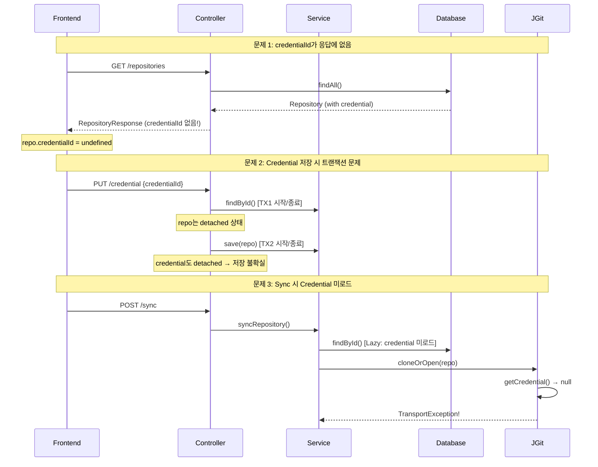
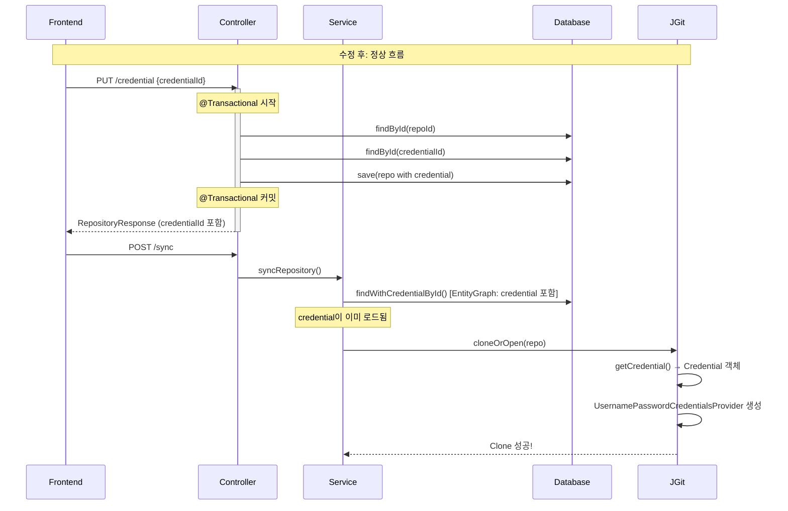

# Private Repository 동기화 실패 - Credential 미적용

## 증상

Private GitHub 레포지토리 동기화 시 다음 오류 발생:

```
org.eclipse.jgit.api.errors.TransportException:
https://github.com/owner/repo.git: git-upload-pack not permitted on
'https://github.com/owner/repo.git/'
```

UI에서 Credential을 선택했음에도 인증이 적용되지 않음.

---

## 원인 분석

이 문제는 **3가지 연쇄적인 버그**로 인해 발생했습니다.

### 원인 1: DTO에 credentialId 필드 누락

`RepositoryResponse` DTO에 `credentialId` 필드가 없어서 프론트엔드로 전달되지 않음.

```java
// ApiModels.java - 문제 코드
public record RepositoryResponse(
        UUID id,
        UUID projectId,
        String provider,
        // ... 생략
        Instant createdAt
        // credentialId 필드 없음!
) {}
```

**결과**: 프론트엔드에서 `repo.credentialId`가 항상 `undefined` → 선택해도 UI에 반영 안 됨

### 원인 2: @Transactional 누락

`RepositoriesController.setCredential()`에 `@Transactional`이 없어서 detached 엔티티 문제 발생.

```java
// 문제 코드
@PutMapping("/repositories/{repoId}/credential")
public ResponseEntity<RepositoryResponse> setCredential(...) {
    return repositoryService.findById(repoId)  // ← 트랜잭션 종료
            .map(repo -> {
                repo.setCredential(credential);  // ← detached 엔티티에 설정
                Repository updated = repositoryService.save(repo);  // ← 새 트랜잭션
                return ResponseEntity.ok(toResponse(updated));
            })
            // ...
}
```

### 원인 3: Lazy Loading으로 인한 Credential 미로드

`GitSyncService`에서 Repository 조회 시 Credential이 Lazy loading으로 설정되어 있어,
별도의 fetch 없이는 Git 작업 시점에 null로 처리됨.

```java
// Repository.java
@ManyToOne(fetch = FetchType.LAZY)  // ← Lazy loading
@JoinColumn(name = "credential_id")
private Credential credential;
```

---

## 문제 흐름도



---

## 해결 방법

### 수정 1: DTO에 credentialId 추가

```java
// ApiModels.java
public record RepositoryResponse(
        UUID id,
        UUID projectId,
        String provider,
        String externalId,
        String owner,
        String name,
        String cloneUrl,
        String defaultBranch,
        String localMirrorPath,
        boolean active,
        Instant createdAt,
        UUID credentialId  // ← 추가
) {}
```

```java
// RepositoriesController.java - toResponse()
private RepositoryResponse toResponse(Repository repo) {
    return new RepositoryResponse(
            // ... 생략
            repo.getCreatedAt(),
            repo.getCredential() != null ? repo.getCredential().getId() : null  // ← 추가
    );
}
```

### 수정 2: @Transactional 추가

```java
// RepositoriesController.java
@Transactional  // ← 추가
@PutMapping("/repositories/{repoId}/credential")
public ResponseEntity<RepositoryResponse> setCredential(...) {
    // 이제 전체가 하나의 트랜잭션에서 실행됨
}
```

### 수정 3: EntityGraph로 Credential Eager Fetch

```java
// RepositoryRepository.java
@EntityGraph(attributePaths = {"credential"})
Optional<Repository> findWithCredentialById(UUID id);
```

```java
// GitSyncService.java
@Transactional
public String syncRepository(UUID jobId, UUID repositoryId, String branch) {
    Repository repo = repositoryRepository.findWithCredentialById(repositoryId)  // ← 변경
            .orElseThrow(() -> new IllegalArgumentException("Repository not found"));
    // ...
}
```

---

## 수정 후 흐름도



---

## 핵심 포인트

1. **DTO 필드 누락 확인**: Entity에 필드를 추가했다면 Response DTO에도 반영해야 함
2. **Controller에서 여러 Repository 호출 시 @Transactional 필수**: detached 엔티티 문제 방지
3. **비동기/별도 트랜잭션에서 Lazy 연관 필요 시 EntityGraph 사용**: N+1 문제도 함께 해결

---

## 관련 파일

- `backend/src/main/java/com/docst/api/ApiModels.java`
- `backend/src/main/java/com/docst/api/RepositoriesController.java`
- `backend/src/main/java/com/docst/repository/RepositoryRepository.java`
- `backend/src/main/java/com/docst/service/GitSyncService.java`
- `frontend/app/projects/[projectId]/page.tsx`
