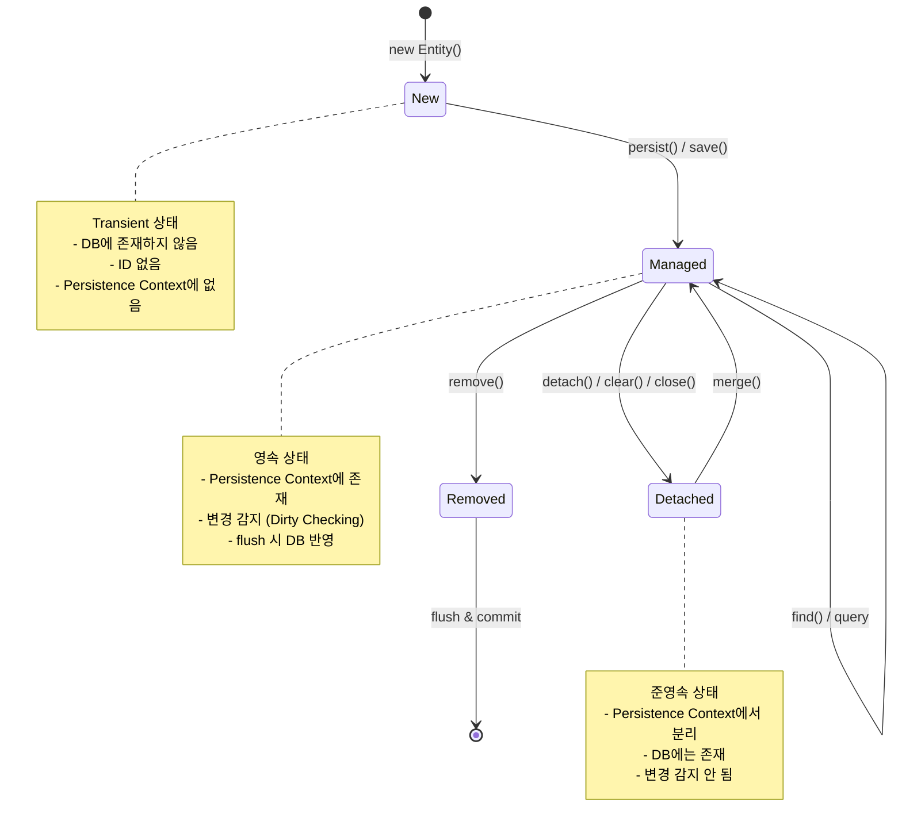
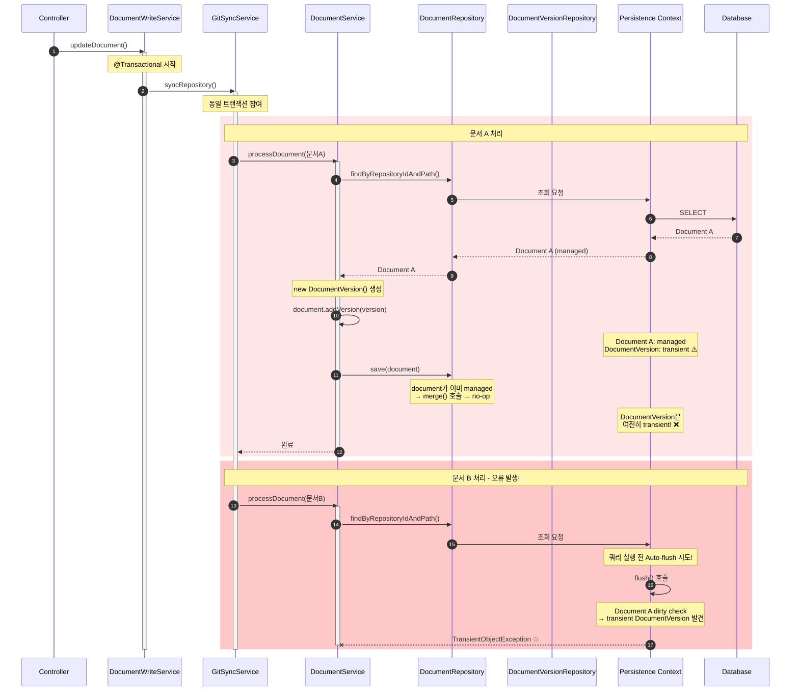
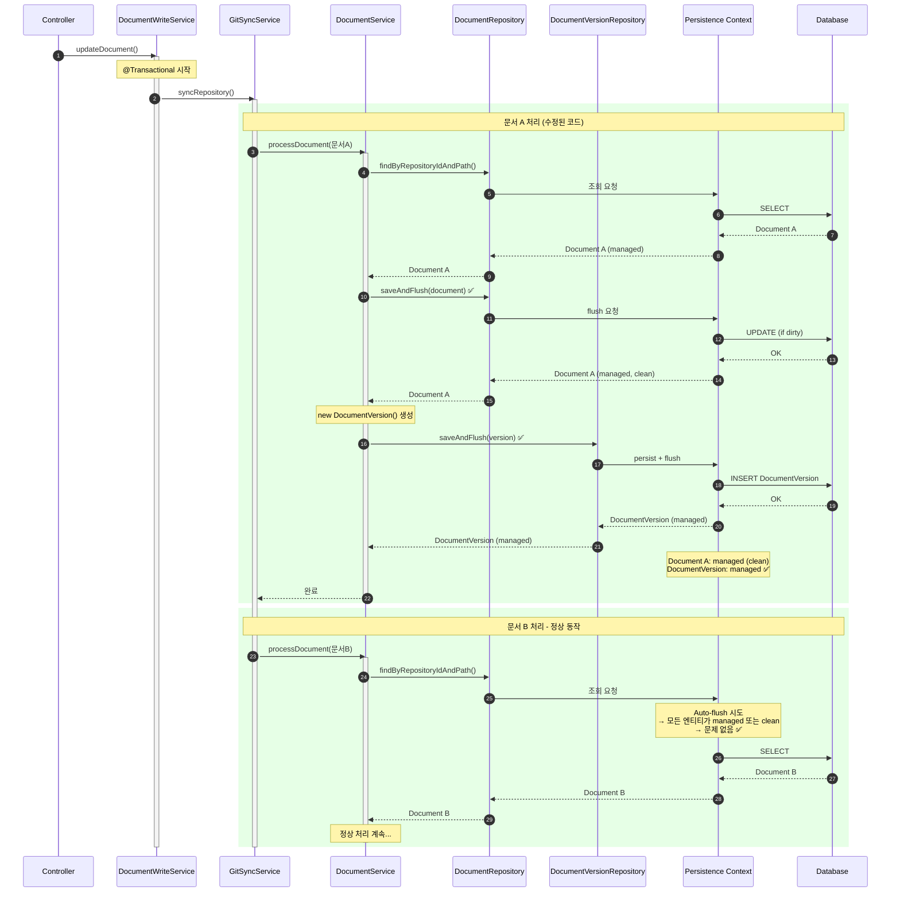
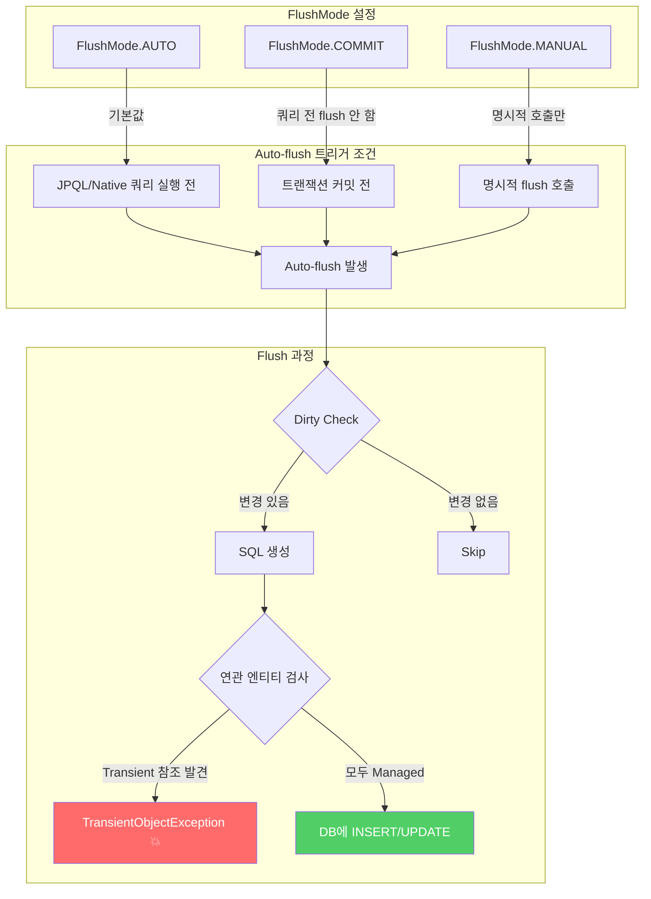
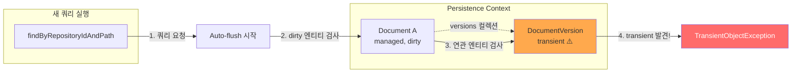
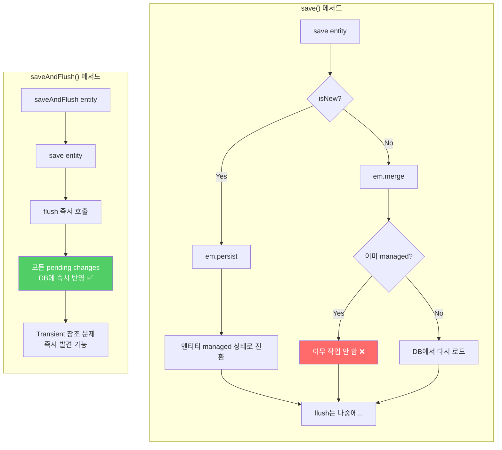

# Troubleshooting: TransientObjectException 오류

> **작성일**: 2026-01-10
> **관련 Phase**: Phase 8 (Document Editor with Git Commit)
> **증상**: 문서 편집 후 Commit Changes 시 서버 오류 발생

---

## 증상

문서 상세 페이지(`/documents/[docId]`)에서 문서를 편집하고 "Commit Changes" 버튼을 클릭하면 다음과 같은 오류가 발생합니다:

```
org.hibernate.TransientObjectException: persistent instance references an unsaved transient instance of 'com.docst.domain.DocumentVersion' (save the transient instance before flushing)
```

### 오류 발생 위치

```
at com.docst.service.DocumentService.upsertDocument(DocumentService.java:148)
at com.docst.service.GitSyncService.processDocument(GitSyncService.java:257)
at com.docst.service.GitSyncService.syncRepository(GitSyncService.java:80)
at com.docst.service.DocumentWriteService.updateDocument(DocumentWriteService.java:188)
at com.docst.api.DocumentsController.updateDocument(DocumentsController.java:140)
```

### 재현 조건

1. 문서 편집 페이지에서 내용 수정
2. "Save" 버튼 클릭 → Commit Dialog 표시
3. 커밋 메시지 입력 후 "Commit" 버튼 클릭
4. 레포지토리에 여러 개의 문서가 있는 경우 오류 발생

---

## JPA 엔티티 생명주기 (Entity Lifecycle)

이 문제를 이해하려면 먼저 JPA 엔티티의 생명주기를 알아야 합니다.



### 엔티티 상태 요약

| 상태 | Persistence Context | DB | 변경 감지 |
|------|---------------------|-----|-----------|
| **New (Transient)** | X | X | X |
| **Managed** | O | O | O |
| **Detached** | X | O | X |
| **Removed** | O (삭제 예정) | O → X | - |

---

## 원인 분석

### 1. 문제의 핵심

JPA의 **Cascade 타이밍 문제**와 **Auto-flush 메커니즘**의 상호작용으로 인해 발생합니다.

### 2. 오류 발생 시퀀스 다이어그램



### 3. 수정 후 정상 동작 시퀀스 다이어그램



### 4. JPA Auto-flush 메커니즘

Hibernate는 쿼리 실행 전 자동으로 Persistence Context를 flush합니다. 이를 **Auto-flush**라고 합니다.



#### Auto-flush가 TransientObjectException을 발생시키는 이유



### 5. 상세 흐름 분석

`DocumentWriteService.updateDocument()` 호출 시 다음과 같은 흐름이 발생합니다:

```
DocumentsController.updateDocument()
  └── DocumentWriteService.updateDocument()  // @Transactional
        └── GitWriteService.commitFile()     // Git 파일 쓰기 및 커밋
        └── GitSyncService.syncRepository()  // @Transactional (동일 트랜잭션 참여)
              └── processDocument() for 문서 A
                    └── DocumentService.upsertDocument()  // @Transactional
              └── processDocument() for 문서 B
                    └── DocumentService.upsertDocument()  // 여기서 오류!
```

### 6. 오류 발생 메커니즘

**Step 1: 문서 A 처리**
```java
// DocumentService.upsertDocument() 내부
Document document = documentRepository.findByRepositoryIdAndPath(repositoryId, path);
// document는 이제 managed 상태

DocumentVersion version = new DocumentVersion(document, commitSha);
// version은 transient 상태 (아직 저장되지 않음)

document.addVersion(version);
// document의 versions 컬렉션에 transient 엔티티 추가

documentRepository.save(document);
// 문제: document가 이미 managed 상태라면 save()는 실질적으로 no-op
// version은 여전히 transient 상태!
```

**Step 2: 문서 B 처리 시 오류**
```java
// 문서 B에 대한 upsertDocument() 호출
Document document = documentRepository.findByRepositoryIdAndPath(repositoryId, path);
// ↑ 이 쿼리 실행 전 Hibernate가 auto-flush 시도!

// Auto-flush 과정:
// 1. Hibernate가 dirty 상태의 문서 A를 flush 하려고 함
// 2. 문서 A의 versions 컬렉션에 transient DocumentVersion 발견
// 3. CascadeType.ALL이지만, managed 엔티티에 대한 save()는 cascade 트리거 안 함
// 4. TransientObjectException 발생!
```

### 7. 왜 Cascade가 동작하지 않았나?

`Document` 엔티티의 cascade 설정:
```java
@OneToMany(mappedBy = "document", cascade = CascadeType.ALL, orphanRemoval = true)
private List<DocumentVersion> versions = new ArrayList<>();
```

문제점:
- Spring Data JPA의 `save()` 메서드는 기존 엔티티에 대해 `merge()`를 호출
- 이미 **managed 상태**인 엔티티에 대한 `merge()`는 실질적으로 아무 작업도 하지 않음
- 따라서 **cascade persist가 트리거되지 않음**
- 새로 추가된 `DocumentVersion`은 transient 상태로 남음

```java
// SimpleJpaRepository.save() 내부 로직
public <S extends T> S save(S entity) {
    if (entityInformation.isNew(entity)) {
        em.persist(entity);  // 새 엔티티: persist() 호출 → cascade 동작
        return entity;
    } else {
        return em.merge(entity);  // 기존 엔티티: merge() 호출 → managed면 no-op
    }
}
```

---

## 해결 방법

### save() vs saveAndFlush() 비교



### 수정 전 코드

```java
@Transactional
public DocumentVersion upsertDocument(UUID repositoryId, String path, String commitSha,
                                String content, String authorName, String authorEmail,
                                Instant committedAt, String message) {
    // ...

    Document document = documentRepository.findByRepositoryIdAndPath(repositoryId, path)
            .map(doc -> { /* update */ return doc; })
            .orElseGet(() -> new Document(repo, path, title, docType));

    DocumentVersion newVersion = null;

    if (!documentVersionRepository.existsByDocumentIdAndContentHash(document.getId(), contentHash)) {
        DocumentVersion version = new DocumentVersion(document, commitSha);
        // ... set properties

        document.addVersion(version);  // transient version 추가
        newVersion = version;
    }

    documentRepository.save(document);  // managed 엔티티면 no-op → version은 transient 유지
    return newVersion;
}
```

### 수정 후 코드

```java
@Transactional
public DocumentVersion upsertDocument(UUID repositoryId, String path, String commitSha,
                                String content, String authorName, String authorEmail,
                                Instant committedAt, String message) {
    // ...

    Document document = documentRepository.findByRepositoryIdAndPath(repositoryId, path)
            .map(doc -> { /* update */ return doc; })
            .orElseGet(() -> new Document(repo, path, title, docType));

    // 1. Document를 먼저 저장하고 즉시 flush
    //    - 새 문서: ID 부여
    //    - 기존 문서: pending changes flush
    document = documentRepository.saveAndFlush(document);

    DocumentVersion newVersion = null;

    if (!documentVersionRepository.existsByDocumentIdAndContentHash(document.getId(), contentHash)) {
        DocumentVersion version = new DocumentVersion(document, commitSha);
        // ... set properties

        // 2. DocumentVersion을 명시적으로 저장하고 즉시 flush
        //    - Cascade에 의존하지 않음
        //    - 다음 쿼리의 auto-flush에서 문제 발생 방지
        newVersion = documentVersionRepository.saveAndFlush(version);

        // 3. Document 업데이트
        document.setLatestCommitSha(commitSha);
        document.getVersions().add(newVersion);
    } else {
        document.setLatestCommitSha(commitSha);
        documentRepository.save(document);
    }

    return newVersion;
}
```

### 핵심 변경사항

| 변경 | 이유 |
|------|------|
| `saveAndFlush(document)` | 문서를 먼저 저장하여 유효한 ID 확보, pending changes 즉시 flush |
| `documentVersionRepository.saveAndFlush(version)` | Cascade에 의존하지 않고 명시적으로 버전 저장 |
| Cascade 의존성 제거 | managed 엔티티의 cascade 타이밍 문제 회피 |

---

## 관련 파일

| 파일 | 수정 내용 |
|------|-----------|
| `backend/src/main/java/com/docst/service/DocumentService.java` | `upsertDocument()` 메서드 수정 |

---

## 교훈 및 베스트 프랙티스

### 1. JPA Cascade 주의사항

- **Cascade는 새 엔티티에서만 확실히 동작**: 이미 managed 상태인 엔티티에 대한 `save()`는 cascade를 트리거하지 않을 수 있음
- **명시적 저장 권장**: 중요한 연관 엔티티는 cascade에 의존하지 말고 명시적으로 저장

### 2. Auto-flush 인지

- **쿼리 실행 전 auto-flush**: Hibernate는 쿼리 실행 전 dirty 엔티티를 자동 flush
- **Transient 참조 주의**: flush 시점에 transient 엔티티 참조가 있으면 오류 발생

### 3. saveAndFlush 사용

- **즉시 flush가 필요한 경우**: `saveAndFlush()` 사용으로 타이밍 문제 방지
- **트랜잭션 내 일관성**: 같은 트랜잭션에서 여러 엔티티 처리 시 순서 중요

### 4. 디버깅 팁

```java
// Auto-flush 시점 확인을 위한 로그
@Transactional
public void someMethod() {
    log.debug("Before query - entities will be flushed");
    repository.findSomething();  // auto-flush 발생 지점
    log.debug("After query");
}
```

---

## 참고 자료

- [Hibernate TransientObjectException](https://docs.jboss.org/hibernate/orm/6.4/userguide/html_single/Hibernate_User_Guide.html#pc-cascade)
- [Spring Data JPA save() vs persist()](https://docs.spring.io/spring-data/jpa/reference/jpa/entity-persistence.html)
- [JPA Cascade Types](https://jakarta.ee/specifications/persistence/3.1/jakarta-persistence-spec-3.1.html#a12807)
