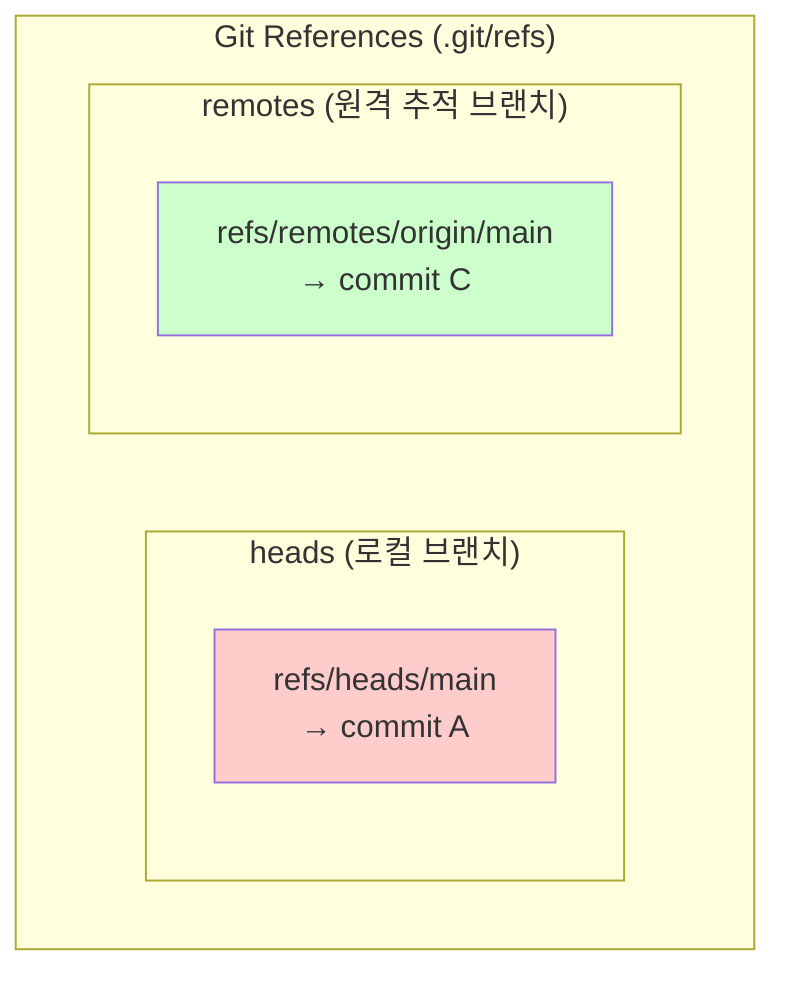
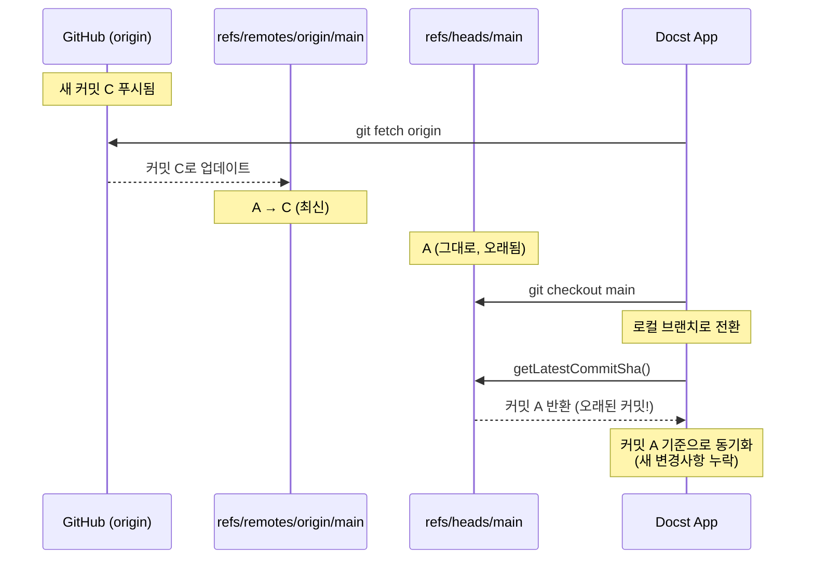
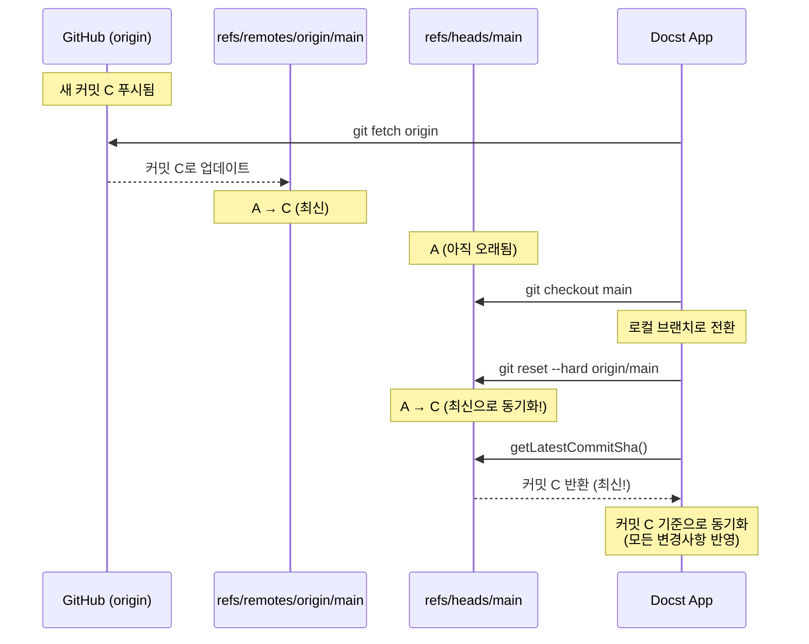
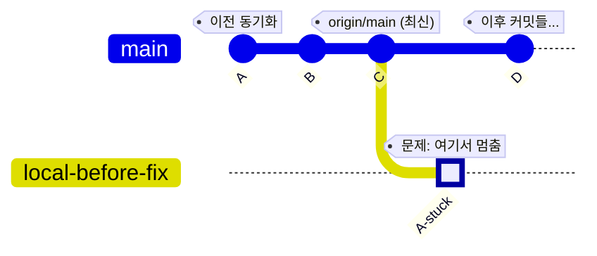
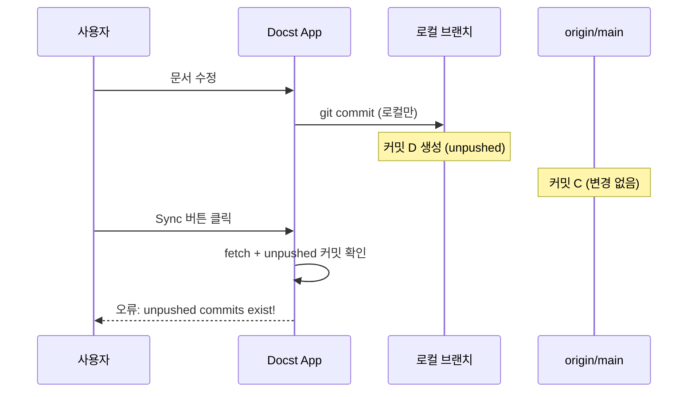
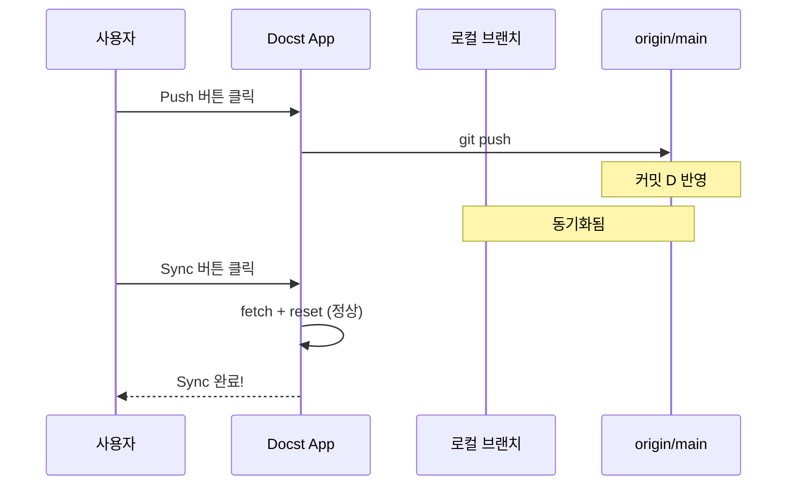
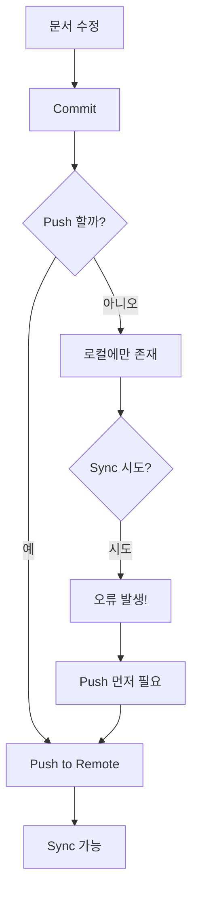
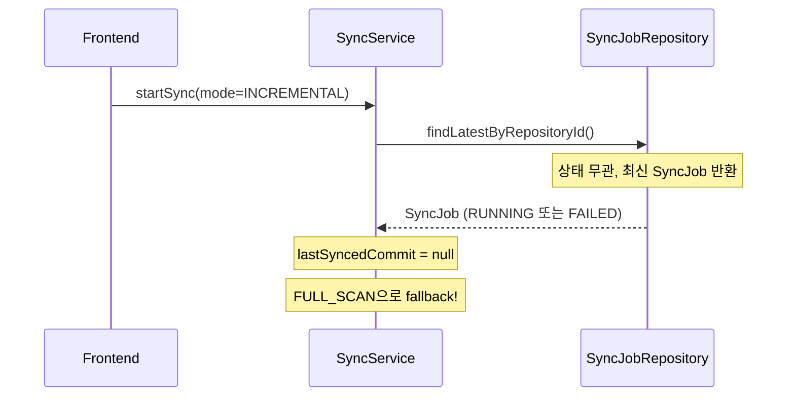

# Git Sync 관련 트러블슈팅

## 1. SSE 스트리밍 중 Access Denied 오류

### 증상

Sync 버튼 클릭 시 다음 오류가 발생하지만, 문서 동기화는 정상적으로 완료됨:

```
org.springframework.security.authorization.AuthorizationDeniedException: Access Denied
    at org.springframework.security.web.access.intercept.AuthorizationFilter.doFilter(AuthorizationFilter.java:99)
    ...
    at org.apache.catalina.core.AsyncContextImpl$AsyncRunnable.run(AsyncContextImpl.java:599)
```

### 원인

Spring Security 6.x에서 SSE(Server-Sent Events) 스트리밍 중 `SseEmitter.send()`가 **ASYNC 디스패치**를 발생시킴. 이때 `AuthorizationFilter`가 다시 적용되지만 SecurityContext가 비동기 컨텍스트로 전파되지 않아 `Access Denied` 발생.

**흐름**:
1. `/api/repositories/{repoId}/sync/stream` 요청 → JWT 인증 성공
2. `SseEmitter.send()` 호출 → ASYNC 디스패치 발생
3. Spring Security가 ASYNC 요청에 대해 다시 인가 체크
4. SecurityContext가 없어 `Access Denied`

### 해결

`SecurityConfig.java`에 ASYNC 디스패치에 대한 허용 설정 추가:

```java
import jakarta.servlet.DispatcherType;

@Bean
public SecurityFilterChain securityFilterChain(HttpSecurity http) throws Exception {
    http
        .authorizeHttpRequests(auth -> auth
            // ASYNC 디스패치 허용 (SSE 스트리밍 등)
            // 원본 요청에서 이미 인증되었으므로 ASYNC 디스패치는 permitAll
            .dispatcherTypeMatchers(DispatcherType.ASYNC).permitAll()
            // ... 기존 설정
        );
    return http.build();
}
```

**안전한 이유**: ASYNC 디스패치는 이미 인증된 원본 요청에서만 시작되므로, 원본 요청의 인증이 보장됨.

### 관련 파일

- `backend/src/main/java/com/docst/config/SecurityConfig.java`
- `backend/src/main/java/com/docst/api/SyncController.java`

---

## 2. Sync 후 원격 저장소 변경사항 미반영

### 증상

- Sync 버튼을 눌러도 원격(origin)에서 새로 푸시된 변경사항이 반영되지 않음
- 로그에서 `FULL_SCAN: Syncing repository ... at commit xxx` 출력되지만 커밋이 오래된 상태
- 이미 동기화된 문서만 반복 처리됨

### 원인

`git fetch` 후 로컬 브랜치를 원격 브랜치로 **reset/merge 하지 않음**.

### Git 참조(refs) 구조 이해

Git은 브랜치를 "참조(refs)"로 관리합니다. 로컬과 원격 브랜치는 별도의 참조입니다:



### 문제 상황: fetch만 하고 reset 안 함



**기존 코드 흐름**:
```java
gitService.fetch(git, repo, branch);    // refs/remotes/origin/<branch> 업데이트
gitService.checkout(git, branch);        // refs/heads/<branch>로 전환 (오래된 상태)
String latestCommit = gitService.getLatestCommitSha(git, branch);  // 로컬 브랜치 커밋 반환
```

`getLatestCommitSha()`가 `refs/heads/<branch>`를 먼저 확인하므로, fetch로 업데이트된 `refs/remotes/origin/<branch>`가 아닌 오래된 로컬 브랜치 커밋을 사용.

### 해결 후: fetch + reset



### 커밋 히스토리 시각화



| 참조 | fetch 후 | reset 후 |
|------|----------|----------|
| `refs/remotes/origin/main` | 커밋 C (최신) | 커밋 C (최신) |
| `refs/heads/main` | 커밋 A (오래됨) | 커밋 C (최신) |

### 해결

#### 1. `GitService.java`에 `resetToRemote()` 메서드 추가

```java
/**
 * 로컬 브랜치를 원격 브랜치로 리셋한다.
 * fetch 후 호출하여 로컬 브랜치가 원격의 최신 상태를 반영하도록 한다.
 */
public void resetToRemote(Git git, String branch) throws GitAPIException, IOException {
    Ref remoteRef = git.getRepository().findRef("refs/remotes/origin/" + branch);
    if (remoteRef == null) {
        log.warn("Remote branch not found: origin/{}", branch);
        return;
    }

    log.info("Resetting local branch {} to origin/{} ({})",
            branch, branch, remoteRef.getObjectId().getName().substring(0, 7));

    git.reset()
            .setMode(org.eclipse.jgit.api.ResetCommand.ResetType.HARD)
            .setRef("origin/" + branch)
            .call();
}
```

#### 2. `GitSyncService.java`에서 fetch 후 reset 호출

```java
// FULL_SCAN, INCREMENTAL 모드 모두 적용
gitService.fetch(git, repo, branch);
gitService.checkout(git, branch);
gitService.resetToRemote(git, branch);  // 추가

String latestCommit = gitService.getLatestCommitSha(git, branch);
```

### 동작 변경

| 단계 | Before | After |
|------|--------|-------|
| 1 | `fetch` | `fetch` |
| 2 | `checkout` | `checkout` |
| 3 | - | `reset --hard origin/<branch>` |
| 4 | 로컬 브랜치 커밋 사용 (오래됨) | 원격 브랜치 커밋 사용 (최신) |

### 관련 파일

- `backend/src/main/java/com/docst/git/GitService.java` - `resetToRemote()` 메서드
- `backend/src/main/java/com/docst/service/GitSyncService.java` - `syncFullScan()`, `syncIncremental()`

### 참고: Git 명령어 비교

```bash
# 기존 동작 (문제)
git fetch origin
git checkout main
# → 로컬 main 브랜치는 여전히 오래된 상태

# 수정 후 동작 (정상)
git fetch origin
git checkout main
git reset --hard origin/main
# → 로컬 main 브랜치가 원격과 동일해짐
```

---

## 3. Sync 시 "unpushed commits exist" 오류

### 증상

Sync 버튼 클릭 시 다음 오류 발생:

```
Cannot sync: unpushed commits exist on branch 'main'.
Please push your changes first or discard them manually.
```

### 원인

Docst에서 문서를 수정하면 **로컬에 커밋**이 생성됩니다. 이 커밋을 **push하지 않은 상태**에서 Sync를 시도하면, `reset --hard`로 인해 로컬 커밋이 사라질 수 있어 안전장치가 작동합니다.



### 해결 방법

#### 방법 1: 먼저 Push 후 Sync (권장)



#### 방법 2: 로컬 변경 폐기 (주의)

로컬 커밋이 불필요하다면 수동으로 폐기:

```bash
cd /data/git/<repository-id>
git reset --hard origin/main
```

### 워크플로우 권장사항



**권장**: 문서 수정 후 **Commit → Push → Sync** 순서로 진행

### 관련 코드

`GitService.java`의 `resetToRemote()` 메서드:

```java
// reset 전에 unpushed 커밋 확인
if (hasUnpushedCommits(git, branch)) {
    throw new IllegalStateException(
        "Cannot sync: unpushed commits exist on branch '" + branch + "'. " +
        "Please push your changes first or discard them manually.");
}
```

---

## 4. INCREMENTAL Sync가 전체 Sync처럼 동작

### 증상

- INCREMENTAL 모드로 Sync를 요청해도 모든 문서를 다시 처리함
- 로그에 `FULL_SCAN: Found N document files` 메시지가 출력됨
- `INCREMENTAL: No lastSyncedCommit, falling back to FULL_SCAN` 경고 출력

### 원인 (수정 전)

`SyncService.executeSync()`에서 `lastSyncedCommit`을 조회할 때 **상태와 관계없이** 가장 최근 SyncJob을 사용함.



**문제**: PENDING/RUNNING/FAILED 상태의 SyncJob은 `lastSyncedCommit`이 null. SUCCEEDED 상태에서만 `complete()` 호출 시 설정됨.

### 해결

`SyncService.java`에서 **성공한(SUCCEEDED) 마지막 SyncJob**에서만 `lastSyncedCommit`을 조회하도록 수정:

```java
// Before (문제)
String lastSyncedCommit = findLatestByRepositoryId(repo.getId())
        .map(SyncJob::getLastSyncedCommit)
        .orElse(null);

// After (수정)
String lastSyncedCommit = findLatestSucceededByRepositoryId(repo.getId())
        .map(SyncJob::getLastSyncedCommit)
        .orElse(null);
```

새로 추가된 메서드:
```java
public Optional<SyncJob> findLatestSucceededByRepositoryId(UUID repositoryId) {
    return syncJobRepository.findFirstByRepositoryIdAndStatusOrderByCreatedAtDesc(
            repositoryId, SyncStatus.SUCCEEDED);
}
```

### 정상 동작 확인

INCREMENTAL이 정상 동작하면 로그에 다음이 출력됨:

```
INFO  Starting sync for repository: owner/repo branch: main mode: INCREMENTAL
INFO  INCREMENTAL: Syncing from abc123 to def456 (embedding: true)
INFO  INCREMENTAL: Found 2 commits to process
```

FULL_SCAN fallback 시 (첫 번째 Sync 등):

```
INFO  Starting sync for repository: owner/repo branch: main mode: INCREMENTAL
INFO  INCREMENTAL requested but no previous successful sync found, will fallback to FULL_SCAN
WARN  INCREMENTAL: No lastSyncedCommit, falling back to FULL_SCAN
INFO  FULL_SCAN: Found 50 document files
```

### 관련 파일

- `backend/src/main/java/com/docst/service/SyncService.java` - `findLatestSucceededByRepositoryId()`, `executeSync()`

---

## 5. SPECIFIC_COMMIT 모드에서 첫 번째 커밋 동기화 실패

### 증상

- `SPECIFIC_COMMIT` 모드로 레포지토리의 **첫 번째 커밋(Initial Commit)**을 동기화
- 로그에 `SPECIFIC_COMMIT: Found 0 changed document files` 출력
- 아무 문서도 처리되지 않음

### 원인 (수정 전)

**GitCommitWalker.java**에서 초기 커밋(부모가 없는 커밋) 처리 미구현:

```java
if (parents.length == 0) {
    // 최초 커밋 - 모든 파일이 ADDED
    log.debug("Initial commit, all files are added");
    return changedFiles; // TODO: 빈 목록 반환 (버그!)
}
```

초기 커밋은 부모가 없어 diff를 계산할 수 없었고, 빈 목록을 반환했음.

### 해결

`getAllFilesInCommit()` 메서드 추가하여 초기 커밋의 모든 파일을 ADDED로 처리:

```java
private List<ChangedFile> getAllFilesInCommit(Repository repo, RevCommit commit) throws IOException {
    List<ChangedFile> files = new ArrayList<>();

    try (TreeWalk treeWalk = new TreeWalk(repo)) {
        treeWalk.addTree(commit.getTree());
        treeWalk.setRecursive(true);

        while (treeWalk.next()) {
            String path = treeWalk.getPathString();
            files.add(new ChangedFile(path, ChangeType.ADDED, null));
        }
    }

    return files;
}
```

**getChangedFiles() 수정**:
```java
if (parents.length == 0) {
    log.debug("Initial commit, extracting all files as ADDED");
    changedFiles = getAllFilesInCommit(repo, commit);
    return changedFiles;
}
```

### 정상 동작 확인

첫 번째 커밋 동기화 시 로그:

```
INFO  SPECIFIC_COMMIT: Syncing repository owner/repo at commit abc1234 (embedding: true)
DEBUG Initial commit, extracting all files as ADDED
DEBUG Initial commit contains 15 files
INFO  SPECIFIC_COMMIT: Found 10 changed document files
```

### 관련 파일

- `backend/src/main/java/com/docst/git/GitCommitWalker.java` - `getAllFilesInCommit()`, `getChangedFiles()`

---

## 관련 이슈 체크리스트

Sync 문제 발생 시 확인할 사항:

- [ ] 원격 저장소에 실제로 새 커밋이 존재하는가?
- [ ] Credential(GitHub PAT 등)이 유효한가?
- [ ] 네트워크 연결이 정상인가?
- [ ] 로그에서 `Fetching branch: ...` 메시지가 출력되는가?
- [ ] 로그에서 `Resetting local branch ... to origin/...` 메시지가 출력되는가?
- [ ] 첫 번째 커밋 동기화 시 `Initial commit contains N files` 로그가 출력되는가?
